---
## Author
author:
  name: Бахи сиди али темассини
  degrees: Student (3 курс)
  orcid: ""
  email: 1032234211@pfur.ru
  affiliation:
    - name: Российский университет дружбы народов
      country: Российская Федерация
      postal-code: 117198
      city: Москва
      address: ул. Миклухо-Маклая, д. 6
## Title
title: Лабораторная работа №1
subtitle: "Дисциплина: Администрирование сетевых подсистем "
license: CC BY
date: today
date-format: "YYYY-MM-DD" # Example: 2025-09-06
---

# Цель работы

## Цель работы

- Приобретение практических навыков установки Rocky Linux на виртуальную машину с использованием Vagrant

# Выполнение лабораторной работы

##  Конфигурационные файлы

- Созданы каталоги `C:\work\bahis\packer` и `C:\work\bahis\vagrant`
- Подготовлена структура для сборки box-файла

{#fig-1 width=70%}

---

- В каталоге `packer` размещены ISO-образ, `packer.exe`, HCL-файл и каталог `http`
- Структура соответствует требованиям проекта

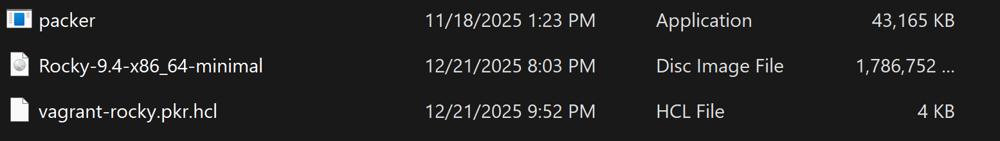{#fig-2 width=70%}

---

- Файл `vagrant-rocky.pkr.hcl` содержит блок `packer` и `required_plugins`
- Заданы переменные версии, диска, ISO, архитектуры и SSH
- В каталоге `http` размещён файл `ks.cfg`
- Определены параметры автоматической установки

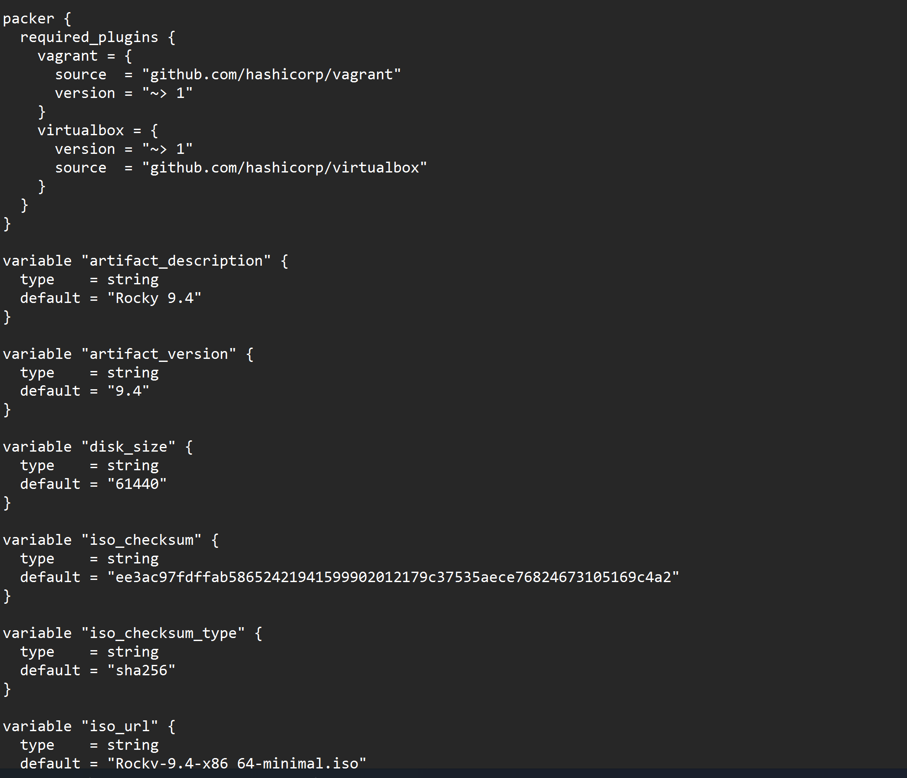{#fig-3 width=70%}

---

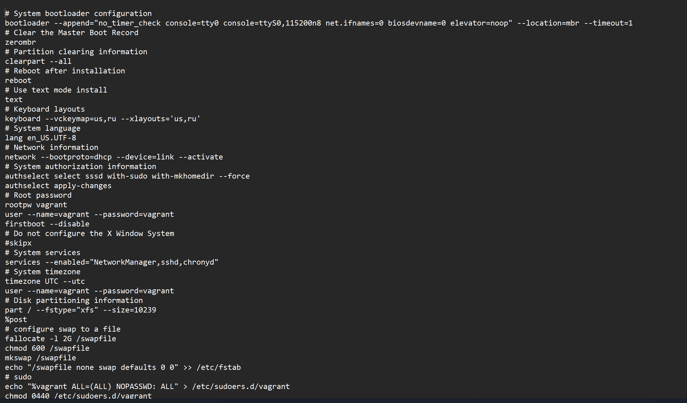{#fig-4 width=70%}

---

- В каталоге `vagrant` создан файл `Vagrantfile`
- Определена ВМ `server` с box `rocky9`
- Настроены IP 192.168.1.1 и параметры VirtualBox
- Создан каталог `provision` с подкаталогами `default`, `server`, `client`

{#fig-5 width=70%}

---

{#fig-6 width=70%}

---

- В каталогах размещены скрипты-заглушки `01-dummy.sh`

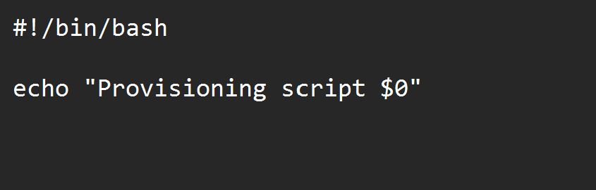{#fig-7 width=70%}

---

- В `default` добавлен `01-user.sh`
- Создание пользователя `bahis`
- Добавление в группу `wheel`
- Настройка PS1

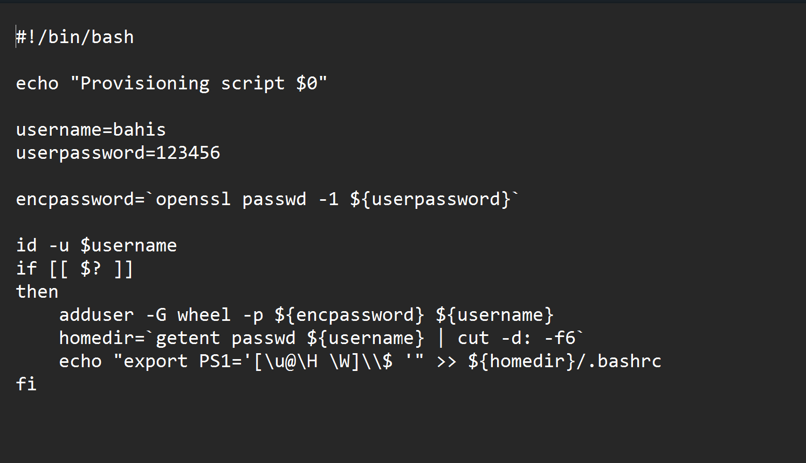{#fig-8 width=70%}

---

- В `default` добавлен `01-hostname.sh`
- Установка FQDN вида `*.bahis.net`

{#fig-9 width=70%}

---

- В `server` размещён `02-forward.sh`
- Включение IP-forwarding
- Настройка masquerading через firewalld

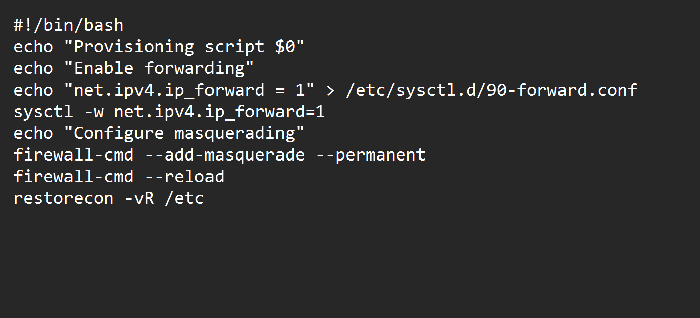{#fig-10 width=70%}

---

- В `client` размещён `01-routing.sh`
- Настройка шлюза 192.168.1.1
- Конфигурация интерфейсов через nmcli

{#fig-11 width=70%}

## Развёртывание лабораторного стенда на ОС Windows

- Выполнены `packer.exe init` и `packer.exe build`
- Произведена автоматическая установка Rocky Linux
- Сформирован box-файл

{#fig-12 width=70%}

---

- Создан файл `vagrant-virtualbox-rocky-9-x86_64.box`
- Подтверждена корректная сборка образа

{#fig-13 width=70%}

---

- Выполнена регистрация box через `vagrant box add rocky9`
- Образ добавлен под именем `rocky9`

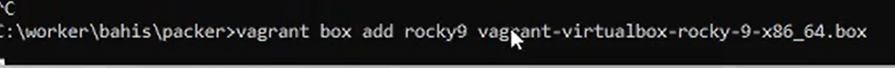{#fig-14 width=70%}

---

- Запуск `vagrant up server`
- Инициализация сети и provisioning

{#fig-15 width=70%}

---

- Запуск `vagrant up client`
- Настройка сетевых адаптеров
- Подключение по SSH

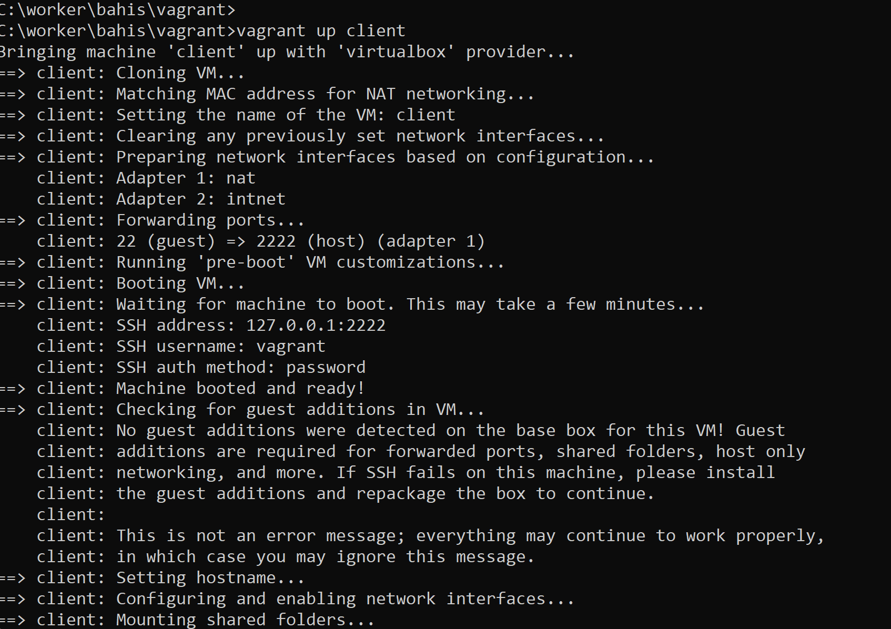{#fig-16 width=70%}

---

- Обе ВМ успешно загружены в VirtualBox
- Выполнен вход под пользователем `vagrant`

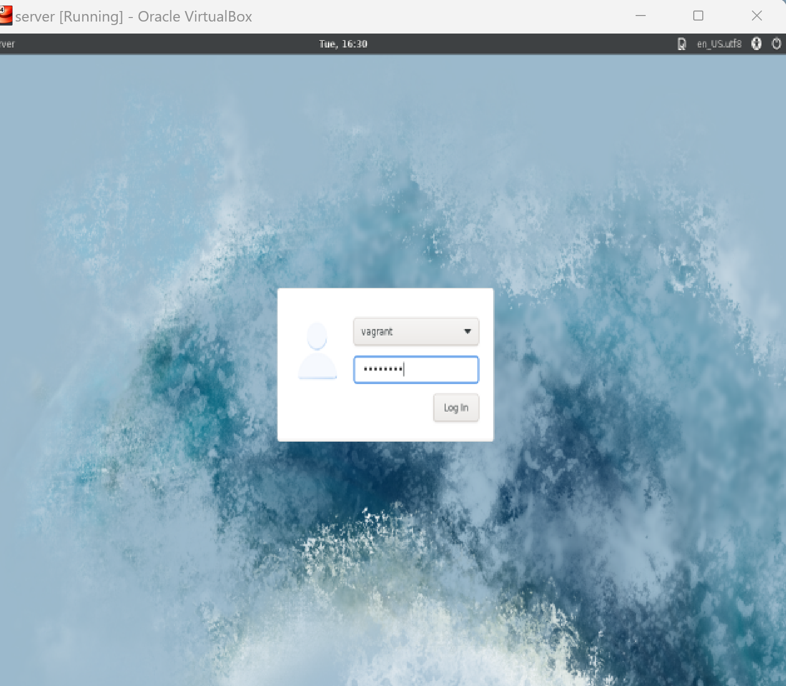{#fig-17 width=70%}

---

{#fig-17-1 width=70%}

---

- Подключение через `vagrant ssh server`
- Переход к пользователю `bahis`
- Аналогичное подключение к клиенту

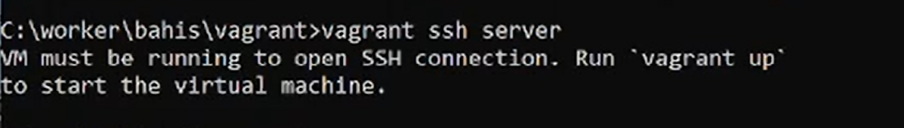{#fig-18 width=70%}

---

{#fig-18-1 width=70%}

---

- Выполнены `vagrant halt server` и `vagrant halt client`
- Корректное завершение работы ВМ

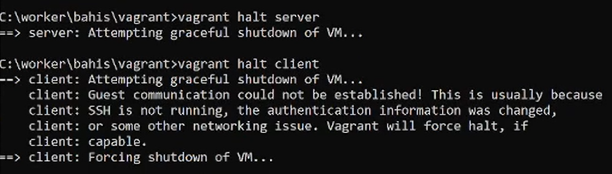{#fig-19 width=70%}

## Внесение изменений в настройки внутреннего окружения виртуальной машины

- В `Vagrantfile` добавлены блоки `common user` и `common hostname`
- Обеспечено выполнение `01-user.sh` и `01-hostname.sh`

{#fig-20 width=70%}

---

- Выполнены `vagrant up --provision` для server и client
- Повторный запуск provisioning
- Подтверждено существование пользователя `bahis`

{#fig-21 width=70%}

---

{#fig-22 width=70%}

---

- Выполнен вход под пользователем `bahis`
- Проверено отображение FQDN в приглашении терминала
- Подтверждена корректная настройка hostname

{#fig-23 width=70%}

---

{#fig-23-1 width=70%}

---

# Выводы

## Выводы

- Выполнена автоматическая сборка box-файла Rocky Linux через Packer
- Зарегистрирован образ в Vagrant
- Развёрнуты виртуальные машины server и client
- Применены provisioning-скрипты
- Настроены пользователь и hostname
- Подтверждена работа SSH и сетевых параметров
- Лабораторный стенд успешно подготовлен к дальнейшей работе

