---
## Author
author:
  name: Бахи сиди али темассини
  degrees: Student (3 курс)
  orcid: ""
  email: 1032234211@pfur.ru
  affiliation:
    - name: Российский университет дружбы народов
      country: Российская Федерация
      postal-code: 117198
      city: Москва
      address: ул. Миклухо-Маклая, д. 6

## Title
title: "Отчёт по лабораторной работе №1"
subtitle: "Дисциплина: Администрирование сетевых подсистем"
license: "CC BY"
---

# Цель работы

Целью данной работы является приобретение практических навыков установки Rocky Linux на виртуальную машину с помощью инструмента Vagrant.

# Выполнение лабораторной работы

В рабочем каталоге ОС Windows созданы подкаталоги `C:\work\bahis\packer` и `C:\work\bahis\vagrant`, предназначенные для подготовки box-файла Vagrant ([рис. @fig-1]). В каталоге `packer` размещены образ Rocky-9.4-x86_64-minimal.iso, исполняемый файл packer.exe, файл конфигурации vagrant-rocky.pkr.hcl и подкаталог `http`, что соответствует требованиям к структуре проекта ([рис. @fig-2]).

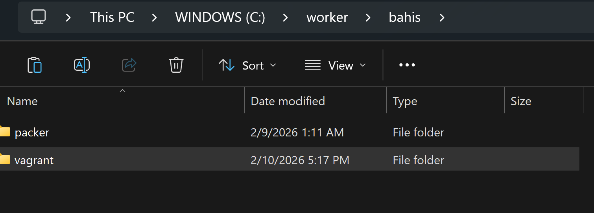{#fig-1 width=70%}

{#fig-2 width=70%}

Файл `vagrant-rocky.pkr.hcl` содержит блок `packer` с разделом `required_plugins` (vagrant, virtualbox), а также переменные, определяющие версию дистрибутива, размер диска, контрольную сумму ISO-образа, архитектуру и параметры SSH ([рис. @fig-3]). В подкаталоге `http` размещён файл `ks.cfg`, задающий автоматизированные параметры установки системы: загрузчик, очистку разделов, язык, сетевые настройки (DHCP), создание пользователя и post-настройки ([рис. @fig-4]).

{#fig-3 width=70%}

{#fig-4 width=70%}

В каталоге `vagrant` размещён файл `Vagrantfile`, определяющий конфигурацию виртуальной машины server: имя box `rocky9`, сетевой интерфейс с IP 192.168.1.1, параметры VirtualBox (RAM, CPU, VRAM, графический контроллер) и подключение provision-скриптов ([рис. @fig-5]). Также создан каталог `provision` с подкаталогами `default`, `server` и `client`, предназначенными для разделения сценариев настройки окружения ([рис. @fig-6]).

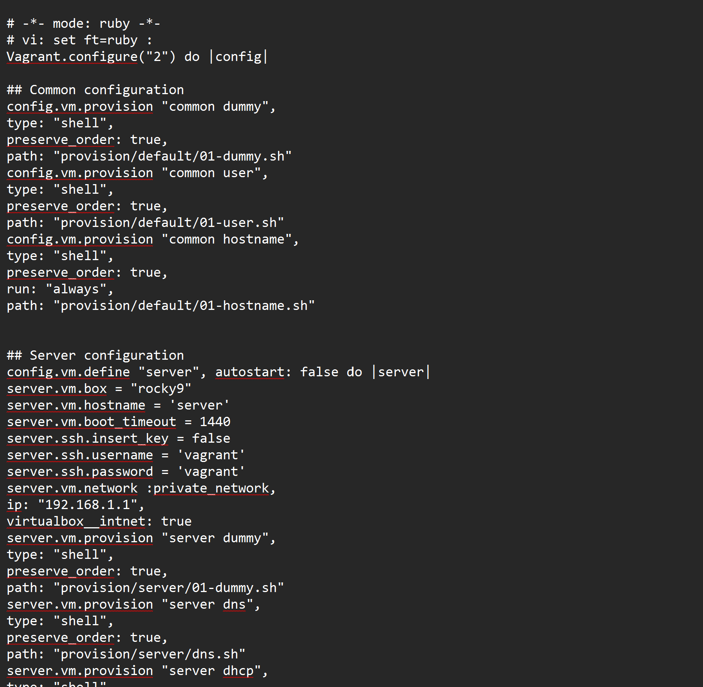{#fig-5 width=70%}

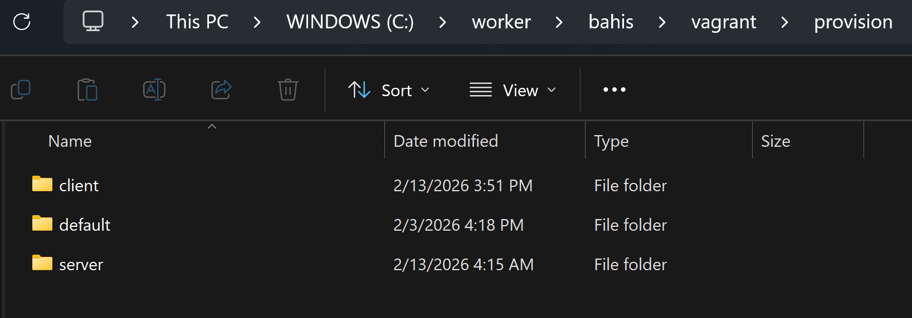{#fig-6 width=70%}

В подкаталогах `default`, `server` и `client` размещены скрипты-заглушки `01-dummy.sh`, выводящие сообщение о выполнении provisioning ([рис. @fig-7]). В каталоге `default` дополнительно размещены скрипты `01-user.sh` (создание пользователя bahis, добавление в группу wheel, настройка PS1) и `01-hostname.sh` (установка FQDN вида *.bahis.net) ([рис. @fig-8], [рис. @fig-9]). В каталоге `server` размещён скрипт `02-forward.sh`, активирующий IP-маршрутизацию и masquerading через firewalld, а в каталоге `client` — скрипт `01-routing.sh`, настраивающий шлюз 192.168.1.1 и параметры интерфейсов через nmcli ([рис. @fig-10], [рис. @fig-11]).

{#fig-7 width=70%}

![Скрипты-заглушки 01-dummy.sh в каталогах default, server и client]

![Скрипты-заглушки 01-dummy.sh в каталогах default, server и client]

{#fig-8 width=70%}

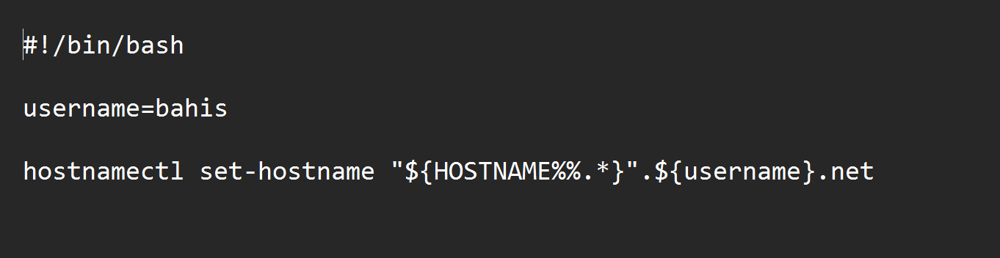{#fig-9 width=70%}

{#fig-10 width=70%}

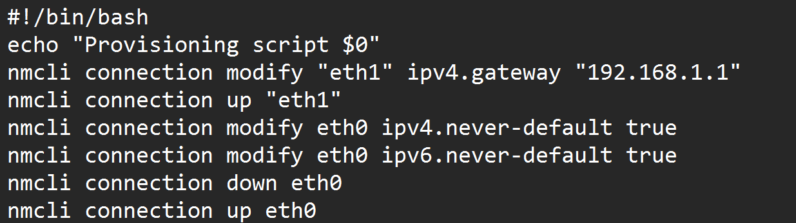{#fig-11 width=70%}

# Развёртывание лабораторного стенда на ОС Windows

В рабочем каталоге `C:\work\bahis\packer` выполнены команды `packer.exe init vagrant-rocky.pkr.hcl` и `packer.exe build vagrant-rocky.pkr.hcl`, в результате чего произведена автоматическая установка Rocky Linux в VirtualBox и сформирован box-файл ([рис. @fig-12]). По завершении сборки в каталоге создан файл `vagrant-virtualbox-rocky-9-x86_64.box`, подтверждающий корректное формирование образа для Vagrant ([рис. @fig-13]).

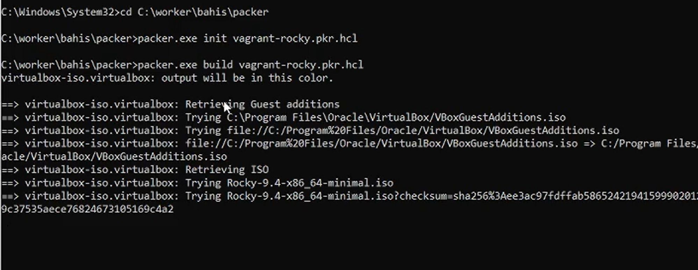{#fig-12 width=70%}

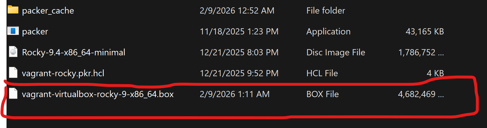{#fig-13 width=70%}

Далее выполнена регистрация образа в Vagrant командой `vagrant box add rocky9 vagrant-virtualbox-rocky-9-x86_64.box`, после чего box добавлен под именем `rocky9` ([рис. @fig-14]). Запуск виртуальной машины Server осуществлён командой `vagrant up server`, выполнена инициализация сетевых интерфейсов, проброс портов и запуск provisioning-сценариев ([рис. @fig-15]).

{#fig-14 width=70%}

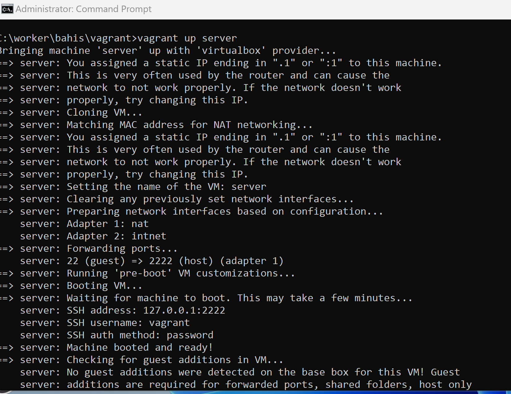{#fig-15 width=70%}

Запуск виртуальной машины Client выполнен командой `vagrant up client`, произведена настройка сетевых адаптеров и подключение через SSH ([рис. @fig-16]). В графическом интерфейсе VirtualBox обе виртуальные машины успешно загружены, выполнен вход под пользователем `vagrant` с паролем `vagrant` ([рис. @fig-17], [рис. @fig-17-1]).

{#fig-16 width=70%}

{#fig-17 width=70%}

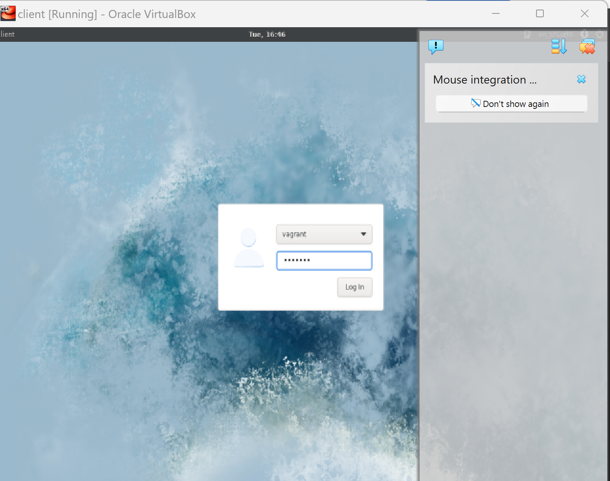{#fig-17-1 width=70%}

Подключение к серверу выполнено командой `vagrant ssh server`, после ввода пароля осуществлён переход к пользователю `bahis` командой `su - bahis` и последующий выход из сеанса ([рис. @fig-18]). Аналогичные действия выполнены для клиента с использованием команды `vagrant ssh client` ([рис. @fig-18-1]).

{#fig-18 width=70%}

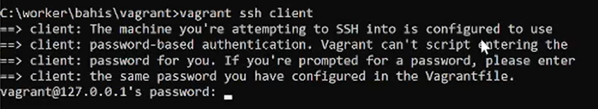{#fig-18-1 width=70%}

Завершение работы лабораторного стенда выполнено командами `vagrant halt server` и `vagrant halt client`, что обеспечило корректное выключение обеих виртуальных машин ([рис. @fig-19]).

{#fig-19 width=70%}

# Внесение изменений в настройки внутреннего окружения виртуальной машины

В конфигурационном файле `Vagrantfile` перед разделом с описанием виртуальной машины server добавлены provisioning-блоки `common user` и `common hostname`, обеспечивающие выполнение скриптов `01-user.sh` и `01-hostname.sh` при загрузке ВМ ([рис. @fig-20]). Это гарантирует создание пользователя bahis и установку доменного имени вида `*.bahis.net`.

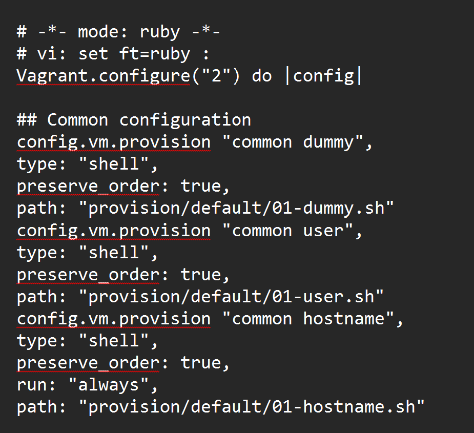{#fig-20 width=70%}

Для применения изменений выполнены команды `vagrant up server --provision` и `vagrant up client --provision`, в результате чего повторно запущены provisioning-сценарии и зафиксированы внутренние настройки виртуальных машин ([рис. @fig-21], [рис. @fig-22]). В процессе выполнения на сервере зафиксировано существование пользователя bahis, что подтверждает корректную работу скрипта создания пользователя.

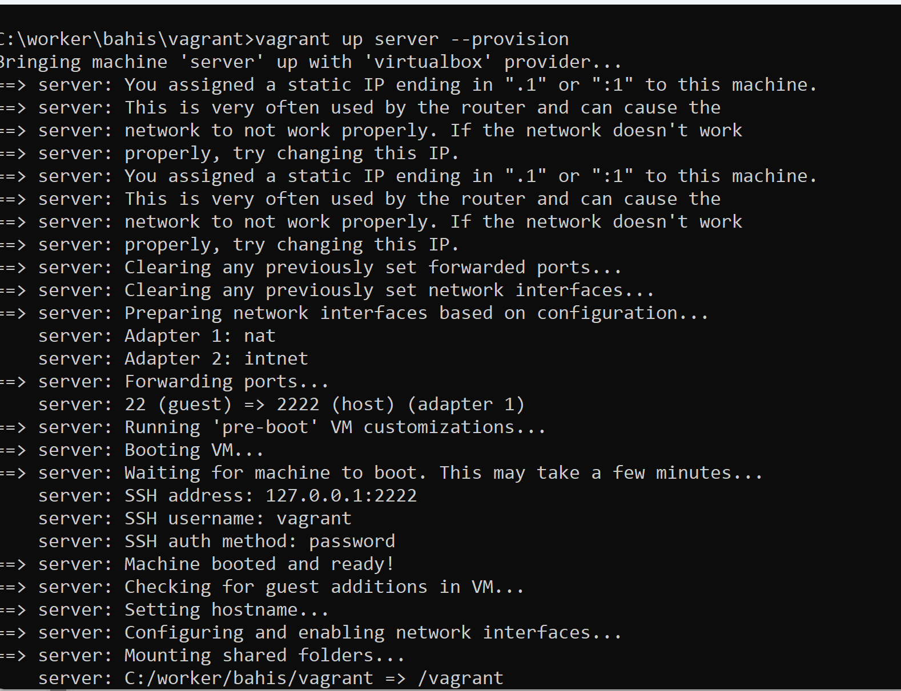{#fig-21 width=70%}

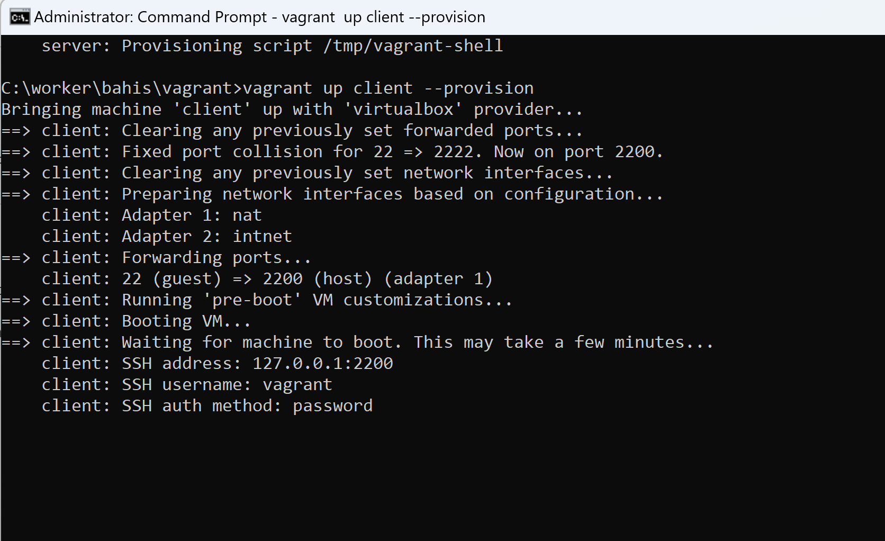{#fig-22 width=70%}

После применения настроек выполнен вход в графическом интерфейсе под пользователем bahis на сервере и клиенте ([рис. @fig-23], [рис. @fig-23-1]). При подключении по SSH командой `vagrant ssh` выполнен переход к пользователю `bahis` через `su - bahis`, при этом приглашение терминала отображается в формате `bahis@server.bahis.net` и `bahis@client.bahis.net`, что подтверждает корректную настройку hostname и пользовательского окружения ([рис. @fig-24]).

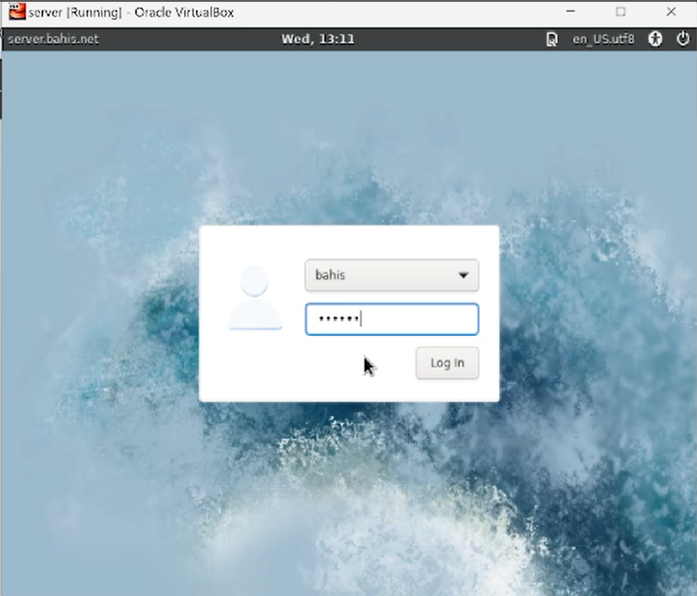{#fig-23 width=70%}

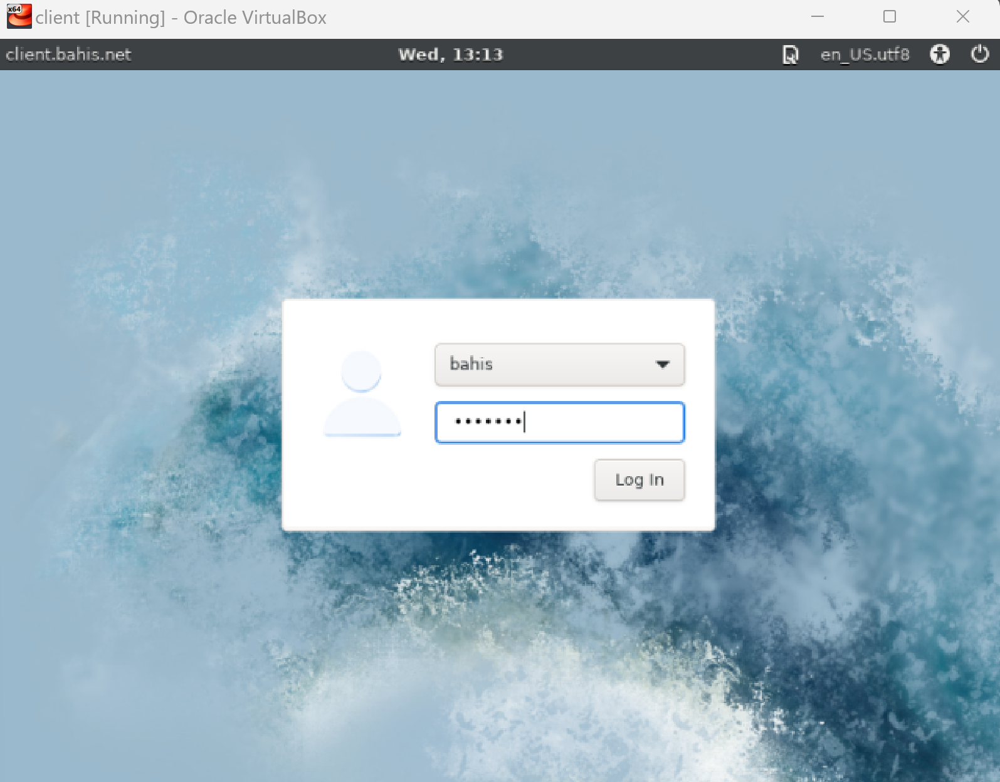{#fig-23-1 width=70%}

![Проверка SSH-подключения и отображения приглашения пользователя]

# Выводы

В ходе работы выполнена автоматическая сборка box-файла Rocky Linux с использованием Packer и его регистрация в Vagrant. Развёрнуты виртуальные машины server и client, применены provisioning-скрипты для создания пользователя и настройки hostname. Подтверждена корректная работа SSH-доступа и сетевых параметров. Лабораторный стенд в ОС Windows успешно подготовлен к дальнейшей работе.

# Контрольные вопросы:

1. Для чего предназначен Vagrant? – Это инструмент для создания и
управления средами виртуальных машин в одном рабочем процессе.
Он позволяет автоматизировать процесс установки на виртуальную
машину как основного дистрибутива операционной системы, так и
настройки необходимого в дальнейшем программного обеспечения.

2. Что такое box-файл? В чём назначение Vagrantfile? - box-файл (или
Vagrant Box) — сохранённый образ виртуальной машины с
развёрнутой в ней операционной системой, box-файл используется
как основа для клонирования виртуальных машин с теми или иными
настройками. Vagrantfile — конфигурационный файл, написанный
на языке Ruby, в котором указаны настройки запуска виртуальной
машины.

3. Приведите описание и примеры вызова основных команд Vagrant.
vagrant help — вызов справки по командам Vagrant;
vagrant box list — список подключённых к Vagrant box-файлов;
vagrant box add — подключение box-файла к Vagrant;
vagrant destroy— отключение box-файла от Vagrant и удаление его из
виртуального окружения;
vagrant init — создание «шаблонного» конфигурационного файла
Vagrantfile для его последующего изменения;
vagrant up — запуск виртуальной машины с использованием инструкций
по запуску из конфигурационного файла Vagrantfile;
vagrant reload — перезагрузка виртуальной машины;
vagrant halt — остановка и выключение виртуальной машины;
vagrant provision — настройка внутреннего окружения имеющейся
виртуальной машины (например, добавление новых инструкций
(скриптов) в ранее созданную виртуальную машину);
vagrant ssh — подключение к виртуальной машине через ssh.

4. Дайте построчные пояснения содержания файлов vagrant-rocky.pkr.hcl,
ks.cfg, Vagrantfile, Makefile.
Vagrantfile - Первые две строки указывают на режим работы с Vagrantfile
и использование языка Ruby. Затем идёт цикл do, заменяющий
конструкцию Vagrant.configure далее по тексту на config. Строка
config.vm.box = "BOX_NAME" задаёт название образа (box-файла)
виртуальной машины (обычно выбирается из официального репозитория).
Строка config.vm.hostname = "HOST_NAME" задаёт имя виртуальной
машины. Конструкция config.vm.network задаёт тип сетевого соединения
и может иметь следующие назначения: – config.vm.network
"private_network", ip: "xxx.xxx.xxx.xxx" — адрес из внутренней сети; –
config.vm.network "public_network", ip: "xxx.xxx.xxx.xxx" — публичный
адрес, по которому виртуальная машина будет доступна; –
config.vm.network "private_network", type: "dhcp" — адрес, назначаемый по протоколу DHCP. Строка config.vm.define "VM_NAME" задаёт название
виртуальной машины, по которому можно обращаться к ней из Vagrant и
VirtualBox. В конце идёт конструкция, определяющая параметры
провайдера, а именно запуск виртуальной машины без графического
интерфейса и с выделением 1 ГБ памяти.

# Список литературы

1. GNU Bash Manual. — 2019. — URL: https://www.gnu.org/software/bash/manual/ (дата обр. 13.09.2021).

2. GNU Make Manual. — 2016. — URL: http://www.gnu.org/software/make/manual/ (visited on 09/13/2021).

3. Powers S. *Vagrant Simplified [Просто о Vagrant]* / Пер.: А. Панин // Библиотека сайта ruslinux.net. — 2015. — URL: http://rus-linux.net/MyLDP/vm/vagrant-simplified.html (visited on 09/13/2021).

4. Vagrant Documentation. — URL: https://www.vagrantup.com/docs (visited on 09/13/2021).

5. Купер М. *Искусство программирования на языке сценариев командной оболочки*. — 2004. — URL: https://www.opennet.ru/docs/RUS/bash_scripting_guide/ (дата обр. 13.09.2021).

