---
## Author
author:
  name: Бахи сиди али темассини
  degrees: Student (3 курс)
  orcid: ""
  email: 1032234211@pfur.ru
  affiliation:
    - name: Российский университет дружбы народов
      country: Российская Федерация
      postal-code: 117198
      city: Москва
      address: ул. Миклухо-Маклая, д. 6

## Title
title: "Отчёт по лабораторной работе №2"
subtitle: "Дисциплина: Администрирование сетевых подсистем"
license: "CC BY"
---

# Цель работы

Здесь приводится формулировка цели лабораторной работы.
Формулировки цели для каждой лабораторной работы приведены в методических указаниях.

Цель данного шаблона --- максимально упростить подготовку отчётов по лабораторным работам.
Модифицируя данный шаблон, студенты смогут без труда подготовить отчёт по лабораторным работам, а также познакомиться с основными возможностями разметки Markdown.

# Выполнение лабораторной работы

## Установка DNS-сервера

На виртуальной машине server выполнен вход под пользователем bahis и переход в режим суперпользователя с помощью команды `sudo -i`, что подтверждается сменой приглашения командной строки на root ([рис. @fig-1]).

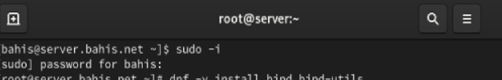{#fig-1 width=70%}

В режиме суперпользователя установлены пакеты `bind` и `bind-utils` с использованием `dnf -y install bind bind-utils`; транзакция завершена успешно, зависимости разрешены, пакеты установлены ([рис. @fig-2]).

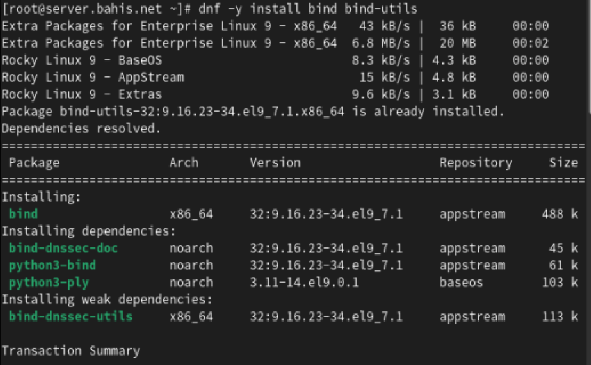{#fig-2 width=70%}

С помощью утилиты `dig` выполнен DNS-запрос к имени [www.yandex.ru](http://www.yandex.ru); в выводе отображены заголовок ответа (opcode: QUERY, status: NOERROR), флаги (qr, rd, ra), секции QUESTION и ANSWER с тремя A-записями и временем отклика, что подтверждает корректное разрешение имени через внешний DNS-сервер ([рис. @fig-3]).

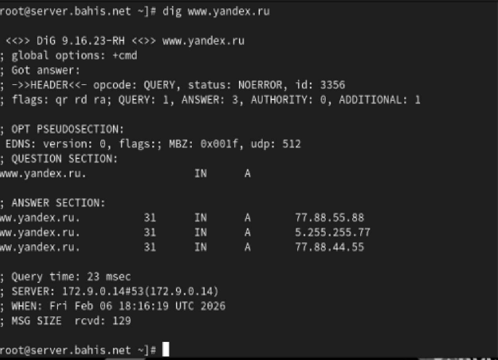{#fig-3 width=70%}

## Конфигурирование кэширующего DNS-сервера

Проанализировано содержимое файла `/etc/resolv.conf`: указан поисковый домен bahis.net и заданы внешние DNS-серверы (172.249.0.7, 8.8.8.8, 8.8.4.4), что определяет порядок разрешения имён до изменения конфигурации ([рис. @fig-4]).

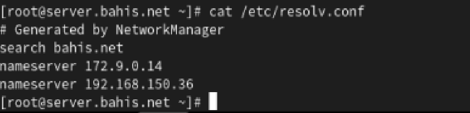{#fig-4 width=70%}

Проанализирован файл `/etc/named.conf`: сервер настроен как кэширующий (recursion yes), прослушивает порт 53 только на 127.0.0.1, разрешены запросы от localhost, определены параметры каталогов и подключены стандартные зоны ([рис. @fig-5]).

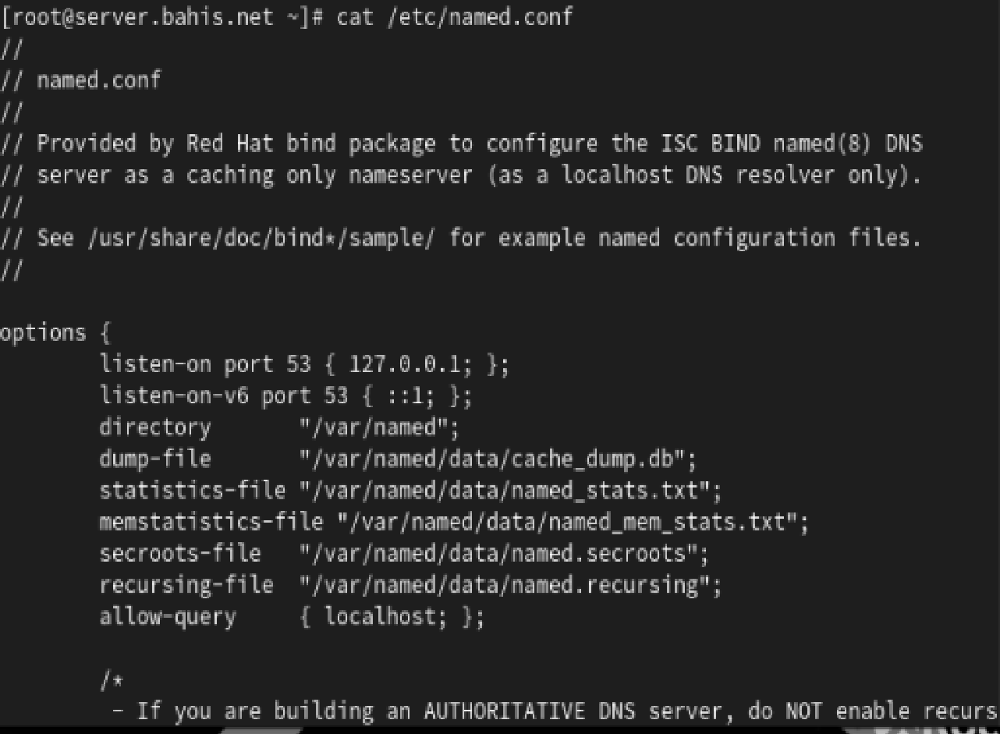{#fig-5 width=70%}

Рассмотрено содержимое файлов `/var/named/named.ca`, `/var/named/named.localhost` и `/var/named/named.loopback`: первый содержит список корневых DNS-серверов (NS, A, AAAA-записи), второй и третий определяют локальные зоны localhost и обратного разрешения 127.0.0.1 ([рис. @fig-6], [рис. @fig-7], [рис. @fig-8]).

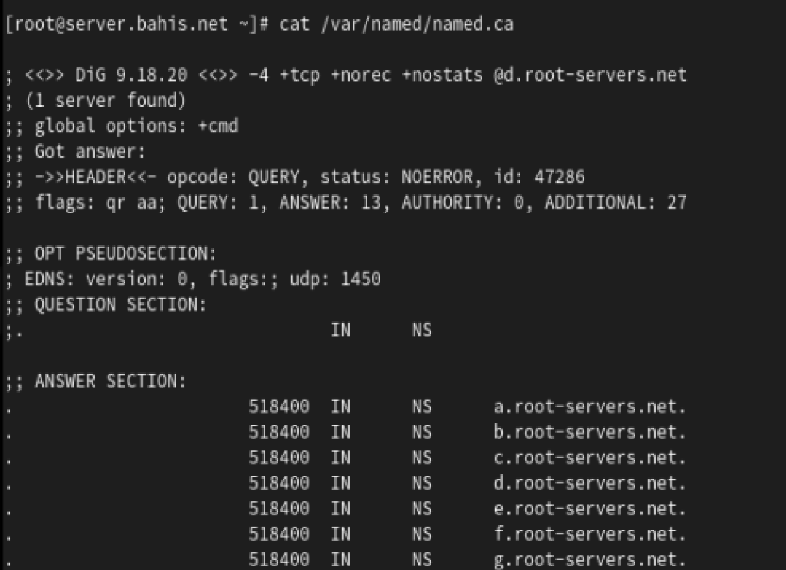{#fig-6 width=70%}

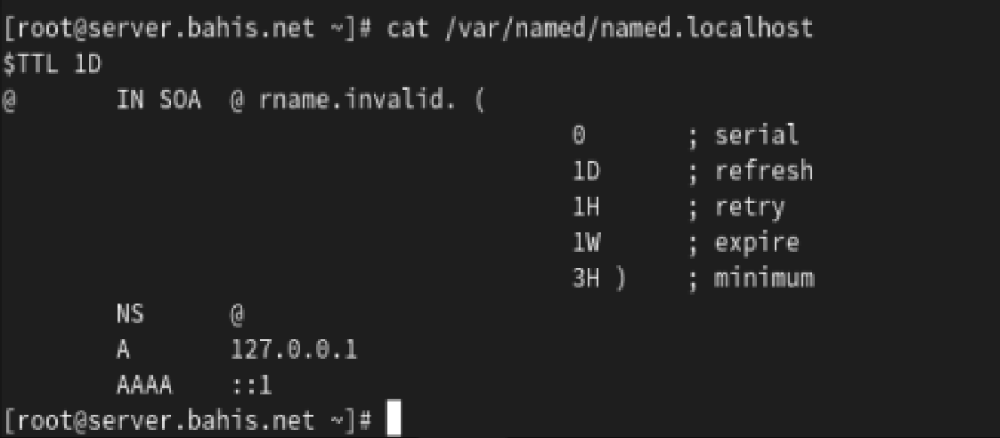{#fig-7 width=70%}

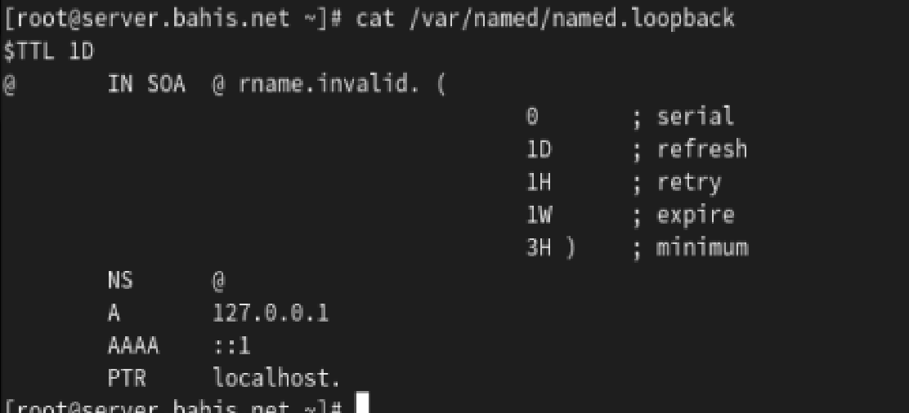{#fig-8 width=70%}

DNS-сервер запущен и добавлен в автозагрузку командами `systemctl start named` и `systemctl enable named`; сравнение результатов `dig www.yandex.ru` и `dig @127.0.0.1 www.yandex.ru` показало отсутствие ответа от локального сервера до изменения настроек прослушивания ([рис. @fig-9]).

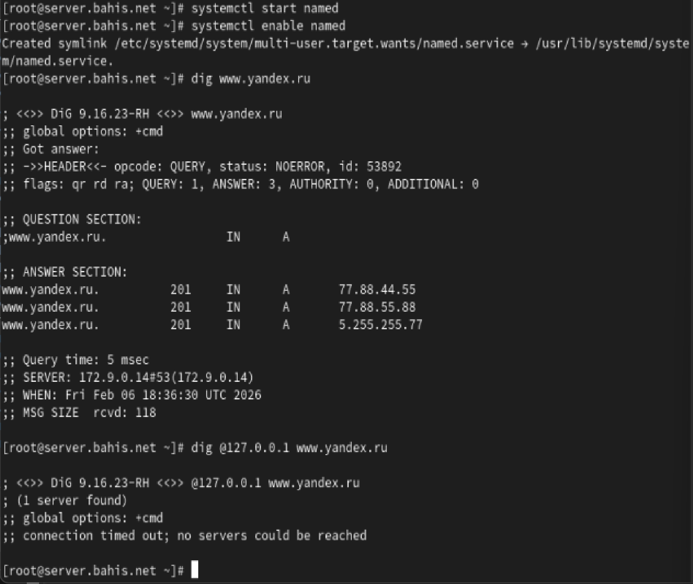{#fig-9 width=70%}

В NetworkManager изменены параметры соединений eth0 и System eth0: удалены автоматические DNS, включено игнорирование auto-DNS и установлен сервер 127.0.0.1; после перезапуска NetworkManager файл `/etc/resolv.conf` содержит nameserver 127.0.0.1 ([рис. @fig-10]).

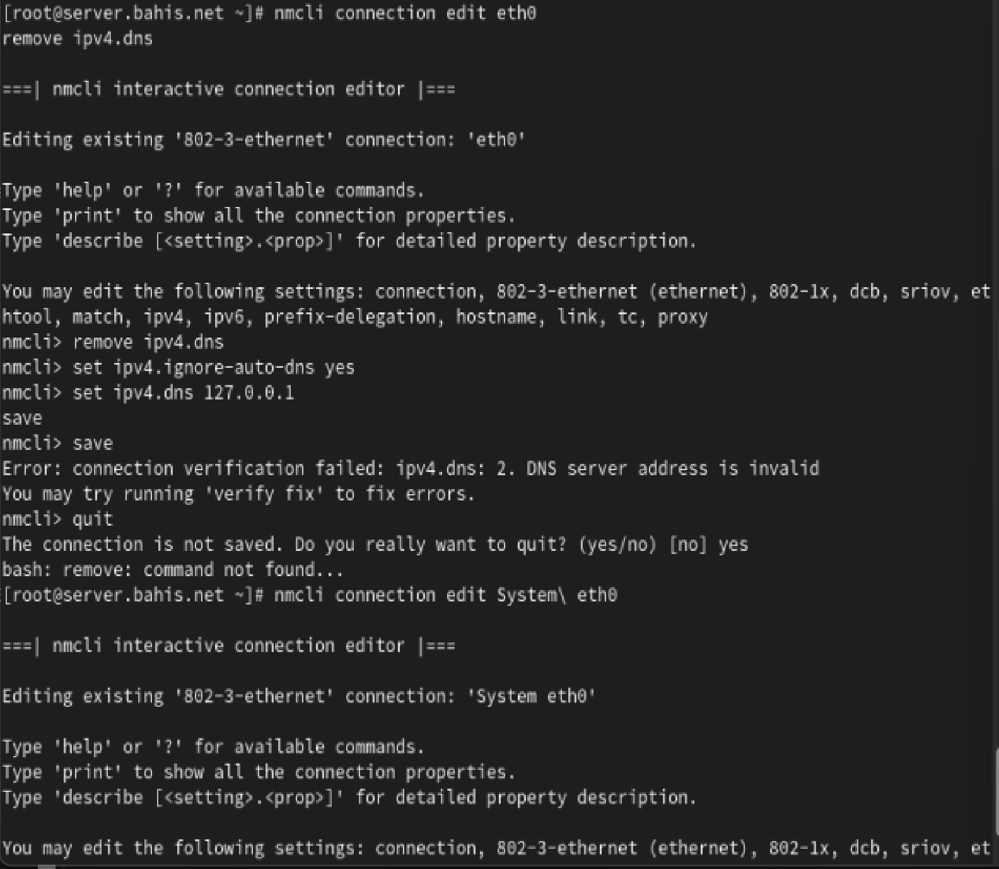{#fig-10 width=70%}

В файл `/etc/named.conf` внесены изменения: добавлено прослушивание на всех интерфейсах (127.0.0.1; any;) и разрешены запросы от сети 192.168.0.0/16; также в межсетевом экране разрешена служба DNS ([рис. @fig-11]).

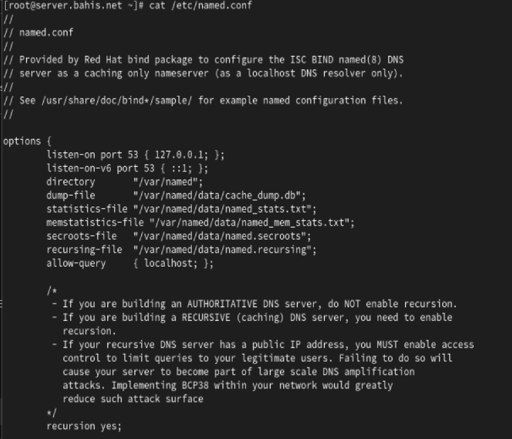{#fig-11 width=70%}

С помощью команды `lsof | grep UDP` подтверждено, что процесс named прослушивает порт 53 (UDP), что свидетельствует о корректной работе DNS-сервера и направлении запросов через узел server ([рис. @fig-12]).

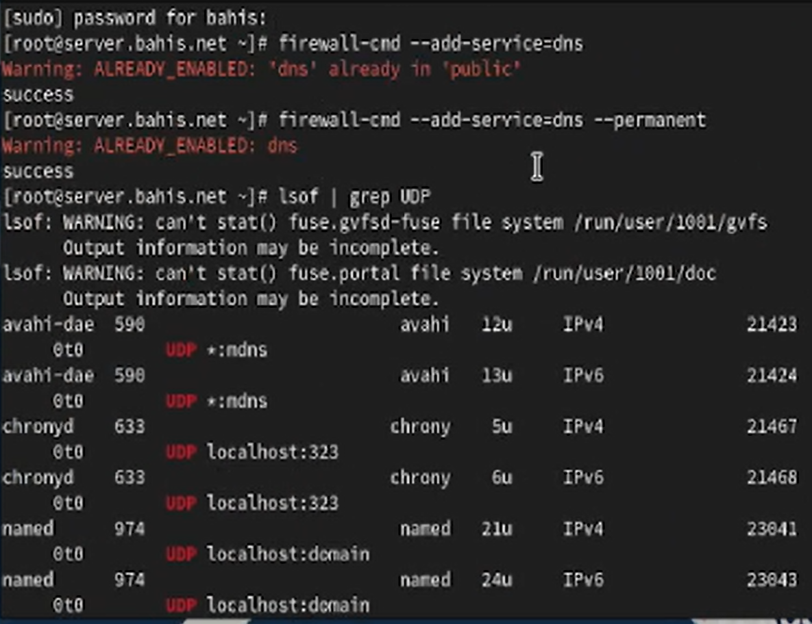{#fig-12 width=70%}

В конфигурационном файле `/etc/named.conf` в секцию `options` добавлены директивы `forwarders { 127.0.0.1; };` и `forward first;`, а также отключены параметры `dnssec-enable` и `dnssec-validation`, что обеспечивает перенаправление DNS-запросов на вышестоящий сервер и отказ от проверки DNSSEC ([рис. @fig-13]).

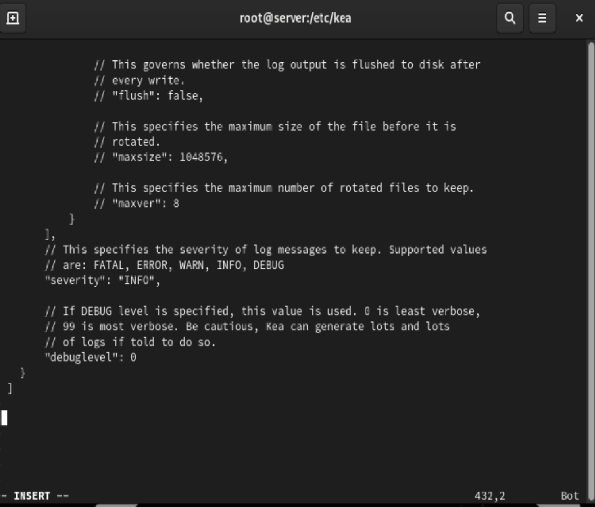{#fig-13 width=70%}

## Конфигурирование первичного DNS-сервера

На первом этапе выполнено копирование шаблона зон DNS `named.rfc1912.zones` в каталог `/etc/named` с последующим переименованием файла в `bahis.net`, после чего данный файл был подключён в конфигурации `/etc/named.conf` директивой `include "/etc/named/bahis.net";` ([рис. @fig-14]).

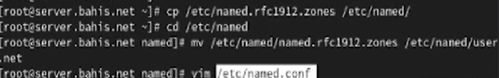{#fig-14 width=70%}

Далее в файле `/etc/named/bahis.net` вместо стандартных зон `localhost.localdomain` и `1.0.0.127.in-addr.arpa` были определены собственные зоны: прямая зона `bahis.net` с файлом `master/fz/bahis.net` и обратная зона `1.168.192.in-addr.arpa` с файлом `master/rz/192.168.1` ([рис. @fig-16]).

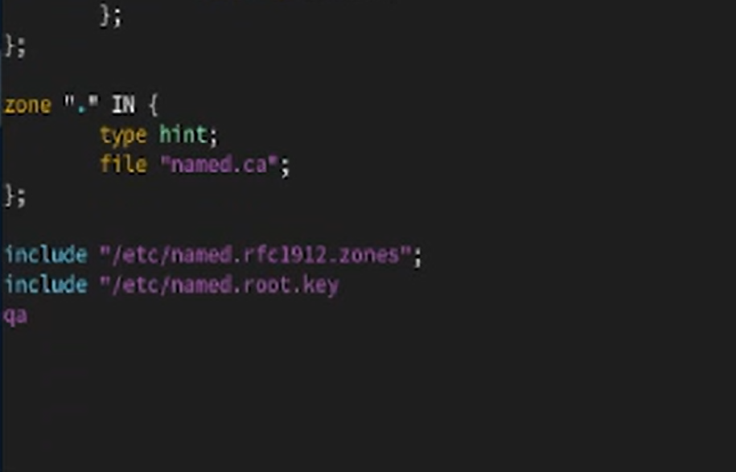{#fig-16 width=70%}

После этого в каталоге `/var/named` созданы подкаталоги `master/fz` и `master/rz` для размещения файлов прямой и обратной зон. В каталог `master/fz` скопирован шаблон `named.localhost`, который был переименован в `bahis.net` ([рис. @fig-17]).

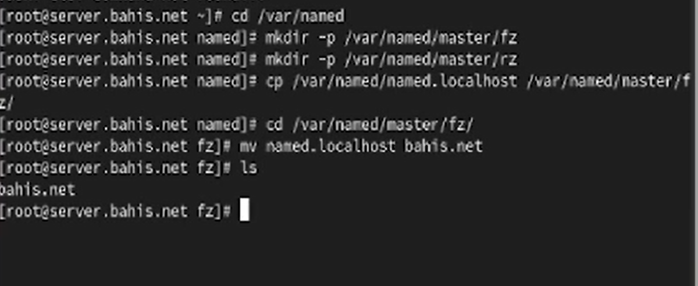{#fig-17 width=70%}

Затем был отредактирован файл обратной зоны `/var/named/master/rz/192.168.1`: указана директива `$TTL 1D`, задана запись SOA с сервером `server.bahis.net.`, установлен серийный номер формата ГГГГММДДВВ, добавлена A-запись с адресом `192.168.1.1`, а также PTR-записи для соответствия IP-адреса имени `server.bahis.net.` и `ns.bahis.net.`; директива `$ORIGIN` установлена в `1.168.192.in-addr.arpa.` ([рис. @fig-18]).

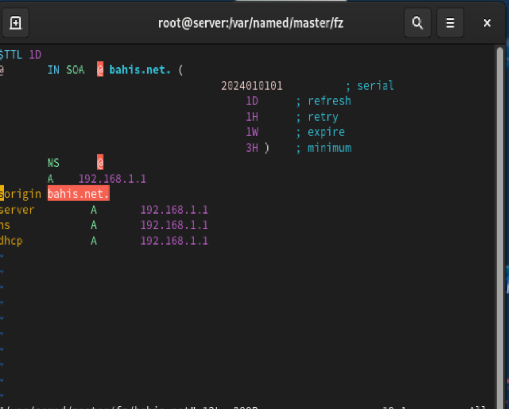{#fig-18 width=70%}

Далее выполнено восстановление контекстов безопасности SELinux для каталогов `/etc` и `/var/named`, проверены SELinux-переключатели для службы named, после чего активирован параметр `named_write_master_zones` и сервер DNS перезапущен командой `systemctl restart named` ([рис. @fig-20]).

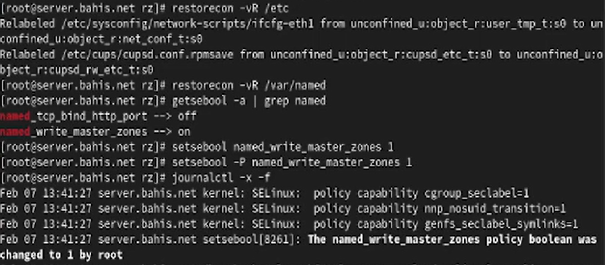{#fig-20 width=70%}

## Проверка работоспособности первичного DNS-сервера

После перезапуска службы `named` выполнена проверка разрешения имени `ns.bahis.net` с помощью утилиты `dig`. В ответе сервера получен статус `NOERROR`, в разделе ANSWER возвращена A-запись `192.168.1.1`, сервером указан `127.0.0.1#53`, что подтверждает корректную работу локального DNS-сервера ([рис. @fig-21]).

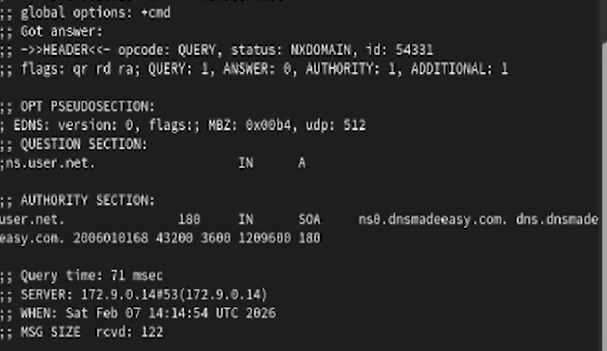{#fig-21 width=70%}

Далее выполнена передача зоны командой `host -l bahis.net`. В выводе отображаются NS-запись `server.bahis.net.` и A-записи для `bahis.net`, `ns.bahis.net` и `server.bahis.net` с адресом `192.168.1.1`, что подтверждает корректную настройку прямой зоны ([рис. @fig-22]).

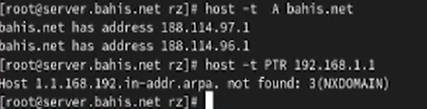{#fig-22 width=70%}

Командой `host -a bahis.net` выполнен расширенный запрос типа ANY. В разделе ANSWER присутствуют записи SOA, NS и A, что подтверждает корректность параметров зоны и серийного номера ([рис. @fig-23]).

![Расширенный запрос host -a для bahis.net]

Затем выполнена проверка прямого и обратного разрешения имени. Команда `host -t A bahis.net` возвращает IP-адрес `192.168.1.1`. Команда `host -t PTR 192.168.1.1` возвращает PTR-записи `server.bahis.net.` и `ns.bahis.net.`, что подтверждает корректную настройку обратной зоны `1.168.192.in-addr.arpa` ([рис. @fig-24]).

![Проверка A- и PTR-записей зоны bahis.net]
## Внесение изменений в настройки внутреннего окружения виртуальной машины

На виртуальной машине `server` выполнен переход в каталог `/vagrant`, после чего созданы подкаталоги `provision/server/dns/etc/named` и `provision/server/dns/var/named/master`. Далее скопированы файлы `/etc/named.conf`, содержимое `/etc/named/` и файлы зон из `/var/named/master/` в соответствующие каталоги внутри `/vagrant/provision/server/dns/` ([рис. @fig-25]).

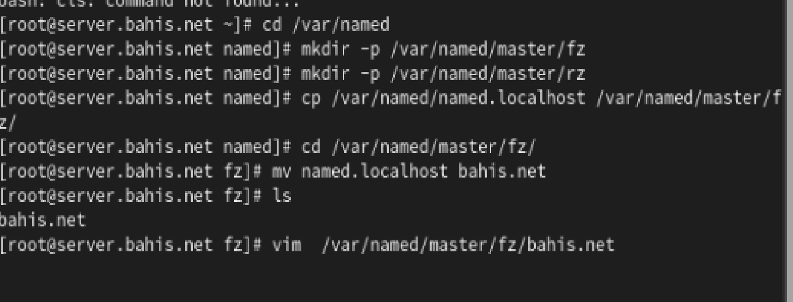{#fig-25 width=70%}

Затем в каталоге `/vagrant/provision/server` создан исполняемый файл `dns.sh`, в который внесён скрипт автоматической установки и настройки DNS-сервера: установка пакетов `bind` и `bind-utils`, копирование конфигурационных файлов в системные каталоги `/etc` и `/var/named`, изменение владельца на `named:named`, восстановление SELinux-контекстов, настройка межсетевого экрана для службы `dns`, включение параметра `named_write_master_zones`, изменение DNS-адреса соединения `System eth0` на `127.0.0.1`, перезапуск `NetworkManager`, а также включение и запуск службы `named` ([рис. @fig-26]).

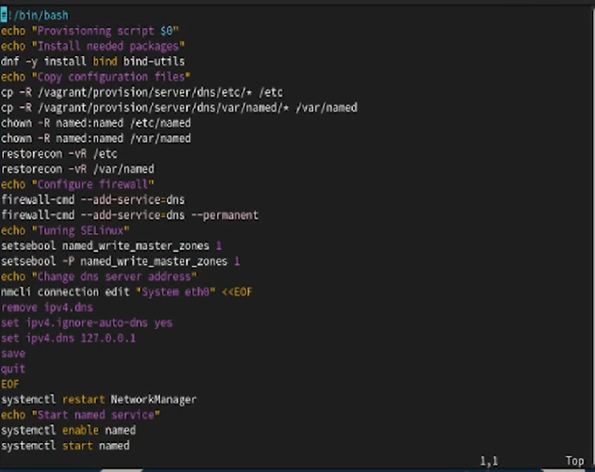{#fig-26 width=70%}

Для автоматического выполнения данного скрипта при загрузке виртуальной машины в файл `Vagrantfile` в разделе конфигурации сервера добавлен provision-блок типа `shell` с путём `provision/server/dns.sh` и параметром `preserve_order: true`, что обеспечивает последовательное выполнение сценария при старте VM ([рис. @fig-27]).

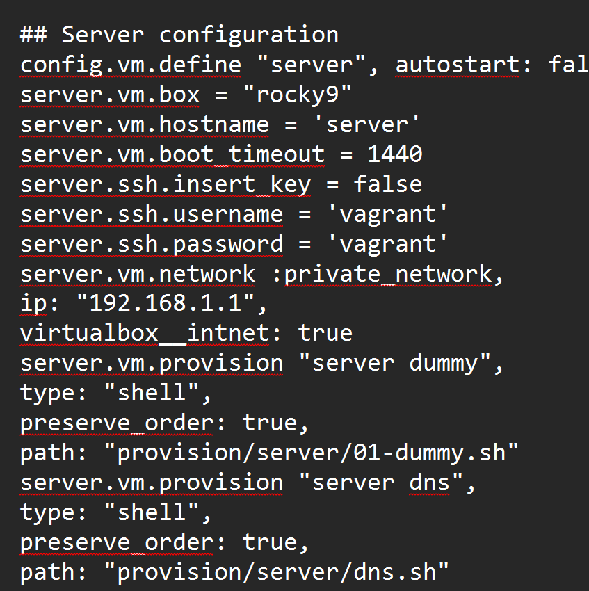{#fig-27 width=70%}

# Выводы

В ходе работы выполнена установка и настройка кэширующего и первичного DNS-сервера на базе BIND.

Сервер успешно сконфигурирован для работы в режиме recursive caching, а также в режиме первичного (master) сервера для прямой зоны **bahis.net** и обратной зоны **1.168.192.in-addr.arpa**.

Настроены A- и PTR-записи, подтверждена авторитетность сервера по флагу **aa** в ответах `dig`. Проверка утилитами `dig` и `host` показала корректное разрешение имён и обратное разрешение IP-адреса 192.168.1.1.

Обеспечена работа DNS через внутреннюю виртуальную сеть:
– изменены параметры `listen-on` и `allow-query`;
– открыт сервис DNS в firewall;
– настроены политики SELinux;
– сервер назначен DNS-сервером по умолчанию (127.0.0.1).

Дополнительно выполнена автоматизация конфигурации с использованием provisioning-скрипта `dns.sh` и интеграции в `Vagrantfile`, что обеспечивает воспроизводимость настройки при перезапуске виртуальной машины.

# Контрольные вопросы:

1. Что такое DNS? - Это система, предназначенная для преобразования
человекочитаемых доменных имен в IP-адреса, используемые
компьютерами для идентификации друг друга в сети.

2. Каково назначение кэширующего DNS-сервера? - Его задача - хранить
результаты предыдущих DNS-запросов в памяти. Когда клиент делает
запрос, кэширующий DNS проверяет свой кэш, и если он содержит
соответствующую информацию, сервер возвращает ее без необходимости
обращаться к другим DNS-серверам. Это ускоряет процесс запроса.

3. Чем отличается прямая DNS-зона от обратной? - Прямая зона преобразует
доменные имена в IP-адреса, обратная зона выполняет обратное:
преобразует IP-адреса в доменные имена.

4. В каких каталогах и файлах располагаются настройки DNS-сервера?
Кратко охарактеризуйте, за что они отвечают. - В Linux-системах обычно
используется файл /etc/named.conf для общих настроек. Зоны хранятся в
файлах в каталоге /var/named/, например, /var/named/example.com.zone.

5. Что указывается в файле resolv.conf? - Содержит информацию о DNS-
серверах, используемых системой, а также о параметрах конфигурации.

6. Какие типы записи описания ресурсов есть в DNS и для чего они
используются? - A (IPv4-адрес), AAAA (IPv6-адрес), CNAME
(каноническое имя), MX (почтовый сервер), NS (имя сервера), PTR
(обратная запись), SOA (начальная запись зоны), TXT (текстовая
информация).

7. Для чего используется домен in-addr.arpa? - Используется для обратного
маппинга IP-адресов в доменные имена.

8. Для чего нужен демон named? - Это DNS-сервер, реализация BIND
(Berkeley Internet Name Domain).

9. В чём заключаются основные функции slave-сервера и master-сервера? -
Master-сервер хранит оригинальные записи зоны, slave-серверы получают
копии данных от master-сервера.

10. Какие параметры отвечают за время обновления зоны? - refresh, retry,
expire, и minimum.

11. Как обеспечить защиту зоны от скачивания и просмотра? - Это может
включать в себя использование TSIG (Transaction SIGnatures) для
аутентификации между серверами.

12. Какая запись RR применяется при создании почтовых серверов? - MX
(Mail Exchange).

13. Как протестировать работу сервера доменных имён? - Используйте
команды nslookup, dig, или host.

14. Как запустить, перезапустить или остановить какую-либо службу в
системе? - systemctl start|stop|restart <service>.

15. Как посмотреть отладочную информацию при запуске какого-либо
сервиса или службы? - Используйте опции, такие как -d или -v при запуске
службы.

16. Где храниться отладочная информация по работе системы и служб? Как
её посмотреть? - В системных журналах, доступных через journalctl.

17. Как посмотреть, какие файлы использует в своей работе тот или иной
процесс? Приведите несколько примеров. - lsof -p <pid> или fuser -v <file>.

18. Приведите несколько примеров по изменению сетевого соединения при
помощи командного интерфейса nmcli. - Примеры включают nmcli
connection up|down <connection_name>.

19. Что такое SELinux? - Это мандатный контроль доступа для ядра Linux.

20. Что такое контекст (метка) SELinux? - Метка, определяющая, какие
ресурсы могут быть доступны процессу или объекту.

21. Как восстановить контекст SELinux после внесения изменений в
конфигурационные файлы? - restorecon -Rv <directory>.

22. Как создать разрешающие правила политики SELinux из файлов
журналов, содержащих сообщения о запрете операций? - Используйте
audit2allow.

23. Что такое булевый переключатель в SELinux? - Это параметр, который
включает или отключает определенные аспекты защиты SELinux.

24. Как посмотреть список переключателей SELinux и их состояние? -
getsebool -a.

25. Как изменить значение переключателя SELinux? - setsebool -P
<boolean_name> <on|off>.

# Список литературы

1. Barr D. *Common DNS Operational and Configuration Errors*: RFC / RFC Editor. — 02/1996. — DOI: 10.17487/rfc1912.

2. McAllister M., Radvan S., Walsh D., Grift D., Paris E., Morris J.  
   *Security-Enhanced Linux. Linux с улучшенной безопасностью: руководство пользователя*. —  
   URL: https://docs-old.fedoraproject.org/ru-RU/Fedora/13/html/Security-Enhanced_Linux/index.html  
   (дата обращения: 13.09.2021).

3. *Systemd*. — 2015. —  
   URL: https://wiki.archlinux.org/index.php/Systemd  
   (visited on 09/13/2021).

4. Костромин В. А. *Утилита lsof — инструмент администратора*. —  
   URL: http://rus-linux.net/kos.php?name=/papers/lsof/lsof.html  
   (дата обращения: 13.09.2021).

5. Поттеринг Л. *Systemd для администраторов: цикл статей*. — 2010. —  
   URL: http://wiki.opennet.ru/Systemd  
   (дата обращения: 13.09.2021).

6. *Сайт проекта NetworkManager*. —  
   URL: https://wiki.gnome.org/Projects/NetworkManager  
   (visited on 09/13/2021).

7. *Сайт проекта nmcli*. —  
   URL: https://developer.gnome.org/NetworkManager/stable/nmcli.html  
   (visited on 09/13/2021).

