---
## Author
author:
  name: Бахи сиди али темассини
  degrees: Student (3 курс)
  orcid: ""
  email: 1032234211@pfur.ru
  affiliation:
    - name: Российский университет дружбы народов
      country: Российская Федерация
      postal-code: 117198
      city: Москва
      address: ул. Миклухо-Маклая, д. 6
## Title
title: Лабораторная работа №3
subtitle: "Дисциплина: Администрирование сетевых подсистем "
license: CC BY
date: today
date-format: "YYYY-MM-DD" # Example: 2025-09-06
---

# Цель работы
## Цель работы

- Приобретение практических навыков установки и конфигурирования DHCP-сервера

# Выполнение лабораторной работы

## Установка DHCP-сервера

- Переход в режим суперпользователя
- Установка DHCP-сервера Kea через `dnf`

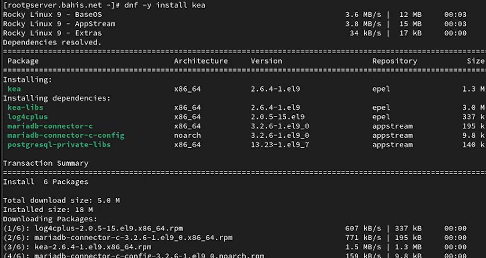{#fig-1 width=70%}

## Конфигурирование DHCP-сервера

- Отредактирован `/etc/kea/kea-dhcp4.conf`
- Указан интерфейс `eth1`
- Настроен DNS `192.168.1.1`
- Задан домен `bahis.net`
- Определена подсеть `192.168.1.0/24`
- Диапазон `192.168.1.30–192.168.1.199`
- Указан шлюз `192.168.1.1`

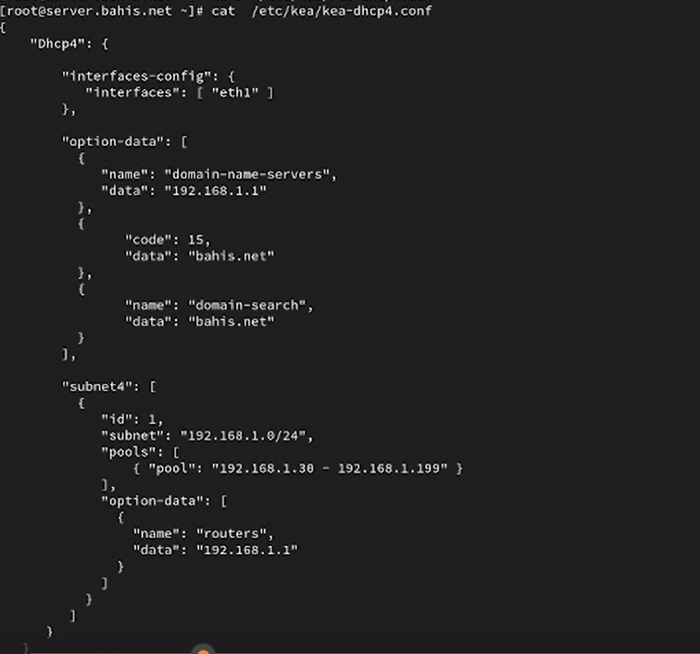{#fig-2 width=70%}

---

- Выполнена проверка `kea-dhcp4 -t`
- Ошибки отсутствуют
- Прослушивание на `eth1` активно

{#fig-3 width=70%}

---

- В прямую зону добавлена A-запись `dhcp.bahis.net`
- Обновлён серийный номер зоны

{#fig-4 width=70%}

---

- В обратную зону добавлена PTR-запись
- Связь `192.168.1.1` → `dhcp.bahis.net`
- Обновлён серийный номер

{#fig-5 width=70%}

---

- Перезапущена служба `named`
- Проверено разрешение `dhcp.bahis.net`
- Потерь пакетов нет

{#fig-6 width=70%}

---

- В `firewalld` добавлена служба `dhcp`
- Правило добавлено в текущую и постоянную конфигурацию
- Восстановлены SELinux-контексты

{#fig-7 width=70%}

---

- Выполнен мониторинг `/var/log/messages`
- Запущена служба `kea-dhcp4.service`
- Состояние — рабочее

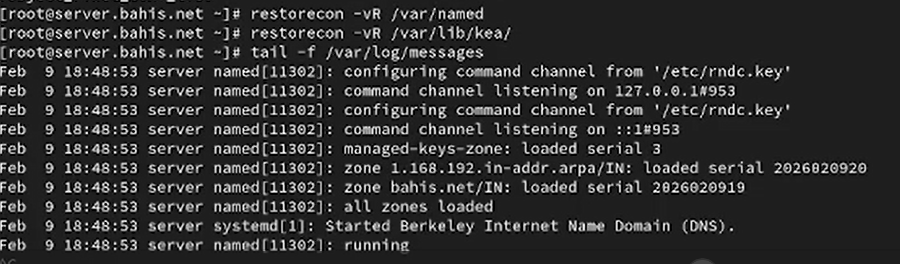{#fig-8 width=70%}

## Анализ работы DHCP-сервера

- Создан скрипт `01-routing.sh`
- Настроен шлюз `192.168.1.1` для `eth1`
- Отключён `eth0` как default-route

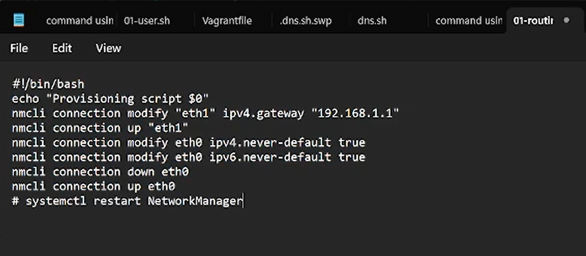{#fig-9 width=70%}

---

- Скрипт подключён в `Vagrantfile`
- Параметр `run: "always"`

{#fig-10 width=70%}

---

- В `/var/lib/kea/kea-leases4.csv` зафиксирована аренда `192.168.1.30`
- MAC клиента `08:00:27:ef:c7:e6`
- Время аренды 7200 секунд
- Подсеть ID 1
- Имя клиента `client`

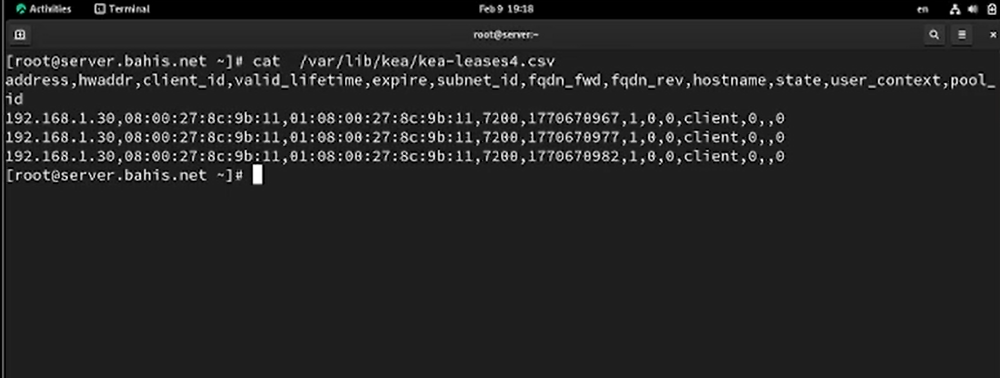{#fig-11 width=70%}

---

- Выполнена команда `ifconfig` на клиенте
- `eth0` — `10.0.2.15/24` (NAT)
- `eth1` — `192.168.1.30/24` (DHCP)
- Подтверждён MAC-адрес

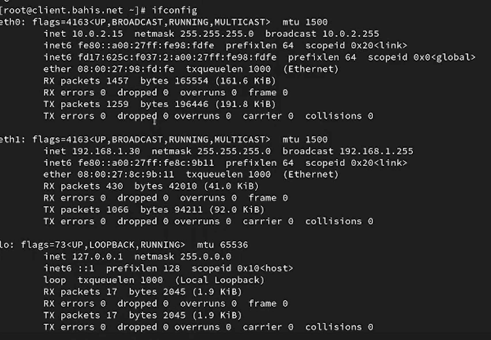{#fig-12 width=70%}

---

- Повторная проверка leases
- Аренда активна
- DHCP работает корректно

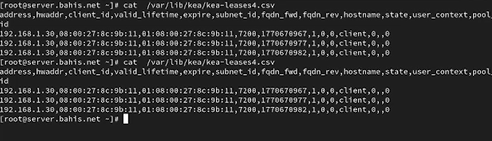{#fig-13 width=70%}

## Настройка обновления DNS-зоны

- Создан каталог `/etc/named/keys`
- Сгенерирован TSIG-ключ `DHCP_UPDATER` (HMAC-SHA512)
- Настроены права доступа

{#fig-14 width=70%}

---

- В файле `dhcp_updater.key` указаны имя, алгоритм и секрет

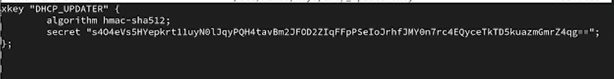{#fig-15 width=70%}

---

- В `named.conf` добавлена директива `include` для ключа

{#fig-16 width=70%}

---

- В зонах добавлена `update-policy`
- Разрешено обновление A- и PTR-записей
- Используется механизм DHCID

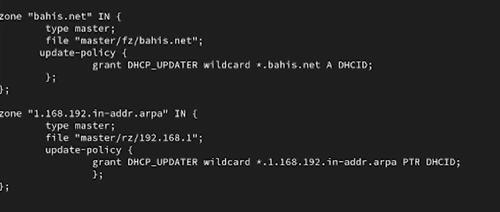{#fig-17 width=70%}

---

- Проверка `named-checkconf`
- Перезапуск `named`
- Ошибки отсутствуют

{#fig-18 width=70%}

---

- Создан `/etc/kea/tsig-keys.json`
- Перенесён секретный ключ
- Владелец `kea:kea`, права 640

{#fig-19 width=70%}

---

- В файле описан ключ `DHCP_UPDATER`
- Алгоритм `hmac-sha512`

{#fig-20 width=70%}

---

- Настроен `/etc/kea/kea-dhcp-ddns.conf`
- Адрес `127.0.0.1`, порт `53001`
- Подключён `tsig-keys.json`
- Указаны зоны `bahis.net.` и `1.168.192.in-addr.arpa.`

{#fig-21 width=70%}

---

- Проверка `kea-dhcp-ddns -t`
- Служба запущена
- Статус `active (running)`

{#fig-22 width=70%}

---

- В `kea-dhcp4.conf` включены:
- `"enable-updates": true`
- `"ddns-qualifying-suffix": "bahis.net"`
- `"ddns-override-client-update": true`

{#fig-23 width=70%}

---

- Проверка `kea-dhcp4 -t`
- Перезапуск `kea-dhcp4.service`
- Статус `active (running)`

{#fig-24 width=70%}

---

- На клиенте выполнено переполучение IP (`nmcli down/up`)
- Инициировано динамическое обновление DNS

{#fig-25 width=70%}

---

## Анализ работы DHCP-сервера после настройки обновления DNS-зоны

- Выполнен `dig @192.168.1.1 client.bahis.net`
- Статус `NOERROR`
- Флаг `aa` — сервер авторитетный
- Получена запись `A 192.168.1.30`
- TTL 2400 секунд

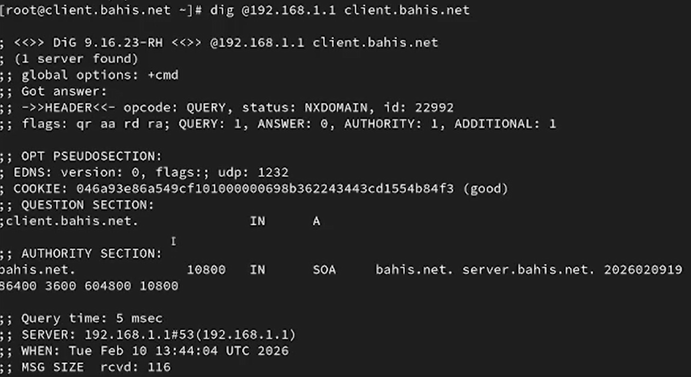{#fig-27 width=70%}

## Внесение изменений в настройки внутреннего окружения виртуальной машины

- Создан каталог `/vagrant/provision/server/dhcp/etc/kea`
- Скопированы конфигурации DHCP и DNS

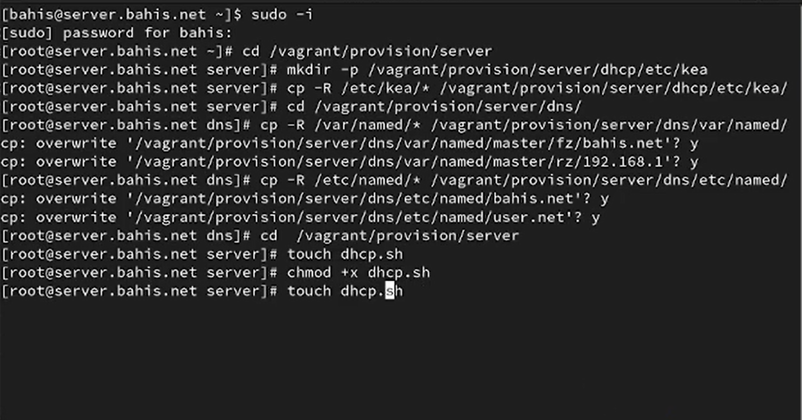{#fig-28 width=70%}

---

- Создан скрипт `dhcp.sh`
- Установка `kea`
- Копирование конфигураций
- Настройка прав доступа
- Восстановление SELinux
- Настройка firewalld
- Запуск `kea-dhcp4` и `kea-dhcp-ddns`

{#fig-29 width=70%}

---

- В `Vagrantfile` добавлен provision-блок
- Путь `provision/server/dhcp.sh`
- Сохранён порядок выполнения

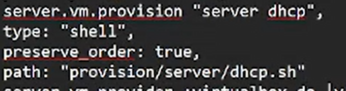{#fig-30 width=70%}

# Выводы
## Выводы

- Установлен и настроен DHCP-сервер Kea
- Реализована выдача адресов в сети `192.168.1.0/24`
- Настроено динамическое обновление DNS через TSIG
- Подтверждено создание записи `client.bahis.net`
- Проверена корректность работы DHCP и DDNS
- Зафиксированы аренды в `kea-leases4.csv`
- Реализована автоматизация через `dhcp.sh` и `Vagrantfile`
