---
## Author
author:
  name: Бахи сиди али темассини
  degrees: Student (3 курс)
  orcid: ""
  email: 1032234211@pfur.ru
  affiliation:
    - name: Российский университет дружбы народов
      country: Российская Федерация
      postal-code: 117198
      city: Москва
      address: ул. Миклухо-Маклая, д. 6

## Title
title: "Отчёт по лабораторной работе №3"
subtitle: "Дисциплина: Администрирование сетевых подсистем"
license: "CC BY"
---

# Цель работы

Приобретение практических навыков по установке и конфигурированию DHCP-сервера.

# Выполнение лабораторной работы

## Установка DHCP-сервера

На виртуальной машине server выполнен переход в режим суперпользователя и произведена установка DHCP-сервера Kea с использованием пакетного менеджера `dnf` ([рис. @fig-1]).

{#fig-1 width=70%}


## Конфигурирование DHCP-сервера

В конфигурационном файле `/etc/kea/kea-dhcp4.conf` выполнены следующие изменения:
указан интерфейс `eth1`, настроен DNS-сервер `192.168.1.1`, домен `bahis.net`, поисковый домен `bahis.net`, задана подсеть `192.168.1.0/24`, диапазон выдаваемых адресов `192.168.1.30–192.168.1.199`, а также шлюз `192.168.1.1` ([рис. @fig-2]).

{#fig-2 width=70%}


Проверка корректности конфигурационного файла выполнена командой `kea-dhcp4 -t /etc/kea/kea-dhcp4.conf`. Ошибки синтаксиса отсутствуют, подсеть успешно добавлена, прослушивание настроено на интерфейсе `eth1` ([рис. @fig-3]).

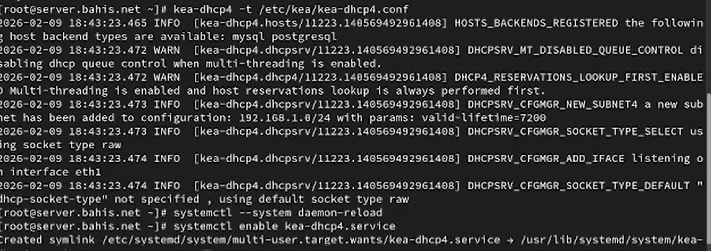{#fig-3 width=70%}


В файл прямой DNS-зоны `/var/named/master/fz/bahis.net` добавлена запись типа `A` для узла `dhcp.bahis.net` с адресом `192.168.1.1`. Серийный номер зоны обновлён ([рис. @fig-4]).

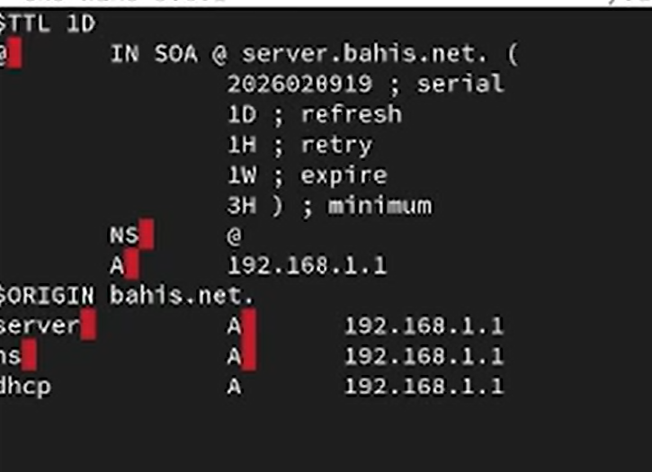{#fig-4 width=70%}


В файл обратной зоны `/var/named/master/rz/192.168.1` добавлена запись `PTR`, связывающая IP-адрес `192.168.1.1` с именем `dhcp.bahis.net`. Серийный номер зоны изменён ([рис. @fig-5]).

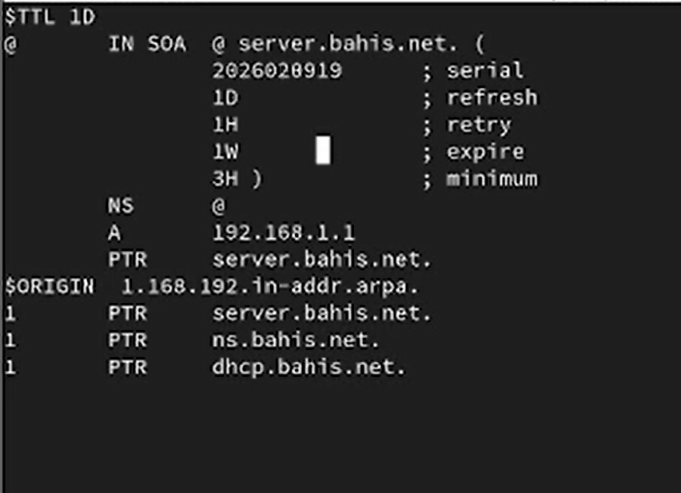{#fig-5 width=70%}


После перезапуска службы `named` выполнена проверка разрешения имени `dhcp.bahis.net`. Имя корректно разрешается в IP-адрес `192.168.1.1`, потерь пакетов нет ([рис. @fig-6]).

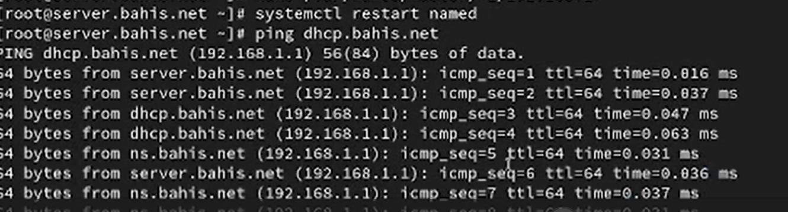{#fig-6 width=70%}


Выполнена настройка межсетевого экрана: добавлена служба `dhcp` в текущую и постоянную конфигурацию, произведена корректировка контекстов SELinux для каталогов `/etc`, `/var/named`, `/var/lib/kea/` ([рис. @fig-7]).

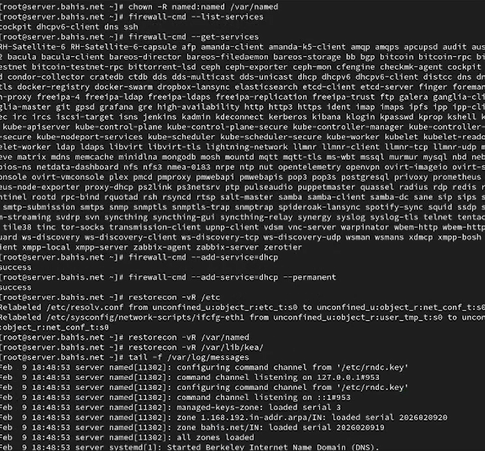{#fig-7 width=70%}


Запущен мониторинг системного журнала `/var/log/messages`, после чего выполнен запуск службы `kea-dhcp4.service`. Система перешла в рабочее состояние без критических ошибок ([рис. @fig-8]).

{#fig-8 width=70%}

## Анализ работы DHCP-сервера

В каталоге `vagrant/provision/client` создан исполняемый файл `01-routing.sh`, содержащий команды `nmcli`, изменяющие шлюз по умолчанию для интерфейса `eth1` на `192.168.1.1`, а также отключающие использование `eth0` как маршрута по умолчанию ([рис. @fig-9]).

{#fig-9 width=70%}


В файле `Vagrantfile` скрипт `01-routing.sh` подключён в разделе конфигурации виртуальной машины `client` с параметром `run: "always"`, что обеспечивает его выполнение при каждом запуске с provisioning ([рис. @fig-10]).

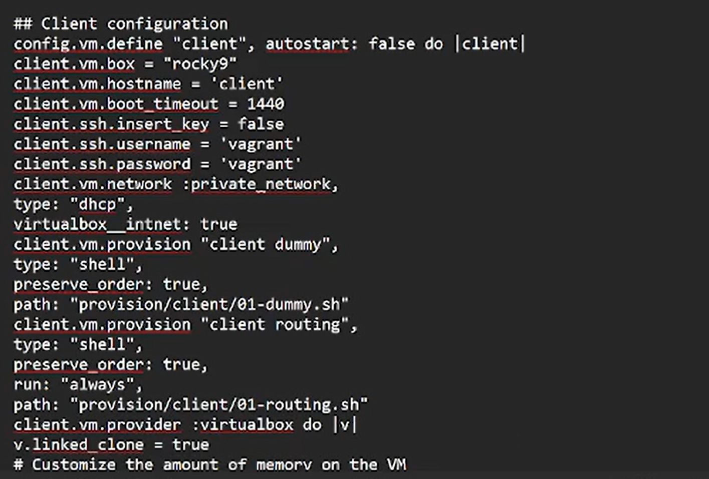{#fig-10 width=70%}


На сервере в файле `/var/lib/kea/kea-leases4.csv` зафиксирована выдача IP-адреса `192.168.1.30` клиенту.
Структура строк файла:

- `address` — выданный IP-адрес (`192.168.1.30`);
- `hwaddr` — MAC-адрес клиента (`08:00:27:ef:c7:e6`);
- `client_id` — идентификатор клиента;
- `valid_lifetime` — время аренды (7200 секунд);
- `expire` — время окончания аренды (Unix-time);
- `subnet_id` — идентификатор подсети (1);
- `fqdn_fwd`, `fqdn_rev` — параметры обновления DNS;
- `hostname` — имя клиента (`client`);
- `state` — состояние аренды;
- `user_context`, `pool_id` — дополнительные параметры пула ([рис. @fig-11]).

{#fig-11 width=70%}


На виртуальной машине `client` выполнена команда `ifconfig`.
Интерфейс `eth0` получил адрес `10.0.2.15/24` (NAT VirtualBox).
Интерфейс `eth1` получил адрес `192.168.1.30/24` из диапазона DHCP, broadcast-адрес `192.168.1.255`, MAC-адрес `08:00:27:ef:c7:e6`.
Интерфейс `lo` — локальный интерфейс `127.0.0.1` ([рис. @fig-12]).

{#fig-12 width=70%}


Повторная проверка файла `/var/lib/kea/kea-leases4.csv` на сервере подтверждает активную аренду IP-адреса `192.168.1.30` клиентской машине, что свидетельствует о корректной работе DHCP-сервера Kea ([рис. @fig-13]).

{#fig-13 width=70%}

## Настройка обновления DNS-зоны

На виртуальной машине server создан каталог `/etc/named/keys`, затем сгенерирован TSIG-ключ `DHCP_UPDATER` алгоритмом `HMAC-SHA512` с сохранением в файл `/etc/named/keys/dhcp_updater.key`. После этого откорректированы права доступа владельца каталога ([рис. @fig-14]).

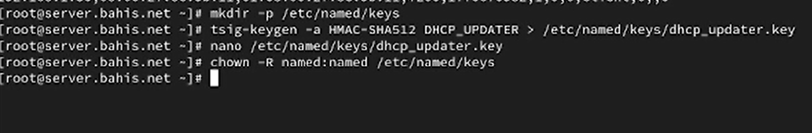{#fig-14 width=70%}


В файле `/etc/named/keys/dhcp_updater.key` содержится описание ключа: имя `DHCP_UPDATER`, алгоритм `hmac-sha512` и сгенерированное секретное значение, используемое для аутентификации динамических DNS-обновлений ([рис. @fig-15]).

{#fig-15 width=70%}


В конфигурационный файл `/etc/named.conf` добавена директива подключения ключа:

```
include "/etc/named/keys/dhcp_updater.key";
```

что позволяет службе `named` использовать созданный TSIG-ключ ([рис. @fig-16]).

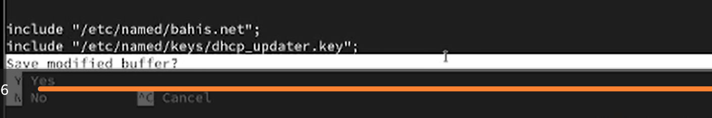{#fig-16 width=70%}


В конфигурации зон прямого и обратного разрешения добавлена политика `update-policy`, разрешающая ключу `DHCP_UPDATER` выполнять динамическое обновление записей типа `A` и `PTR` с использованием механизма `DHCID` ([рис. @fig-17]).

{#fig-17 width=70%}


Выполнена проверка корректности конфигурационного файла командой `named-checkconf`, затем произведён перезапуск службы `named`. Ошибки конфигурации отсутствуют ([рис. @fig-18]).

{#fig-18 width=70%}


Создан файл `/etc/kea/tsig-keys.json`, в который перенесён ранее сгенерированный секретный ключ в формате JSON для использования службой Kea DHCP. Затем установлен владелец `kea:kea` и права доступа `640`, что ограничивает доступ к ключу ([рис. @fig-19]).

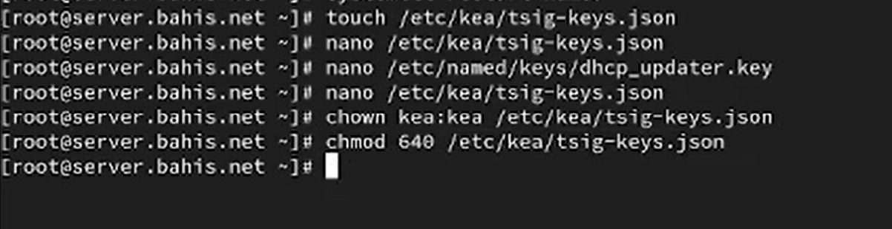{#fig-19 width=70%}


В файле `/etc/kea/tsig-keys.json` описан TSIG-ключ `DHCP_UPDATER` с алгоритмом `hmac-sha512` и секретным значением, используемым Kea для аутентификации обновлений DNS ([рис. @fig-20]).

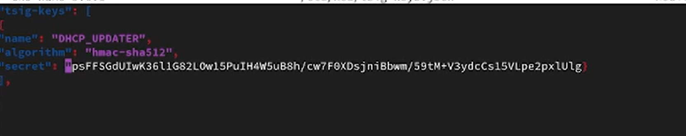{#fig-20 width=70%}


В конфигурационном файле `/etc/kea/kea-dhcp-ddns.conf` настроен сервис DHCP-DDNS: указаны адрес `127.0.0.1`, порт `53001`, подключён файл `tsig-keys.json`, определены зоны `bahis.net.` и `1.168.192.in-addr.arpa.` с ключом `DHCP_UPDATER` и DNS-сервером `192.168.1.1` ([рис. @fig-21]).

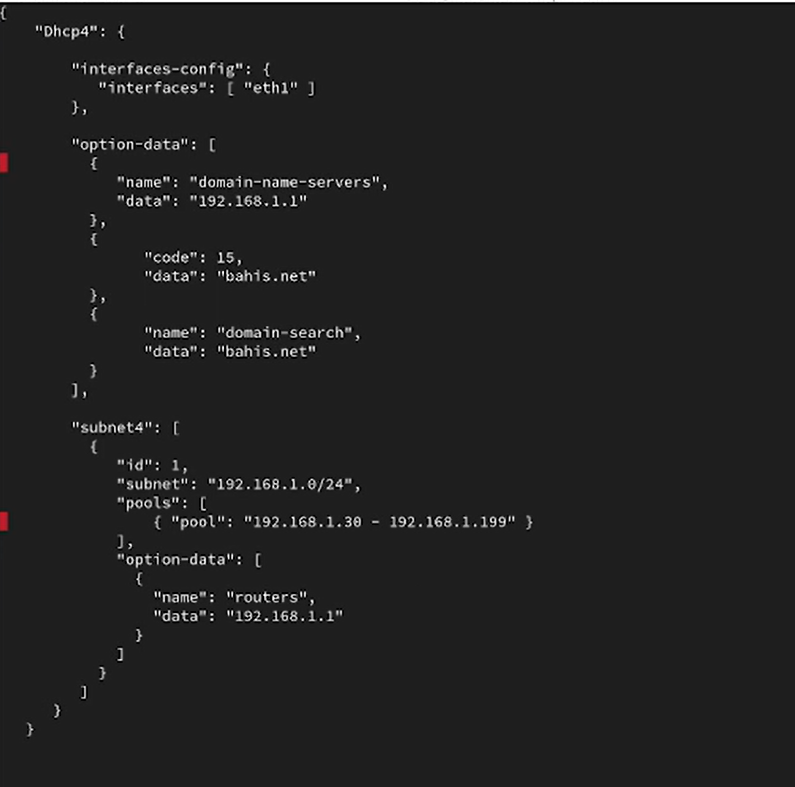{#fig-21 width=70%}


После исправления синтаксической ошибки выполнена проверка конфигурации командой `kea-dhcp-ddns -t`. Проверка завершилась успешно. Затем служба `kea-dhcp-ddns.service` включена и запущена; статус — `active (running)` ([рис. @fig-22]).

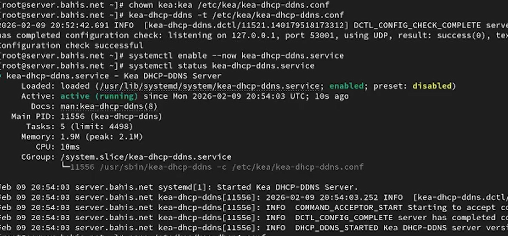{#fig-22 width=70%}


В файл `/etc/kea/kea-dhcp4.conf` добавлены параметры, разрешающие динамическое обновление DNS:
`"enable-updates": true`,
`"ddns-qualifying-suffix": "bahis.net"`,
`"ddns-override-client-update": true` ([рис. @fig-23]).

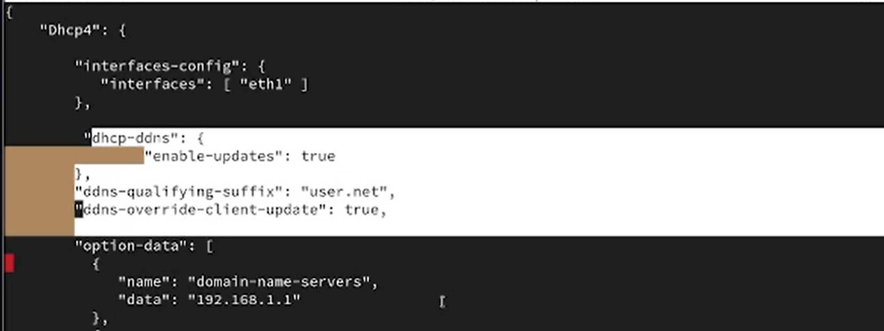{#fig-23 width=70%}


Проверка конфигурации DHCP-сервера выполнена командой `kea-dhcp4 -t`, затем служба `kea-dhcp4.service` перезапущена. Статус — `active (running)` ([рис. @fig-24]).

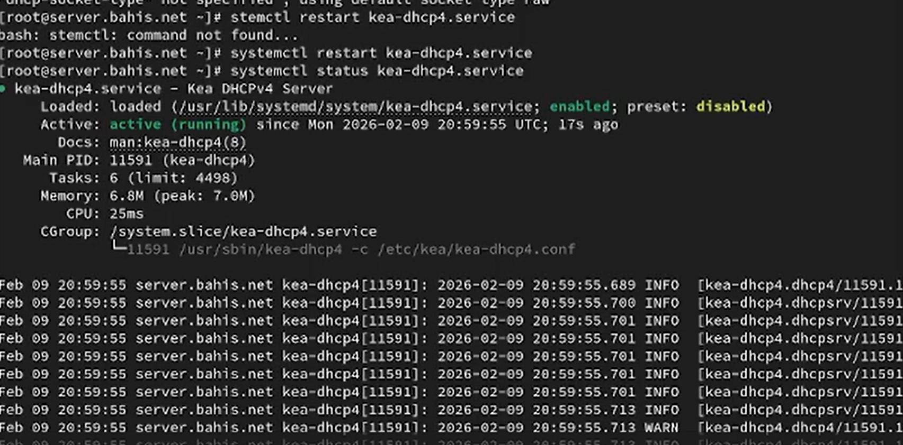{#fig-24 width=70%}


На виртуальной машине `client` выполнено повторное получение IP-адреса через интерфейс `eth1` с помощью команд `nmcli connection down eth1` и `nmcli connection up eth1`, что инициировало процесс динамического обновления DNS-зоны ([рис. @fig-25]).

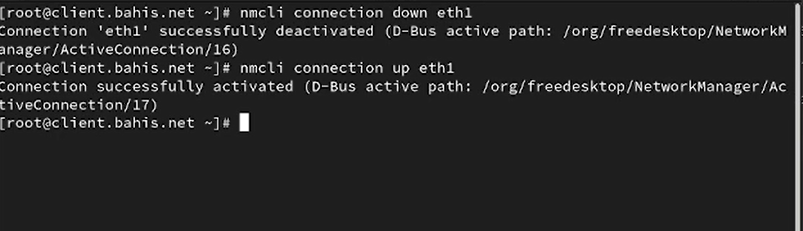{#fig-25 width=70%}


## Анализ работы DHCP-сервера после настройки обновления DNS-зоны

На виртуальной машине client выполнен запрос:

`dig @192.168.1.1 client.bahis.net`

В разделе `HEADER` указано:

- `opcode: QUERY` — стандартный DNS-запрос;
- `status: NOERROR` — ошибок разрешения нет;
- `flags: qr aa rd ra` — ответ получен (`qr`), сервер является авторитетным (`aa`), рекурсивный запрос разрешён (`rd`, `ra`);
- `ANSWER: 1` — получена одна запись.

В разделе `QUESTION SECTION` запрошена запись типа `A` для `client.bahis.net.`

В разделе `ANSWER SECTION` возвращена запись:

`client.bahis.net. 2400 IN A 192.168.1.30`

где:

- `2400` — TTL записи;
- `IN` — класс Internet;
- `A` — тип записи;
- `192.168.1.30` — IP-адрес, выданный DHCP-сервером.

Это подтверждает корректное динамическое обновление прямой DNS-зоны ([рис. @fig-27]).

X{#fig-27 width=70%}


## Внесение изменений в настройки внутреннего окружения виртуальной машины

На виртуальной машине server выполнено копирование конфигурационных файлов DHCP в каталог provisioning:

- создан каталог `/vagrant/provision/server/dhcp/etc/kea`;
- скопировано содержимое `/etc/kea/`;
- затем выполнено копирование файлов DNS из `/var/named/` в каталог provisioning ([рис. @fig-28]).

{#fig-28 width=70%}


В каталоге `/vagrant/provision/server` создан исполняемый файл `dhcp.sh`, содержащий команды установки пакета `kea`, копирования конфигураций, настройки прав доступа, восстановления SELinux-контекста, настройки firewalld и запуска служб `kea-dhcp4` и `kea-dhcp-ddns` ([рис. @fig-29]).

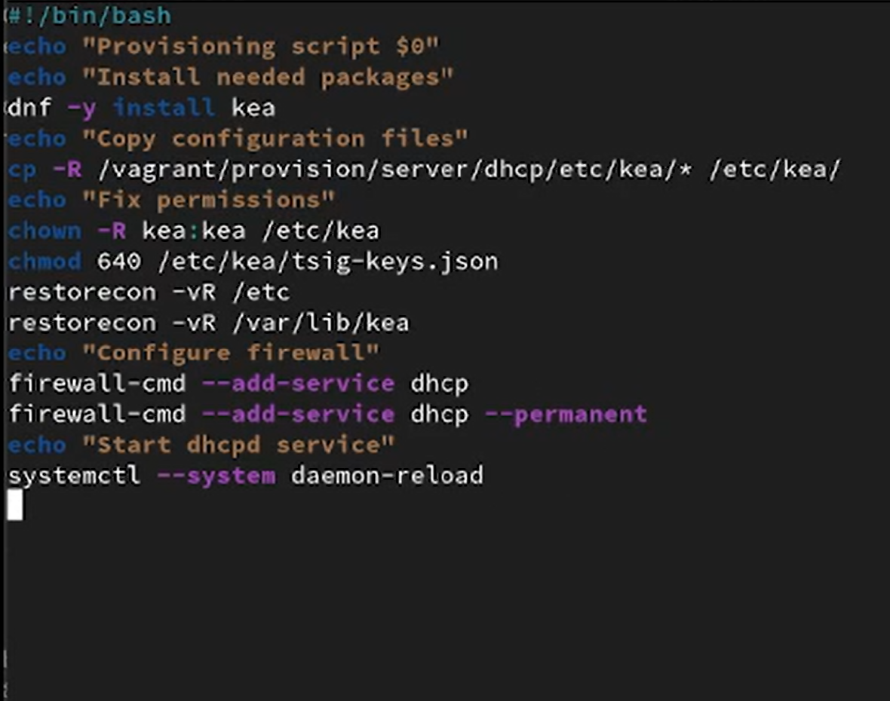{#fig-29 width=70%}


В файле `Vagrantfile` в разделе конфигурации виртуальной машины `server` добавлена директива:

```
server.vm.provision "server dhcp",
    type: "shell",
    preserve_order: true,
    path: "provision/server/dhcp.sh"
```

что обеспечивает автоматическое выполнение скрипта при загрузке виртуальной машины ([рис. @fig-30]).

{#fig-30 width=70%}

# Выводы


В ходе выполнения работы был установлен и настроен DHCP-сервер Kea на виртуальной машине server, выполнена конфигурация выдачи IP-адресов в подсети `192.168.1.0/24` и проверена корректность распределения адресов клиенту.

Настроено динамическое обновление прямой и обратной DNS-зон с использованием механизма TSIG и службы `kea-dhcp-ddns`. После переполучения адреса клиентом автоматически создана DNS-запись `client.bahis.net`, что подтверждено запросом `dig`.

Проверка журналов, статуса служб и содержимого файла аренды `/var/lib/kea/kea-leases4.csv` показала корректную работу DHCP- и DDNS-служб. В каталоге зоны появился файл журнала `.jnl`, что свидетельствует о выполнении динамических обновлений.

Дополнительно реализована автоматизация настройки через provisioning-скрипт `dhcp.sh`, подключённый в `Vagrantfile`, что обеспечивает воспроизводимость конфигурации при повторном развёртывании виртуальной машины.


# Контрольные вопросы:

1. В каких файлах хранятся настройки сетевых подключений? 

- В Linux настройки сети обычно хранятся в текстовых файлах в
директории /etc/network/ или /etc/sysconfig/network-scripts/.

2. За что отвечает протокол DHCP? 

- Протокол DHCP (Dynamic Host Configuration Protocol) отвечает за автоматическое присвоение
сетевых настроек устройствам в сети, таких как IP-адресов,
маски подсети, шлюза, DNS-серверов и других параметров.

3. Поясните принцип работы протокола DHCP. Какими сообщениями обмениваются клиент и сервер, используя протокол DHCP? 

- Принцип работы протокола DHCP:

Discover (Обнаружение): Клиент отправляет в сеть запрос на
обнаружение DHCP-сервера.

Offer (Предложение): DHCP-сервер отвечает клиенту, предлагая
ему конфигурацию сети.

Request (Запрос): Клиент принимает предложение и отправляет
запрос на использование предложенной конфигурации.

Acknowledgment (Подтверждение): DHCP-сервер подтверждает
клиенту, что предложенная конфигурация принята и может быть
использована.

4. В каких файлах обычно находятся настройки DHCP-сервера? За что
отвечает каждый из файлов? 

- Настройки DHCP-сервера обычно
хранятся в файлах конфигурации, таких как /etc/dhcp/dhcpd.conf. Они содержат информацию о диапазонах IP-адресов, параметрах сети и других опциях DHCP.


5. Что такое DDNS? Для чего применяется DDNS? 

- DDNS (Dynamic Domain Name System) - это система динамического доменного
имени. Она используется для автоматического обновления записей DNS, когда IP-адрес узла изменяется. DDNS применяется, например, в домашних сетях, где IP-адреса часто изменяются
посредством DHCP.

6. Какую информацию можно получить, используя утилиту ifconfig? Приведите примеры с использованием различных опций. 

- Утилита ifconfig используется для получения информации о сетевых
интерфейсах.

Примеры:

ifconfig: Показывает информацию обо всех активных сетевых
интерфейсах.

ifconfig eth0: Показывает информацию о конкретном интерфейсе
(в данном случае, eth0).

7. Какую информацию можно получить, используя утилиту ping? Приведите примеры с использованием различных опций. - Утилита ping используется для проверки доступности узла в сети.

Примеры:

ping google.com: Пингует домен google.com.

ping -c 4 192.168.1.1: Пингует IP-адрес 192.168.1.1 и отправляет 4
эхо-запроса.

# Список литературы

1. Barr D. **Common DNS Operational and Configuration Errors**: RFC / RFC Editor. — 02/1996. — DOI: [https://doi.org/10.17487/rfc1912](https://doi.org/10.17487/rfc1912)

2. Droms R. **Dynamic Host Configuration Protocol**: RFC / RFC Editor. — 03/1997. — P. 1–45. — DOI: [https://doi.org/10.17487/rfc2131](https://doi.org/10.17487/rfc2131)

3. Vixie P., Thomson S., Rekhter Y., Bound J. **Dynamic Updates in the Domain Name System (DNS UPDATE), RFC 2136**: RFC / RFC Editor. — 04/1997. — DOI: [https://doi.org/10.17487/RFC2136](https://doi.org/10.17487/RFC2136)
