---
## Author
author:
  name: Бахи сиди али темассини
  degrees: Student (3 курс)
  orcid: ""
  email: 1032234211@pfur.ru
  affiliation:
    - name: Российский университет дружбы народов
      country: Российская Федерация
      postal-code: 117198
      city: Москва
      address: ул. Миклухо-Маклая, д. 6

## Title
title: "Отчёт по лабораторной работе №4"
subtitle: "Дисциплина: Администрирование сетевых подсистем"
license: "CC BY"
---

# Цель работы

Приобретение практических навыков по установке и базовому конфигурированию HTTP-сервера Apache.

# Выполнение лабораторной работы

###  Установка HTTP-сервера

После запуска виртуальной машины `server` выполнен переход в режим суперпользователя и просмотр доступных групп пакетов командой `LANG=C yum grouplist`. В списке установленных сред указана `Server with GUI`, а также доступна группа `Basic Web Server` ([рис. @fig-1]).

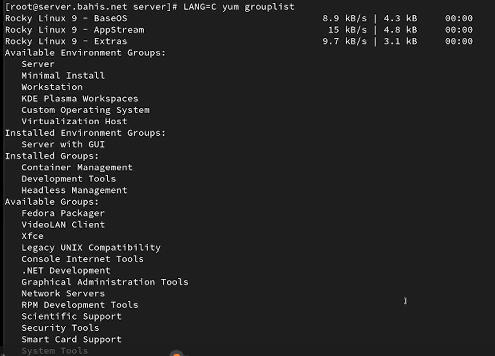{#fig-1 width=70%}

Далее выполнена установка группы пакетов `Basic Web Server` с помощью команды `dnf -y groupinstall "Basic Web Server"`. В процессе установки были загружены и установлены пакеты `httpd`, `mod_ssl`, `mod_fcgid`, а также зависимости `apr`, `apr-util` и другие компоненты веб-сервера Apache ([рис. @fig-2]).

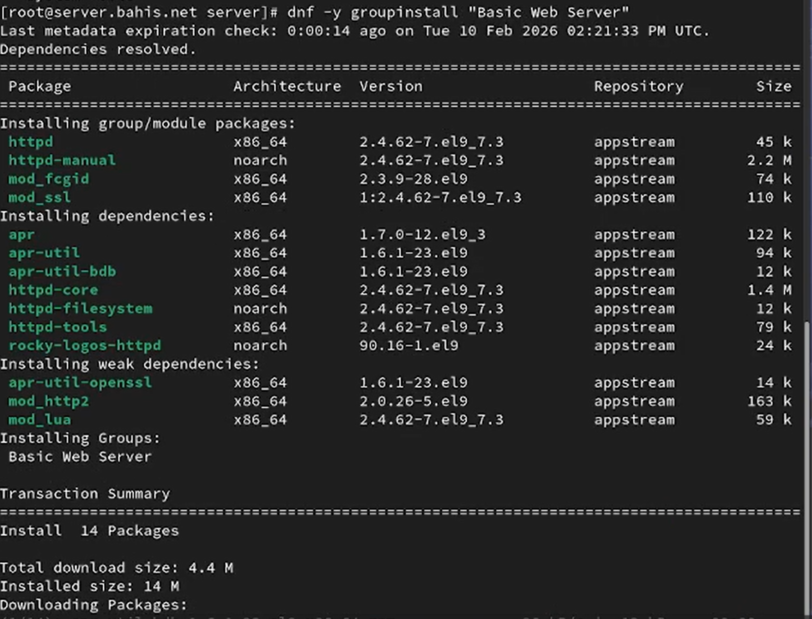{#fig-2 width=70%}

## Базовое конфигурирование HTTP-сервера

После установки просмотрено содержимое каталога `/etc/httpd/conf.d`, в котором присутствуют конфигурационные файлы `ssl.conf`, `welcome.conf`, `userdir.conf` и другие. Это подтверждает наличие стандартной конфигурации Apache HTTP Server ([рис. @fig-3]).

{#fig-3 width=70%}

Для разрешения работы HTTP через межсетевой экран выполнены команды `firewall-cmd --add-service=http` и `firewall-cmd --add-service=http --permanent`. В результате сервис `http` был успешно добавлен в список разрешённых служб ([рис. @fig-3-1]).

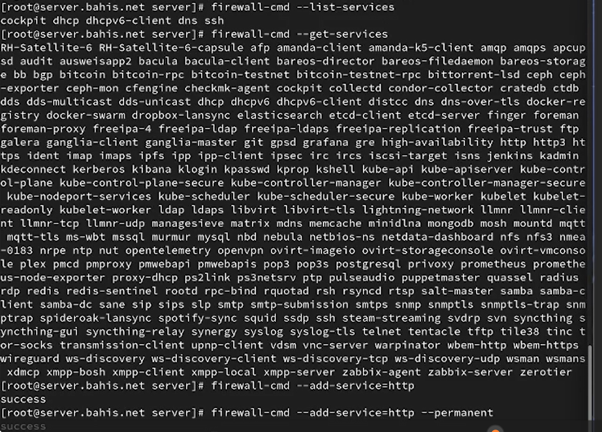{#fig-3-1 width=70%}

В дополнительном терминале запущен расширенный мониторинг системного журнала командой `journalctl -x -f` для контроля запуска службы и состояния системы в реальном времени ([рис. @fig-5]).

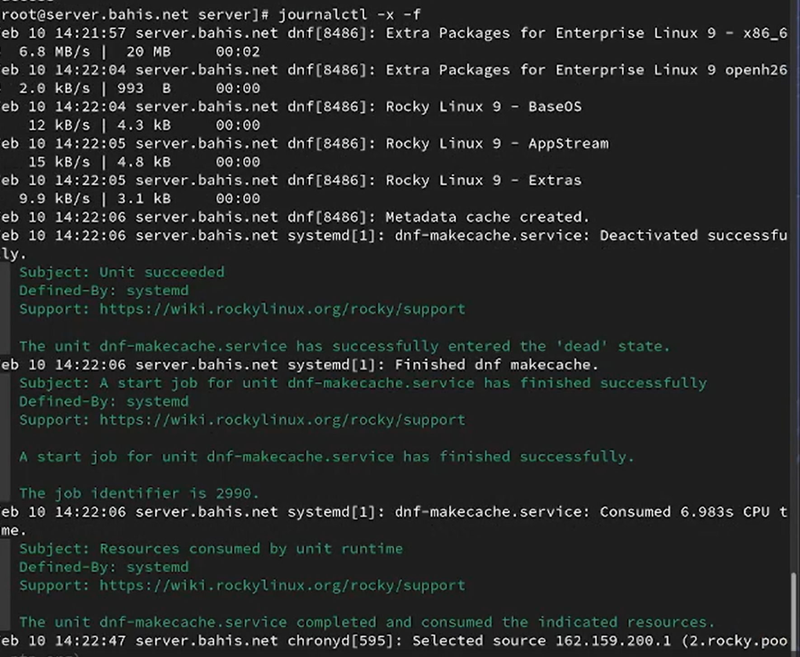{#fig-4 width=70%}

В основном терминале выполнена активация и запуск HTTP-сервера командами `systemctl enable httpd` и `systemctl start httpd`. Проверка состояния через `systemctl status httpd` показала, что служба `httpd.service` находится в состоянии `active (running)` и прослушивает порты 80 и 443, что свидетельствует об успешном запуске веб-сервера ([рис. @fig-6]).

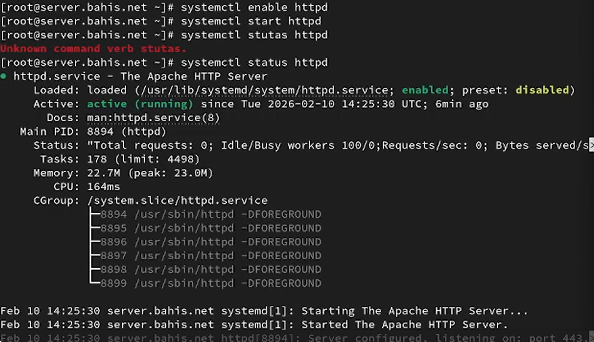{#fig-5 width=70%}

## Анализ работы HTTP-сервера

После запуска виртуальной машины `client` в браузере введён адрес `http://192.168.1.1`. Отобразилась стандартная тестовая страница `HTTP Server Test Page`, что подтверждает корректную работу веб-сервера Apache на узле `server` ([рис. @fig-7]).

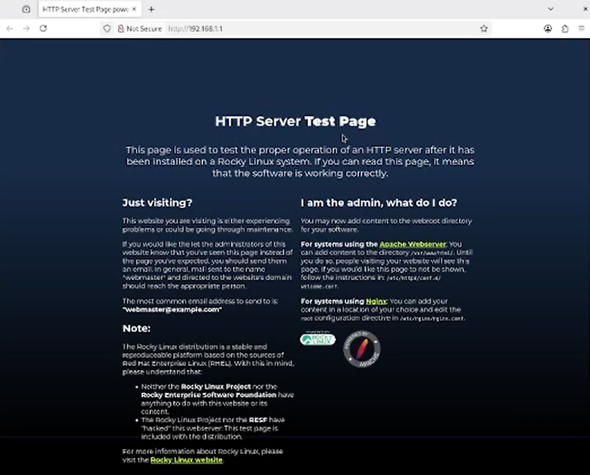{#fig-6 width=70%}

На виртуальной машине `server` выполнен мониторинг журнала доступа командой `tail -f /var/log/httpd/access_log`. В журнале зафиксированы HTTP-запросы типа `GET` от клиента с IP-адреса 192.168.1.30, включая обращения к `/`, `/poweredby.png` и `/favicon.ico`, с кодами ответа 200 и 404 ([рис. @fig-8]).

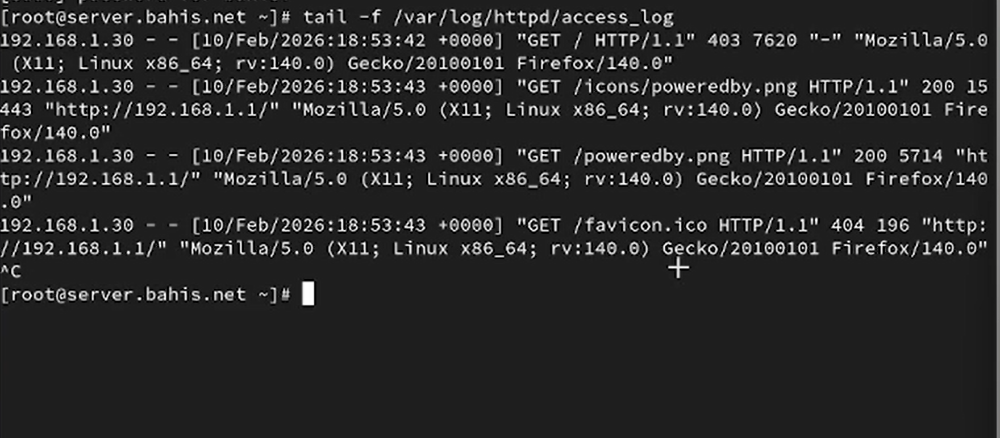{#fig-7 width=70%}

Дополнительно выполнен мониторинг журнала ошибок `/var/log/httpd/error_log`, где зафиксировано сообщение о невозможности обслуживания каталога `/var/www/html/` из-за отсутствия файла `index.html`, что соответствует коду ответа 403 и стандартной конфигурации Apache ([рис. @fig-8]).

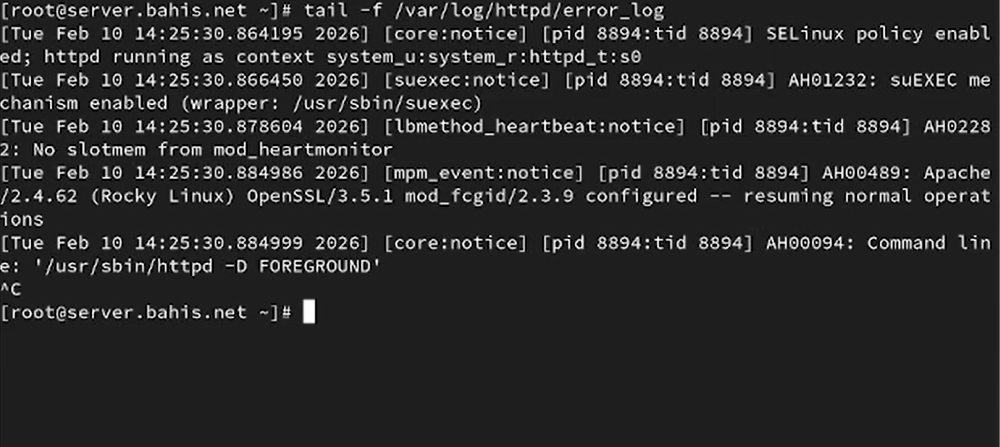{#fig-8 width=70%}

## Настройка виртуального хостинга для HTTP-сервера

Перед внесением изменений отредактирован файл прямой DNS-зоны `/var/named/master/fz/bahis.net`, в который добавлена запись `www A 192.168.1.1`, указывающая на IP-адрес HTTP-сервера. Также в зоне присутствует запись для узла `client` с соответствующим DHCID, что подтверждает корректность структуры зоны ([рис. @fig-9]).

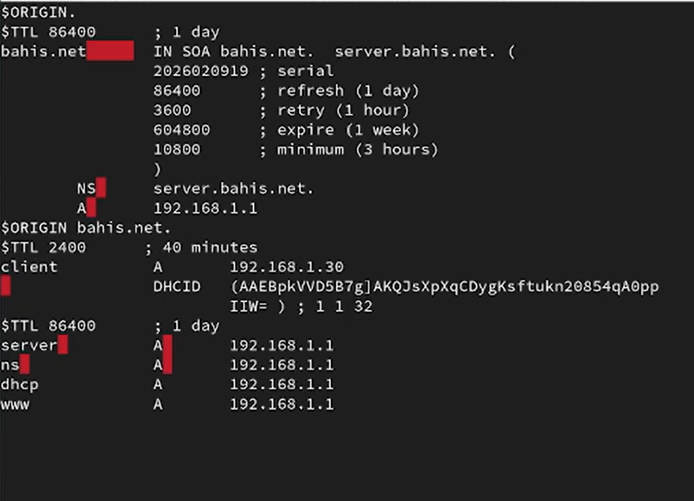{#fig-9 width=70%}

Далее внесены изменения в файл обратной зоны `/var/named/master/rz/192.168.1`, где добавлена PTR-запись `1 PTR www.bahis.net.`, обеспечивающая обратное разрешение IP-адреса 192.168.1.1 в доменное имя. Также присутствует PTR-запись для клиента с DHCID ([рис. @fig-10]).

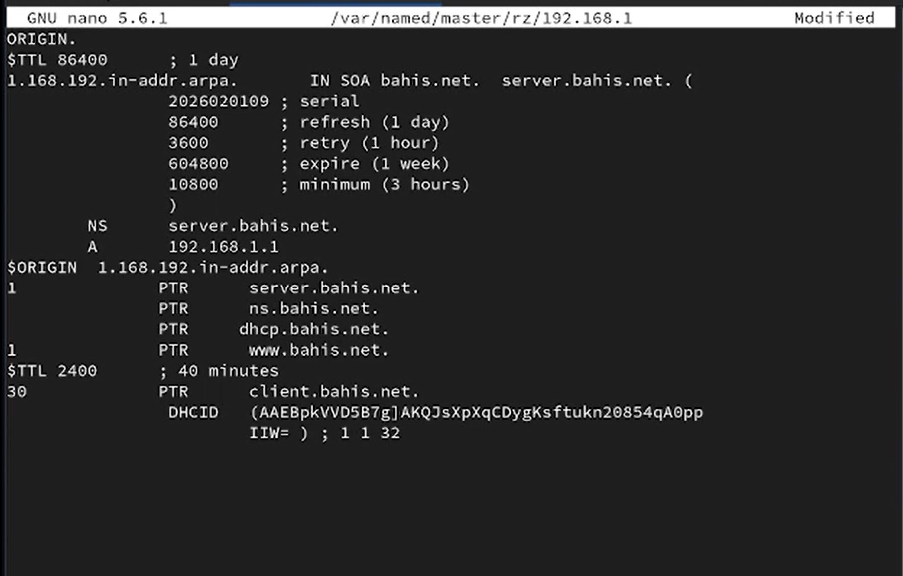{#fig-10 width=70%}

Затем выполнен запуск DNS-сервера и переход в каталог `/etc/httpd/conf.d`, где созданы конфигурационные файлы виртуальных хостов `server.bahis.net.conf` и `www.bahis.net.conf` для настройки виртуального хостинга ([рис. @fig-12]).

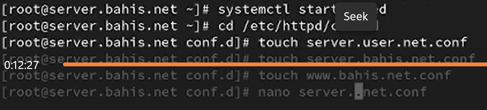{#fig-12 width=70%}

В файл `server.bahis.net.conf` добавлена конфигурация виртуального хоста `<VirtualHost *:80>`, в которой заданы параметры `ServerAdmin`, `DocumentRoot`, `ServerName`, а также отдельные файлы журналов ошибок и доступа для домена `server.bahis.net` ([рис. @fig-13]).

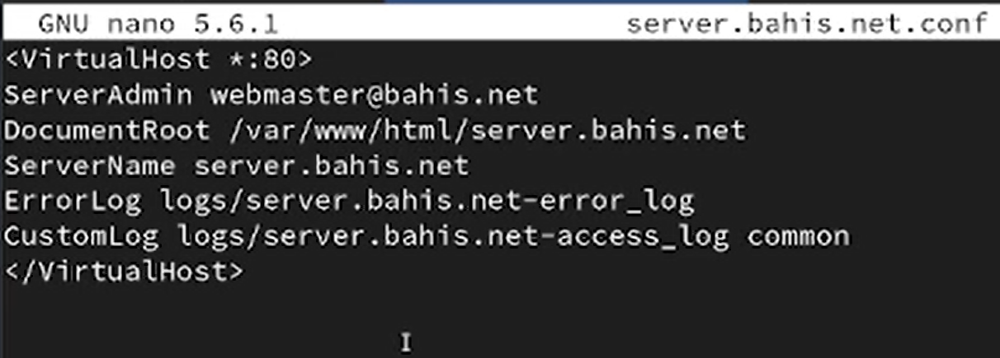{#fig-13 width=70%}

Аналогично в файл `www.bahis.net.conf` внесена конфигурация виртуального хоста для домена `www.bahis.net` с отдельным каталогом `DocumentRoot` и индивидуальными лог-файлами, что обеспечивает раздельное обслуживание двух DNS-имён одним HTTP-сервером ([рис. @fig-14]).

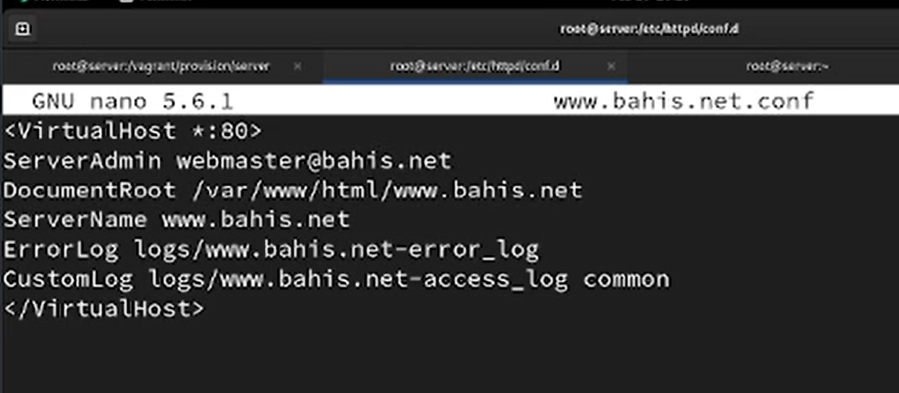{#fig-14 width=70%}

## Создание контента виртуальных хостов

В каталоге `/var/www/html` создан подкаталог `server.bahis.net`, предназначенный для размещения контента виртуального хоста. В нём создан файл `index.html` ([рис. @fig-15]).

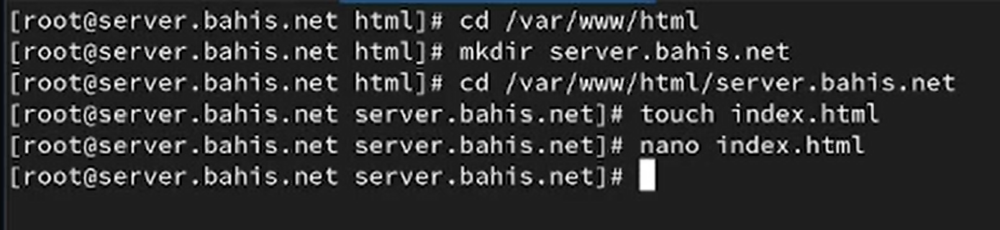{#fig-15 width=70%}

В файл `/var/www/html/server.bahis.net/index.html` внесено тестовое содержимое:
`Welcome to the server.bahis.net server.` ([рис. @fig-16]).

{#fig-16 width=70%}

Аналогично создан каталог `/var/www/html/www.bahis.net` и в нём файл `index.html` для второго виртуального хоста ([рис. @fig-17]).

{#fig-17 width=70%}

В файл `/var/www/html/www.bahis.net/index.html` внесено содержимое:
`Welcome to the www.bahis.net server.` ([рис. @fig-18]).

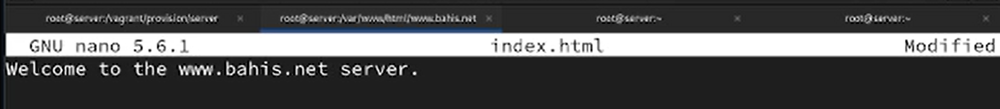{#fig-18 width=70%}

## Настройка прав доступа и SELinux

Для обеспечения корректного доступа веб-сервера к файлам выполнена смена владельца каталога `/var/www` на пользователя и группу `apache` с помощью команды `chown -R apache:apache /var/www`. Далее выполнено восстановление контекста безопасности SELinux для каталогов `/etc`, `/var/named` и `/var/www`, после чего произведён перезапуск службы `httpd` ([рис. @fig-19]).

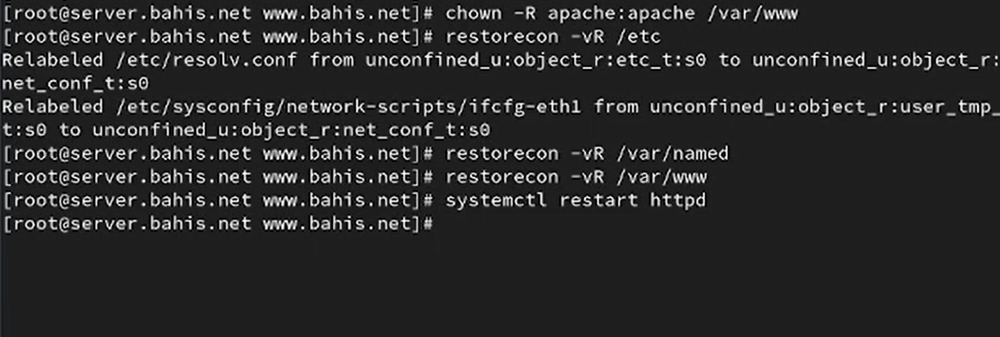{#fig-19 width=70%}

## Проверка работы виртуальных хостов

На виртуальной машине `client` в браузере открыт адрес `http://server.bahis.net`, в результате чего отобразилась созданная тестовая страница с соответствующим содержимым. Это подтверждает корректную работу виртуального хоста `server.bahis.net` ([рис. @fig-20]).

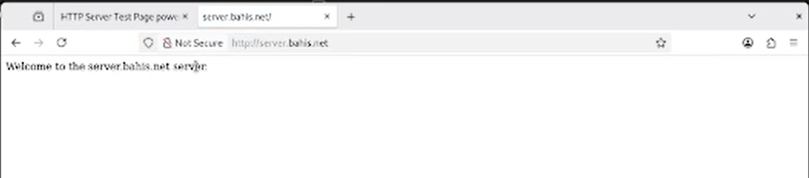{#fig-20 width=70%}

Далее выполнен доступ по адресу `http://www.bahis.net`, где отображается вторая тестовая страница. Это подтверждает успешную настройку виртуального хостинга по двум DNS-именам на одном HTTP-сервере ([рис. @fig-21]).

{#fig-21 width=70%}

## Внесение изменений в настройки внутреннего окружения виртуальной машины

На виртуальной машине `server` выполнен переход в каталог `/vagrant/provision/server`, после чего создана структура каталогов `http/etc/httpd/conf.d` и `http/var/www/html`. В данные каталоги скопированы текущие конфигурационные файлы HTTP-сервера из `/etc/httpd/conf.d` и веб-контент из `/var/www/html` ([рис. @fig-22]).

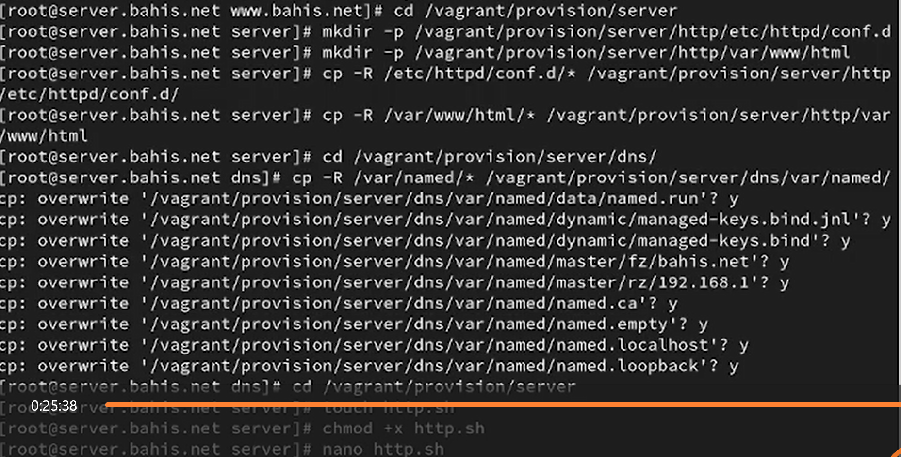{#fig-22 width=70%}

Далее произведена синхронизация конфигурации DNS-сервера: из каталога `/var/named` файлы зон и служебные данные скопированы в `/vagrant/provision/server/dns/var/named/`, что обеспечивает воспроизводимость конфигурации при автоматическом развёртывании ([рис. @fig-22]).

{#fig-22 width=70%}

В каталоге `/vagrant/provision/server` создан исполняемый файл `http.sh`, которому назначены права выполнения. Файл открыт для редактирования ([рис. @fig-22]).

{#fig-22 width=70%}

В файл `http.sh` внесён скрипт автоматизированной установки и настройки HTTP-сервера. Скрипт выполняет установку группы пакетов `Basic Web Server`, копирование конфигурационных файлов из каталога provision в системные каталоги `/etc/httpd` и `/var/www`, назначение владельца `apache`, восстановление контекста SELinux, настройку firewalld и запуск службы `httpd` ([рис. @fig-23]).

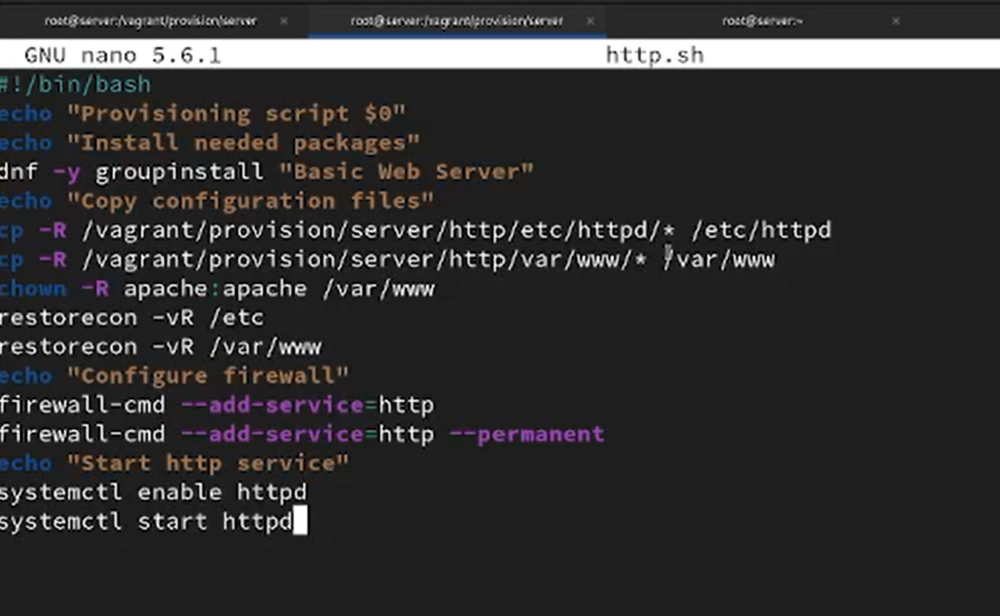{#fig-23 width=70%}

Для автоматического выполнения данного скрипта при запуске виртуальной машины в файл `Vagrantfile` добавлена секция provisioner типа `shell` с указанием пути `provision/server/http.sh` и параметра `preserve_order: true`, что обеспечивает выполнение скрипта в заданной последовательности ([рис. @fig-24]).

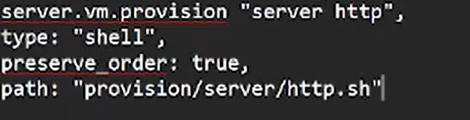{#fig-24 width=70%}
 

# Выводы

В ходе работы выполнена установка и базовая настройка HTTP-сервера Apache на виртуальной машине `server`. С использованием группы пакетов `Basic Web Server` произведена инсталляция необходимых компонентов, выполнена настройка межсетевого экрана и обеспечен корректный запуск службы `httpd`.

Настроен виртуальный хостинг по двум DNS-именам: `server.bahis.net` и `www.bahis.net`. Для каждого виртуального хоста созданы отдельные каталоги с веб-контентом, индивидуальные конфигурационные файлы в `/etc/httpd/conf.d` и собственные журналы доступа и ошибок, что подтверждает корректную реализацию механизма `<VirtualHost>`.

Обновлены прямые и обратные DNS-зоны, добавлены соответствующие A- и PTR-записи, что обеспечило корректное разрешение доменных имён в IP-адрес и обратно. Проверка с клиентской машины подтвердила доступность веб-ресурсов по обоим DNS-адресам.

Дополнительно реализована автоматизация настройки HTTP-сервера посредством provisioning-скрипта `http.sh`, интегрированного в `Vagrantfile`. Это обеспечивает воспроизводимость конфигурации и автоматическое развёртывание веб-сервера при запуске виртуальной машины.

# Ответы на контрольные вопросы

1. Через какой порт по умолчанию работает Apache? 

- По умолчанию Apache работает через порт 80 для HTTP и порт 443 для HTTPS.

2. Под каким пользователем запускается Apache и к какой группе относится этот пользователь?

- Apache обычно запускается от имени пользователя www-data (или apache, в зависимости от дистрибутива) и относится к группе с тем же именем.

3. Где располагаются лог-файлы веб-сервера? Что можно по ним
отслеживать? 

- Лог-файлы веб-сервера обычно располагаются в директории логов. Например, в Ubuntu логи Apache хранятся в /var/log/apache2/, а в CentOS - в /etc/httpd/logs/. Лог-файлы содержат информацию о запросах к серверу, ошибки, статусы запросов и другие события, что позволяет администраторам отслеживать активность и выявлять проблемы.

4. Где по умолчанию содержится контент веб-серверов? 

- Контент веб-серверов по умолчанию обычно находится в директории, называемой "DocumentRoot". Например, в Apache на Linux DocumentRoot по умолчанию установлен в /var/www/html/. В этой директории содержатся файлы, которые веб-сервер отдает при запросах.

5. Каким образом реализуется виртуальный хостинг? Что он даёт? 

- Виртуальный хостинг в Apache позволяет хостить несколько сайтов на одном сервере. Разные сайты обслуживаются на одном IP-адресе, но на разных доменных именах.
Это основывается на значении заголовка "Host" в HTTP-запросе, который используется для определения, какой виртуальный хост должен обработать запрос.
Виртуальный хостинг позволяет хозяину сервера размещать несколько сайтов на одном физическом сервере, управлять ими независимо, и предоставлять услуги хостинга для различных клиентов или проектов.

# Список литературы

1. Apache HTTP Server Version 2.4 Documentation. — URL: http://httpd.apache.org/docs/current/ (дата обр. 13.09.2021).

2. Httpd — Apache Hypertext Transfer Protocol Server. — URL: https://httpd.apache.org/docs/2.4/programs/httpd.html (дата обр. 13.09.2021).
