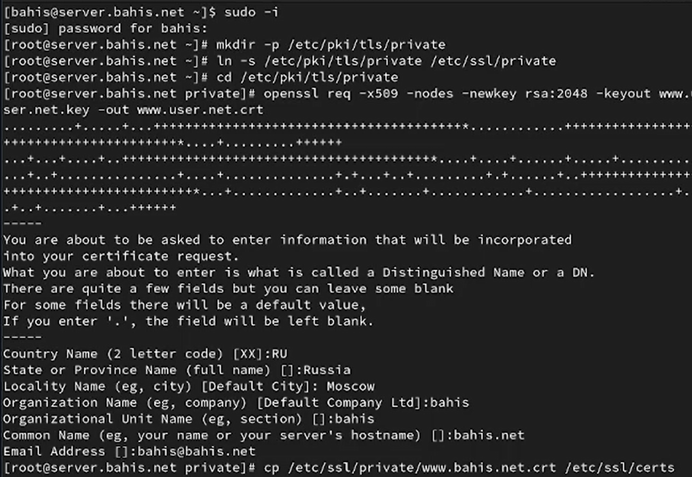
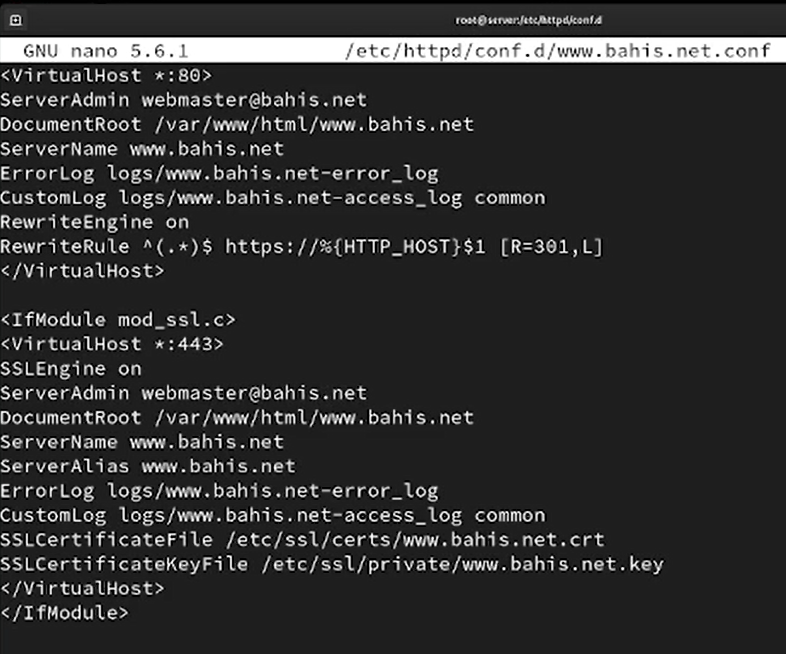
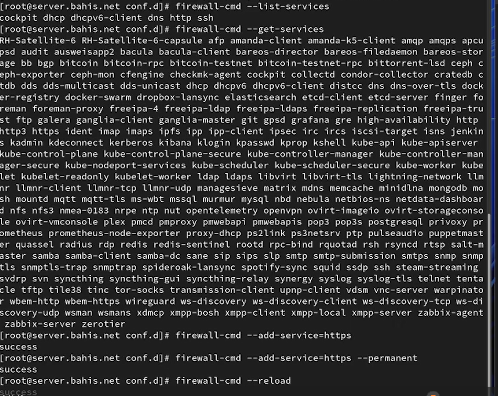
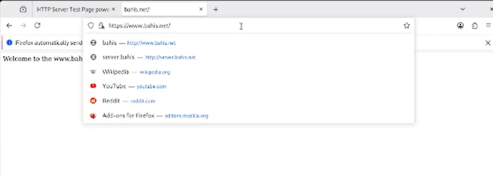
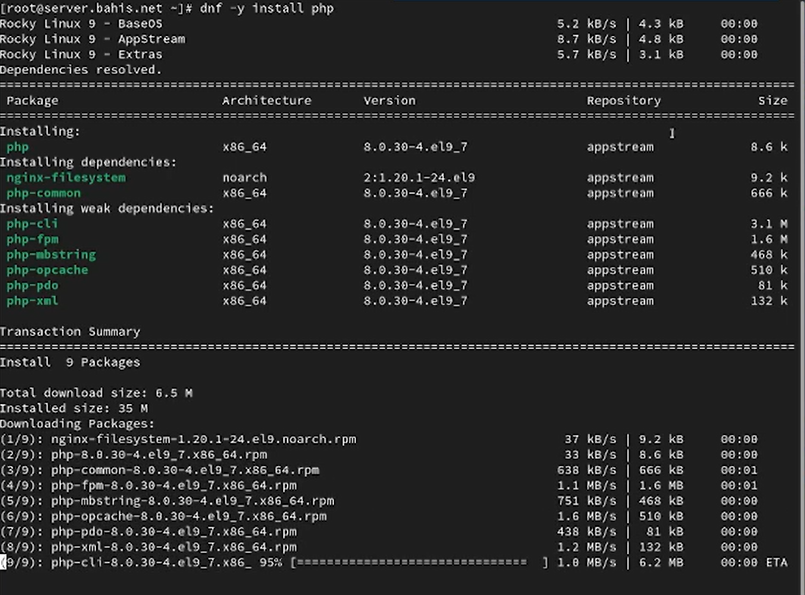
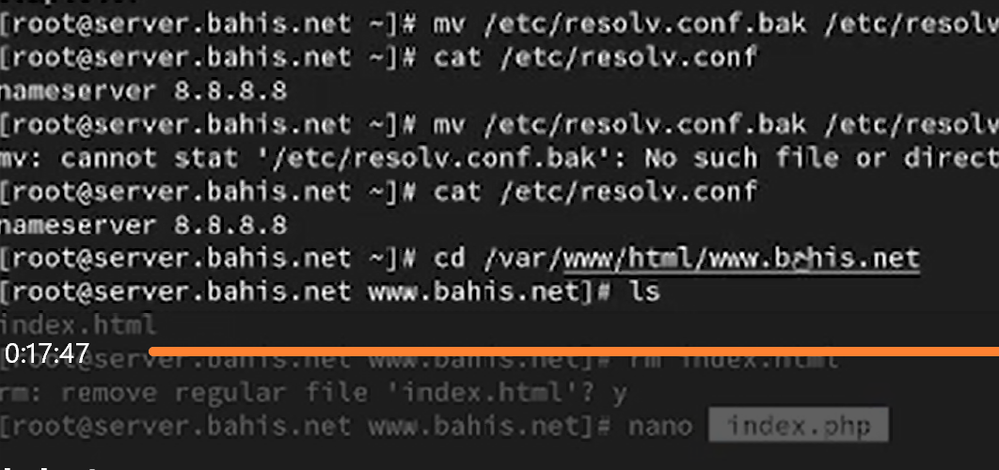
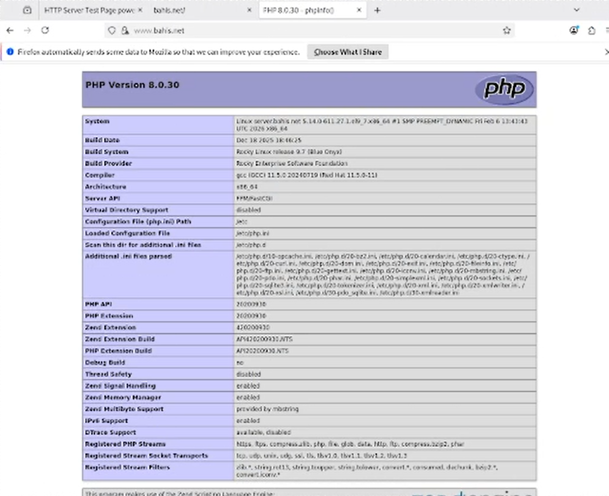
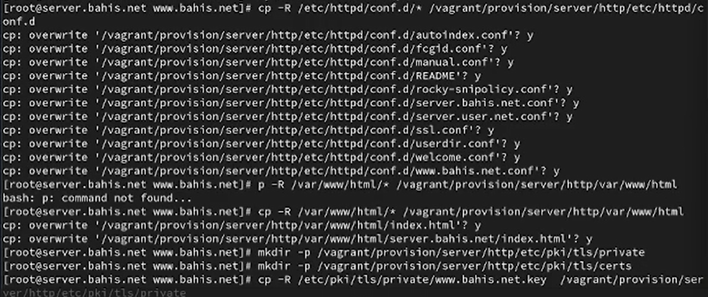
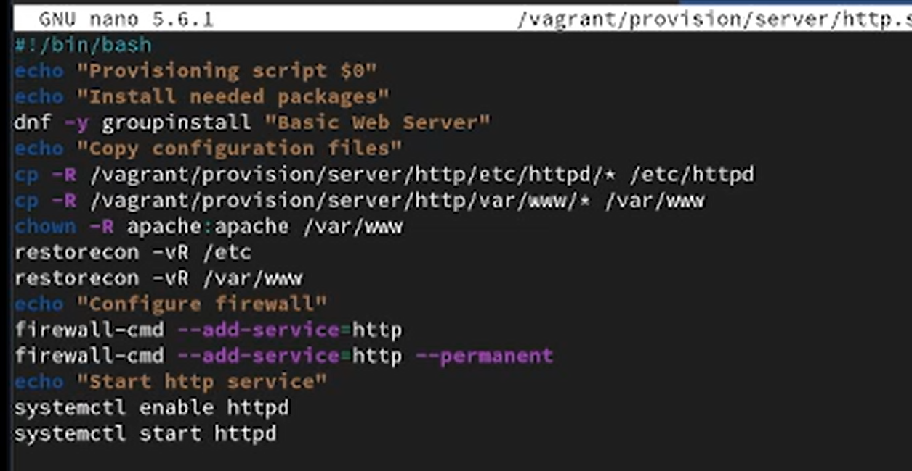

---
## Author
author:
  name: Бахи сиди али темассини
  degrees: Student (3 курс)
  orcid: ""
  email: 1032234211@pfur.ru
  affiliation:
    - name: Российский университет дружбы народов
      country: Российская Федерация
      postal-code: 117198
      city: Москва
      address: ул. Миклухо-Маклая, д. 6

## Title
title: "Отчёт по лабораторной работе №5"
subtitle: "Дисциплина: Администрирование сетевых подсистем"
license: "CC BY"
---

#  Цель работы

Приобретение практических навыков по расширенному конфигурированию HTTP-сервера Apache в части безопасности и возможности использования PHP.

# Выполнение лабораторной работы

## Конфигурирование HTTP-сервера для работы через протокол HTTPS

В каталоге `/etc/pki/tls/private` был создан закрытый ключ и самоподписанный сертификат с использованием команды `openssl req -x509 -nodes -newkey rsa:2048`. В процессе генерации были заданы параметры DN: код страны — RU, страна — Russia, город — Moscow, организация и подразделение — bahis, общее имя (CN) — bahis.net, e-mail — [bahis@bahis.net](mailto:bahis@bahis.net). После генерации сертификат был скопирован в каталог `/etc/ssl/certs` ([рис. @fig-1]).

{#fig-1 width=70%}

Далее был отредактирован конфигурационный файл виртуального хоста `/etc/httpd/conf.d/www.bahis.net.conf`. В блоке `<VirtualHost *:80>` задана переадресация HTTP-запросов на HTTPS с использованием `RewriteRule`. В блоке `<VirtualHost *:443>` включён модуль SSL (`SSLEngine on`), указаны пути к файлам сертификата (`SSLCertificateFile`) и закрытого ключа (`SSLCertificateKeyFile`), а также параметры журнала и корневой каталог сайта ([рис. @fig-2]).

{#fig-2 width=70%}

После изменения конфигурации были внесены корректировки в настройки межсетевого экрана: выполнена проверка активных и доступных сервисов, добавлен сервис `https`, изменения сохранены как постоянные и применены с помощью перезагрузки правил. Затем выполнен перезапуск службы `httpd` для применения новой конфигурации ([рис. @fig-3]).

{#fig-3 width=70%}

На виртуальной машине client в браузере выполнен переход по адресу `https://www.bahis.net`. Произошло автоматическое перенаправление с HTTP на HTTPS. После добавления исключения безопасности отображается содержимое веб-страницы сервера, что подтверждает корректную работу HTTPS-соединения ([рис. @fig-4]).

{#fig-4 width=70%}

## Конфигурирование HTTP-сервера для работы с PHP

На сервере выполнена установка пакета `php` с использованием менеджера пакетов `dnf`. В результате были установлены основной пакет PHP версии 8.0.30 и связанные зависимости, необходимые для функционирования PHP-интерпретатора в составе веб-сервера ([рис. @fig-5]).

{#fig-5 width=70%}

В каталоге `/var/www/html/www.bahis.net` файл `index.html` был удалён и создан файл `index.php` с содержимым `phpinfo();`, предназначенным для вывода конфигурационной информации PHP. После этого изменён владелец каталога `/var/www` на пользователя и группу `apache`, восстановлены контексты безопасности SELinux для каталогов `/etc` и `/var/www`, затем выполнен перезапуск службы `httpd` для применения изменений ([рис. @fig-6]).

{#fig-6 width=70%}

На виртуальной машине client в браузере открыт адрес `www.bahis.net`. Отображена страница `phpinfo()`, содержащая сведения о версии PHP (8.0.30), параметрах сборки и загруженных модулях, что подтверждает корректную интеграцию PHP с HTTP-сервером ([рис. @fig-7]).

{#fig-7 width=70%}

## Внесение изменений в настройки внутреннего окружения виртуальной машины

На виртуальной машине server выполнено копирование конфигурационных файлов веб-сервера и веб-контента в каталог внутреннего окружения `/vagrant/provision/server/http`. Скопированы файлы из `/etc/httpd/conf.d` и `/var/www/html`, созданы каталоги для хранения ключей и сертификатов `/etc/pki/tls/private` и `/etc/pki/tls/certs` внутри структуры provision, после чего в них помещены файлы `www.bahis.net.key` и `www.bahis.net.crt` ([рис. @fig-8]).

{#fig-8 width=70%}

Далее в скрипт `/vagrant/provision/server/http.sh` внесены изменения: добавлена установка пакета `php`, реализовано копирование конфигурационных файлов в системные каталоги `/etc/httpd` и `/var/www`, выполнена корректировка владельца каталога `/var/www`, восстановление контекстов SELinux и добавлены правила межсетевого экрана для сервисов `http` и `https` с постоянным сохранением. В завершение настроено включение и запуск службы `httpd` ([рис. @fig-9]).

{#fig-9 width=70%}

# Выводы

В ходе выполнения работы была реализована настройка HTTP-сервера Apache для функционирования по протоколу HTTPS с использованием самоподписанного SSL-сертификата. Выполнена генерация закрытого ключа и сертификата, их интеграция в конфигурацию виртуального хоста и настройка автоматической переадресации HTTP-запросов на HTTPS.

Дополнительно выполнена установка и интеграция интерпретатора PHP с веб-сервером. Создание файла `index.php` с вызовом `phpinfo()` подтвердило корректность обработки PHP-скриптов сервером.

Внесённые изменения были перенесены во внутреннее окружение виртуальной машины посредством копирования конфигурационных файлов и модификации provisioning-скрипта `http.sh`, включающего установку PHP, настройку SELinux и правил межсетевого экрана для сервисов `http` и `https`.

Работоспособность веб-сервера подтверждена успешным доступом к ресурсу по протоколу HTTPS и отображением страницы конфигурации PHP в браузере клиента.

# Ответы на контрольные вопросы

1. В чём отличие HTTP от HTTPS? 

- **HTTP** (HyperText Transfer Protocol) – это протокол передачи данных, который используется для передачи информации между клиентом (например, веб-браузером) и сервером. Однако он не обеспечивает шифрование данных, что делает их уязвимыми к перехвату злоумышленниками. 

- **HTTPS** (HyperText Transfer Protocol Secure) - это расширение протокола HTTP с добавлением шифрования, обеспечивающее безопасную передачу данных между клиентом и сервером. Протокол HTTPS использует SSL (Secure Sockets Layer) или более современный TLS (Transport Layer Security) для шифрования данных.

2. Каким образом обеспечивается безопасность контента веб-сервера при работе через HTTPS? 

- Шифрование данных: при использовании HTTPS данные, передаваемые между клиентом и сервером, шифруются, что делает их невозможными для прочтения злоумышленниками, перехватывающими трафик.

- Идентификация сервера: сервер предоставляет цифровой сертификат, подтверждающий его легитимность. Этот сертификат выдается сертификационным центром и содержит информацию о владельце сертификата, публичный ключ для шифрования и подпись, подтверждающую подлинность сертификата.

3. Что такое сертификационный центр? 
- Сертификационный центр (Центр сертификации) - это доверенная сторона, которая выдает цифровые сертификаты, подтверждающие подлинность владельца сертификата. Пример: Одним из известных сертификационных центров является "Let's Encrypt". Он предоставляет бесплатные SSL-сертификаты, которые используются для обеспечения безопасного соединения на множестве веб-сайтов. Владельцы веб-сайтов могут получить сертификат от Let's Encrypt, чтобы обеспечить шифрование и подтвердить свою легитимность в онлайн-среде.