---
## Author
author:
  name: Бахи сиди али темассини
  degrees: Student (3 курс)
  orcid: ""
  email: 1032234211@pfur.ru
  affiliation:
    - name: Российский университет дружбы народов
      country: Российская Федерация
      postal-code: 117198
      city: Москва
      address: ул. Миклухо-Маклая, д. 6

## Title
title: "Отчёт по лабораторной работе №6"
subtitle: "Дисциплина: Администрирование сетевых подсистем"
license: "CC BY"
---


# Цель работы

Приобретение практических навыков по установке и конфигурированию системы управления базами данных на примере программного обеспечения MariaDB.

# Выполнение лабораторной работы

## Установка MariaDB

На виртуальной машине `server` выполнен переход в режим суперпользователя и произведена установка пакетов `mariadb` и `mariadb-server` с использованием менеджера пакетов `dnf` ([рис. @fig-1]). В процессе установки были автоматически подключены зависимости и выполнена загрузка необходимых компонентов.

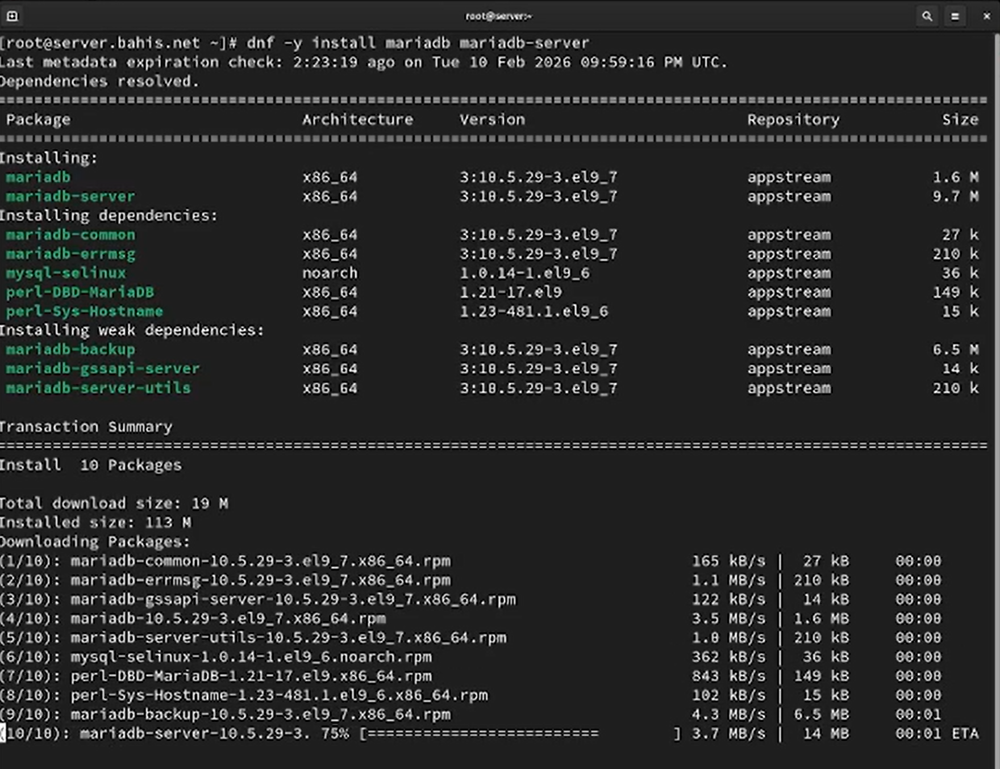{#fig-1 width=70%}

После установки выполнен запуск службы `mariadb` и добавление её в автозагрузку с помощью `systemctl start mariadb` и `systemctl enable mariadb` ([рис. @fig-2]). Созданы символические ссылки в каталогах systemd, что подтверждает успешную регистрацию службы.

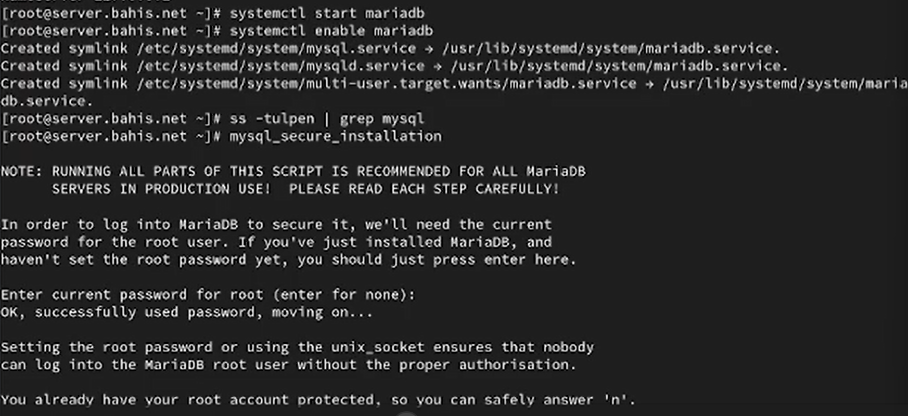{#fig-2 width=70%}

Далее проверено, что процесс `mariadb` прослушивает порт 3306, с использованием команды `ss -tulpen | grep 3306` ([рис. @fig-2]). В выводе отображён процесс `mariadb`, находящийся в состоянии LISTEN на порту 3306, что подтверждает корректный запуск сервера базы данных.

{#fig-2 width=70%}

Выполнен скрипт первичной настройки безопасности `mysql_secure_installation`. В ходе диалога включена аутентификация через `unix_socket`, установлен пароль для пользователя `root` СУБД, удалены анонимные пользователи  ([рис. @fig-3]), запрещён удалённый доступ для root и удалена тестовая база данных. После применения изменений произведена перезагрузка таблиц привилегий. ([рис. @fig-3-1])

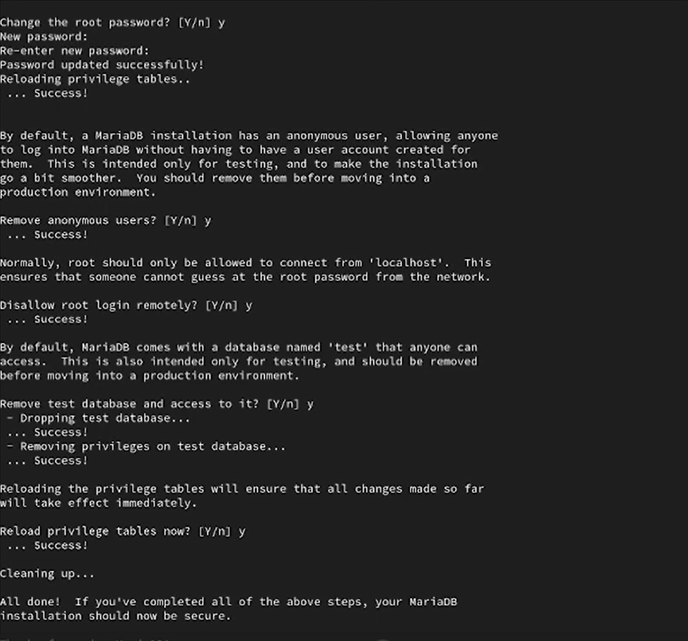{#fig-3 width=70%}

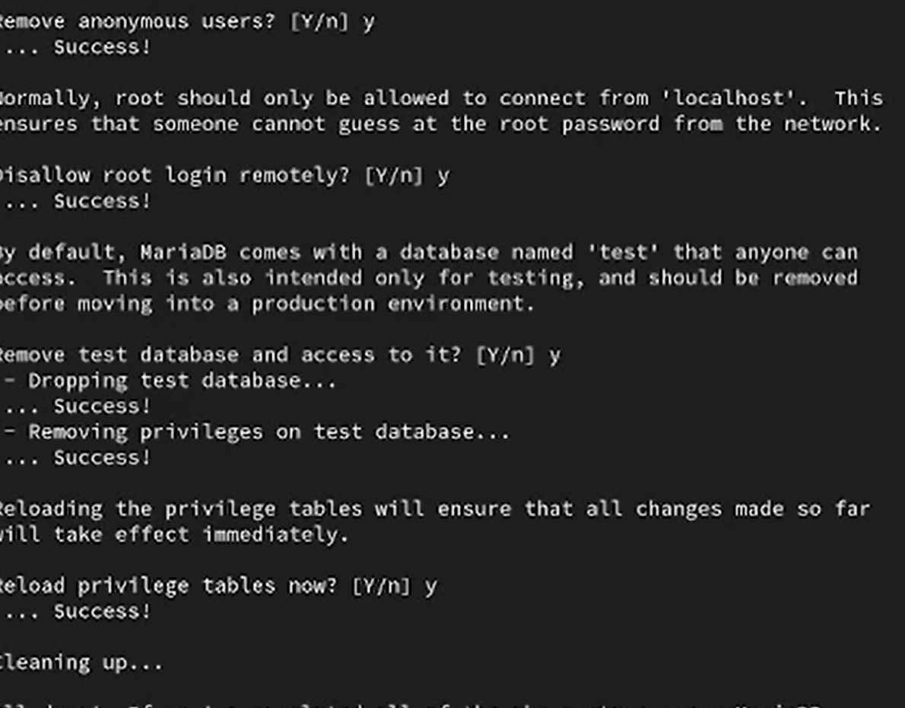{#fig-3-1 width=70%}

После завершения настройки выполнен вход в систему управления базами данных от имени администратора с помощью `mysql -u root -p` ([рис. @fig-4]). Отображена информация о версии сервера MariaDB и параметрах подключения.

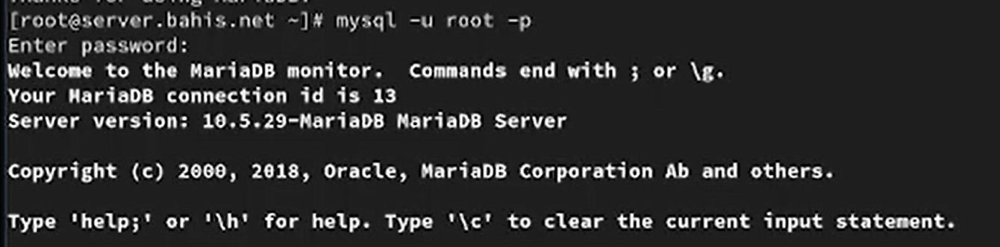{#fig-4 width=70%}

В интерактивной оболочке MariaDB выполнена команда  для просмотра списка доступных клиентских команд ([рис. @fig-5]). В выводе представлен перечень управляющих команд консольного клиента.

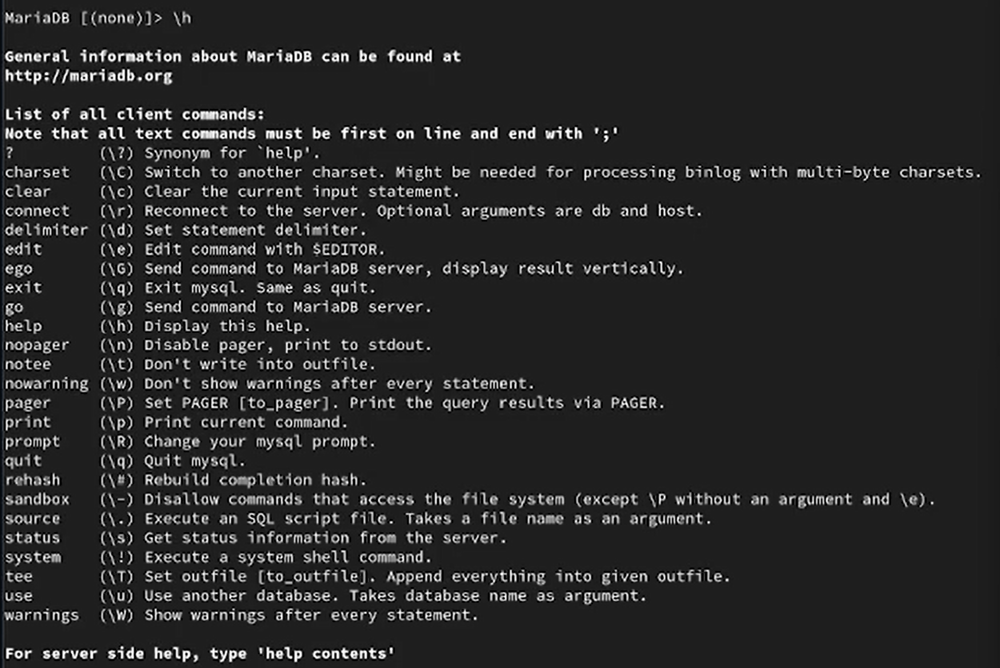{#fig-5 width=70%}

С использованием SQL-запроса `SHOW DATABASES;` получен список доступных системных баз данных ([рис. @fig-6]). В системе присутствуют базы данных: `information_schema`, `mysql`, `performance_schema`.

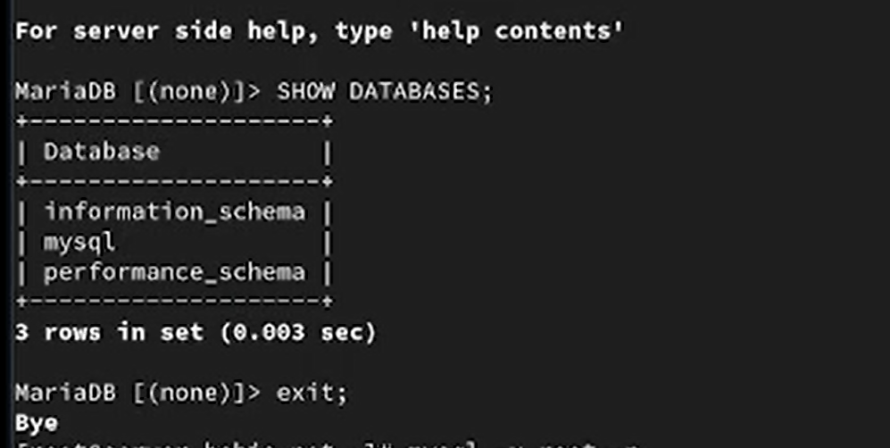{#fig-6 width=70%}

## Конфигурация кодировки символов

Выполнен вход в MariaDB от имени администратора базы данных с использованием команды `mysql -u root -p`. После аутентификации выведена информация о версии сервера и установленном соединении ([рис. @fig-7]).

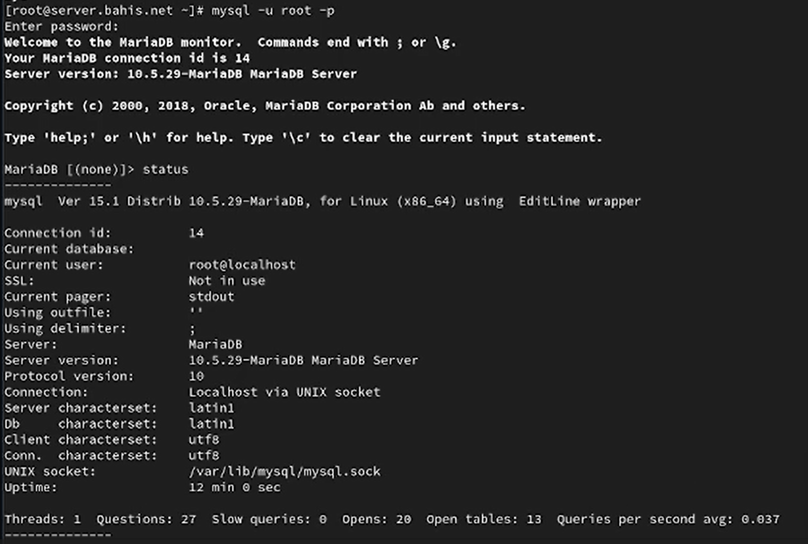{#fig-7 width=70%}

Из интерактивной оболочки выполнена команда `status`, которая отобразила текущее состояние сервера ([рис. @fig-7]). В выводе указаны: идентификатор соединения (Connection id), текущий пользователь (root@localhost), способ подключения (Localhost via UNIX socket), версия сервера (10.5.29-MariaDB), а также параметры кодировки. До изменения конфигурации значения `Server characterset` и `Db characterset` установлены в `latin1`, а `Client characterset` и `Conn. characterset` — в `utf8`.

Далее в каталоге `/etc/my.cnf.d` создан файл `utf8.cnf` и открыт для редактирования ([рис. @fig-8]).

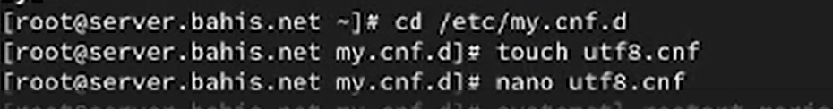{#fig-8 width=70%}

В файл добавлена конфигурация:

```
[client]
default-character-set = utf8
[mysqld]
character-set-server = utf8
```

Данные параметры задают кодировку `utf8` по умолчанию для клиентских подключений и для сервера MariaDB ([рис. @fig-9]).

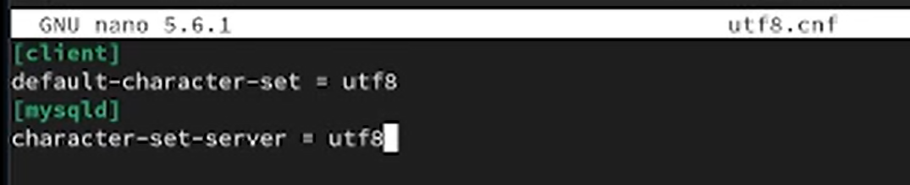{#fig-9 width=70%}

После внесения изменений выполнен перезапуск службы MariaDB командой `systemctl restart mariadb`, затем произведён повторный вход в систему и выполнена команда `status` ([рис. @fig-10]).

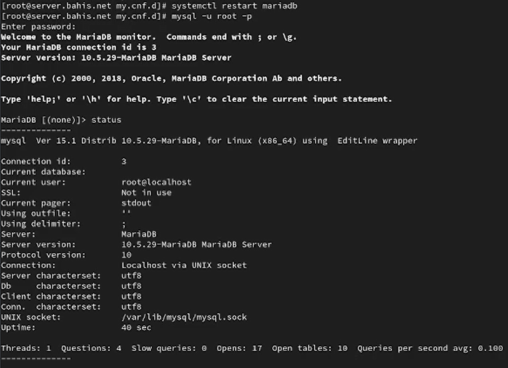{#fig-10 width=70%}

В результате изменения конфигурации параметры `Server characterset` и `Db characterset` изменились с `latin1` на `utf8`. Параметры `Client characterset` и `Conn. characterset` также установлены в `utf8`. Это подтверждает корректное применение новой конфигурации кодировки после перезапуска сервера.


## Создание базы данных

Выполнен вход в MariaDB под пользователем `root` с использованием команды `mysql -u root -p` ([рис. @fig-11]). После аутентификации отображена информация о версии сервера и установленном соединении.

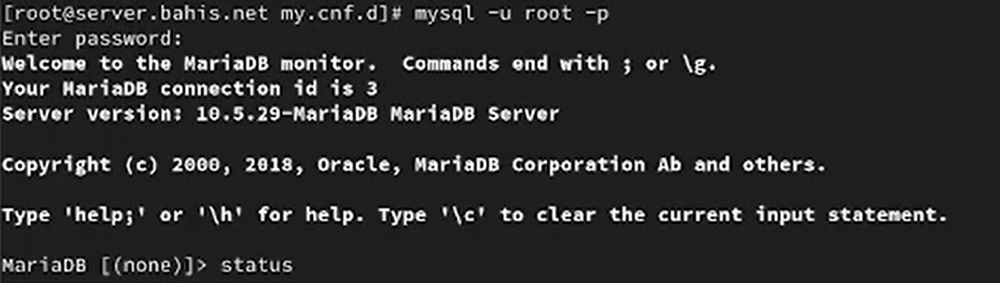{#fig-11 width=70%}

Создана база данных `addressbook` с кодировкой `utf8` и сопоставлением `utf8_general_ci`, затем выполнен переход к ней и проверено отсутствие таблиц командой `SHOW TABLES;` ([рис. @fig-12]). База данных успешно создана, на момент проверки таблицы отсутствуют.


Создана таблица `city` с полями `name` и `city` типа `VARCHAR(40)`. В таблицу добавлены записи: Иванов — Москва, Петров — Сочи, Сидоров — Дубна.

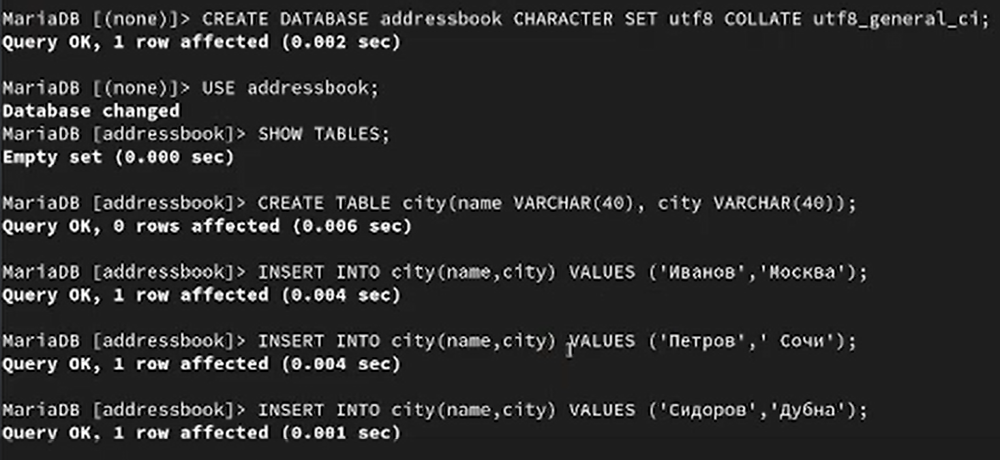{#fig-12 width=70%}

Выполнен запрос `SELECT * FROM city;` ([рис. @fig-13]). Результат запроса отображает три строки, соответствующие введённым данным, что подтверждает корректность создания таблицы и вставки записей.

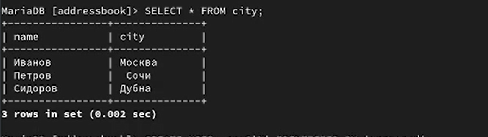{#fig-13 width=70%}

Создан пользователь `bahis@'%'` с паролем и предоставлены права `SELECT`, `INSERT`, `UPDATE`, `DELETE` на базу данных `addressbook`. После выполнения `FLUSH PRIVILEGES;` изменения прав вступили в силу. Командой `DESCRIBE city;` получена структура таблицы ([рис. @fig-14]). Таблица содержит два поля: `name` и `city`, оба типа `VARCHAR(40)`, допускающие значение `NULL`.

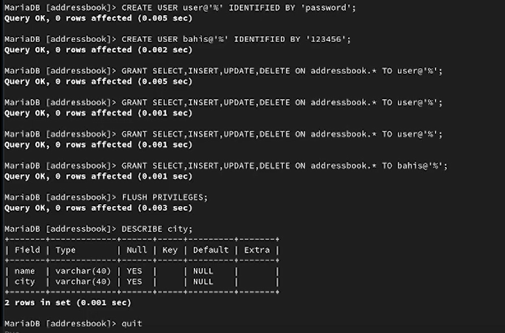{#fig-14 width=70%}

После выхода из MariaDB выполнена проверка списка баз данных с помощью `mysqlshow -u root -p`, а также просмотр таблиц базы `addressbook` под пользователями `root` и `bahis` ([рис. @fig-15]). В списке присутствует база `addressbook`, а в её составе отображается таблица `city`, что подтверждает корректность создания базы данных и настройки прав доступа.

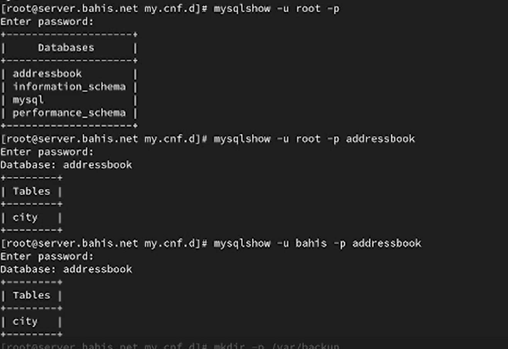{#fig-15 width=70%}

## Резервные копии

На виртуальной машине `server` создан каталог для хранения резервных копий с использованием команды `mkdir -p /var/backup` ([рис. @fig-16]). Каталог предназначен для размещения дампов базы данных.

Выполнено создание полной резервной копии базы данных `addressbook` с помощью команды
`mysqldump -u root -p addressbook > /var/backup/addressbook.sql` ([рис. @fig-16]). В результате сформирован SQL-файл, содержащий структуру таблиц и данные базы.

Создана сжатая резервная копия базы данных с использованием конвейера и утилиты `gzip`:
`mysqldump -u root -p addressbook | gzip > /var/backup/addressbook.sql.gz` ([рис. @fig-16]). В результате получен архивированный файл дампа.

Дополнительно выполнено создание сжатой резервной копии с указанием даты и времени создания файла:
`mysqldump -u root -p addressbook | gzip > $(date +/var/backup/addressbook.%Y%m%d.%H%M%S.sql.gz)` ([рис. @fig-16]). Имя файла автоматически формируется с добавлением временной метки.

Произведено восстановление базы данных из обычной резервной копии командой
`mysql -u root -p addressbook < /var/backup/addressbook.sql` ([рис. @fig-16]). Данные базы импортированы из SQL-файла.

Выполнено восстановление базы данных из сжатой резервной копии с использованием `zcat`:
`zcat /var/backup/addressbook.sql.gz | mysql -u root -p addressbook` ([рис. @fig-16]). Архив предварительно распакован в поток вывода и передан в клиент `mysql`, что подтверждает корректность процедуры восстановления.

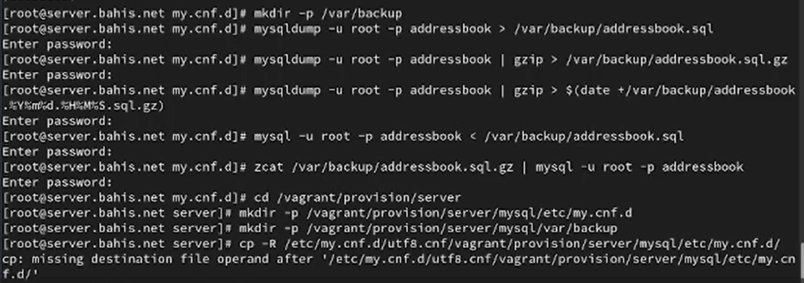{#fig-16 width=70%}

## Внесение изменений в настройки внутреннего окружения виртуальной машины

На виртуальной машине `server` выполнен переход в каталог `/vagrant/provision/server`. Создан каталог `mysql` со структурой подкаталогов `etc/my.cnf.d` и `var/backup`. В созданные каталоги скопированы файл конфигурации `utf8.cnf` и резервные копии базы данных `addressbook` ([рис. @fig-17]).

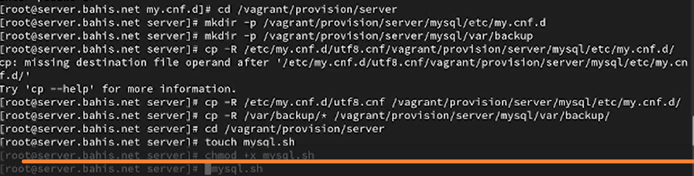{#fig-17 width=70%}

В каталоге `/vagrant/provision/server` создан исполняемый файл `mysql.sh`, которому назначены права на выполнение. В файл добавлен скрипт автоматической установки и настройки MariaDB ([рис. @fig-18]). Скрипт выполняет установку пакетов `mariadb` и `mariadb-server`, копирование конфигурационных файлов, создание каталога `/var/backup`, запуск и включение службы `mariadb`, выполнение `mysql_secure_installation` в неинтерактивном режиме, создание базы данных `addressbook` и восстановление данных из резервной копии.

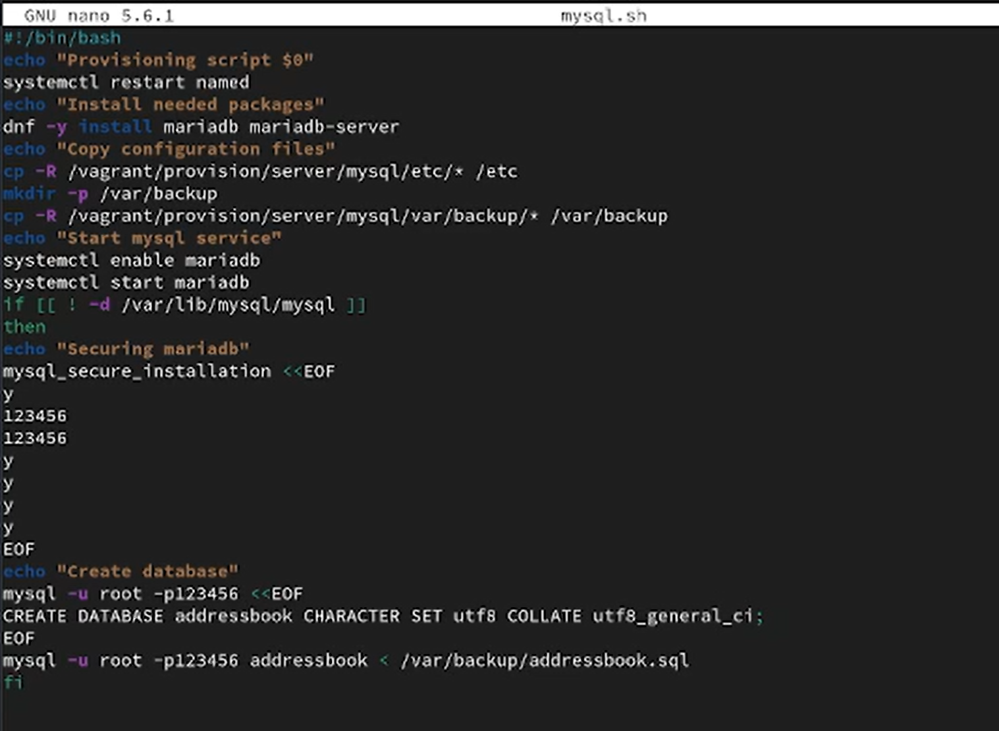{#fig-18 width=70%}

В конфигурационный файл `Vagrantfile` добавлена секция провижининга для сервера, обеспечивающая автоматическое выполнение скрипта `mysql.sh` при запуске виртуальной машины ([рис. @fig-19]). Запись использует тип `shell`, параметр `preserve_order: true` и путь к скрипту `provision/server/mysql.sh`.

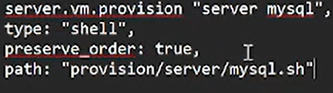{#fig-19 width=70%}


# Выводы

В ходе работы выполнена установка и базовая настройка сервера баз данных MariaDB на виртуальной машине `server`. Проверена корректность запуска службы и прослушивания стандартного порта 3306.

Произведена настройка параметров безопасности с использованием `mysql_secure_installation`: установлен пароль пользователя `root` СУБД, удалены анонимные пользователи, запрещён удалённый доступ администратора и удалена тестовая база данных.

Настроена кодировка `utf8` на уровне клиента и сервера путём изменения конфигурационных файлов и перезапуска службы. Корректность применения параметров подтверждена через команду `status`.

Создана база данных `addressbook`, таблица `city`, добавлены тестовые записи и проверена их выборка SQL-запросом. Настроен пользователь с ограниченными правами доступа к базе данных.

Освоены процедуры резервного копирования и восстановления базы данных с использованием `mysqldump`, включая создание сжатых архивов.

Автоматизирован процесс установки и настройки MariaDB посредством скрипта `mysql.sh`, подключённого к механизму provisioning в `Vagrantfile`, что обеспечивает воспроизводимость конфигурации при повторном развёртывании виртуальной машины.


# Ответы на контрольные вопросы

1. Какая команда отвечает за настройки безопасности в MariaDB? 

- Настройки безопасности в MariaDB обычно управляются с помощью команды mysql_secure_installation. Эта команда выполняет несколько шагов, включая установку пароля для пользователя root, удаление анонимных учетных записей, отключение удаленного входа для пользователя root и удаление тестовых баз данных.

2. Как настроить MariaDB для доступа через сеть? 

- Для настройки MariaDB для доступа через сеть, вы можете отредактировать файл конфигурации MariaDB (обычно называемый my.cnf) и убедиться, что параметр bind-address установлен на IP-адрес, доступный в вашей сети. Также, убедитесь, что пользователь имеет права доступа извне, например, с использованием команды GRANT.

3. Какая команда позволяет получить обзор доступных баз данных после входа в среду оболочки MariaDB? 

- SHOW DATABASES;

4. Какая команда позволяет узнать, какие таблицы доступны в базе
данных? 

- SHOW TABLES;

5. Какая команда позволяет узнать, какие поля доступны в таблице? -

- DESCRIBE table_name;

6. Какая команда позволяет узнать, какие записи доступны в таблице?

-  SELECT * FROM table_name;

7. Как удалить запись из таблицы? 

- DELETE FROM table_name WHERE condition;, где condition - условие, определяющее, какие записи следует удалить.

8. Где расположены файлы конфигурации MariaDB? Что можно настроить с их помощью? 

- Файлы конфигурации MariaDB обычно располагаются в различных местах в зависимости от системы, но основной файл - my.cnf. Он может быть в /etc/my.cnf, /etc/mysql/my.cnf или /usr/etc/my.cnf. С помощью этих файлов можно настроить различные параметры, такие как порт, пути к файлам данных, параметры безопасности и другие.

9. Где располагаются файлы с базами данных MariaDB? 

- Файлы с базами данных MariaDB располагаются в директории данных. Обычно это /var/lib/mysql/ на Linux-системах.

10. Как сделать резервную копию базы данных и затем её восстановить? 

- Для создания резервной копии базы данных используйте команду mysqldump. Например, mysqldump -u username -p dbname > backup.sql. Для восстановления базы данных из резервной копии используйте команду mysql -u username -p dbname < backup.sql.