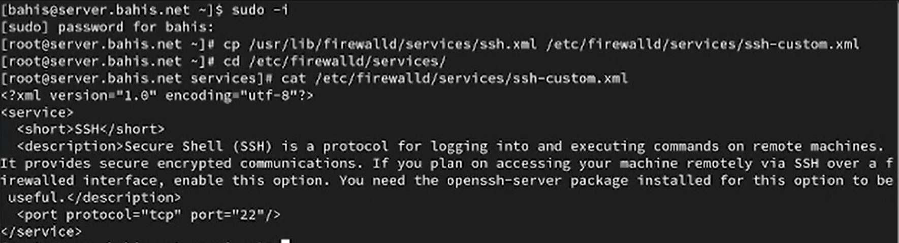
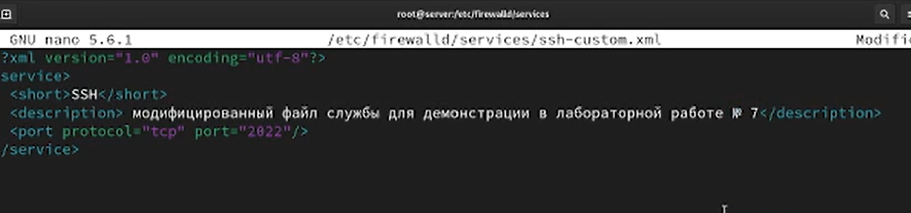
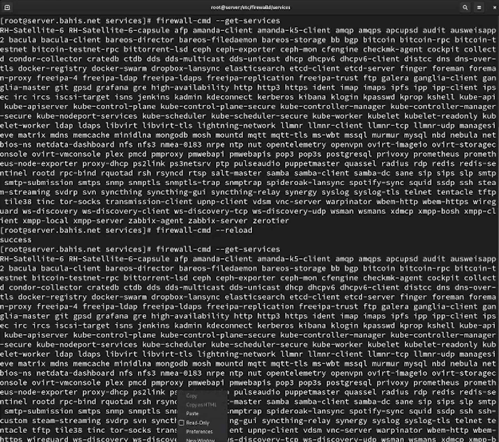
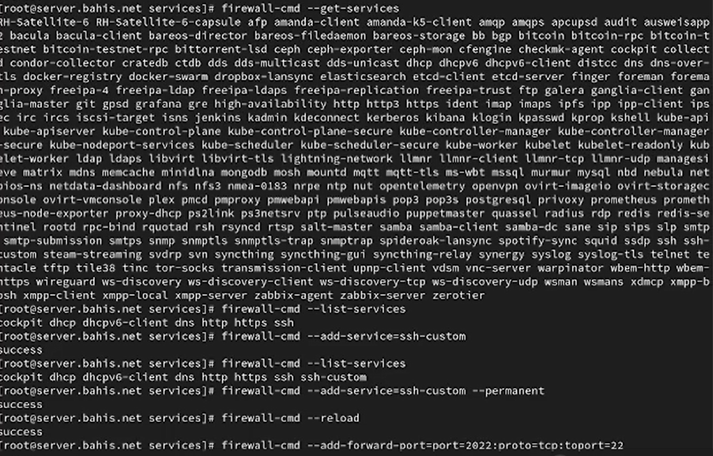
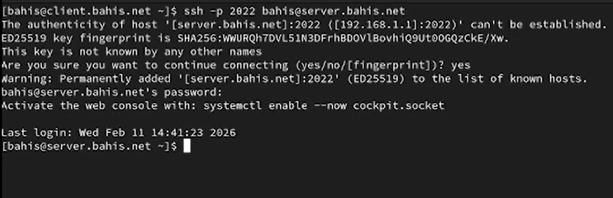
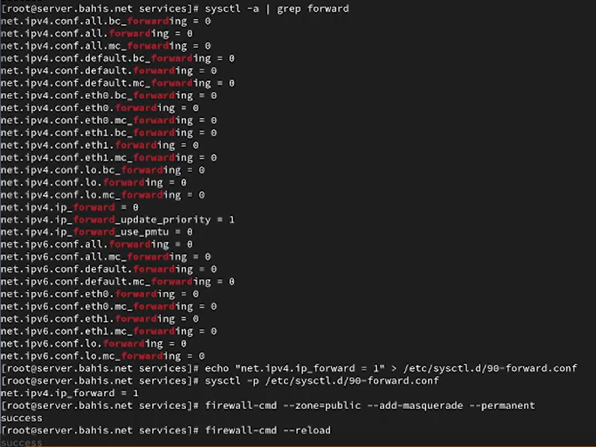
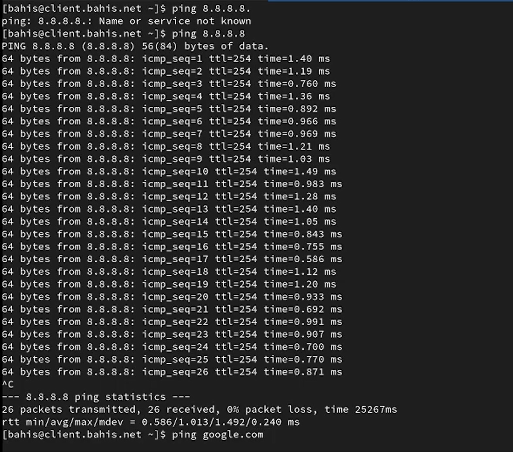
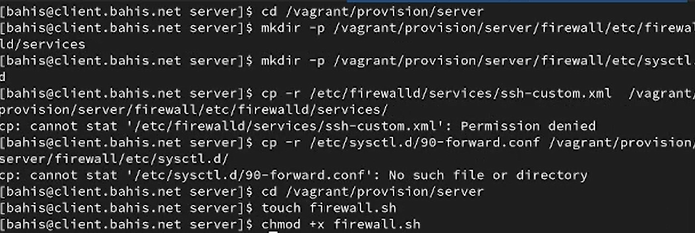
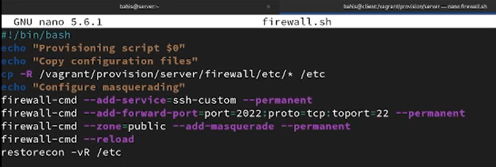
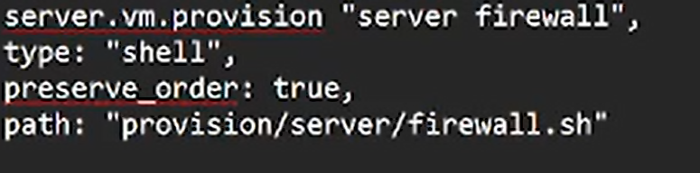

---
## Author
author:
  name: Бахи сиди али темассини
  degrees: Student (3 курс)
  orcid: ""
  email: 1032234211@pfur.ru
  affiliation:
    - name: Российский университет дружбы народов
      country: Российская Федерация
      postal-code: 117198
      city: Москва
      address: ул. Миклухо-Маклая, д. 6

## Title
title: "Отчёт по лабораторной работе №7"
subtitle: "Дисциплина: Администрирование сетевых подсистем"
license: "CC BY"
---

# Цель работы

Получить навыки настройки межсетевого экрана в Linux в части переадресации портов и настройки Masquerading.

# Выполнение лабораторной работы

## Создание пользовательской службы firewalld

В рабочем каталоге проекта выполнен переход в режим суперпользователя на виртуальной машине `server`, после чего на основе существующего файла описания службы `ssh.xml` создан пользовательский файл `ssh-custom.xml` в каталоге `/etc/firewalld/services/` с помощью команды копирования. Далее осуществлён переход в соответствующий каталог для дальнейшей работы с файлом ([рис. @fig-1]).

Содержимое файла `/etc/firewalld/services/ssh-custom.xml` выведено командой `cat`. Файл представляет собой XML-описание службы: корневой элемент `<service>`, краткое имя службы `<short>`, текстовое описание `<description>`, а также определение порта через элемент `<port>` с указанием протокола `tcp` и номера порта `22` ([рис. @fig-1]).


{#fig-1 width=70%}


Файл службы отредактирован: в элементе `<port>` изменён номер порта с `22` на `2022`, а в элементе `<description>` указано, что используется модифицированная служба SSH для доступа через TCP-порт 2022. После редактирования содержимое файла повторно выведено на экран для проверки внесённых изменений ([рис. @fig-3]).

{#fig-2 width=70%}


С помощью команды `firewall-cmd --get-services` получен список доступных служб, затем выполнена перезагрузка правил межсетевого экрана командой `firewall-cmd --reload` ([рис. @fig-4]) . После перезагрузки служба `ssh-custom` отображается в списке доступных служб, но отсутствует среди активных . Далее служба добавлена в активные с помощью `firewall-cmd --add-service=ssh-custom`, проверена командой `firewall-cmd --list-services`, затем добавлена на постоянной основе с ключом `--permanent` и выполнена повторная перезагрузка правил ([рис. @fig-4]).

{#fig-3 width=70%}

{#fig-4 width=70%}


## Перенаправление портов

На виртуальной машине `server` выполнена настройка перенаправления трафика с TCP-порта 2022 на стандартный порт SSH 22 с помощью команды `firewall-cmd --add-forward-port=port=2022:proto=tcp:toport=22`. Команда завершилась успешно, что подтверждает добавление правила переадресации в текущую конфигурацию firewalld ([рис. @fig-5]).

{#fig-5 width=70%}

На виртуальной машине `client` выполнена попытка подключения к серверу по SSH через порт 2022 командой `ssh -p 2022 bahis@server.bahis.net`. При первом подключении подтверждена подлинность хоста и его ключ добавлен в файл `known_hosts`. После ввода пароля пользователя выполнен успешный вход в систему, что подтверждает корректную работу перенаправления с порта 2022 на порт 22 ([рис. @fig-6]).

{#fig-6 width=70%}

На виртуальной машине `server` выполнена проверка состояния параметров пересылки пакетов в ядре с помощью команды `sysctl -a | grep forward`. В выводе параметр `net.ipv4.ip_forward` имел значение `0`, что означает отключённую маршрутизацию IPv4-пакетов ([рис. @fig-7]).


Для включения пересылки IPv4-пакетов создан файл `/etc/sysctl.d/90-forward.conf` с параметром `net.ipv4.ip_forward = 1`, после чего конфигурация применена командой `sysctl -p /etc/sysctl.d/90-forward.conf`, что подтвердило установку значения `1`. Далее в зоне `public` активирован маскарадинг с помощью `firewall-cmd --zone=public --add-masquerade --permanent` и выполнена перезагрузка правил `firewall-cmd --reload` ([рис. @fig-7]).

{#fig-7 width=70%}

 На виртуальной машине `client` проверена доступность сети Интернет командами `ping 8.8.8.8` и `ping google.com`; получены ответы без потерь пакетов, что подтверждает корректную работу перенаправления и маскарадинга ([рис. @fig-8]).

{#fig-8 width=70%}

## Внесение изменений в настройки внутреннего 

На виртуальной машине `server` выполнен переход в каталог `/vagrant/provision/server`, после чего создана структура каталогов `firewall/etc/firewalld/services` и `firewall/etc/sysctl.d`. В данные каталоги скопированы файл пользовательской службы `ssh-custom.xml` и файл конфигурации `90-forward.conf`, что обеспечивает сохранение настроек firewalld и параметра `ip_forward` во внутреннем окружении виртуальной машины ([рис. @fig-9]).

{#fig-9 width=70%}

В каталоге `/vagrant/provision/server` создан исполняемый файл `firewall.sh`, которому назначены права на выполнение. В скрипте реализовано копирование подготовленных конфигурационных файлов в каталог `/etc`, добавление службы `ssh-custom`, настройка перенаправления порта 2022 на 22, включение маскарадинга в зоне `public`, перезагрузка правил firewalld и восстановление контекстов SELinux командой `restorecon -vR /etc` ([рис. @fig-10]).

{#fig-10 width=70%}

В конфигурационный файл `Vagrantfile` в разделе настройки виртуальной машины `server` добавлен блок `provision` с типом `shell`, параметром `preserve_order: true` и указанием пути `provision/server/firewall.sh`. Это обеспечивает автоматическое выполнение созданного скрипта при запуске или пересоздании виртуальной машины ([рис. @fig-11]).

{#fig-11 width=70%}


# Выводы

В ходе работы была создана пользовательская служба `ssh-custom` в системе firewalld с изменённым портом TCP 2022, что позволило организовать доступ к SSH через нестандартный порт. Реализовано перенаправление трафика с порта 2022 на порт 22, подтверждённое успешным подключением по SSH.

В ядре системы включена пересылка IPv4-пакетов (`net.ipv4.ip_forward = 1`), а также настроен маскарадинг в зоне `public`, что обеспечило корректную маршрутизацию и выход клиента в Интернет через сервер.

Конфигурационные файлы и параметры были вынесены во внутреннее окружение виртуальной машины и автоматизированы с помощью provisioning-скрипта `firewall.sh`, подключённого в `Vagrantfile`. Это обеспечивает воспроизводимость настроек при повторном развёртывании виртуальной машины.


# Ответы на контрольные вопросы

1. Где хранятся пользовательские файлы firewalld? 

- В firewalld пользовательские файлы хранятся в директории /etc/firewalld/.

2. Какую строку надо включить в пользовательский файл службы, чтобы указать порт TCP 2022? 

- Для указания порта TCP 2022 в пользовательском файле службы, вы можете добавить строку в секцию port следующим образом:

<port protocol="tcp" port="2022"/>

3. Какая команда позволяет вам перечислить все службы, доступные в настоящее время на вашем сервере? 

- firewall-cmd --get-services

4. В чем разница между трансляцией сетевых адресов (NAT) и маскарадингом (masquerading)? 

- Разница между трансляцией сетевых адресов (NAT) и маскарадингом (masquerading) заключается в том, что в случае NAT исходный IP-адрес пакета заменяется на IP-адрес маршрутизатора, а в случае маскарадинга используется маршрутизатора.

5. Какая команда разрешает входящий трафик на порт 4404 и перенаправляет его в службу ssh по IP-адресу 10.0.0.10? 

```
firewall-cmd --zone=public --add-port=4404/tcp --permanent
firewall-cmd --zone=public --add-forward-port=port=4404
            :proto=tcp:toport=22:toaddr=10.0.0.10 --permanent
firewall-cmd --reload
```

6. Какая команда используется для включения маcкарадинга IP- пакетов для всех пакетов, выходящих в зону public? 

- firewall-cmd --zone=public --add-masquerade --permanent
- firewall-cmd --reload