---
## Author
author:
  name: Бахи сиди али темассини
  degrees: Student (3 курс)
  orcid: ""
  email: 1032234211@pfur.ru
  affiliation:
    - name: Российский университет дружбы народов
      country: Российская Федерация
      postal-code: 117198
      city: Москва
      address: ул. Миклухо-Маклая, д. 6

## Title
title: "Отчёт по лабораторной работе №8"
subtitle: "Дисциплина: Администрирование сетевых подсистем"
license: "CC BY"
---

# Цель работы

Приобретение практических навыков по установке и конфигурированию SMTP-сервера.


# Выполнение лабораторной работы

## Переход в режим суперпользователя

На виртуальной машине `server` выполнен вход в терминал и переход в режим суперпользователя с использованием команды `sudo -i`, что подтверждается приглашением командной строки `root@server.bahis.net` ([рис. @fig-1]).

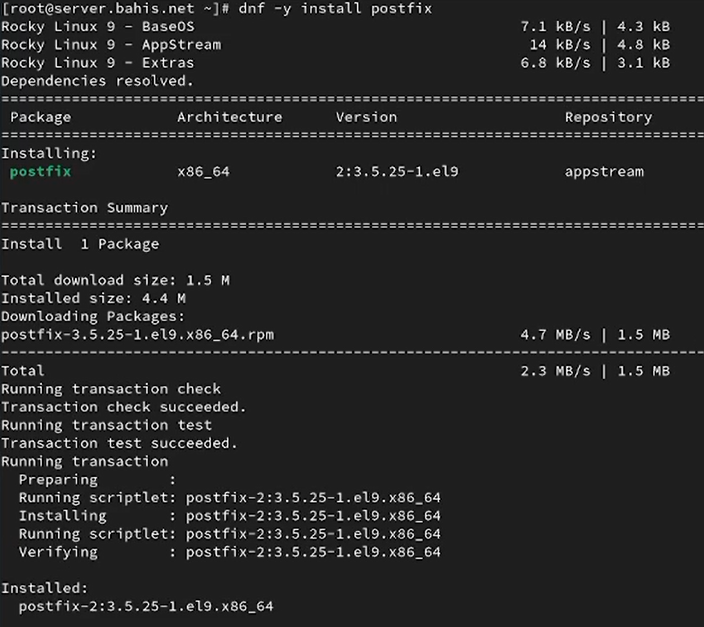{#fig-1 width=70%}

## Установка пакетов Postfix и s-nail

С использованием менеджера пакетов `dnf` установлены необходимые для работы почтовой подсистемы пакеты `postfix` и `s-nail`. В выводе отображается успешное разрешение зависимостей, загрузка и установка пакетов без ошибок ([рис. @fig-2]).

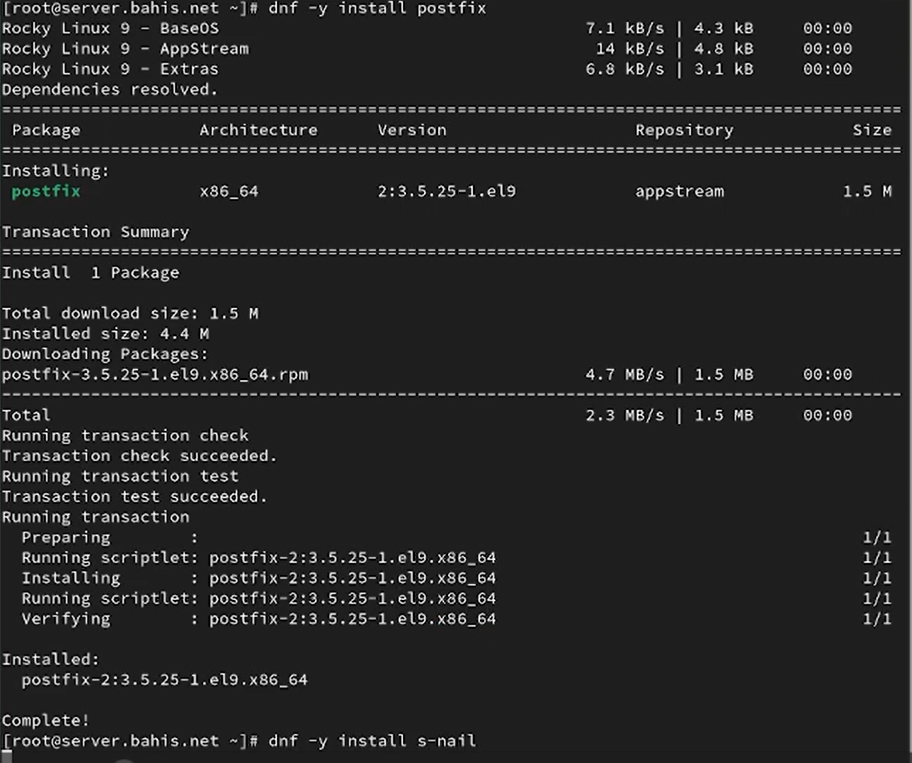{#fig-2 width=70%}


## Настройка межсетевого экрана для службы SMTP

С помощью утилиты `firewall-cmd` разрешена работа службы `smtp` в текущей и постоянной конфигурации межсетевого экрана. Команда `--list-services` подтверждает наличие службы `smtp` в списке разрешённых сервисов ([рис. @fig-3]).

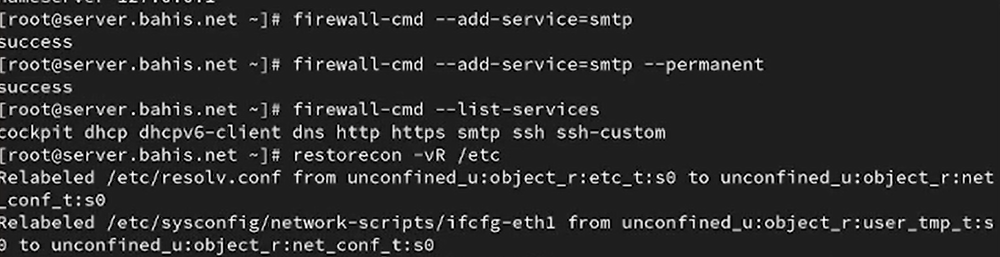{#fig-3 width=70%}

## Восстановление контекста безопасности SELinux

Выполнена команда `restorecon -vR /etc` для восстановления корректных контекстов безопасности SELinux в каталоге `/etc`. В выводе отображается изменение контекста для сетевого конфигурационного файла ([рис. @fig-3]).

{#fig-3 width=70%}

## Запуск и активация службы Postfix

Служба `postfix` добавлена в автозагрузку с помощью `systemctl enable postfix` и запущена командой `systemctl start postfix`. Проверка состояния через `systemctl status postfix` показывает, что служба активна и находится в состоянии `active (running)` ([рис. @fig-4]).

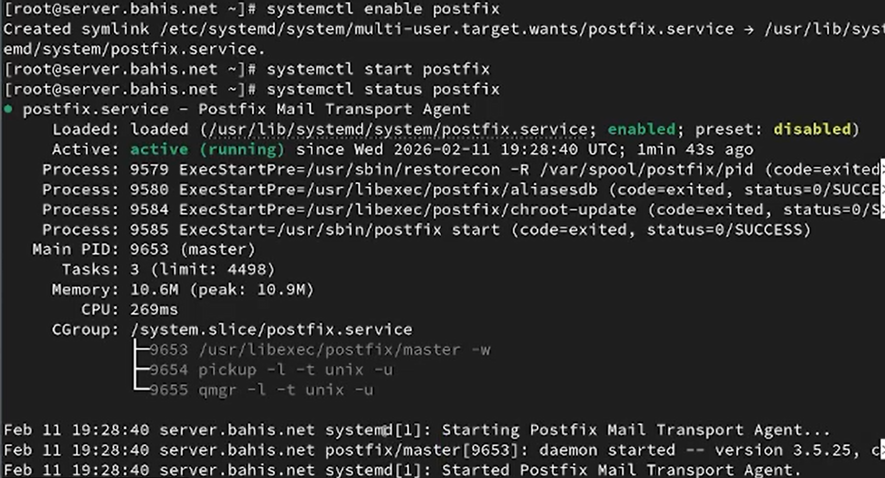{#fig-4 width=70%}

## Просмотр текущих параметров Postfix

С помощью команды `postconf` выведен полный список текущих параметров конфигурации Postfix. В выводе отображаются активные значения переменных, включая параметры проверки адресов и транспортов ([рис. @fig-5]).

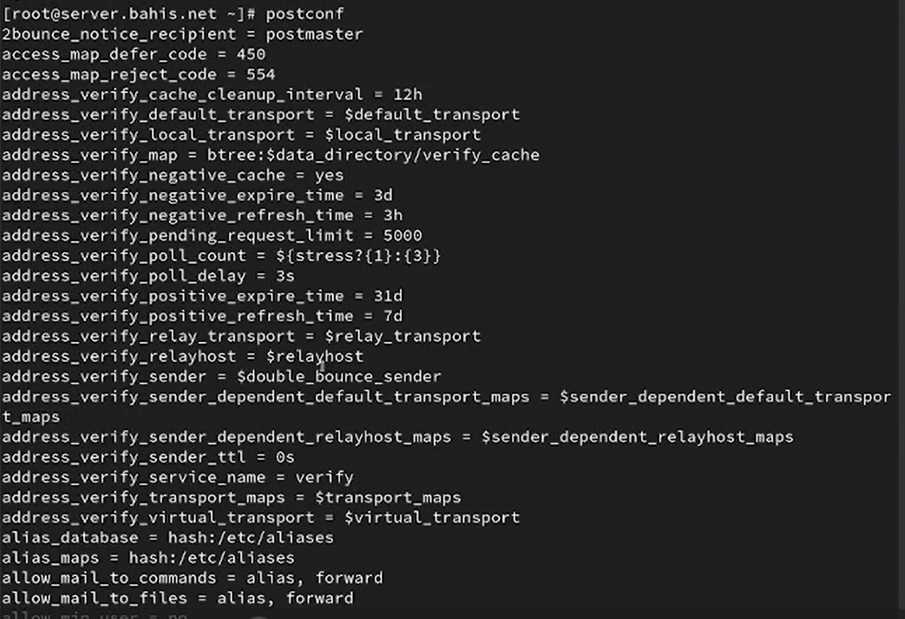{#fig-5 width=70%}

## Проверка параметров myorigin и mydomain

Команда `postconf myorigin` показала, что параметр `myorigin` имеет значение `$myhostname`.
Команда `postconf mydomain` подтвердила, что домен установлен как `bahis.net`.
Далее выполнена команда `postconf -e 'myorigin = $mydomain'`, после чего повторная проверка `postconf myorigin` показала новое значение `$mydomain`.
Корректность конфигурации проверена командой `postfix check`, затем выполнена перезагрузка конфигурации `systemctl reload postfix`.
Команда `postconf -n` отобразила параметры, отличающиеся от значений по умолчанию, включая `myorigin = $mydomain` ([рис. @fig-6]).

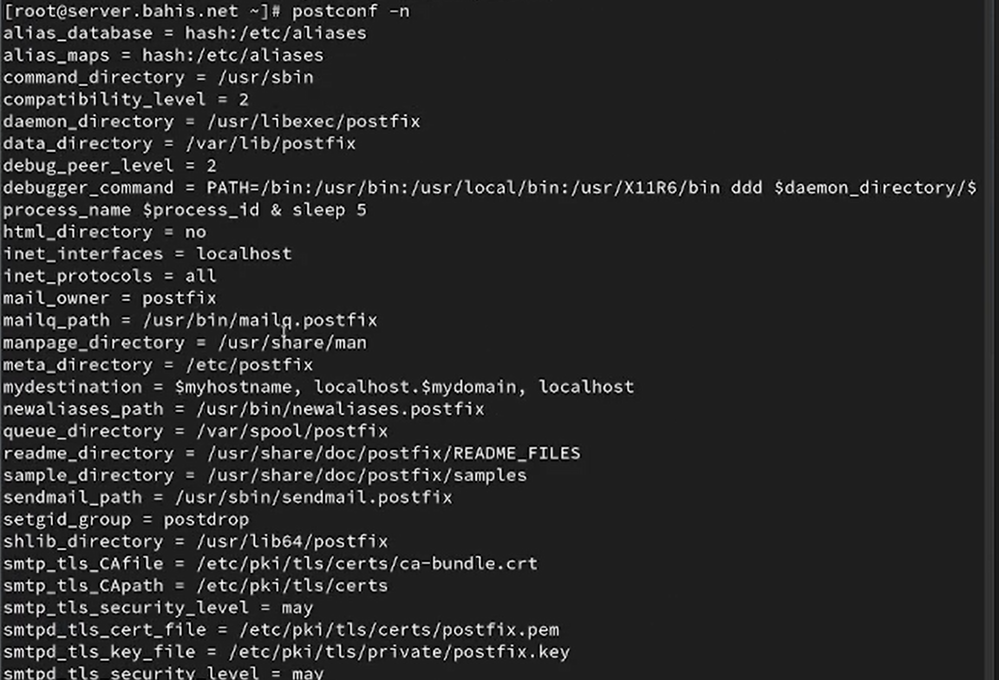{#fig-6 width=70%}

## Жёсткая установка домена и отключение IPv6

Параметр домена принудительно установлен командой
`postconf -e 'mydomain = bahis.net'`.

Проверка `postconf inet_protocols` показала, что разрешены все протоколы (`all`).
Затем выполнена команда `postconf -e 'inet_protocols = ipv4'`, в результате чего IPv6 отключён и оставлен только IPv4.

После внесения изменений выполнены команды `postfix check` и `systemctl reload postfix` для проверки и применения новой конфигурации ([рис. @fig-7]).

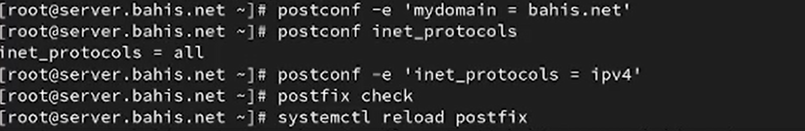{#fig-7 width=70%}


### 1. Отправка тестового сообщения с сервера

---

### Анализ журналов и локальной доставки на сервере

Выполнен мониторинг журнала `/var/log/maillog` командой `tail -f`.
В логе присутствуют строки:

* `status=sent (delivered to mailbox)`
* `removed`

Это подтверждает успешную локальную доставку сообщения в почтовый ящик пользователя ([рис. @fig-9]).

Дополнительно проверено содержимое каталога `/var/spool/mail`, где обнаружен файл пользователя `bahis` с полученным письмом ([рис. @fig-10]).

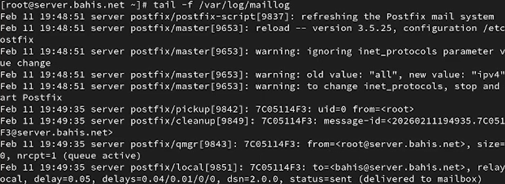{#fig-9 width=70%}


## Установка Postfix и s-nail на клиенте

На виртуальной машине `client` выполнена установка пакетов `postfix` и `s-nail` с использованием `dnf`. Установка завершена успешно ([рис. @fig-11], [рис. @fig-12]).

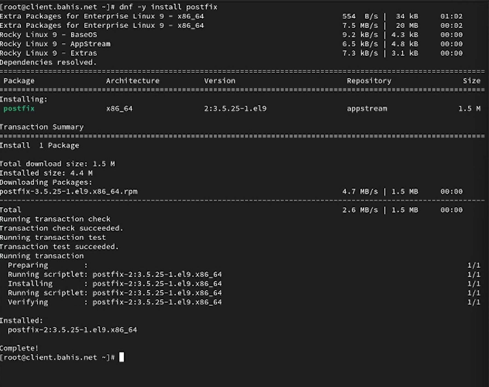{#fig-11 width=70%}

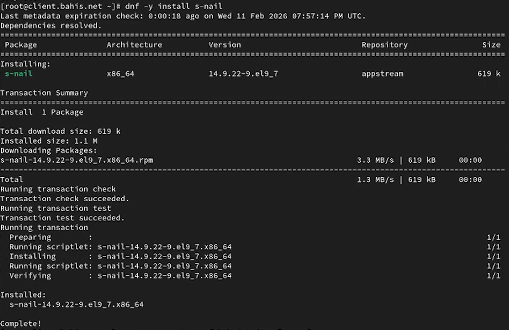{#fig-12 width=70%}

## Настройка протоколов и запуск Postfix на клиенте

На клиенте проверено значение параметра `inet_protocols`, затем выполнено изменение на `ipv4`.
Служба Postfix добавлена в автозагрузку и запущена ([рис. @fig-13]).

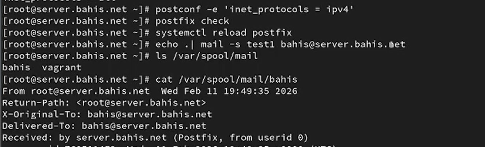{#fig-13 width=70%}

## Повторная отправка письма с клиента

С клиента отправлено второе письмо командой
`echo . | mail -s test2 bahis@server.bahis.net` ([рис. @fig-14]).

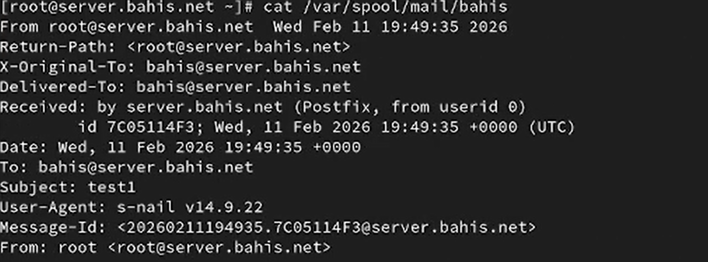{#fig-14 width=70%}


## Проверка сетевых параметров на сервере

На сервере просмотрены параметры:

* `inet_interfaces = localhost`
* `mynetworks = 127.0.0.1/32`

Это означает, что сервер принимал соединения только с локального интерфейса ([рис. @fig-15]).

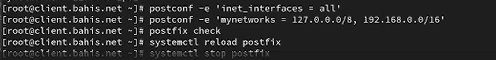{#fig-15 width=70%}


## Разрешение сетевых соединений

В конфигурацию внесены изменения:

* `inet_interfaces = all`
* `mynetworks = 127.0.0.0/8, 192.168.0.0/16`

После этого выполнены `postfix check`, `systemctl reload postfix`, `systemctl stop postfix`, `systemctl start postfix` для применения изменений ([рис. @fig-15]).

{#fig-15 width=70%}


## Повторная отправка письма после изменения конфигурации

После внесения изменений письмо с клиента успешно доставлено.

В заголовках письма отображается строка:

* `Received: from client.bahis.net (192.168.1.30)`
* `status=sent (delivered to mailbox)`


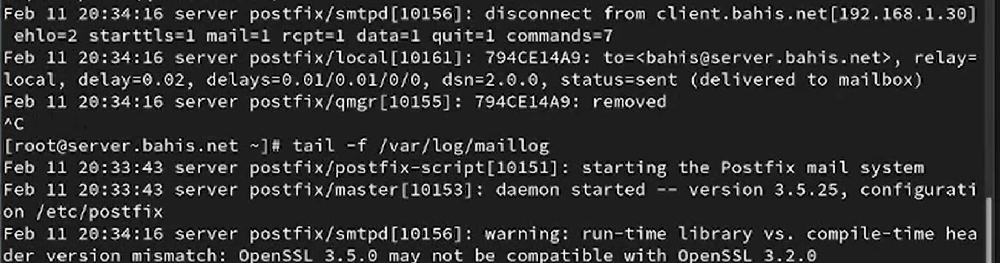{#fig-18 width=70%}

## Настройка прямой DNS-зоны с MX-записью

В файле прямой зоны `/var/named/master/fz/bahis.net` добавлена MX-запись:

`MX 10 mail.bahis.net.`

Также задана A-запись для узла `mail` с адресом `192.168.1.1`. Это обеспечивает маршрутизацию почты для домена `bahis.net` через почтовый сервер `mail.bahis.net` ([рис. @fig-19]).

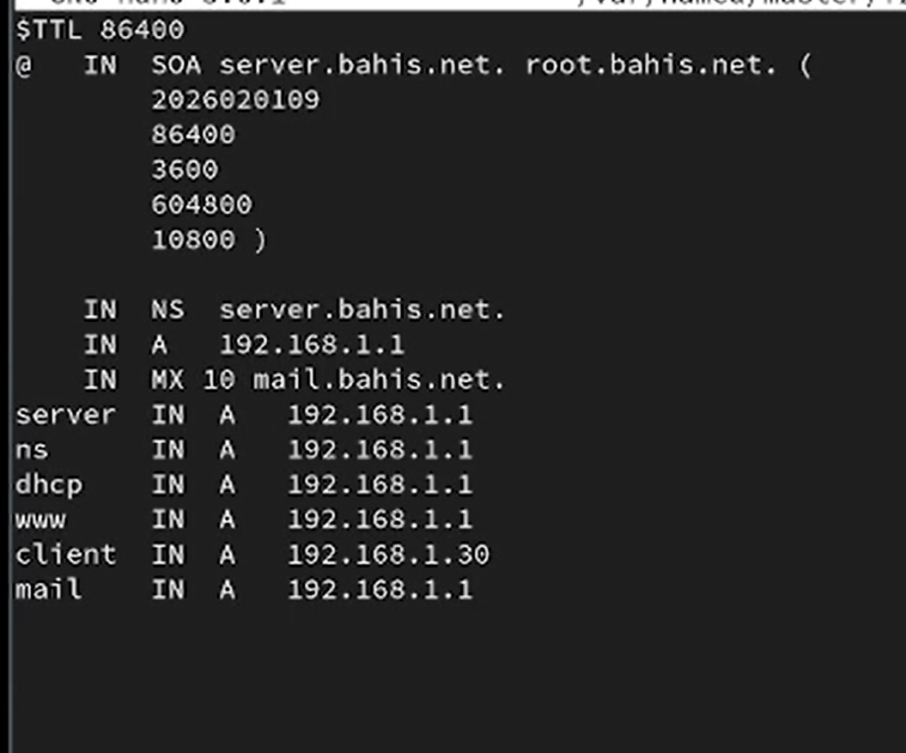{#fig-19 width=70%}

## Настройка обратной DNS-зоны

В файле обратной зоны `/var/named/master/rz/192.168.1` добавлены PTR-записи, сопоставляющие IP-адрес `192.168.1.1` с именами:

* `server.bahis.net`
* `ns.bahis.net`
* `dhcp.bahis.net`
* `www.bahis.net`
* `mail.bahis.net`

Это обеспечивает корректное обратное разрешение имени почтового сервера ([рис. @fig-20]).

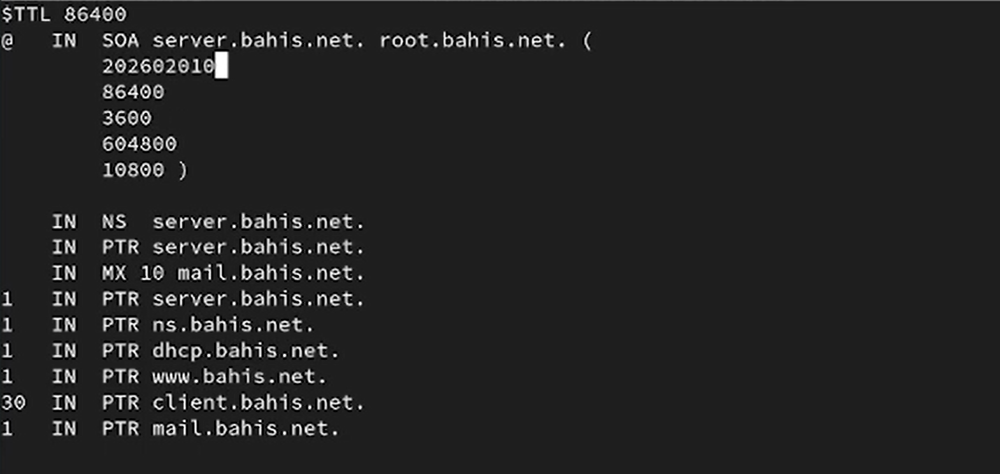{#fig-20 width=70%}

## Добавление домена в параметры mydestination

В конфигурацию Postfix внесено изменение:

`postconf -e 'mydestination = $myhostname, localhost.$mydomain, localhost, $mydomain'`

После этого выполнены команды `postfix check` и `systemctl reload postfix` для проверки и применения конфигурации. Также восстановлены контексты SELinux и перезапущена служба DNS `named`. Очередь отправки принудительно обработана командой `postqueue -f` ([рис. @fig-21]).

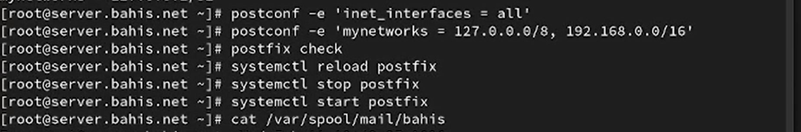{#fig-21 width=70%}

## Отправка письма на доменный адрес с клиента

С клиента отправлено письмо на доменный адрес:


## Проверка доставки сообщения

В журнале `/var/log/maillog` зафиксирована строка:

`status=sent (delivered to mailbox)`

Это подтверждает успешную доставку сообщения в почтовый ящик пользователя на сервере после настройки MX-записи и параметра `mydestination` ([рис. @fig-23]).

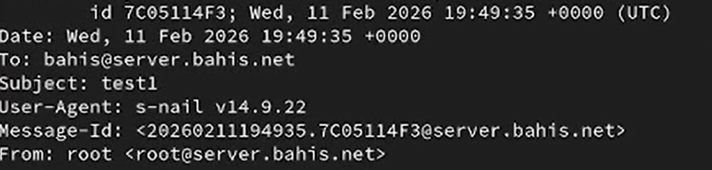{#fig-23 width=70%}

## Копирование конфигурации DNS в каталог provision сервера

На виртуальной машине `server` выполнен переход в каталог
`/vagrant/provision/server/dns/var/named` и произведено копирование текущих файлов DNS из `/var/named` в каталог provision. В процессе подтверждена перезапись существующих файлов зоны ([рис. @fig-24]).

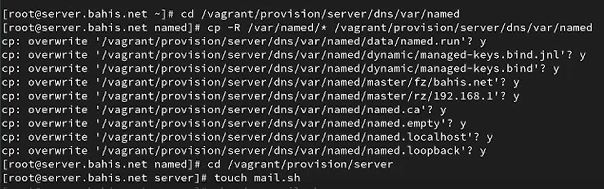{#fig-24 width=70%}

## Создание скрипта mail.sh на сервере

В каталоге `/vagrant/provision/server` создан исполняемый файл `mail.sh` и открыт для редактирования. В скрипт включены команды:

* установка пакетов `postfix` и `s-nail`;
* настройка firewall (служба smtp);
* восстановление контекста SELinux;
* запуск службы Postfix;
* конфигурация параметров `mydomain`, `myorigin`, `inet_protocols`, `inet_interfaces`, `mydestination`, `mynetworks`;
* применение прав `postfix set-permissions`;
* перезапуск службы.

Скрипт полностью соответствует конфигурации домена `bahis.net` ([рис. @fig-25]).

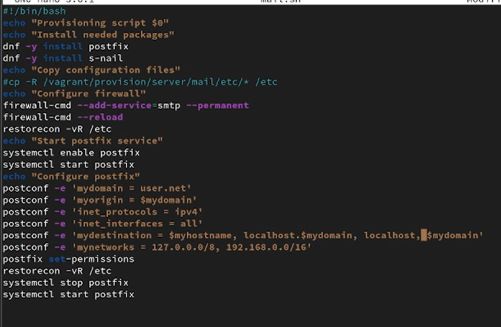{#fig-25 width=70%}


## Создание скрипта mail.sh на клиенте


В скрипте реализованы:

* установка `postfix` и `s-nail`;
* установка параметра `inet_protocols = ipv4`;
* добавление службы в автозагрузку;
* запуск Postfix.

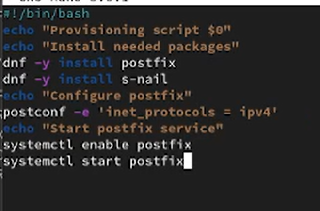{#fig-27 width=70%}


## Добавление provisioning-скрипта для сервера в Vagrantfile

В конфигурационный файл `Vagrantfile` в разделе сервера добавлен блок:

```
server.vm.provision "server mail",
  type: "shell",
  preserve_order: true,
  path: "provision/server/mail.sh"
```

Это обеспечивает автоматическое выполнение скрипта при загрузке виртуальной машины сервера ([рис. @fig-28]).

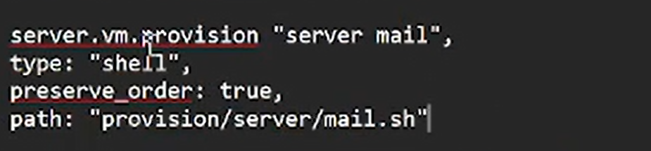{#fig-28 width=70%}

## Добавление provisioning-скрипта для клиента в Vagrantfile

В разделе конфигурации клиента добавлен аналогичный блок:

```
client.vm.provision "client mail",
  type: "shell",
  preserve_order: true,
  path: "provision/client/mail.sh"
```

Таким образом, при запуске виртуальной машины клиента автоматически выполняется настройка почтовой подсистемы ([рис. @fig-29]).

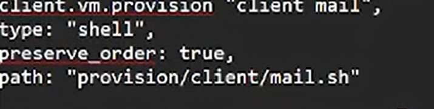{#fig-29 width=70%}

# Выводы

В ходе выполнения работы выполнена полная настройка почтовой системы на базе Postfix в домене `bahis.net`.

На сервере настроены параметры `mydomain`, `myorigin`, `inet_interfaces`, `mynetworks`, `mydestination`, а также реализована поддержка только протокола IPv4. Настроена служба firewalld для разрешения SMTP и восстановлены контексты безопасности SELinux. Проверка журналов `/var/log/maillog` подтвердила успешную локальную и сетевую доставку сообщений (`status=sent (delivered to mailbox)`).

Добавление MX-записи в прямую DNS-зону и соответствующих PTR-записей в обратную зону обеспечило корректную маршрутизацию почты по доменному имени `bahis.net`. После обновления конфигурации DNS и Postfix доставка сообщений на доменный адрес выполняется корректно.

Созданы provisioning-скрипты `mail.sh` для серверной и клиентской виртуальных машин, что позволило автоматизировать установку, настройку и запуск почтовой службы при загрузке через Vagrant. Таким образом, почтовая подсистема интегрирована в механизм автоматической конфигурации виртуального окружения.


# Ответы на контрольные вопросы

1. В каком каталоге и в каком файле следует смотреть конфигурацию Postfix?

- Конфигурация Postfix обычно хранится в файле `main.cf`, а путь к
этому файлу может различаться в разных системах. Однако, обычно
он находится в каталоге `/etc/postfix/`. Таким образом, путь к файлу
конфигурации будет `/etc/postfix/main.cf`.

2. Каким образом можно проверить корректность синтаксиса конфигурационном файле Postfix? 

- ` postfix check`

3. В каких параметрах конфигурации Postfix требуется внести изменения в
значениях для настройки возможности отправки писем не на локальный
хост, а на доменные адреса? 

- Для настройки возможности отправки
писем не на локальный хост, а на доменные адреса, вы можете
изменить параметры `myhostname` и `mydomain` в файле `main.cf`.

4. Приведите примеры работы с утилитой `mail` по отправке письма,
просмотру имеющихся писем, удалению письма. 

- Отправка письма: `echo Текст письма user@example.com`

- Просмотр имеющихся писем: `mail`

- Удаление письма: mail -d номер_письма

5. Приведите примеры работы с утилитой postqueue. Как посмотреть очередь
сообщений? Как определить число сообщений в очереди? Как отправить
все сообщения, находящиеся в очереди? Как удалить письмо из очереди? 

- Просмотр очереди сообщений: `postqueue -p`

- Определение числа сообщений в очереди: `postqueue -p | grep -c "^[A-F0-9]"`

- Отправка всех сообщений из очереди: `postqueue -f`

- Удаление письма из очереди: postsuper -d ID_СООБЩЕНИЯ