---
## Author
author:
  name: Бахи сиди али темассини
  degrees: Student (3 курс)
  orcid: ""
  email: 1032234211@pfur.ru
  affiliation:
    - name: Российский университет дружбы народов
      country: Российская Федерация
      postal-code: 117198
      city: Москва
      address: ул. Миклухо-Маклая, д. 6

## Title
title: "Отчёт по лабораторной работе №9"
subtitle: "Дисциплина: Администрирование сетевых подсистем"
license: "CC BY"
---

# Цель работы

Приобретение практических навыков по установке и простейшему конфигурированию POP3/IMAP-сервера.

# Выполнение лабораторной работы

## Установка Dovecot

На виртуальной машине **server** выполнен переход в режим суперпользователя с помощью команды `sudo -i`, после чего установлены пакеты `dovecot` и `telnet` через менеджер пакетов `dnf`. В выводе отображается разрешение зависимостей и установка соответствующих RPM-пакетов ([рис. @fig-1]).

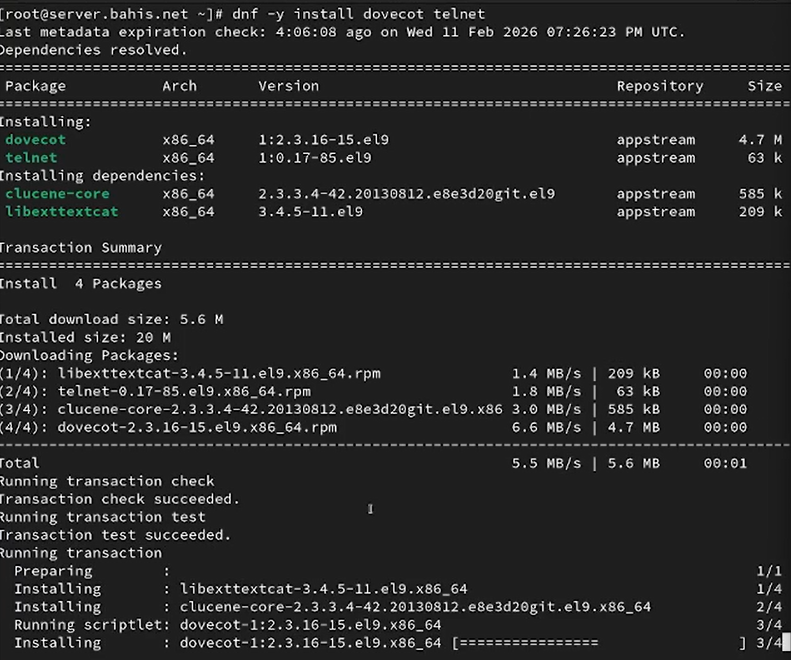{#fig-1 width=70%}


## Настройка Dovecot

В конфигурационном файле `/etc/dovecot/dovecot.conf` задан список поддерживаемых протоколов обслуживания почты: `imap` и `pop3`, что разрешает работу сервиса по данным протоколам ([рис. @fig-2]).

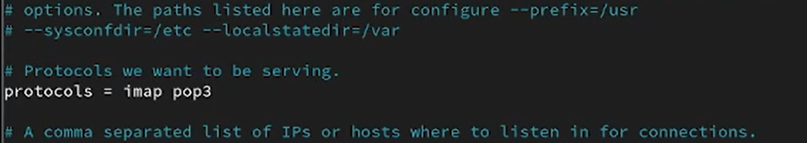{#fig-2 width=70%}

В файле `/etc/dovecot/conf.d/10-auth.conf` проверено, что механизм аутентификации установлен как `plain`, что подтверждается значением параметра `auth_mechanisms` ([рис. @fig-3]).

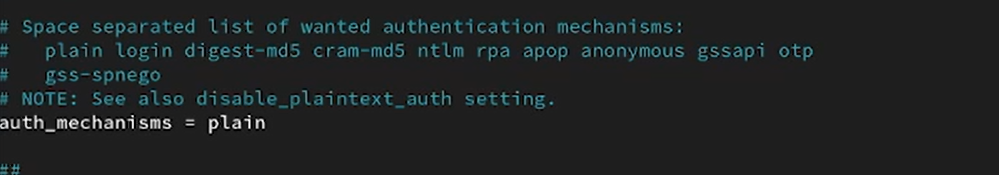{#fig-3 width=70%}

В конфигурационном файле `/etc/dovecot/conf.d/auth-system.conf.ext` проверено, что для аутентификации пользователей используется модуль PAM (`driver = pam`), а получение информации о пользователях осуществляется через системную базу `passwd` (`driver = passwd`). Это подтверждает использование системных учётных записей для доступа к почтовым сервисам ([рис. @fig-4]).

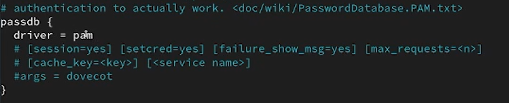{#fig-4 width=70%}

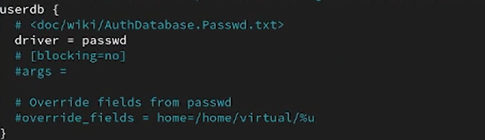{#fig-5 width=70%}

В файле `/etc/dovecot/conf.d/10-mail.conf` настроено расположение почтовых ящиков пользователей с использованием формата Maildir в домашнем каталоге: `mail_location = maildir:~/Maildir`. Это определяет структуру хранения входящей почты ([рис. @fig-6]).

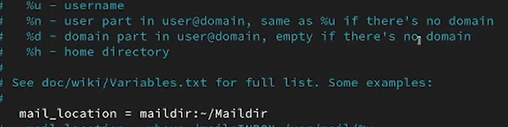{#fig-6 width=70%}

В Postfix задан каталог доставки почты в домашний каталог пользователя с подпапкой `Maildir/` с помощью команды `postconf -e 'home_mailbox = Maildir/'`. Это обеспечивает совместимость механизма доставки Postfix с форматом Maildir ([рис. @fig-7]).

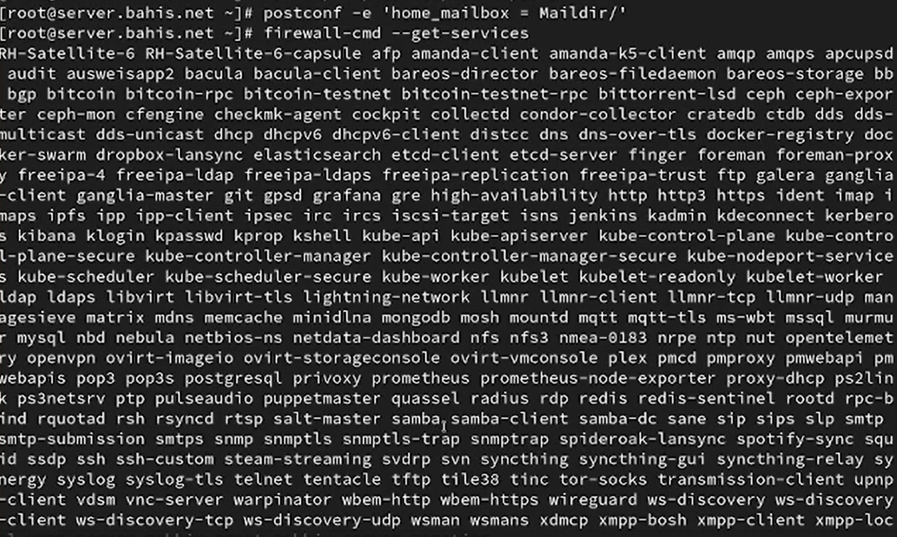{#fig-7 width=70%}

В межсетевом экране выполнена проверка доступных служб и добавлены разрешения для протоколов POP3, POP3S, IMAP и IMAPS с последующей перезагрузкой конфигурации. После выполнения команд список активных служб подтверждает успешное добавление соответствующих сервисов ([рис. @fig-8]).

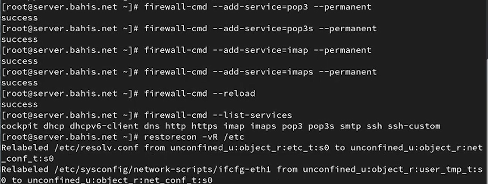{#fig-8 width=70%}

Восстановлен контекст безопасности SELinux для каталога `/etc` командой `restorecon -vR /etc`, что подтверждается выводом об изменении меток безопасности объектов. Это обеспечивает корректную работу служб с учётом политики SELinux ([рис. @fig-8]).

{#fig-8 width=70%}

Выполнен перезапуск службы Postfix и включение с запуском службы Dovecot с использованием `systemctl`. Создание символической ссылки и отсутствие ошибок подтверждают успешную активацию почтовых служб ([рис. @fig-9]).

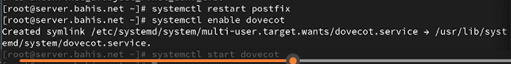{#fig-9 width=70%}

## Проверка работы Dovecot

В дополнительном терминале виртуальной машины `server` запущен мониторинг почтовой службы командой `tail -f /var/log/maillog`. В журнале зафиксированы события перезапуска Postfix и запуск службы Dovecot, что подтверждает их корректное функционирование ([рис. @fig-10]).

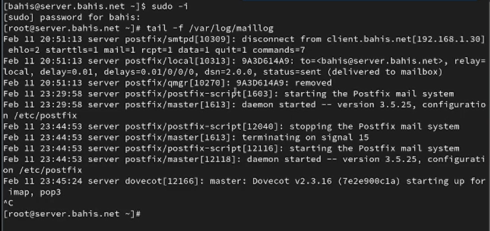{#fig-10 width=70%}

На сервере выполнена попытка просмотра почты командой `MAIL=~/Maildir mail`. В выводе указано отсутствие каталога `/root/Maildir`, что свидетельствует об отсутствии почтового ящика для пользователя root ([рис. @fig-11]).

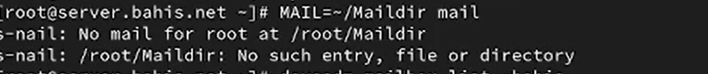{#fig-11 width=70%}

С правами суперпользователя выполнена команда `doveadm mailbox list -u bahis`. В результате отображён почтовый ящик `INBOX`, что подтверждает корректное создание mailbox для пользователя bahis ([рис. @fig-12]).

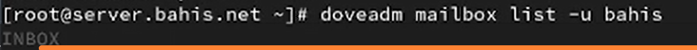{#fig-12 width=70%}

На виртуальной машине `client` выполнен вход в режим суперпользователя и произведена установка почтового клиента Evolution с помощью `dnf -y install evolution`. В выводе показано успешное разрешение зависимостей и завершение установки пакетов ([рис. @fig-13]).

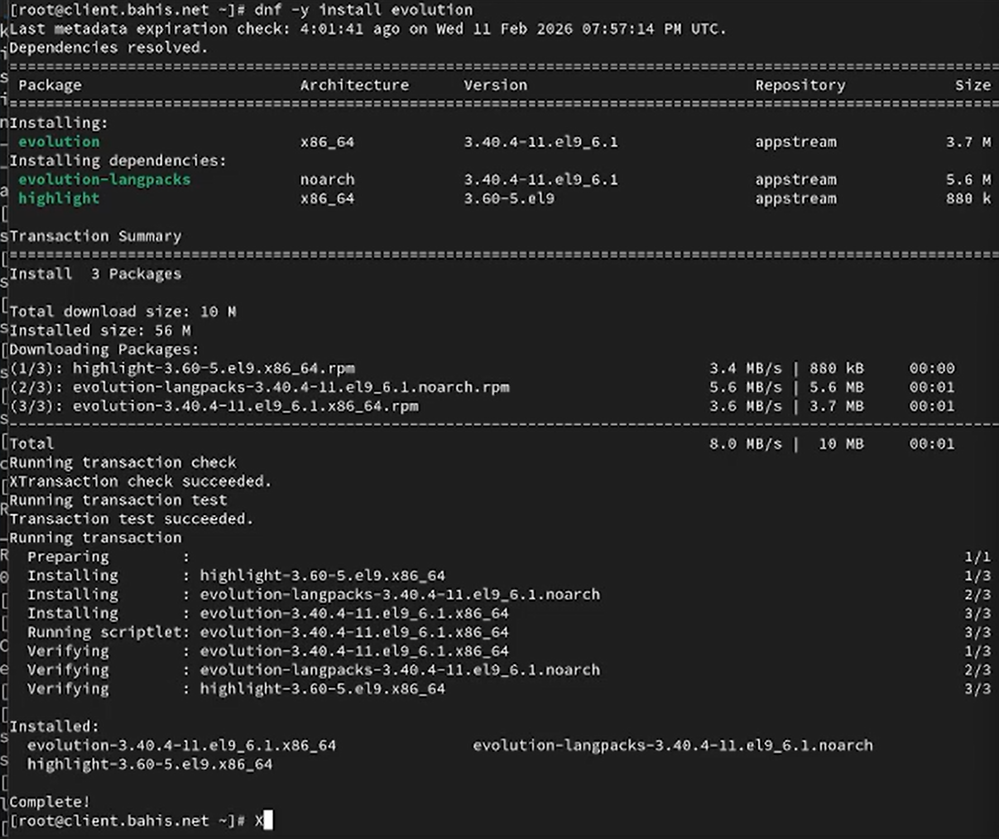{#fig-13 width=70%}


В почтовом клиенте Evolution выполнена настройка учётной записи: указаны имя пользователя `bahis` и адрес `bahis@bahis.net`, затем выбран режим ручной настройки параметров подключения ([рис. @fig-14]).

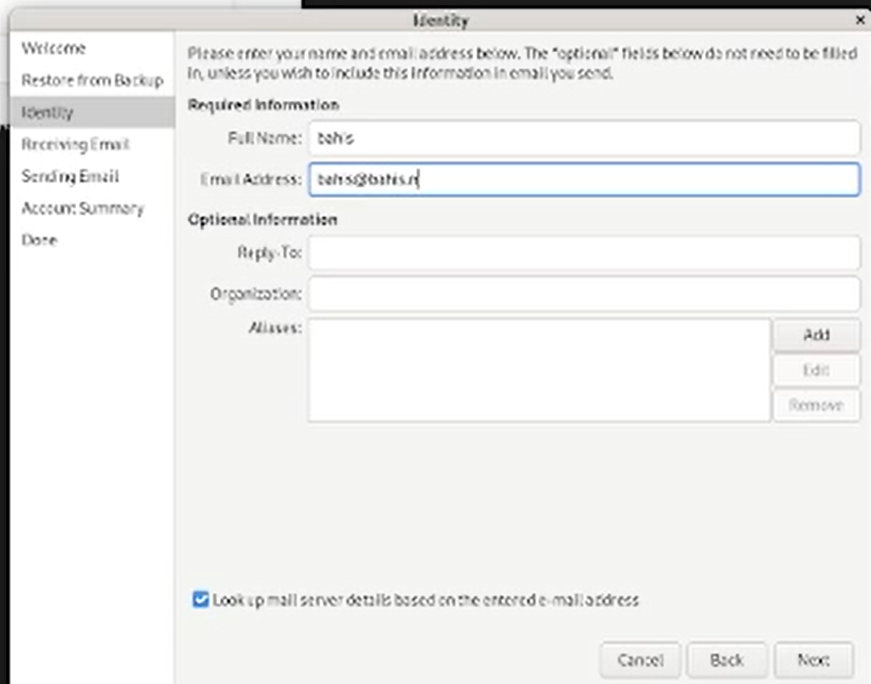{#fig-14 width=70%}

Для входящей почты выбран протокол IMAP, сервер `mail.bahis.net`, порт 143, имя пользователя `bahis`. В качестве метода шифрования установлен STARTTLS, аутентификация — по обычному паролю ([рис. @fig-15]).

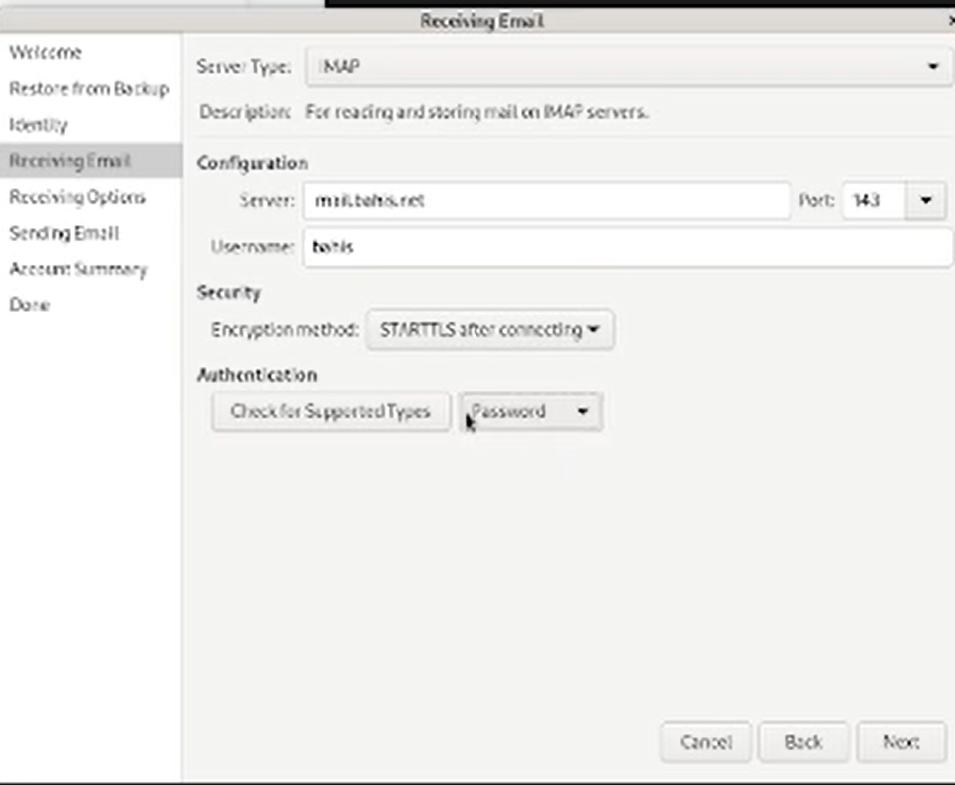{#fig-15 width=70%}

Для исходящей почты указан SMTP-сервер `mail.bahis.net`, порт 25. Настройки безопасности соответствуют требованиям: соединение без дополнительного шифрования, тип аутентификации — PLAIN ([рис. @fig-16]).

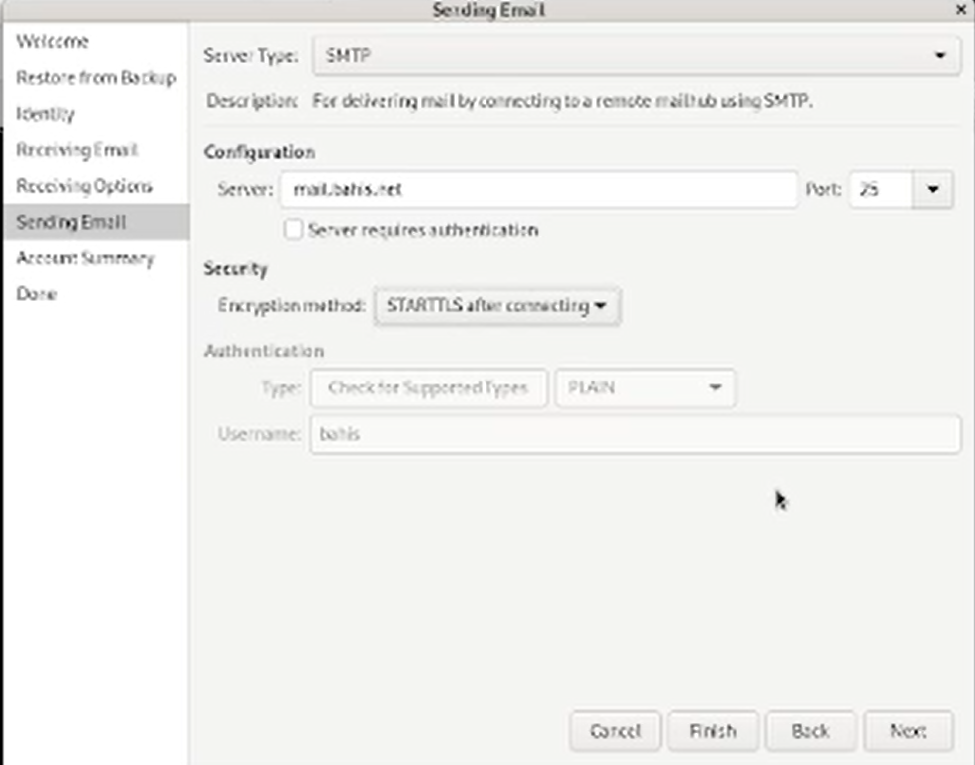{#fig-16 width=70%}

В окне сводной информации подтверждены параметры подключения: IMAP (143, STARTTLS) и SMTP (25), сервер `mail.bahis.net`, пользователь `bahis` ([рис. @fig-17]).

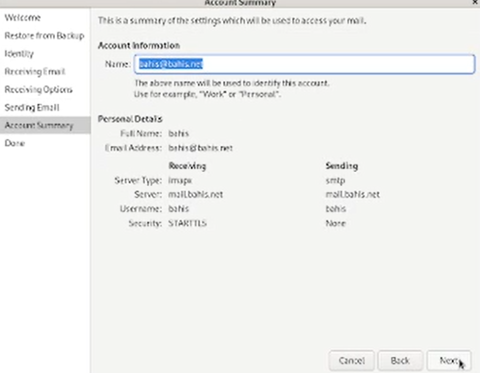{#fig-17 width=70%}

Из клиента отправлены тестовые сообщения на собственный адрес. Входящие письма с темами `Test1`, `test2`, `test3` отображаются в папке Inbox, что подтверждает успешную доставку ([рис. @fig-18]).

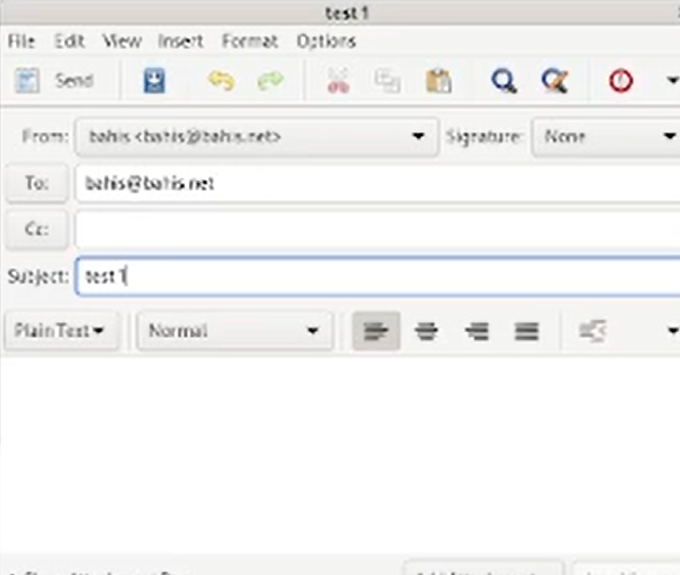{#fig-18 width=70%}

При подключении к серверу по протоколу POP3 через Telnet (`telnet mail.bahis.net 110`) установлено соединение с Dovecot. После аутентификации выполнена команда `list`, отобразившая список из трёх сообщений ([рис. @fig-20]).

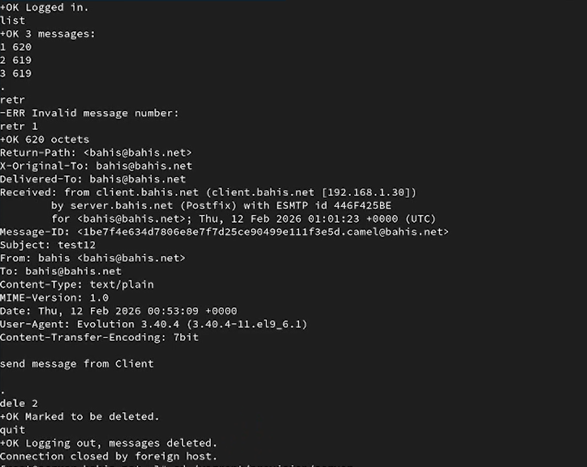{#fig-20 width=70%}

Командой `retr 1` получено содержимое первого письма, включая служебные заголовки (Return-Path, Received, Message-ID, Subject). Командой `dele 2` второе письмо помечено к удалению, а после выполнения `quit` сеанс завершён с подтверждением удаления сообщений ([рис. @fig-20]).

{#fig-20 width=70%}

## Внесение изменений в настройки внутреннего

На виртуальной машине `server` выполнен переход в каталог `/vagrant/provision/server`, создана структура каталогов `mail/etc/dovecot/conf.d`, после чего в соответствующие подкаталоги скопированы файлы конфигурации Dovecot: `dovecot.conf`, `10-auth.conf`, `auth-system.conf.ext`, `10-mail.conf`. Это обеспечивает перенос текущих настроек в систему провижининга Vagrant ([рис. @fig-21]).

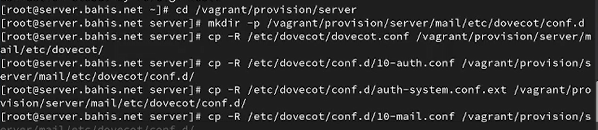{#fig-21 width=70%}

В файл `/vagrant/provision/server/mail.sh` внесены изменения: добавлена установка пакетов `dovecot` и `telnet`, настроено открытие служб SMTP, POP3, POP3S, IMAP, IMAPS в firewalld, задан параметр `home_mailbox = Maildir/` через `postconf`, выполнены команды `restorecon`, а также перезапуск Postfix и запуск Dovecot. Скрипт обеспечивает автоматическую настройку почтового сервера при развёртывании виртуальной машины ([рис. @fig-22]).

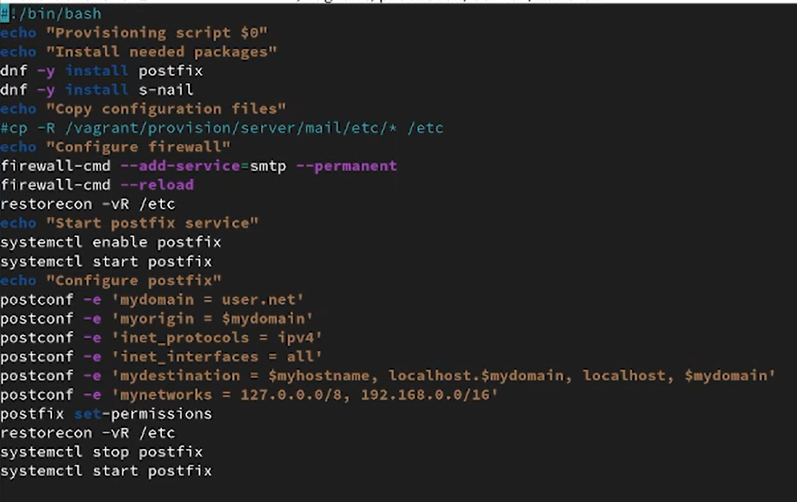{#fig-22 width=70%}

На виртуальной машине `client` в каталоге `/vagrant/provision/client` откорректирован файл `mail.sh`: добавлена строка `dnf -y install evolution` для автоматической установки почтового клиента при провижининге. Это завершает подготовку клиентской части окружения ([рис. @fig-23]).

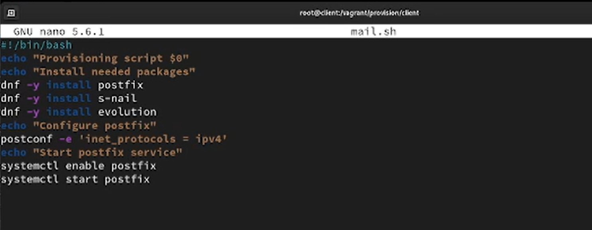{#fig-23 width=70%}


# Выводы

В ходе работы выполнена установка и конфигурирование почтового сервера на базе Postfix и Dovecot. Настроена доставка почты в формате Maildir, реализована аутентификация пользователей через PAM и системную базу passwd.

Обеспечена работа протоколов IMAP и POP3, выполнена настройка межсетевого экрана и восстановление контекстов SELinux. Корректность функционирования подтверждена мониторингом журнала `/var/log/maillog`, использованием утилит `mail` и `doveadm`, а также проверкой протокола POP3 через Telnet.

На клиентской машине выполнена установка и настройка почтового клиента Evolution, отправлены и получены тестовые сообщения, что подтверждает корректную работу службы при взаимодействии клиента и сервера.

Дополнительно выполнена интеграция настроек во внутреннее окружение Vagrant, что обеспечивает автоматизированное развёртывание и воспроизводимость конфигурации почтовой системы.


# Ответы на контрольные вопросы

1. За что отвечает протокол SMTP?

- Отвечает за отправку электронной почты. Этот протокол используется для передачи писем от отправителя к почтовому серверу и от сервера к серверу.

2. За что отвечает протокол IMAP? 

- Отвечает за доступ и управление электронной почтой на сервере. Позволяет клиентским приложениям просматривать, синхронизировать и управлять сообщениями, хранящимися на почтовом сервере.

3. За что отвечает протокол POP3? 

- За получение электронной почты. Письма загружаются с почтового сервера на клиентский компьютер, и после этого они обычно удаляются с сервера (но это можно настроить).

4. В чём назначение Dovecot? 

- Это почтовый сервер, который предоставляет поддержку протоколов IMAP и POP3. Dovecot обеспечивает доступ к электронной почте на сервере, а также хранение и управление сообщениями.

5. В каких файлах обычно находятся настройки работы Dovecot? За что
отвечает каждый из файлов? 
- `/etc/dovecot/dovecot.conf`: Основной файл конфигурации Dovecot.
- `/etc/dovecot/conf.d/`: Дополнительные файлы конфигурации, разделенные на отдельные модули.

6. В чём назначение Postfix? 

- Это почтовый сервер (MTA - Mail Transfer Agent), отвечающий за отправку и маршрутизацию электронной почты.

7. Какие методы аутентификации пользователей можно использовать в Dovecot и в чём их отличие? 

- PLAIN: Передача учетных данных в открытом виде (не рекомендуется, если соединение не защищено).

- LOGIN: Аутентификация по протоколу LOGIN, который шифрует только пароль.

8. Приведите пример заголовка письма с пояснениями его полей. 

```
From: john.doe@example.com
To: jane.smith@example.com
Subject: Meeting Tomorrow
Date: Tue, 6 Dec 2023 14:30:00 +0000
```

9. Приведите примеры использования команд для работы с почтовыми протоколами через терминал (например через telnet). 

- Использование Telnet для проверки SMTP:
```
telnet example.com 25
EHLO example.com
MAIL FROM: sender@example.com
RCPT TO: recipient@example.com
DATA
Subject: Test Email
This is a test email.
.
QUIT
```
- Использование Telnet для проверки POP3:
```
telnet example.com 110
USER your_username
PASS your_password
LIST
RETR 1
QUIT
```

10. Приведите примеры с пояснениями по работе с doveadm. 

- Получение информации о пользователях: `doveadm user user@example.com`
- Получение списка всех писем пользователя: `doveadm search mailbox INBOX ALL`
- Удаление письма: `doveadm expunge -u user@example.com mailbox INBOX uid <UID>`