---
## Author
author:
  name: Бахи сиди али темассини
  degrees: Student (3 курс)
  orcid: ""
  email: 1032234211@pfur.ru
  affiliation:
    - name: Российский университет дружбы народов
      country: Российская Федерация
      postal-code: 117198
      city: Москва
      address: ул. Миклухо-Маклая, д. 6

## Title
title: "Отчёт по лабораторной работе №11"
subtitle: "Дисциплина: Администрирование сетевых подсистем"
license: "CC BY"
---

# Цель работы

Приобретение практических навыков по настройке удалённого доступа к серверу с помощью SSH.

# Выполнение лабораторной работы

##  Запрет удалённого доступа по SSH для пользователя root

Выполнен вход на сервер под пользователем с административными привилегиями и задан пароль для пользователя root с помощью команд `sudo -i` и `passwd root`. В процессе изменения пароля система выдала предупреждение о недостаточной длине пароля, после чего пароль был успешно обновлён ([рис. @fig-1]).

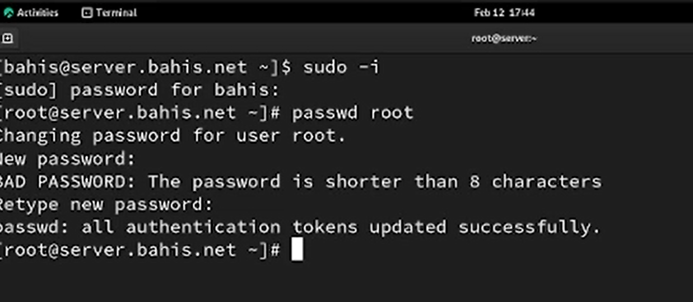{#fig-1 width=70%}

С клиента выполнена попытка подключения к серверу по SSH от имени пользователя root с помощью команды `ssh root@server.bahis.net`. Аутентификация завершилась ошибкой `Permission denied`, что свидетельствует об отклонении доступа сервером ([рис. @fig-2]).

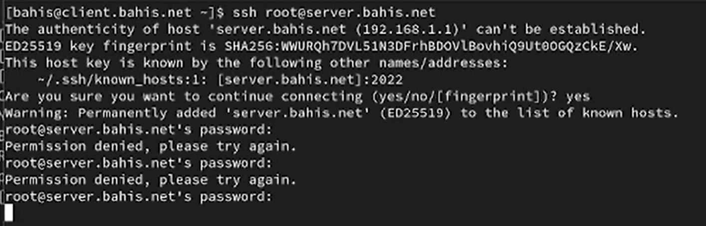{#fig-2 width=70%}

В конфигурационном файле `/etc/ssh/sshd_config` на сервере установлен параметр `PermitRootLogin no`, запрещающий удалённый вход пользователя root по SSH ([рис. @fig-3]).

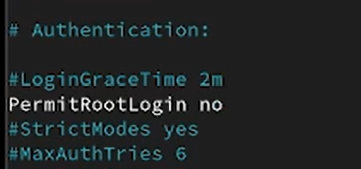{#fig-3 width=70%}

После перезапуска службы `sshd` повторная попытка подключения с клиента под пользователем root завершилась сообщением `Permission denied (publickey,gssapi-keyex,gssapi-with-mic,password)`, что подтверждает успешный запрет удалённого доступа для root ([рис. @fig-4]).

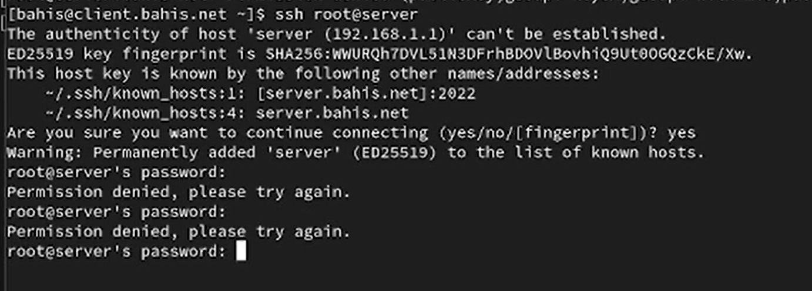{#fig-4 width=70%}

##  Ограничение списка пользователей для удалённого доступа по SSH

С клиента выполнено SSH-подключение к серверу под пользователем bahis с помощью команды `ssh bahis@server.bahis.net`. Аутентификация прошла успешно, о чём свидетельствует вывод приглашения командной строки удалённой системы и информация о предыдущих входах ([рис. @fig-5]).

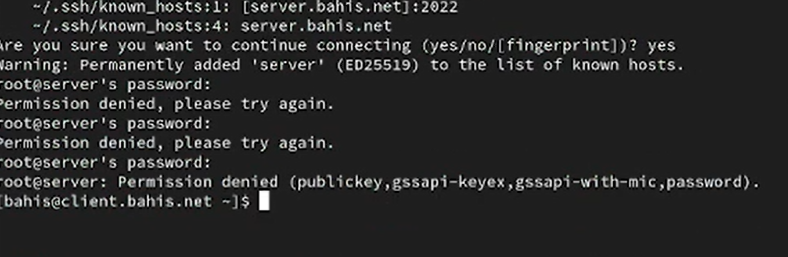{#fig-5 width=70%}

В конфигурационном файле `/etc/ssh/sshd_config` добавлена строка `AllowUsers vagrant`, ограничивающая список пользователей, которым разрешён удалённый доступ по SSH ([рис. @fig-6]).

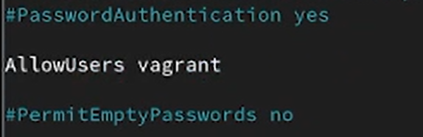{#fig-6 width=70%}

После внесения изменений выполнен перезапуск службы `sshd` командой `systemctl restart sshd` для применения новой конфигурации ([рис. @fig-7]).

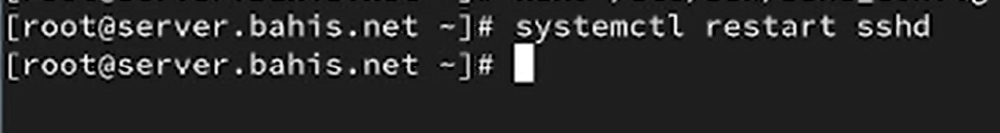{#fig-7 width=70%}

Повторная попытка подключения с клиента под пользователем bahis завершилась ошибкой `Permission denied`, что связано с отсутствием данного пользователя в списке, указанном в директиве `AllowUsers` ([рис. @fig-8]).

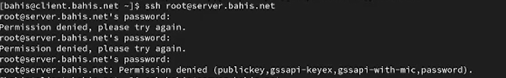{#fig-8 width=70%}

В файл `/etc/ssh/sshd_config` внесено изменение: строка `AllowUsers vagrant` заменена на `AllowUsers vagrant bahis`, что добавляет пользователя bahis в разрешённый список ([рис. @fig-9]).

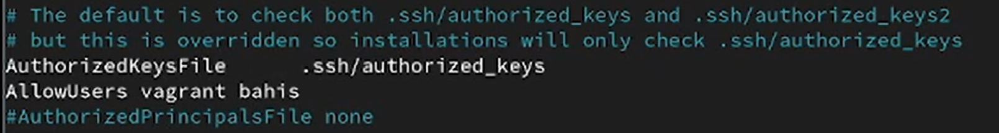{#fig-9 width=70%}

После повторного перезапуска службы `sshd` выполнена новая попытка подключения с клиента под пользователем bahis, которая завершилась успешно, что подтверждается появлением приглашения командной строки сервера ([рис. @fig-10]).

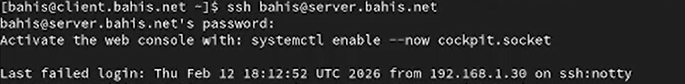{#fig-10 width=70%}

## Настройка дополнительных портов для удалённого доступа по SSH

В конфигурационном файле `/etc/ssh/sshd_config` добавлена дополнительная строка `Port 2022` ниже существующей строки `Port 22`, что задаёт прослушивание двух TCP-портов процессом `sshd` ([рис. @fig-11]).

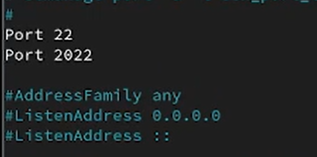{#fig-11 width=70%}

После перезапуска службы выполнена проверка расширенного статуса `systemctl status -l sshd`. В журнале зафиксированы сообщения `error: Bind to port 2022 ... failed: Permission denied`, что указывает на запрет использования данного порта механизмом SELinux. При этом служба продолжила работу на порту 22 ([рис. @fig-12]).

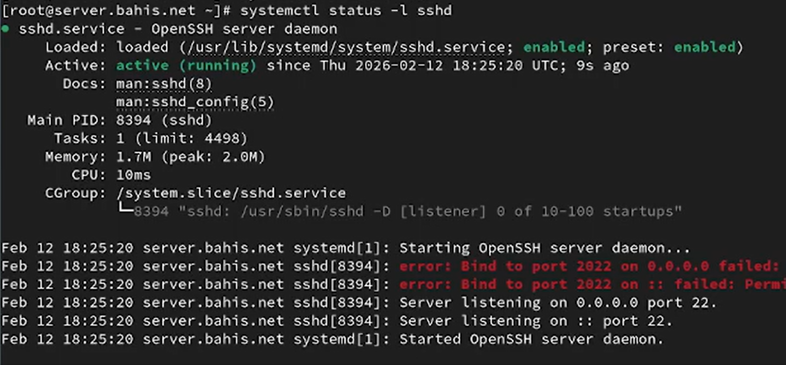{#fig-12 width=70%}

Для разрешения использования порта 2022 выполнено добавление соответствующей метки SELinux командой `semanage port -a -t ssh_port_t -p tcp 2022`, а также открыт порт в межсетевом экране с помощью `firewall-cmd`. После этого служба `sshd` перезапущена ([рис. @fig-13]).

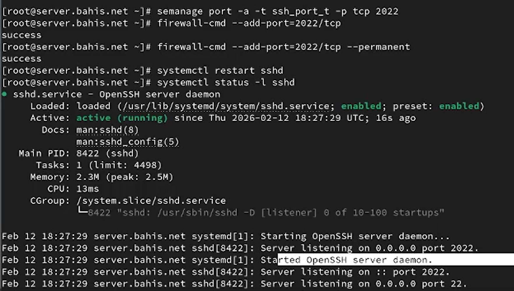{#fig-13 width=70%}

Повторная проверка статуса службы показала, что `sshd` прослушивает порты 22 и 2022 на адресах 0.0.0.0 и ::, что подтверждает корректную настройку ([рис. @fig-14]).

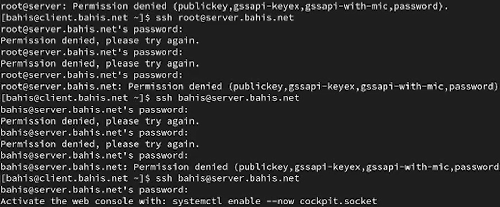{#fig-14 width=70%}

С клиента выполнено подключение к серверу с указанием альтернативного порта `ssh -p2022 bahis@server.bahis.net`. Аутентификация прошла успешно, после чего выполнен переход в режим суперпользователя `sudo -i` и корректный выход из сеанса ([рис. @fig-15]).

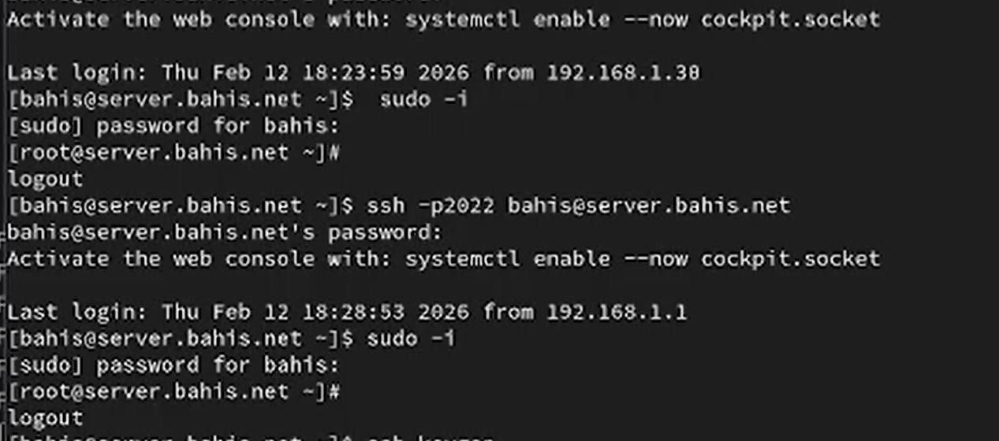{#fig-15 width=70%}

## Настройка удалённого доступа по SSH по ключу

В конфигурационном файле `/etc/ssh/sshd_config` на сервере установлен параметр `PubkeyAuthentication yes`, разрешающий аутентификацию по открытому ключу ([рис. @fig-16]).

{#fig-16 width=70%}

На клиенте под пользователем **bahis** выполнена генерация пары RSA-ключей с помощью команды `ssh-keygen`. Закрытый ключ сохранён в файл `~/.ssh/id_rsa`, открытый — в `~/.ssh/id_rsa.pub`, что подтверждается выводом утилиты ([рис. @fig-17]).

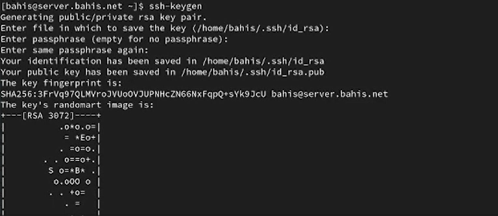{#fig-17 width=70%}

Открытый ключ скопирован на сервер командой `ssh-copy-id bahis@server.bahis.net`. После ввода пароля пользователя ключ добавлен в файл `~/.ssh/authorized_keys` на сервере ([рис. @fig-18]).

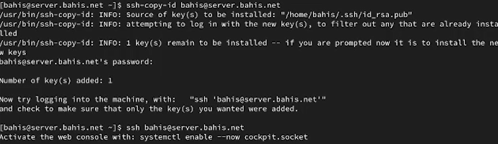{#fig-18 width=70%}

Повторное подключение к серверу выполнено командой `ssh bahis@server.bahis.net`. Аутентификация прошла без запроса пароля, что подтверждается непосредственным входом в оболочку удалённой системы ([рис. @fig-19]).

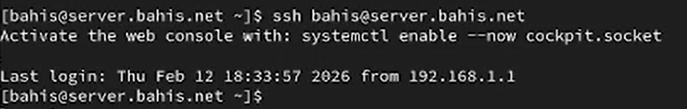{#fig-19 width=70%}

## Организация туннелей SSH, перенаправление TCP-портов

На клиенте выполнена проверка активных TCP-соединений командой `lsof | grep TCP`. До организации туннеля отсутствовали локальные прослушивающие сокеты на порту 8080 ([рис. @fig-20]).

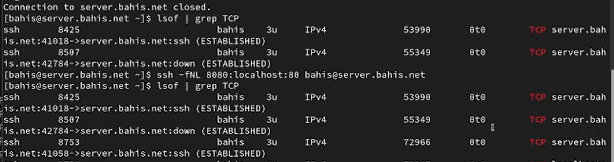{#fig-20 width=70%}

Выполнена команда `ssh -fNL 8080:localhost:80 bahis@server.bahis.net`, создающая локальный SSH-туннель. Параметр `-L 8080:localhost:80` организует перенаправление: локальный порт 8080 клиента связывается с портом 80 сервера через защищённое SSH-соединение. Повторный вывод `lsof | grep TCP` показывает процесс `ssh`, прослушивающий порт `localhost:8080` (webcache), а также установленное SSH-соединение в состоянии `ESTABLISHED`, что подтверждает успешное создание туннеля ([рис. @fig-20]).

{#fig-20 width=70%}

На клиенте в браузере открыт адрес `http://localhost:8080`. Отображается страница приветствия «Welcome to the server.bahis.net server», что подтверждает корректное перенаправление HTTP-трафика через SSH-туннель на веб-сервер, работающий на сервере ([рис. @fig-21]).

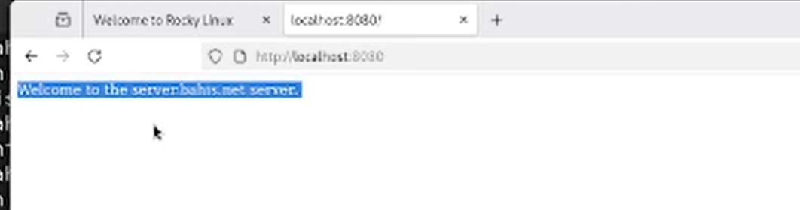{#fig-21 width=70%}

## Запуск консольных приложений через SSH

С клиента под пользователем **bahis** выполнена команда `ssh bahis@server.bahis.net hostname`, которая запускает на удалённом сервере консольную утилиту `hostname`. В ответ получено имя узла `server.bahis.net`, что подтверждает удалённое выполнение команды через SSH ([рис. @fig-22]).

{#fig-22 width=70%}

Командой `ssh bahis@server.bahis.net ls -Al` получен подробный список файлов домашнего каталога пользователя на сервере. Вывод содержит права доступа, владельца, размер и дату изменения файлов, что подтверждает корректное удалённое выполнение команды `ls` ([рис. @fig-23]).

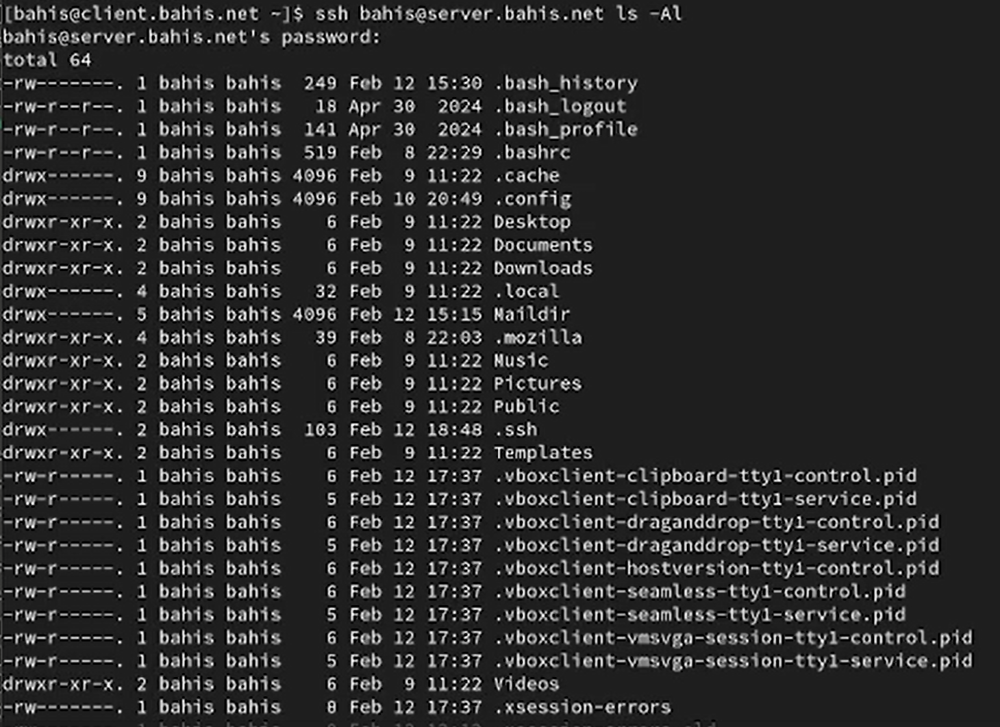{#fig-23 width=70%}

Командой `ssh bahis@server.bahis.net MAIL=~/Maildir/ mail` выполнен запуск почтового клиента `mail` на сервере с указанием каталога `Maildir`. В выводе отображены 4 почтовых сообщения с указанием отправителя, даты и темы, что подтверждает успешный запуск консольного приложения на удалённой системе ([рис. @fig-24]).

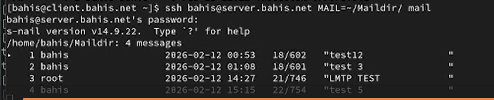{#fig-24 width=70%}

## Запуск графических приложений через SSH (X11Forwarding)

В конфигурационном файле `/etc/ssh/sshd_config` на сервере установлен параметр `X11Forwarding yes`, разрешающий пересылку графического трафика X11 через SSH-соединение ([рис. @fig-25]).

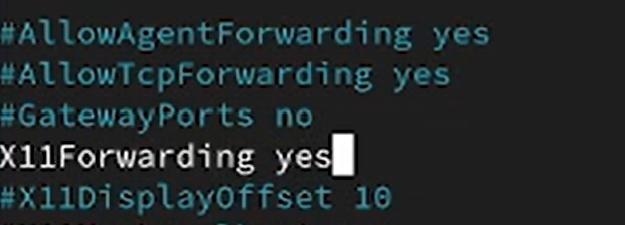{#fig-25 width=70%}

С клиента выполнено подключение с поддержкой X11-перенаправления командой `ssh -YC bahis@server.bahis.net firefox`. Параметр `-Y` включает доверенное X11-перенаправление, `-C` активирует сжатие трафика. В результате графическое приложение Firefox, запущенное на сервере, отобразилось на клиентской машине, что подтверждает корректную работу X11Forwarding ([рис. @fig-26]).

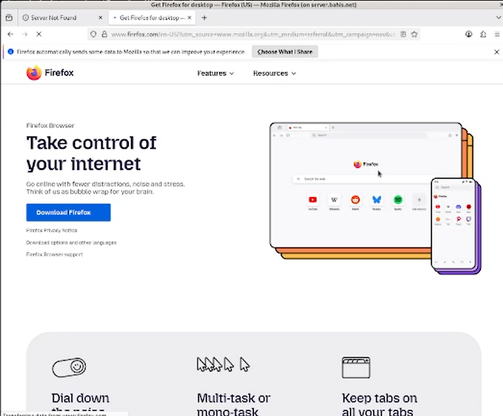{#fig-26 width=70%}

##  Внесение изменений в настройки внутреннего

На виртуальной машине **server** выполнен переход в каталог `/vagrant/provision/server`, создан каталог `ssh/etc/ssh` и в него скопирован конфигурационный файл `sshd_config`, что обеспечивает сохранение настроек SSH во внутреннем окружении Vagrant ([рис. @fig-27]).

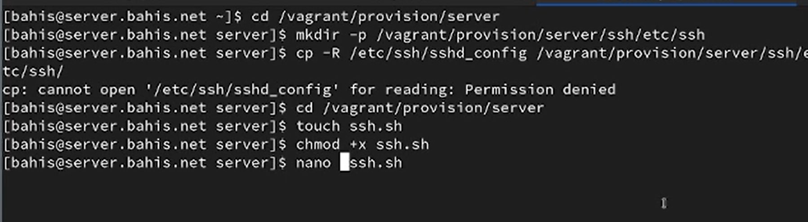{#fig-27 width=70%}

В каталоге `/vagrant/provision/server` создан исполняемый файл `ssh.sh`, в котором реализован сценарий автоматической настройки: копирование конфигурационных файлов в `/etc`, восстановление контекстов SELinux (`restorecon`), открытие порта 2022 в `firewalld`, добавление порта 2022 в тип `ssh_port_t` с помощью `semanage`, а также перезапуск службы `sshd` ([рис. @fig-28]).

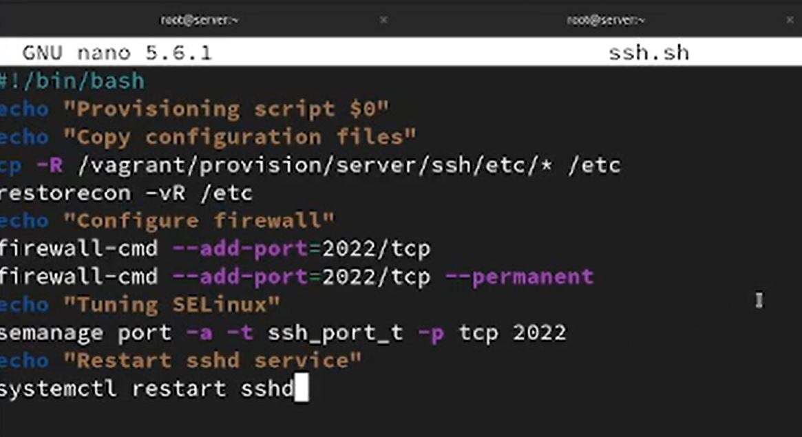{#fig-28 width=70%}

В файле `Vagrantfile` в разделе конфигурации виртуальной машины **server** добавлен provision-блок типа `shell` с указанием пути `provision/server/ssh.sh` и параметром `preserve_order: true`, что обеспечивает автоматическое выполнение созданного скрипта при загрузке виртуальной машины ([рис. @fig-29]).

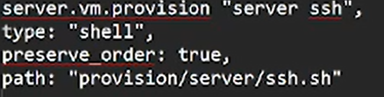{#fig-29 width=70%}

# Выводы

В ходе работы выполнена комплексная настройка службы OpenSSH на виртуальной машине server. Реализованы меры повышения безопасности: запрещён удалённый вход пользователя root, ограничен список пользователей с помощью директивы `AllowUsers`, настроена аутентификация по ключу вместо пароля, а также организован доступ через альтернативный порт 2022 с корректной настройкой SELinux и межсетевого экрана.

Дополнительно реализованы механизмы SSH-туннелирования и X11-перенаправления, что позволило безопасно передавать TCP-трафик и запускать графические приложения удалённо. Проверена возможность выполнения консольных команд на сервере без интерактивного входа в систему.

Изменения интегрированы во внутреннее окружение виртуальной машины посредством provisioning-скрипта Vagrant, что обеспечивает автоматическое применение конфигурации и воспроизводимость настроенной среды.

# Контрольные вопросы

1. Вы хотите запретить удалённый доступ по SSH на сервер пользователю root и разрешить доступ пользователю alice. Как это сделать?

В файле `/etc/ssh/sshd_config` конфигурации прописать `PermitRootLogin no` и `AllowUsers alice`.

2. Как настроить удалённый доступ по SSH через несколько портов? Для чего это может потребоваться?

Для настройки удалённого доступа по SSH через несколько портов нужно отредактировать файл конфигурации SSH и добавить строку `Port <порт>`.

3. Какие параметры используются для создания туннеля SSH, когда команда ssh устанавливает фоновое соединение и не ожидает какой-либо конкретной команды?

Для установки фонового соединения без команды используется параметр -N при использовании команды ssh: `ssh -N <hostname>`

4. Как настроить локальную переадресацию с локального порта 5555 на порт 80 сервера server2.example.com?
 
 `ssh -fNL 80:localhost:55555 server2.example.com`

5. Как настроить SELinux, чтобы позволить SSH связываться с портом 2022?

`semanage port -a -t ssh_port_t -p tcp 2022`

6. Как настроить межсетевой экран на сервере, чтобы разрешить входящие подключения по SSH через порт 2022?

` firewall-cmd --add-port=2022/tcp --permanent`
