---
## Author
author:
  name: Бахи сиди али темассини
  degrees: Student (3 курс)
  orcid: ""
  email: 1032234211@pfur.ru
  affiliation:
    - name: Российский университет дружбы народов
      country: Российская Федерация
      postal-code: 117198
      city: Москва
      address: ул. Миклухо-Маклая, д. 6

## Title
title: "Отчёт по лабораторной работе №12"
subtitle: "Дисциплина: Администрирование сетевых подсистем"
license: "CC BY"
---

# Цель работы

Приобретение практических навыков по управлению системным временем и настройке синхронизации времени.

# Выполнение лабораторной работы

## Настройка параметров времени

В результате выполнения команды `timedatectl` на сервере получена информация о параметрах времени ([рис. @fig-1]). Установлена временная зона **UTC (UTC, +0000)**. Локальное и универсальное время совпадают. Системные часы синхронизированы (`System clock synchronized: yes`), служба NTP активна (`NTP service: active`). Аппаратные часы (RTC) работают в UTC (`RTC in local TZ: no`).

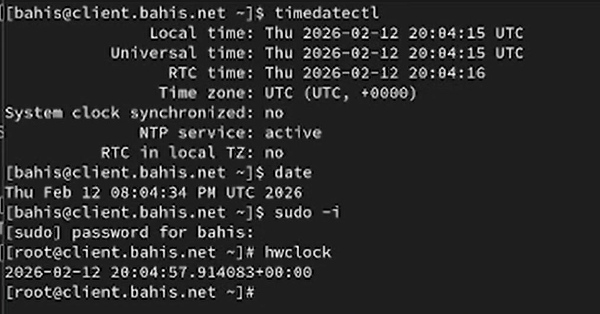{#fig-1 width=70%}

Текущее системное время определено с помощью команды `date`. Отображено текущее значение даты и времени в формате UTC, что подтверждает использование временной зоны UTC.

Аппаратное время проверено командой `hwclock` под учетной записью суперпользователя. Значение RTC соответствует системному времени и также представлено в формате UTC (+00:00).

## Управление синхронизацией времени

На сервере выполнена установка пакета chrony командой `dnf -y install chrony`. В выводе указано, что пакет `chrony-4.6.1-2.el9.x86_64` уже установлен, дополнительные действия не требуются ([рис. @fig-2]).

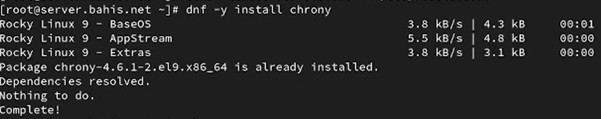{#fig-2 width=70%}

На сервере проверены источники времени командой `chronyc sources` ([рис. @fig-3]). В таблице отображены источники синхронизации (Name/IP address), их уровень Stratum, интервал опроса (Poll), достижимость (Reach), время последнего ответа (LastRx) и смещение (Last sample). Символ `^*` указывает на текущий используемый источник синхронизации, `^+` — допустимые альтернативные источники, `^?` — недоступные источники.

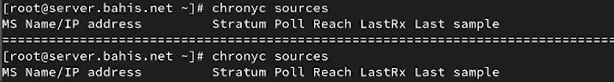{#fig-3 width=70%}

В конфигурационный файл `/etc/chrony.conf` на сервере добавлена строка `allow 192.168.0.0/16`, разрешающая клиентам из локальной сети обращаться к серверу как к источнику времени ([рис. @fig-4]).

{#fig-4 width=70%}

Служба chronyd на сервере перезапущена командой `systemctl restart chronyd`, после чего в межсетевом экране открыт сервис NTP (`firewall-cmd --add-service=ntp --permanent`) и применены изменения (`firewall-cmd --reload`) ([рис. @fig-5]).

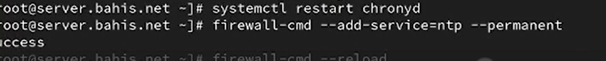{#fig-5 width=70%}

На клиенте выполнена проверка источников времени командой `chronyc sources` ([рис. @fig-6]). В таблице отображены внешние NTP-серверы, выбранный источник помечен символом `^*`, альтернативные — `^+`.

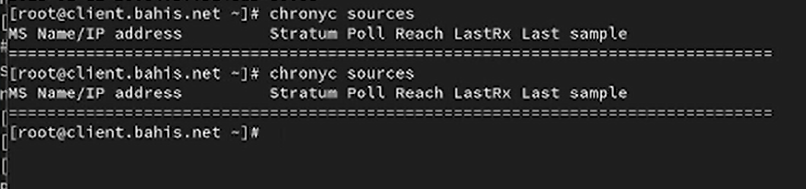{#fig-6 width=70%}

В файле `/etc/chrony.conf` клиента добавлена строка `server server.bahis.net iburst`, остальные строки с директивой `server` удалены ([рис. @fig-7]). Параметр `iburst` обеспечивает ускоренную первичную синхронизацию.

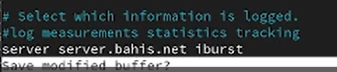{#fig-7 width=70%}

После перезапуска службы `chronyd` на клиенте повторно выполнена команда `chronyc sources` ([рис. @fig-8]). В качестве основного источника синхронизации используется сервер `mail.bahis.net` (Stratum 4), что подтверждается символом `^*`. Остальные записи отражают дополнительные или ранее доступные источники. Это свидетельствует о корректной настройке клиента для синхронизации времени с локальным сервером.

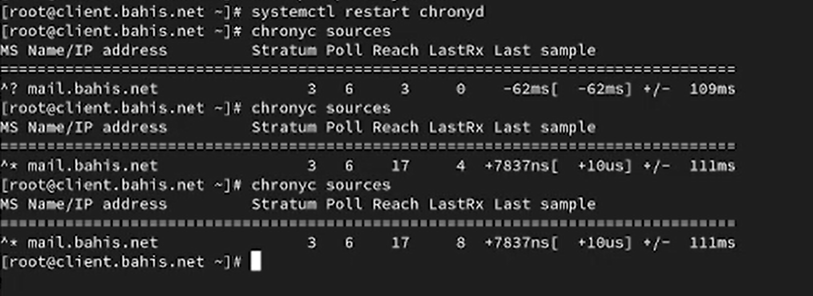{#fig-8 width=70%}

## Внесение изменений в настройки внутреннего

На виртуальной машине **server** выполнен переход в каталог `/vagrant/provision/server`, создан каталог `ntp/etc` и скопирован файл конфигурации `/etc/chrony.conf` во внутреннюю структуру provisioning ([рис. @fig-9]).

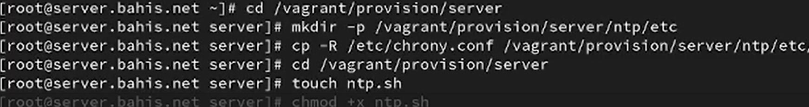{#fig-9 width=70%}

В каталоге `/vagrant/provision/server` создан исполняемый файл `ntp.sh`, которому назначены права на выполнение ([рис. @fig-10]).

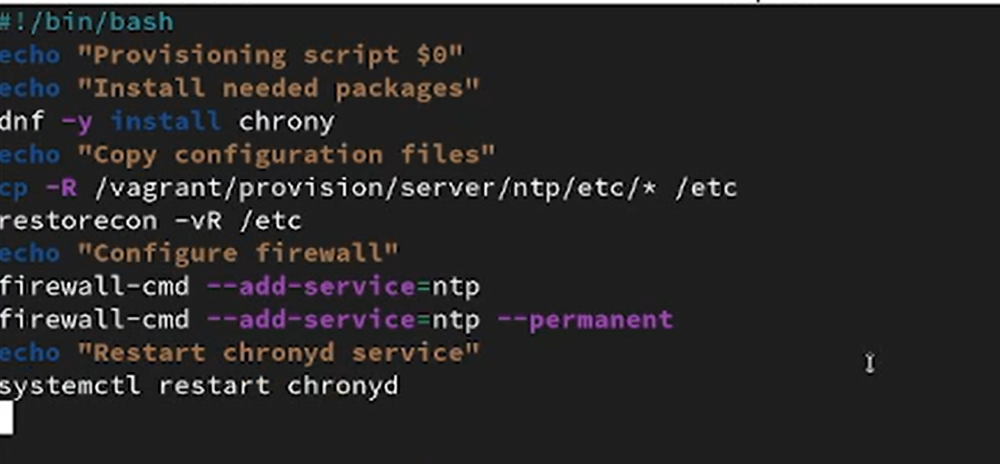{#fig-10 width=70%}

В файл `ntp.sh` добавлен скрипт автоматической настройки: установка пакета `chrony`, копирование конфигурационных файлов в `/etc`, восстановление контекстов SELinux (`restorecon -vR /etc`), открытие сервиса `ntp` в firewall и перезапуск службы `chronyd` ([рис. @fig-11]).

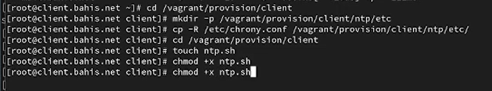{#fig-11 width=70%}

На виртуальной машине **client** выполнен переход в каталог `/vagrant/provision/client`, создан каталог `ntp/etc` и скопирован файл `/etc/chrony.conf` во внутренний каталог provisioning ([рис. @fig-12]).

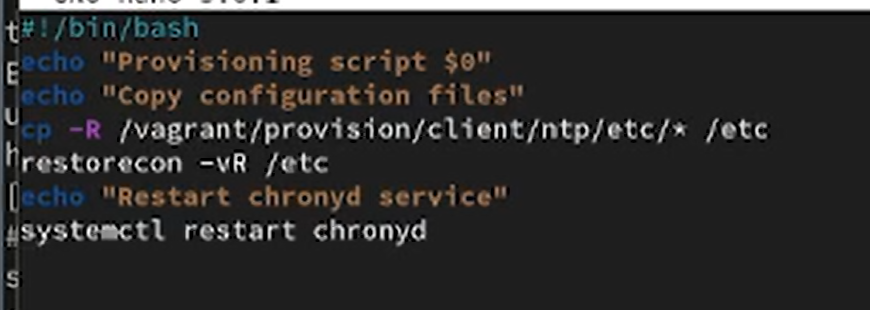{#fig-12 width=70%}

В каталоге `/vagrant/provision/client` создан исполняемый файл `ntp.sh` с назначением прав на выполнение ([рис. @fig-13]).

{#fig-13 width=70%}

В файл `ntp.sh` клиента добавлен скрипт копирования конфигурационных файлов, восстановления контекстов SELinux и перезапуска службы `chronyd` ([рис. @fig-14]).

В конфигурационный файл `Vagrantfile` добавлены секции provisioning для виртуальных машин server и client с указанием типа `shell`, параметра `preserve_order: true` и путей к соответствующим скриптам `provision/server/ntp.sh` и `provision/client/ntp.sh`, что обеспечивает автоматическое выполнение настройки NTP при загрузке виртуальных машин ([рис. @fig-14]).

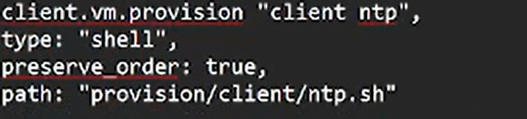{#fig-14 width=70%}

# Выводы

В результате выполненной работы реализована централизованная настройка синхронизации времени с использованием службы **chronyd**.

На сервере настроена работа в качестве NTP-сервера: разрешён доступ из локальной сети, открыт сервис `ntp` в межсетевом экране и обеспечен автоматический запуск службы.

На клиенте выполнена настройка синхронизации времени с сервером, что подтверждается выводом `chronyc sources`, где сервер отображается как основной источник времени.

Созданы provisioning-скрипты для server и client, интегрированные в `Vagrantfile`, что обеспечивает автоматическое применение конфигурации при развертывании виртуальных машин.

Таким образом, обеспечена корректная и воспроизводимая настройка сетевой синхронизации времени во внутреннем окружении виртуальных машин.

# Контрольные вопросы

1. Почему важна точная синхронизация времени для служб баз данных?

Точная синхронизация времени в службах баз данных важна для обеспечения целостности и согласованности данных. Она позволяет различным узлам базы данных оперировать с одним и тем же временем, что помогает предотвратить конфликты при репликации данных и обеспечить правильную последовательность операций.

2. Почему служба проверки подлинности Kerberos сильно зависит от правильной синхронизации времени?

Служба проверки подлинности Kerberos зависит от правильной синхронизации времени для обеспечения безопасности. Керберос использует временные метки для защиты от атак воспроизведения и повтора. Если временные метки не синхронизированы правильно, то проверка подлинности Kerberos может не работать, так как таймстампы могут быть некорректно интерпретированы.

3. Какая служба используется по умолчанию для синхронизации времени на RHEL 7?

`chronyd`

4. Какова страта по умолчанию для локальных часов?

10 - страта по умолчанию для локальных часов.

5. Какой порт брандмауэра должен быть открыт, если вы настраиваете свой сервер как одноранговый узел NTP?

`123 UDP`

6. Какую строку вам нужно включить в конфигурационный файл chrony, если вы хотите быть сервером времени, даже если внешние серверы NTP недоступны?

Для настройки сервера времени в chrony, даже если внешние серверы NTP недоступны, нужно включить строку `local stratum 10` в конфигурационном файле chrony.

7. Какую страту имеет хост, если нет текущей синхронизации времени NTP?

`16`, что означает "недоступно".

8. Какую команду вы бы использовали на сервере с chrony, чтобы узнать, с какими серверами он синхронизируется?

`chronyc sources`

9. Как вы можете получить подробную статистику текущих настроек времени для процесса chrony вашего сервера?

`chronyc tracking`

