---
## Author
author:
  name: Бахи сиди али темассини
  degrees: Student (3 курс)
  orcid: ""
  email: 1032234211@pfur.ru
  affiliation:
    - name: Российский университет дружбы народов
      country: Российская Федерация
      postal-code: 117198
      city: Москва
      address: ул. Миклухо-Маклая, д. 6

## Title
title: "Отчёт по лабораторной работе №13"
subtitle: "Дисциплина: Администрирование сетевых подсистем"
license: "CC BY"
---

# Цель работы

Приобретение практических навыков настройки сервера NFS для удалённого доступа к ресурсам.

# Выполнение лабораторной работы

## Настройка сервера NFSv4

Выполнена установка пакета `nfs-utils` с использованием менеджера пакетов `dnf`, что обеспечивает наличие необходимых утилит и служб для функционирования сервера NFSv4 ([рис. @fig-1]).

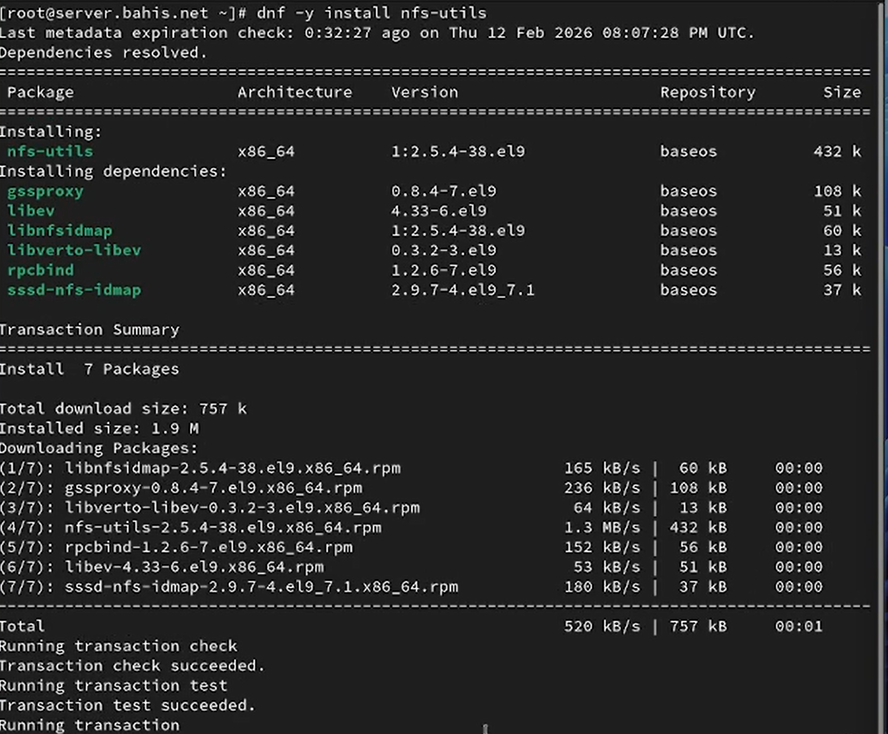{#fig-1 width=70%}

Создан каталог `/srv/nfs`, предназначенный для использования в качестве корневого каталога экспортируемого дерева NFS. В файле `/etc/exports` добавлена строка `/srv/nfs *(ro)`, определяющая экспорт каталога с правами только на чтение для всех узлов сети ([рис. @fig-2]).

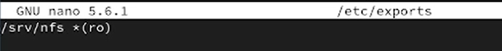{#fig-2 width=70%}

Для каталога `/srv/nfs` задан контекст безопасности SELinux типа `nfs_t` с помощью команды `semanage fcontext`, что обеспечивает корректную работу службы NFS в рамках политики безопасности ([рис. @fig-3]).

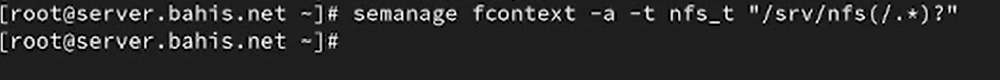{#fig-3 width=70%}

Изменённый контекст SELinux применён к файловой системе командой `restorecon -vR /srv/nfs`, после чего выполнен запуск и добавление службы `nfs-server.service` в автозагрузку средствами `systemctl` ([рис. @fig-4]).

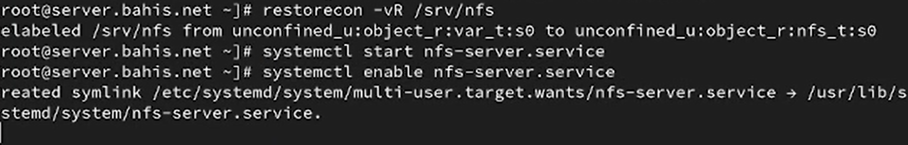{#fig-4 width=70%}

Настроен межсетевой экран: добавлено разрешение сервиса `nfs` и выполнена перезагрузка конфигурации `firewalld`, что обеспечивает доступ к серверу NFS через соответствующие сетевые порты ([рис. @fig-5]).

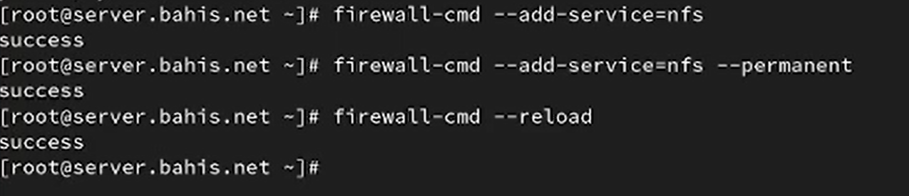{#fig-5 width=70%}

На клиенте выполнена установка пакета `nfs-utils` с использованием `dnf`, что обеспечивает наличие утилит для работы с NFS-ресурсами, включая `showmount` ([рис. @fig-6]).

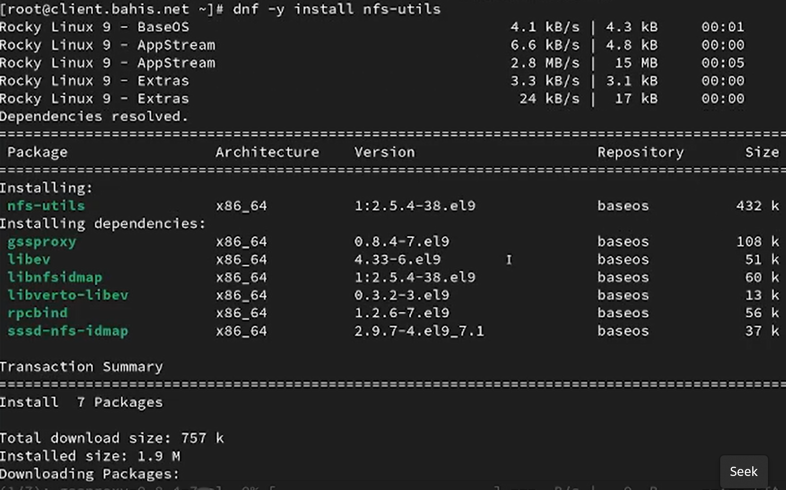{#fig-6 width=70%}

После установки выполнена команда `showmount -e server.bahis.net`. В результате получено сообщение `clnt_create: RPC: Unable to receive`, что указывает на невозможность получения ответа от сервера по протоколу RPC при активном межсетевом экране ([рис. @fig-7]).

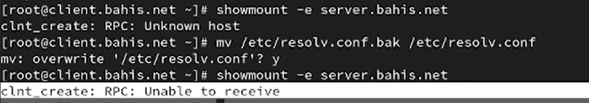{#fig-7 width=70%}

На сервере выполнена остановка службы межсетевого экрана командой `systemctl stop firewalld.service`, что временно снимает сетевые ограничения ([рис. @fig-8]).

{#fig-8 width=70%}

После отключения `firewalld` повторный запуск команды `showmount -e server.bahis.net` на клиенте приводит к успешному получению списка экспортируемых ресурсов. Отображается каталог `/srv/nfs *`, что подтверждает доступность NFS-экспорта ([рис. @fig-9]).

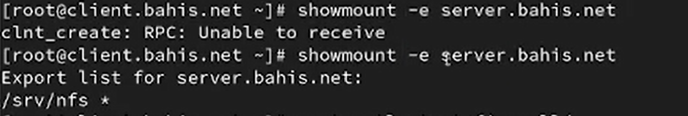{#fig-9 width=70%}

На сервере служба межсетевого экрана вновь запущена командой `systemctl start firewalld`, что восстанавливает стандартные правила фильтрации сетевого трафика ([рис. @fig-10]).

{#fig-10 width=70%}

На сервере выполнен анализ активных служб, задействованных при удалённом монтировании, с использованием команд `lsof | grep TCP` и `lsof | grep UDP`. В выводе отображаются процессы `rpcbind`, `rpc.statd`, `rpc.mountd`, работающие по протоколам TCP и UDP в режимах IPv4 и IPv6, что подтверждает использование RPC-служб при обслуживании NFS-запросов ([рис. @fig-11], [рис. @fig-12]).

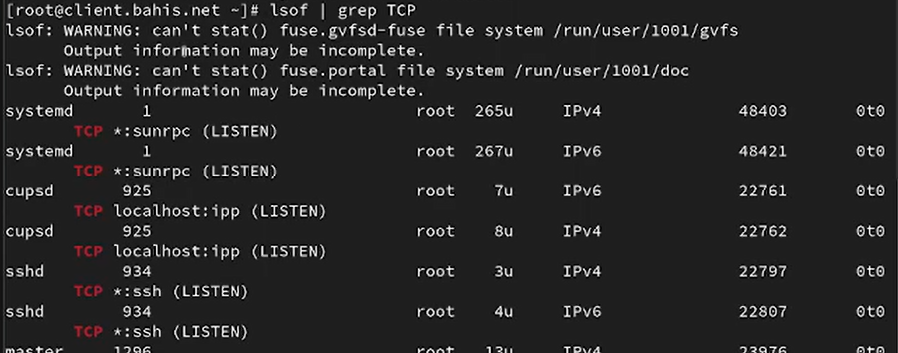{#fig-11 width=70%}

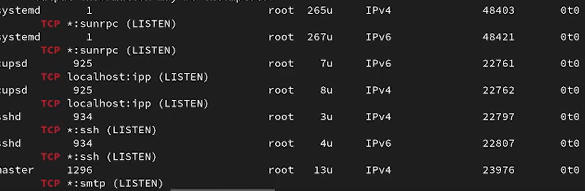{#fig-12 width=70%}

В конфигурацию межсетевого экрана добавлены службы `mountd` и `rpc-bind` командами `firewall-cmd --add-service=mountd --add-service=rpc-bind` и с параметром `--permanent`, после чего выполнена перезагрузка конфигурации `firewalld`. Это обеспечивает разрешение необходимых RPC-портов для корректной работы NFS через межсетевой экран ([рис. @fig-13]).

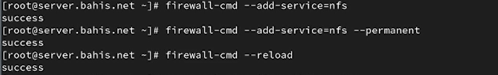{#fig-13 width=70%}

На клиенте повторно выполнена команда `showmount -e server.bahis.net`. В результате успешно получен список экспортируемых ресурсов, включая каталог `/srv/nfs *`, что подтверждает корректную настройку служб и правил межсетевого экрана ([рис. @fig-14]).

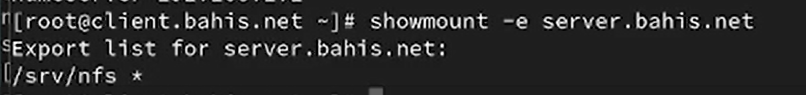{#fig-14 width=70%}

##  Монтирование NFS на клиенте

На клиенте создан каталог `/mnt/nfs`, после чего выполнено монтирование удалённого ресурса командой `mount server.bahis.net:/srv/nfs /mnt/nfs`. Это приводит к подключению экспортируемого каталога сервера к локальной точке монтирования клиента ([рис. @fig-15]).

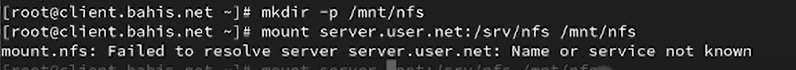{#fig-15 width=70%}

Проверка командой `mount` подтверждает наличие записи вида `server.bahis.net:/srv/nfs on /mnt/nfs type nfs4`. Это означает, что ресурс подключён по протоколу NFSv4, используется транспорт TCP (`proto=tcp`), режим жёсткого монтирования (`hard`), а также параметры обмена данными (`rsize`, `wsize`) и механизм аутентификации `sec=sys` ([рис. @fig-16]).

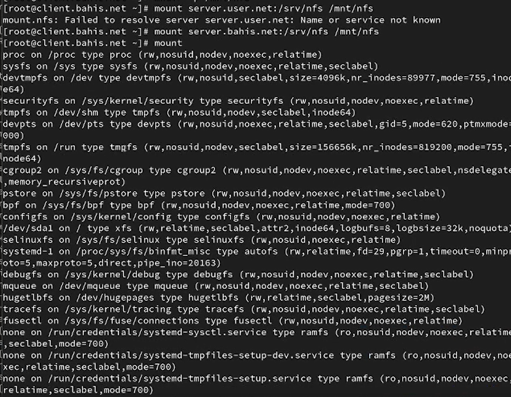{#fig-16 width=70%}

В файл `/etc/fstab` добавлена строка
`server.bahis.net:/srv/nfs /mnt/nfs nfs _netdev 0 0`.
Первое поле — удалённый ресурс, второе — точка монтирования, третье — тип файловой системы (`nfs`), параметр `_netdev` указывает на зависимость монтирования от сетевой подсистемы, последние два нуля определяют отсутствие резервного копирования (`dump`) и проверки `fsck` ([рис. @fig-17]).

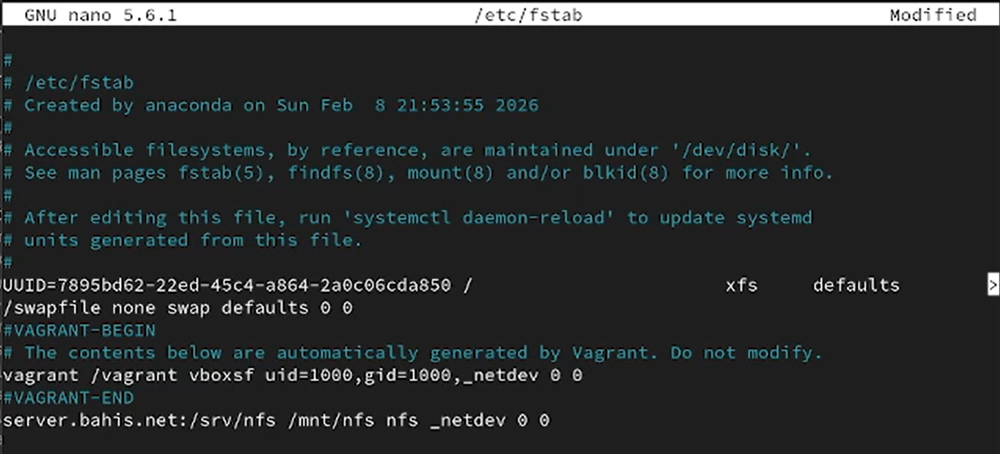{#fig-17 width=70%}

Проверка состояния цели `remote-fs.target` командой `systemctl status remote-fs.target` показывает статус `active`, что свидетельствует о готовности системы автоматически монтировать удалённые файловые системы при запуске ([рис. @fig-18]).

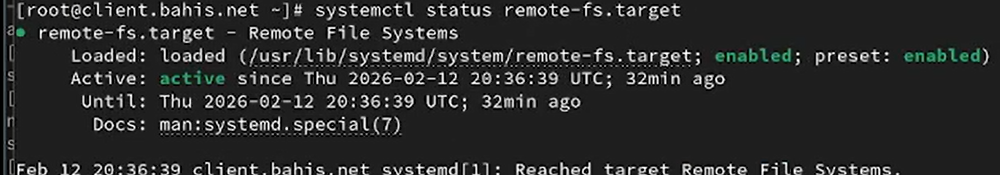{#fig-18 width=70%}

После перезапуска клиента выполнена проверка содержимого `/mnt/nfs` и повторный вывод `mount | grep nfs`. Отображение строки с типом `nfs4` подтверждает, что удалённый ресурс автоматически подключён при старте операционной системы ([рис. @fig-19]).

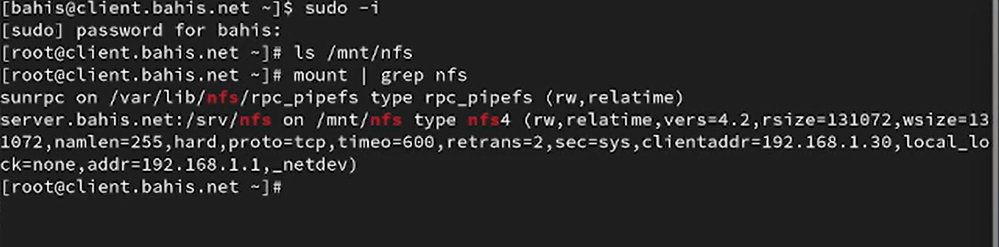{#fig-19 width=70%}

## Подключение каталогов к дереву NFS

На сервере создан каталог `/srv/nfs/www`, предназначенный для включения в дерево NFS, после чего выполнено bind-монтирование каталога веб-сервера `/var/www` в созданный каталог командой `mount -o bind /var/www/ /srv/nfs/www/`. Проверка содержимого подтверждает наличие каталогов `cgi-bin` и `html` ([рис. @fig-20]).

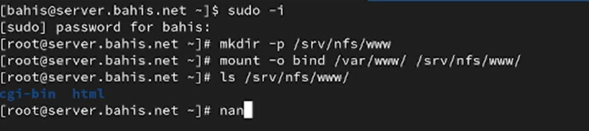{#fig-20 width=70%}

На клиенте при просмотре каталога `/mnt/nfs` отображается подкаталог `www`, что подтверждает его наличие в экспортируемом дереве NFS ([рис. @fig-21]).

{#fig-21 width=70%}

В файл `/etc/exports` на сервере добавлена строка
`/srv/nfs/www 192.168.0.0/16(rw)`,
что разрешает доступ на чтение и запись к каталогу `www` для узлов сети 192.168.0.0/16 ([рис. @fig-22]).

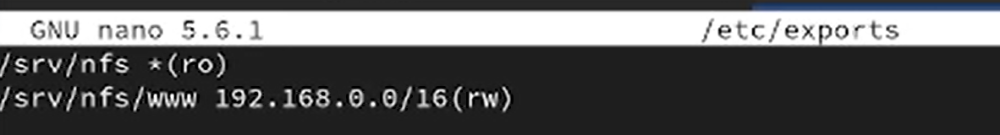{#fig-22 width=70%}

Выполнена команда `exportfs -r`, обеспечивающая повторное применение конфигурации экспорта без перезапуска службы NFS ([рис. @fig-23]).

{#fig-23 width=70%}

На клиенте выполнена проверка каталога `/mnt/nfs/www`, где отображаются каталоги `cgi-bin` и `html`, что подтверждает корректность экспорта и доступность веб-контента через NFS ([рис. @fig-24]).

{#fig-24 width=70%}

Для обеспечения постоянного bind-монтирования на сервере в файл `/etc/fstab` добавлена строка
`/var/www /srv/nfs/www none bind 0 0`,
где первое поле — источник, второе — точка монтирования, тип `none` используется для bind-монтирования, параметр `bind` задаёт тип операции, последние два нуля отключают `dump` и проверку `fsck` ([рис. @fig-25]).

{#fig-25 width=70%}

После повторного выполнения `exportfs -r` конфигурация экспорта актуализирована с учётом постоянного bind-монтирования ([рис. @fig-26]).

{#fig-26 width=70%}

На клиенте повторная проверка каталога `/mnt/nfs/www` подтверждает сохранение доступа к каталогам `cgi-bin` и `html`, что свидетельствует о корректной настройке подключения каталогов к дереву NFS ([рис. @fig-27]).

{#fig-27 width=70%}

## Подключение каталогов для работы пользователей

На сервере под пользователем `bahis` создан каталог `~/common` с правами `700`, что обеспечивает полный доступ только владельцу. В каталоге создан файл `bahis@server.txt`. Права `700` означают `rwx------`, то есть доступ запрещён для группы и остальных пользователей ([рис. @fig-28]).

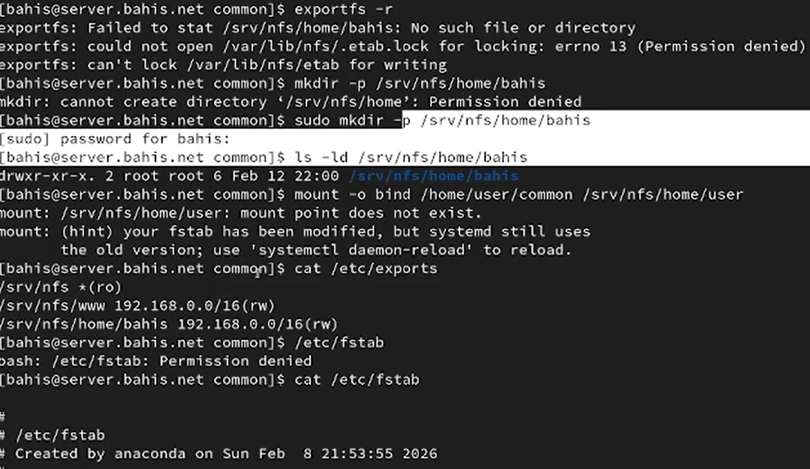{#fig-28 width=70%}

В файл `/etc/exports` добавлена строка
`/srv/nfs/home/bahis 192.168.0.0/16(rw)`,
что разрешает доступ к каталогу по сети с правами чтения и записи для указанного диапазона адресов ([рис. @fig-29]).

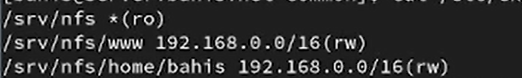{#fig-29 width=70%}

В файл `/etc/fstab` добавлена запись
`/home/bahis/common /srv/nfs/home/bahis none bind 0 0`,
где первое поле — источник, второе — точка монтирования в дереве NFS, `none` — тип для bind-монтирования, `bind` — параметр операции, последние два нуля отключают `dump` и проверку `fsck` ([рис. @fig-30]).

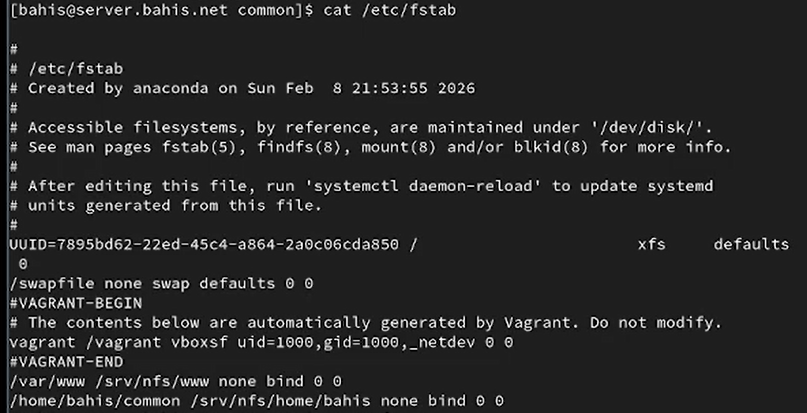{#fig-30 width=70%}

После выполнения `exportfs -r` конфигурация экспорта обновлена без перезапуска службы NFS ([рис. @fig-31]).

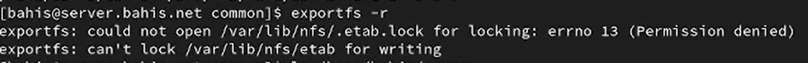{#fig-31 width=70%}

На клиенте при просмотре `/mnt/nfs` отображаются каталоги `home` и `www`, что подтверждает экспорт пользовательского каталога ([рис. @fig-32]).

{#fig-32 width=70%}

Под пользователем `bahis` на клиенте выполнен переход в каталог `/mnt/nfs/home/bahis` и создан файл `bahis@client.txt`, что подтверждает наличие прав записи через NFS ([рис. @fig-33]).

{#fig-33 width=70%}

На сервере в каталоге `/home/bahis/common` отображаются файлы `bahis@server.txt` и `bahis@client.txt`, что подтверждает синхронность данных через bind-монтирование и экспорт NFS ([рис. @fig-34]).

{#fig-34 width=70%}

При попытке доступа к каталогу `/mnt/nfs/home/bahis` под пользователем `root` на клиенте получено сообщение `Permission denied`, что обусловлено правами `700`, установленными на исходный каталог пользователя на сервере ([рис. @fig-35]).

{#fig-35 width=70%}

## Внесение изменений в настройки внутреннего

На виртуальной машине **server** выполнен переход в каталог `/vagrant/provision/server`, создан каталог `nfs/etc`, после чего файл `/etc/exports` скопирован во внутреннюю структуру provisioning. Это обеспечивает сохранение конфигурации экспорта для автоматического развёртывания ([рис. @fig-36]).

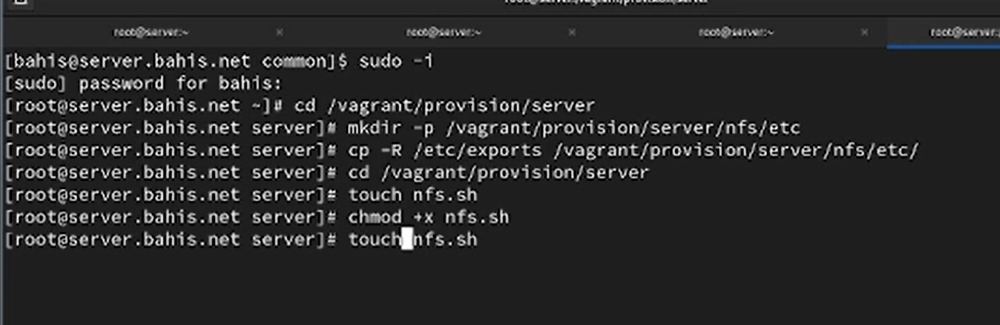{#fig-36 width=70%}

В каталоге `/vagrant/provision/server` создан исполняемый файл `nfs.sh`, в котором реализован сценарий автоматической настройки: установка `nfs-utils`, копирование конфигурации в `/etc`, настройка `firewalld`, назначение контекста SELinux `nfs_t`, bind-монтирование каталогов `/var/www` и `/home/bahis/common`, добавление записей в `/etc/fstab`, а также запуск и включение службы `nfs-server` ([рис. @fig-37]).

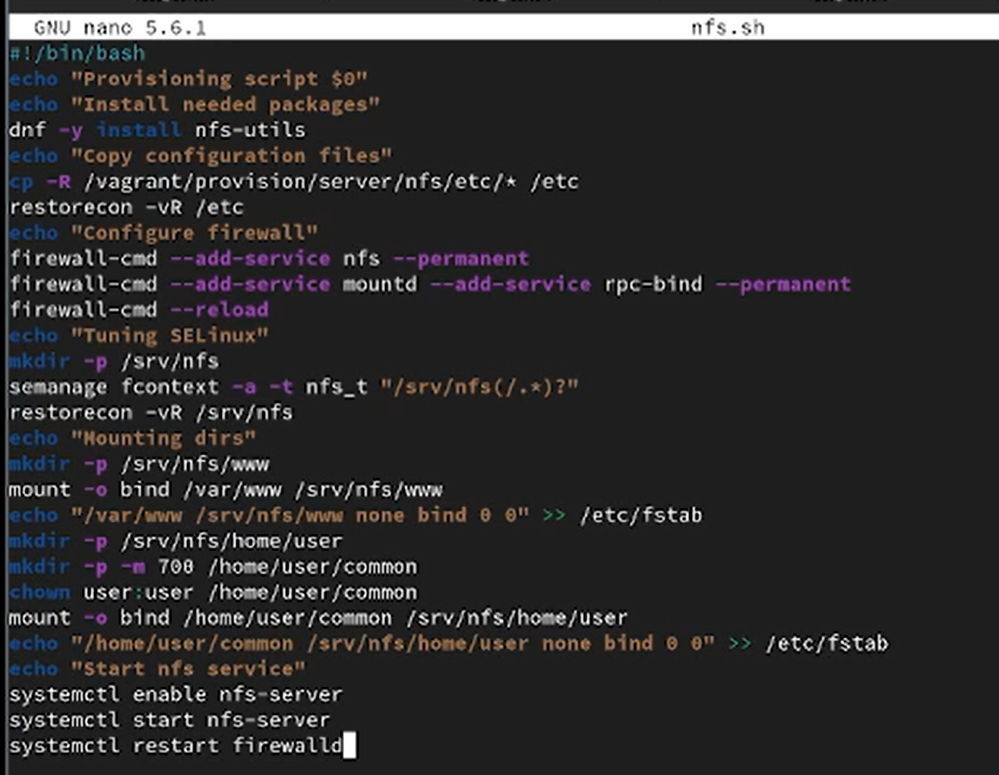{#fig-37 width=70%}

На виртуальной машине **client** выполнен переход в каталог `/vagrant/provision/client`, создан исполняемый файл `nfs.sh`, предназначенный для автоматической настройки клиента NFS ([рис. @fig-38]).

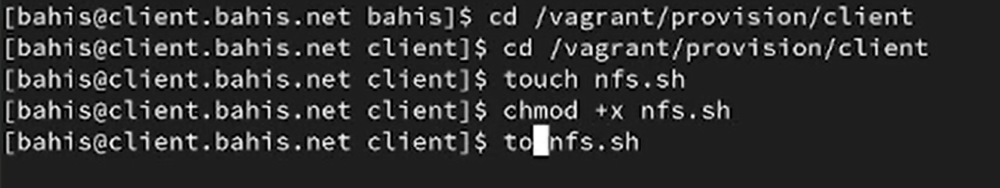{#fig-38 width=70%}

В скрипте клиента реализована установка пакета `nfs-utils`, создание точки монтирования `/mnt/nfs`, подключение ресурса `server.bahis.net:/srv/nfs`, добавление строки автоматического монтирования в `/etc/fstab` с параметром `_netdev`, а также восстановление контекстов SELinux ([рис. @fig-39]).

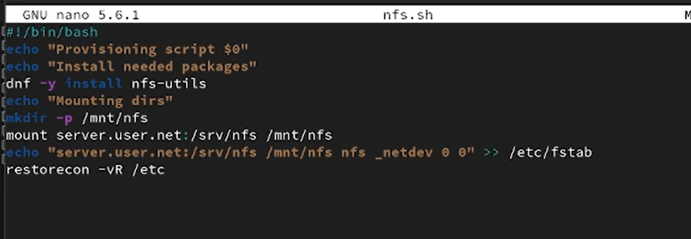{#fig-39 width=70%}

Таким образом, подготовлены сценарии автоматического развёртывания NFS-инфраструктуры для сервера и клиента, предназначенные для выполнения при загрузке виртуальных машин через механизм provisioning в Vagrantfile.

# Выводы

В ходе работы реализована конфигурация сервера и клиента NFSv4 с последующей автоматизацией развёртывания средствами Vagrant provisioning.

На сервере выполнена настройка экспорта каталогов, конфигурирование SELinux-контекстов типа `nfs_t`, настройка `firewalld`, организация bind-монтирования каталогов веб-сервера и пользовательского каталога, а также обеспечение их постоянного подключения через `/etc/fstab`.

На клиенте выполнено подключение удалённого ресурса, проверена корректность монтирования, реализовано автоматическое подключение при загрузке системы и подтверждена работоспособность механизма разграничения доступа на основе прав файловой системы.

Создание скриптов `nfs.sh` для сервера и клиента позволило формализовать и автоматизировать процесс настройки, обеспечив воспроизводимость конфигурации виртуальной инфраструктуры.

# Контрольные вопросы

1. Как называется файл конфигурации, содержащий общие ресурсы NFS?

`/etc/exports`

2. Какие порты должны быть открыты в брандмауэре, чтобы обеспечить полный доступ к серверу NFS?

Cледует открыть TCP и UDP порты 2049 в брандмауэре.

3. Какую опцию следует использовать в `/etc/fstab`, чтобы убедиться, что общие
ресурсы NFS могут быть установлены автоматически при перезагрузке?

Для автоматической установки общих ресурсов NFS при перезагрузке следует использовать опцию `auto` в `/etc/fstab`.

