---
## Author
author:
  name: Бахи сиди али темассини
  degrees: Student (3 курс)
  orcid: ""
  email: 1032234211@pfur.ru
  affiliation:
    - name: Российский университет дружбы народов
      country: Российская Федерация
      postal-code: 117198
      city: Москва
      address: ул. Миклухо-Маклая, д. 6

## Title
title: "Отчёт по лабораторной работе №14"
subtitle: "Дисциплина: Администрирование сетевых подсистем"
license: "CC BY"
---


# Цель работы

Приобретение навыков настройки доступа групп пользователей к общим ресурсам по протоколу SMB.

# Выполнение лабораторной работы

## Настройка сервера Samba

Выполнена установка необходимых пакетов Samba на сервере с использованием менеджера пакетов `dnf`, включая `samba`, `samba-client` и `cifs-utils`, что подтверждается успешным завершением транзакции установки ([рис. @fig-1]).

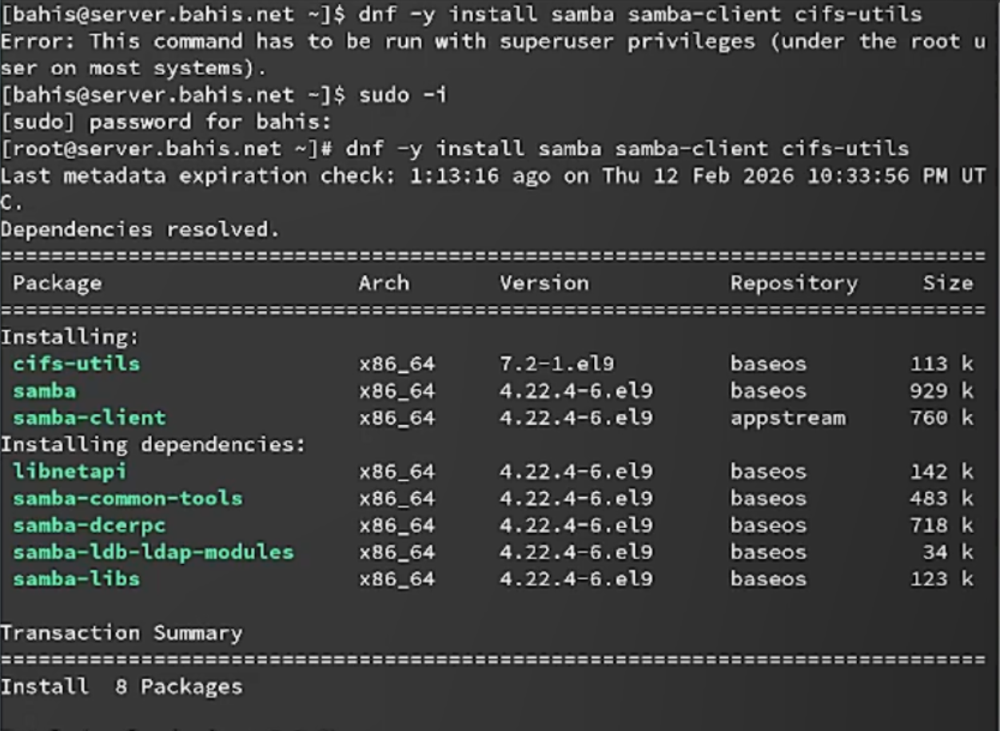{#fig-1 width=70%}

Создана группа `sambagroup` с идентификатором GID 1010 и пользователь `bahis` добавлен в данную группу. Также создан каталог общего доступа `/srv/sambashare` в файловой системе сервера ([рис. @fig-2]).

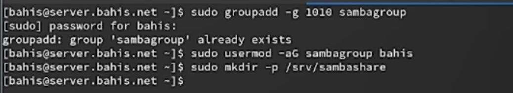{#fig-2 width=70%}

В конфигурационном файле `/etc/samba/smb.conf` изменён параметр `workgroup` в разделе `[global]` на `bahis-NET` и добавлен новый раздел `[sambashare]` с указанием пути `/srv/sambashare` и параметра `write list = @sambagroup`, определяющего список пользователей с правом записи ([рис. @fig-3]).

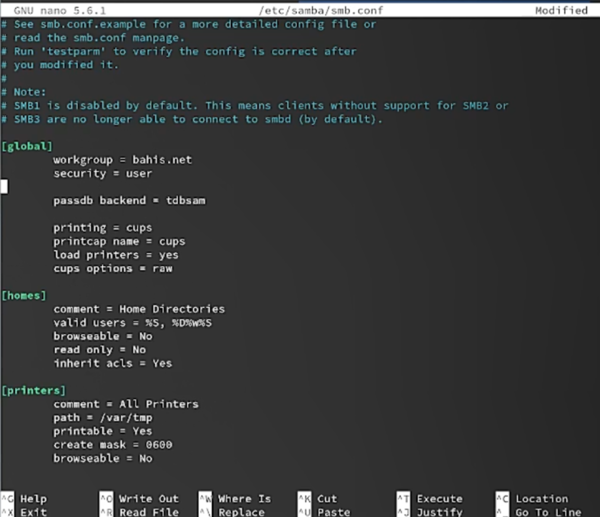{#fig-3 width=70%}

Проверена корректность синтаксиса файла конфигурации `smb.conf` с помощью команды `testparm`. Ошибки конфигурации не обнаружены, что подтверждает корректность настроек сервера Samba ([рис. @fig-4]).

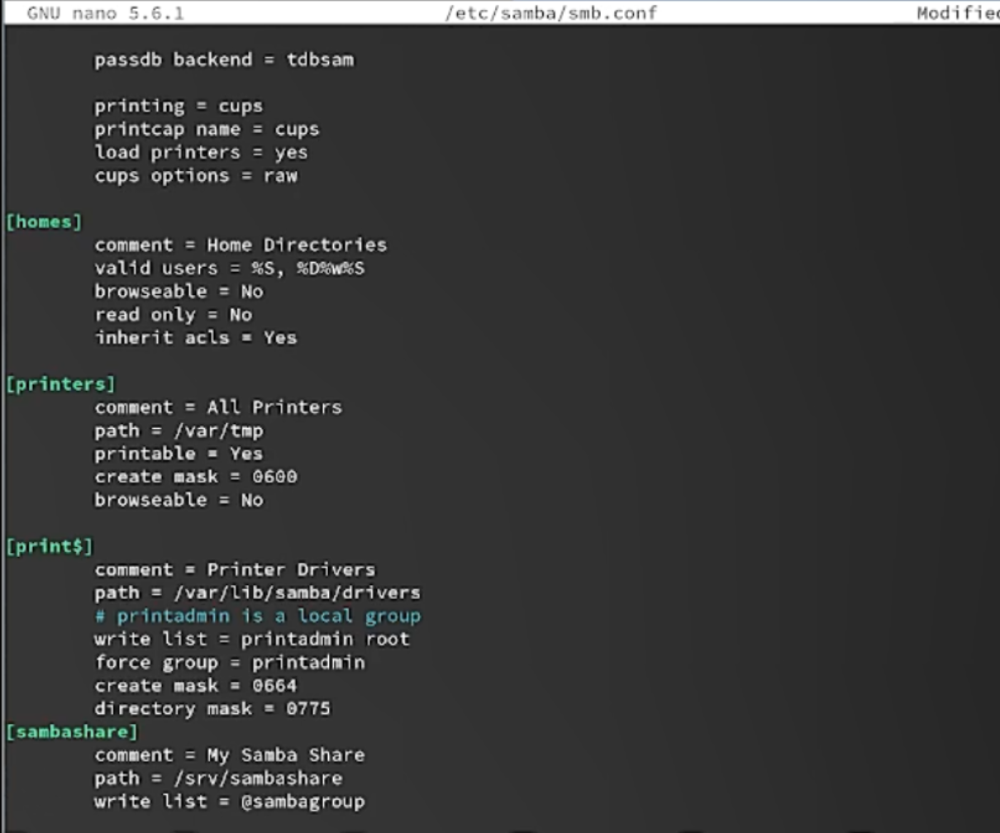{#fig-4 width=70%}

Запущена служба `smb`, выполнено её добавление в автозагрузку и проверен текущий статус. Служба находится в состоянии `active (running)`, что подтверждает успешный запуск демона Samba ([рис. @fig-5]).

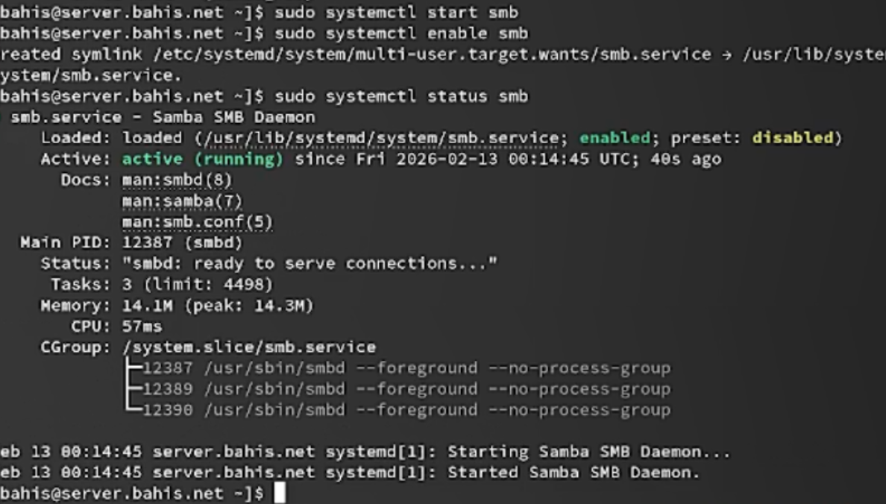{#fig-5 width=70%}

Для проверки доступности общего ресурса выполнена команда `smbclient -L //server`. В результате отображён список доступных ресурсов (`print$`, `sambashare`, `IPC$`), что подтверждает корректную публикацию общего каталога ([рис. @fig-6]).

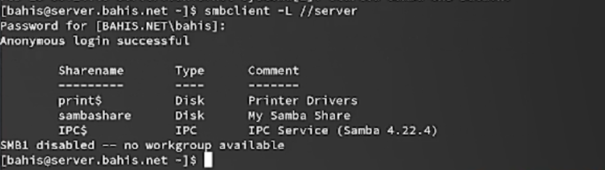{#fig-6 width=70%}

Просмотрен файл конфигурации службы Samba в межсетевом экране `/usr/lib/firewalld/services/samba.xml`, в котором указаны используемые порты TCP 139 и 445 ([рис. @fig-7]).

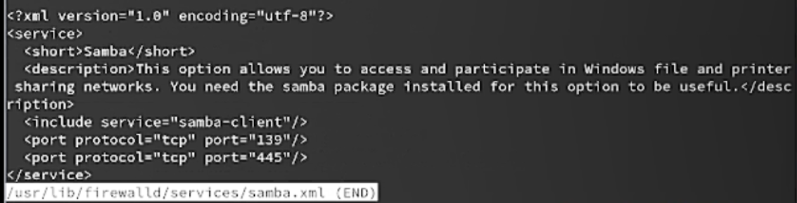{#fig-7 width=70%}

Выполнена настройка межсетевого экрана с добавлением службы `samba`, применением постоянного правила и перезагрузкой конфигурации `firewalld` ([рис. @fig-8]).

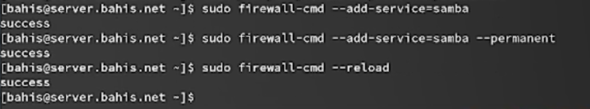{#fig-8 width=70%}

Настроены права доступа к каталогу `/srv/sambashare`: изменена групповая принадлежность на `sambagroup` и установлены права `g=rwx`. Проверен текущий контекст SELinux с помощью `ls -Z` ([рис. @fig-9]).

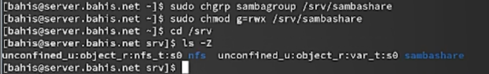{#fig-9 width=70%}

Назначен контекст безопасности SELinux `samba_share_t` для каталога `/srv/sambashare` с использованием `semanage fcontext`, после чего применены изменения командой `restorecon` ([рис. @fig-10]).

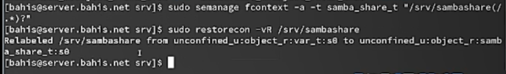{#fig-10 width=70%}

Проверено изменение контекста безопасности SELinux с помощью повторного выполнения `ls -Z`. Для каталога `sambashare` установлен тип `samba_share_t` ([рис. @fig-11]).

{#fig-11 width=70%}

Разрешён экспорт разделяемых ресурсов Samba для чтения и записи посредством установки булевого параметра SELinux `samba_export_all_rw` с временным и постоянным применением ([рис. @fig-12]).

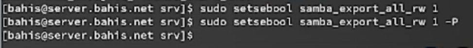{#fig-12 width=70%}

Определён идентификатор пользователя и его принадлежность к группам с помощью команды `id`. Пользователь `bahis` имеет UID 1001 и входит в группы `bahis`, `wheel` и `sambagroup`, что подтверждает его включение в группу доступа к Samba ([рис. @fig-13]).

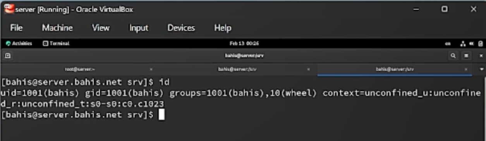{#fig-13 width=70%}

Под пользователем `bahis` выполнен переход в каталог `/srv/sambashare` и создан файл `bahis@server.txt`, что подтверждает наличие прав записи на разделяемый ресурс. Далее пользователь добавлен в базу пользователей Samba командой `smbpasswd -L -a bahis`, после чего учётная запись успешно создана ([рис. @fig-14]).

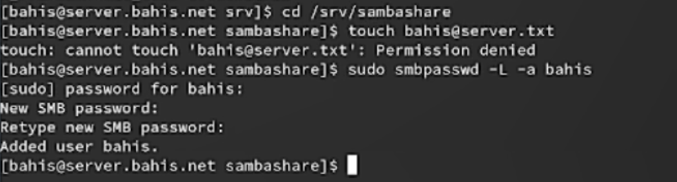{#fig-14 width=70%}

## Монтирование файловой системы Samba на клиенте

На клиенте установлены пакеты `samba-client` и `cifs-utils` с использованием `dnf`, что подтверждается успешным завершением транзакции установки ([рис. @fig-15]).

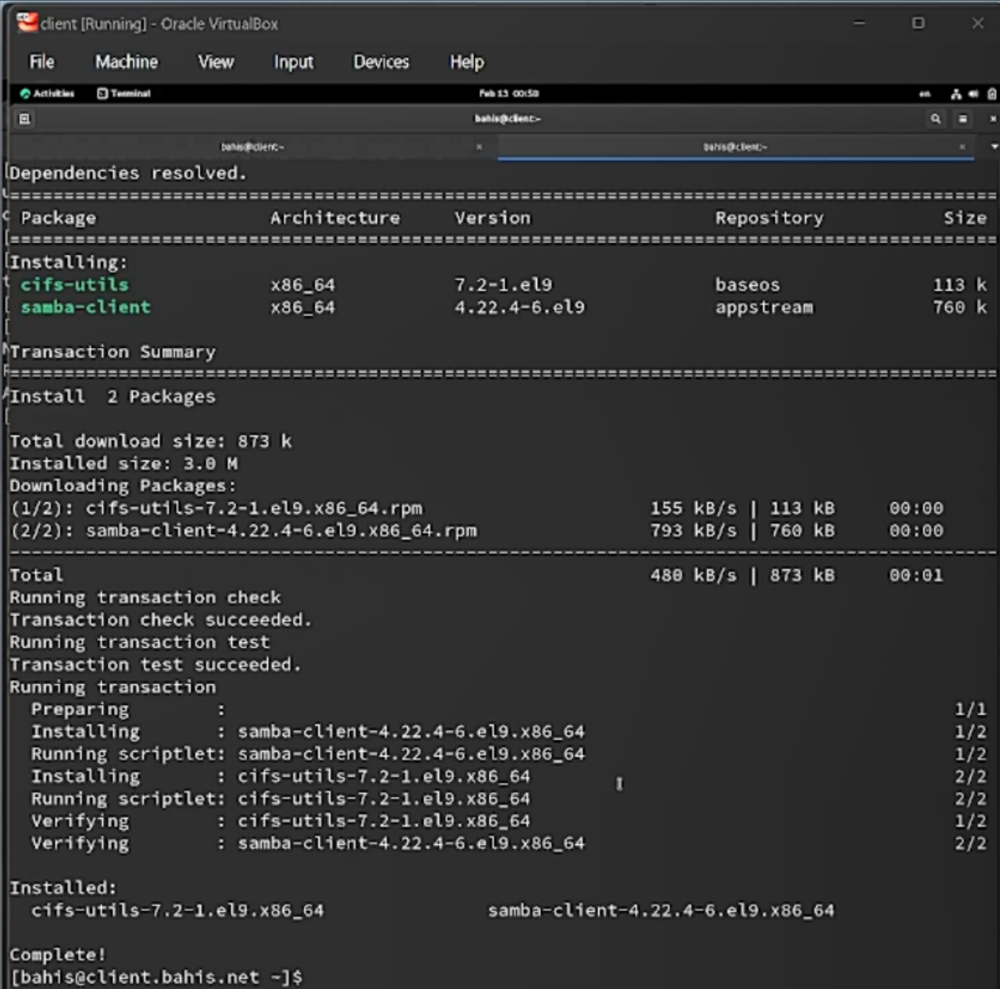{#fig-15 width=70%}

Просмотрен файл конфигурации межсетевого экрана `/usr/lib/firewalld/services/samba-client.xml`, после чего добавлена служба `samba-client`, правило сохранено как постоянное и выполнена перезагрузка `firewalld` ([рис. @fig-16]).

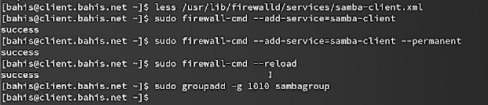{#fig-16 width=70%}

Создана группа `sambagroup` с GID 1010 и пользователь `bahis` добавлен в данную группу на стороне клиента ([рис. @fig-17]).

{#fig-17 width=70%}

В файле `/etc/samba/smb.conf` на клиенте изменён параметр `workgroup` в разделе `[global]` на `bahis-NET`, что обеспечивает соответствие рабочей группе сервера ([рис. @fig-18]).

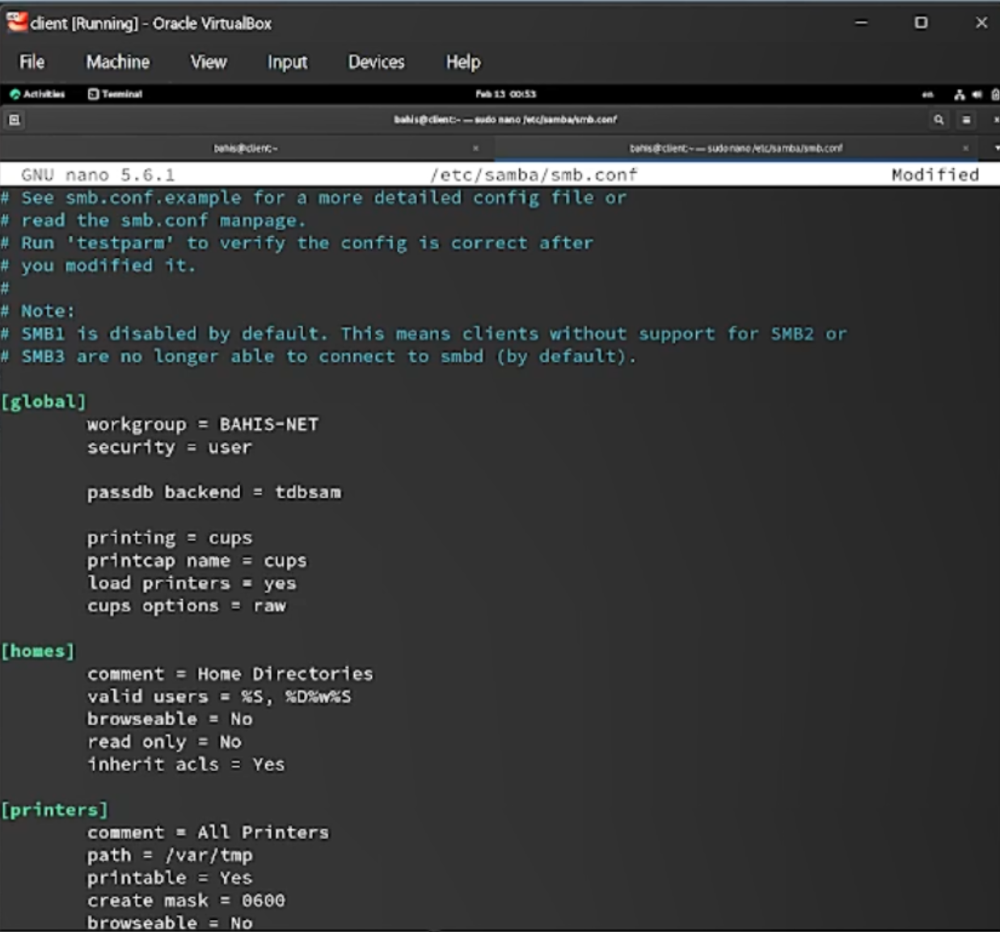{#fig-18 width=70%}

Выполнена проверка доступности общих ресурсов сервера командой `smbclient -L //server`. Просмотр ресурсов выполнен под анонимной учётной записью (после нажатия Enter при запросе пароля), что подтверждается сообщением `Anonymous login successful` ([рис. @fig-19]).

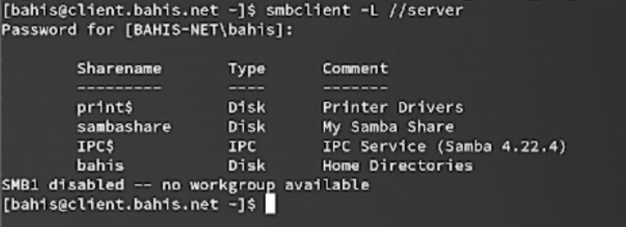{#fig-19 width=70%}

На клиенте создана точка монтирования `/mnt/samba`, после чего выполнено подключение общего ресурса `//server/sambashare` с использованием команды `mount` и указанием параметров `username`, `uid`, `gid` и прав доступа. Аутентификация выполнена под пользователем `bahis` ([рис. @fig-20]).

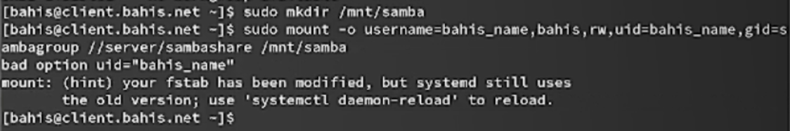{#fig-20 width=70%}

Проверена возможность записи в разделяемый ресурс: выполнен переход в каталог `/mnt/samba` и создан файл `bahis@client.txt`, что подтверждает наличие прав записи. После этого ресурс размонтирован командой `umount` ([рис. @fig-21]).

{#fig-21 width=70%}

Для автоматической аутентификации создан файл `/etc/samba/smbusers` с правами доступа `600`, содержащий имя пользователя и пароль SMB (`username=bahis`, `password=123456`) ([рис. @fig-23]).

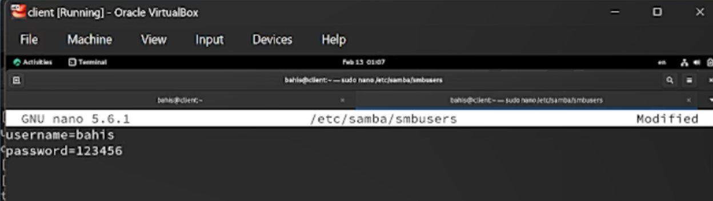{#fig-23 width=70%}

В файл `/etc/fstab` добавлена строка для автоматического монтирования ресурса `//server/sambashare` в каталог `/mnt/samba` с использованием типа файловой системы `cifs`, указанием `uid=bahis`, `gid=sambagroup`, файла учётных данных и параметра `_netdev` ([рис. @fig-24]).

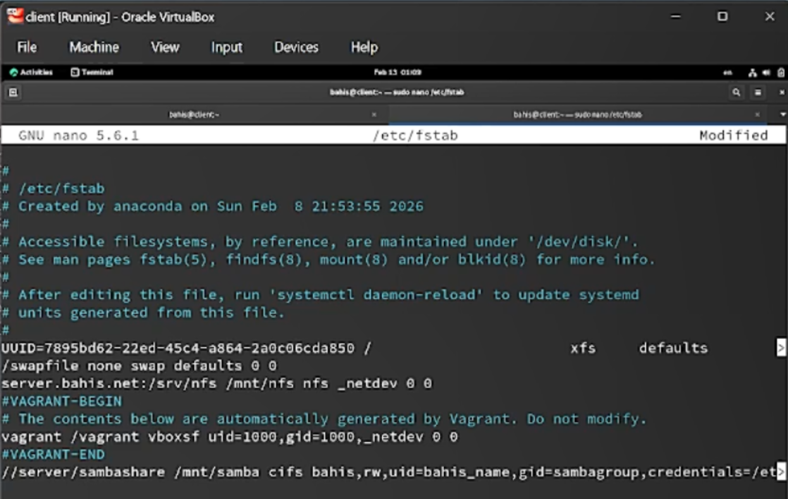{#fig-24 width=70%}

Выполнена команда `mount -a` для применения конфигурации из `/etc/fstab`, что инициировало повторное монтирование ресурса ([рис. @fig-25]).

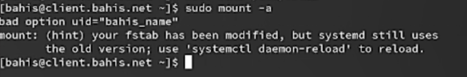{#fig-25 width=70%}

Проверено наличие смонтированного ресурса в каталоге `/mnt`, где отображается каталог `samba`, что подтверждает успешное подключение общего ресурса ([рис. @fig-26]).

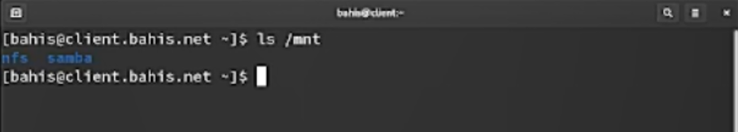{#fig-26 width=70%}

##  Внесение изменений в настройки внутреннего

На виртуальной машине **server** выполнен переход в каталог `/vagrant/provision/server`, создан каталог `smb/etc/samba` и скопирован файл конфигурации `smb.conf` для последующего использования в процессе автоматической настройки ([рис. @fig-27]).

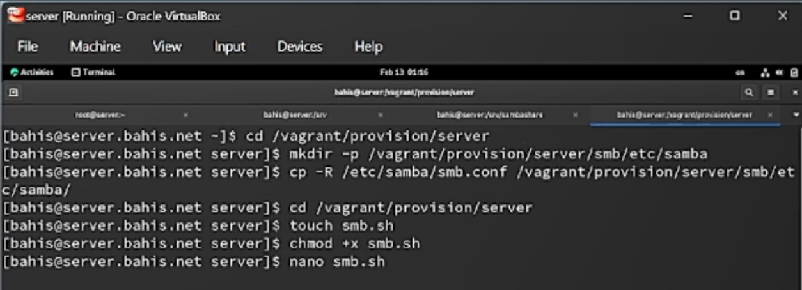{#fig-27 width=70%}

В каталоге `/vagrant/provision/server` создан исполняемый файл `smb.sh`, в котором реализован скрипт автоматической установки пакетов Samba, копирования конфигурации, настройки firewall, создания группы `sambagroup`, добавления пользователя `bahis`, настройки SELinux и запуска службы `smb` ([рис. @fig-28]).

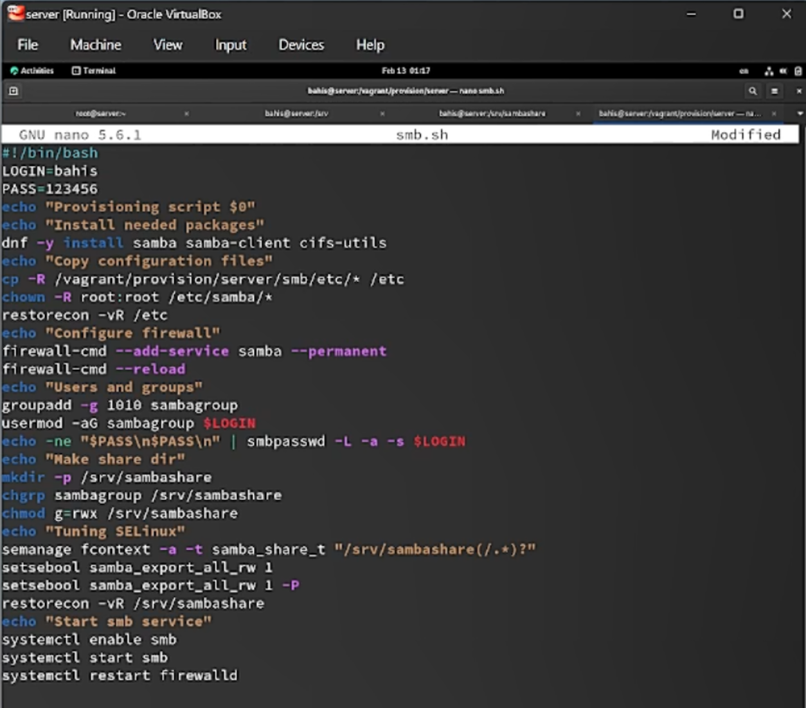{#fig-28 width=70%}

На виртуальной машине **client** выполнен переход в каталог `/vagrant/provision/client`, создан каталог `smb/etc/samba` и скопированы файлы `smb.conf` и `smbusers` для последующей автоматической конфигурации ([рис. @fig-29]).

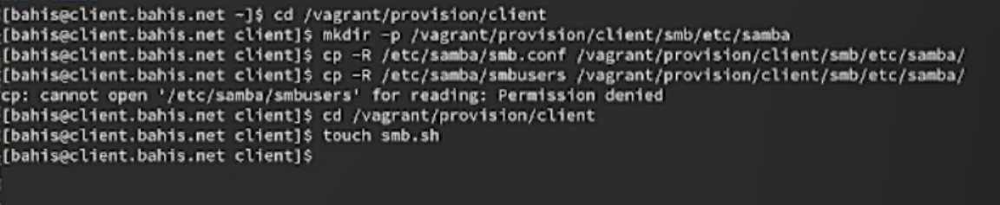{#fig-29 width=70%}

В каталоге `/vagrant/provision/client` создан исполняемый файл `smb.sh`, содержащий команды установки пакетов `samba-client` и `cifs-utils`, настройки firewall, создания группы `sambagroup`, добавления пользователя `bahis`, добавления записи в `/etc/fstab` и монтирования ресурса `/mnt/samba` ([рис. @fig-30]).

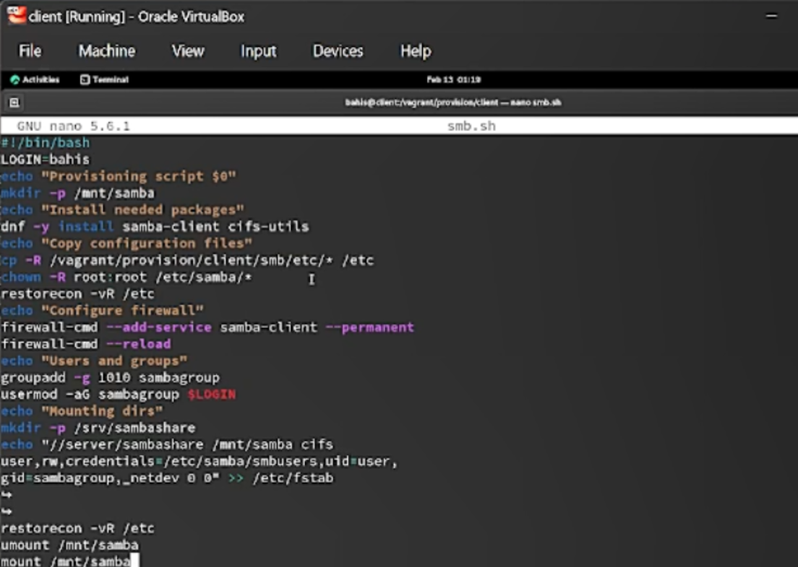{#fig-30 width=70%}

В конфигурационном файле `Vagrantfile` для виртуальной машины **server** добавлен provision-блок типа `shell` с указанием пути `provision/server/smb.sh` для автоматического выполнения скрипта при запуске машины ([рис. @fig-31]).

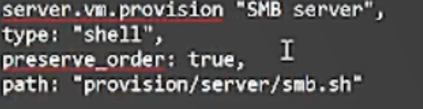{#fig-31 width=70%}

Аналогичный provision-блок добавлен для виртуальной машины **client** с указанием пути `provision/client/smb.sh`, что обеспечивает автоматическую настройку клиента при загрузке ([рис. @fig-32]).

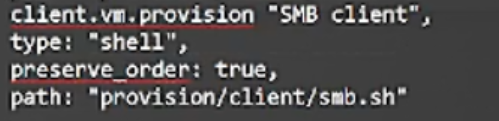{#fig-32 width=70%}


# Выводы

В ходе работы выполнена полная настройка сервера и клиента Samba с обеспечением совместного доступа к каталогу `/srv/sambashare`. На сервере произведена установка необходимых пакетов, настроена конфигурация `smb.conf`, создана группа `sambagroup`, добавлен пользователь `bahis`, настроены права доступа и контекст безопасности SELinux, разрешён экспорт ресурсов и запущена служба `smb`.

На клиенте выполнена установка пакетов `samba-client` и `cifs-utils`, настроен межсетевой экран, обеспечено соответствие рабочей группы, реализовано подключение к ресурсу с использованием `smbclient` и монтирование через `mount` и `/etc/fstab` с применением файла учётных данных.

Дополнительно реализована автоматизация конфигурации через provisioning-скрипты `smb.sh` для виртуальных машин server и client, подключённые в `Vagrantfile`. Это обеспечивает воспроизводимость настройки при загрузке виртуальных машин.

Работоспособность системы подтверждена успешным подключением к общему ресурсу и возможностью записи файлов с клиента на сервер.


# Контрольные вопросы

1. Какова минимальная конфигурация для `smb.conf` для создания общего ресурса, который предоставляет доступ к каталогу `/data`?

Минимальная конфигурация для `smb.conf` может включать следующие параметры:
```
[data]
path = /data
browsable = yes
read only = no
```

2. Как настроить общий ресурс, который даёт доступ на запись всем пользователям, имеющим права на запись в файловой системе Linux?

Для этого нужно установить параметр `read only = no`. Пример:
```
[data]
path = /data
browsable = yes
read only = no
```

3. Как ограничить доступ на запись к ресурсу только членам определённой группы?

Используйте параметр `write list`. Пример:
```
[data]
path = /data
browsable = yes
read only = yes
write list = @groupname
```

4. Какой переключатель SELinux нужно использовать, чтобы позволить пользователям получать доступ к домашним каталогам на сервере через SMB?

Необходимо включить переключатель `samba_enable_home_dirs` с помощью команды `setsebool -P samba_enable_home_dirs on`.

5. Как ограничить доступ к определённому ресурсу только узлам из сети 192.168.10.0/24?

Используйте параметр `hosts allow`. Пример:
```
[data]
path = /data
browsable = yes
read only = no
hosts allow = 192.168.10.
```

6. Какую команду можно использовать, чтобы отобразить список всех пользователей Samba на сервере?

Для этого используется команда `pdbedit -L`.

7. Что нужно сделать пользователю для доступа к ресурсу, который настроен как многопользовательский ресурс?

Пользователю необходимо иметь учётную запись Samba и соответствующие права доступа к ресурсу.

8. Как установить общий ресурс Samba в качестве многопользовательской учётной записи, где пользователь alice используется как минимальная учётная запись пользователя?

Для этого используется параметр `force user = alice`.

9. Как можно запретить пользователям просматривать учётные данные монтирования Samba в файле `/etc/fstab`?

Для этого используется параметр `credentials`, который позволяет хранить учётные данные в отдельном файле с ограниченным доступом. В файле `/etc/fstab` можно указать:
```
/mountpoint smbfs credentials=/path/to/credentials_file 0 0
```
Файл с учётными данными должен быть доступен только владельцу: `chmod 600 /path/to/credentials_file`

10. Какая команда позволяет перечислить все экспортируемые ресурсы Samba, доступные на определённом сервере?

Для этого используется команда `smbclient` с параметром -L и указанием имени сервера: `smbclient -L //server_address -U username`
