---
## Author
author:
  name: Бахи сиди али темассини
  degrees: Student (3 курс)
  orcid: ""
  email: 1032234211@pfur.ru
  affiliation:
    - name: Российский университет дружбы народов
      country: Российская Федерация
      postal-code: 117198
      city: Москва
      address: ул. Миклухо-Маклая, д. 6

## Title
title: "Отчёт по лабораторной работе №15"
subtitle: "Дисциплина: Администрирование сетевых подсистем"
license: "CC BY"
---


# Цель работы

Получение навыков по работе с журналами системных событий.

# Выполнение лабораторной работы

##  Настройка сервера сетевого журнала

В каталоге `/etc/rsyslog.d` на сервере создан файл конфигурации `netlog-server.conf` для настройки сетевого хранения журналов ([рис. @fig-1]).
Команды `cd /etc/rsyslog.d` и `touch netlog-server.conf` обеспечивают размещение и создание нового конфигурационного файла.

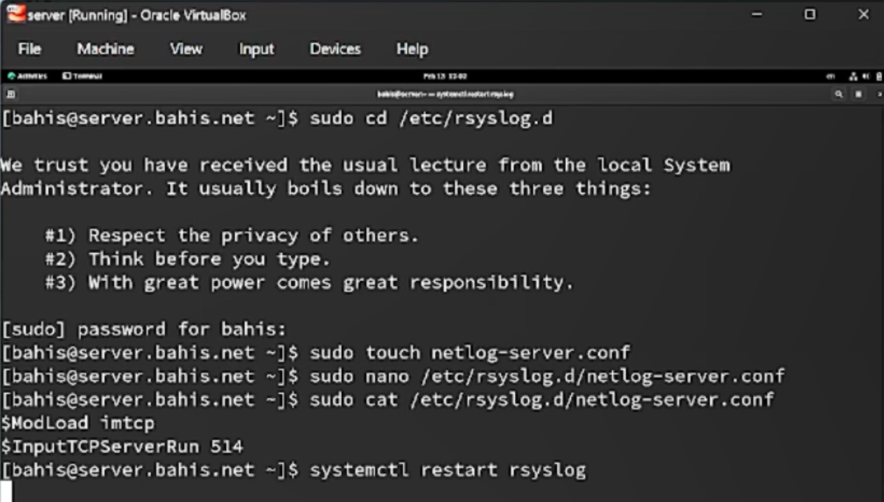{#fig-1 width=70%}

В файле `/etc/rsyslog.d/netlog-server.conf` включён приём журналов по TCP-порту 514 посредством загрузки модуля `imtcp` и активации сервера ввода (`$ModLoad imtcp`, `$InputTCPServerRun 514`) ([рис. @fig-2]).
Данные директивы активируют обработку входящих TCP-соединений службой rsyslog.

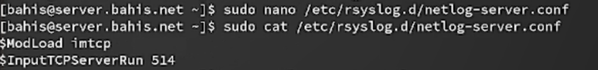{#fig-2 width=70%}

После перезапуска службы `rsyslog` выполнена проверка прослушиваемых TCP-портов с использованием `lsof | grep TCP` ([рис. @fig-3]).
В выводе отображается процесс `rsyslog`, находящийся в состоянии LISTEN, что подтверждает активацию TCP-приёма.

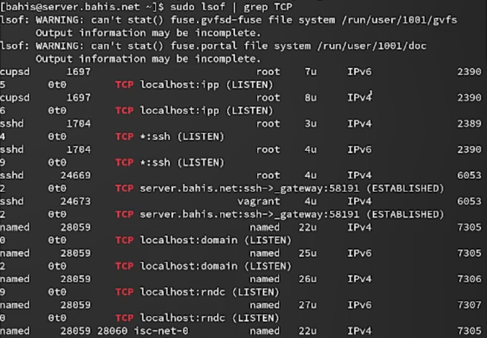{#fig-3 width=70%}

На сервере настроен межсетевой экран для разрешения входящих соединений по TCP-порту 514 с помощью команд `firewall-cmd --add-port=514/tcp` и `firewall-cmd --add-port=514/tcp --permanent` ([рис. @fig-4]).
Это обеспечивает как временное, так и постоянное открытие порта для приёма сетевых сообщений журнала.

{#fig-4 width=70%}

## Настройка клиента сетевого журнала

В каталоге `/etc/rsyslog.d` на клиенте создан файл конфигурации `netlog-client.conf` для настройки сетевой отправки журналов ([рис. @fig-5]).
Команды `cd /etc/rsyslog.d` и `touch netlog-client.conf` обеспечивают размещение и создание конфигурационного файла клиента.

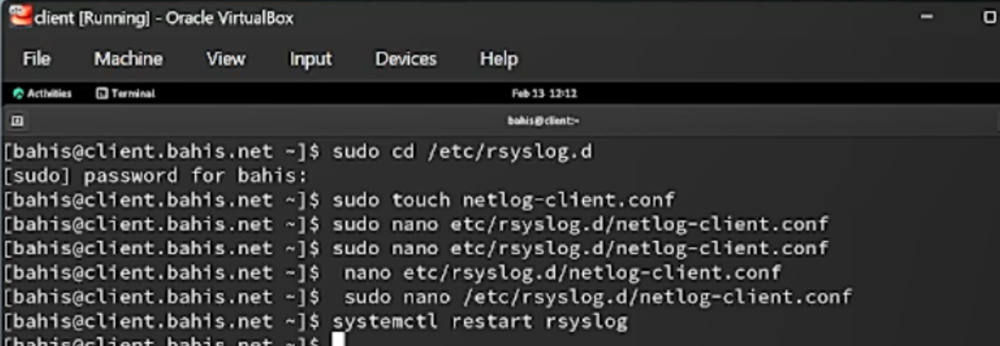{#fig-5 width=70%}

В файле `/etc/rsyslog.d/netlog-client.conf` настроено перенаправление всех сообщений журнала на TCP-порт 514 сервера с использованием строки `*.* @@server.bahis.net:514` ([рис. @fig-6]).
Символы `@@` указывают на передачу сообщений по протоколу TCP.

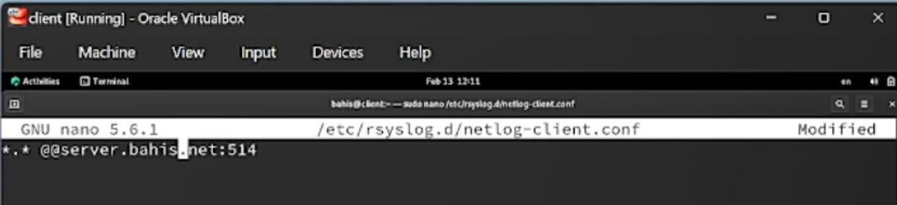{#fig-6 width=70%}

После внесения изменений выполнен перезапуск службы `rsyslog` командой `systemctl restart rsyslog`, что применяет новую конфигурацию клиента.

## Просмотр журнала

На сервере выполнен просмотр файла системного журнала `/var/log/messages` с использованием команды `tail -f` ([рис. @fig-7]).
В выводе отображаются сообщения служб `rsyslog`, `systemd`, а также указаны имена хостов `client` и `server`, что подтверждает поступление удалённых записей журнала.

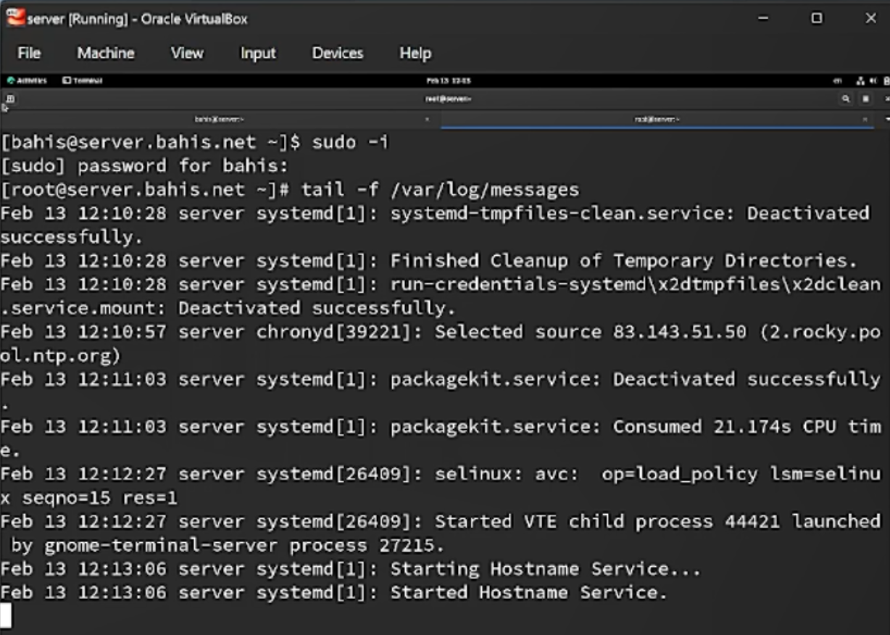{#fig-7 width=70%}

Под пользователем `bahis` на сервере запущена графическая программа мониторинга системы `gnome-system-monitor` ([рис. @fig-8]).
Интерфейс отображает активные процессы, их идентификаторы, использование CPU и памяти.

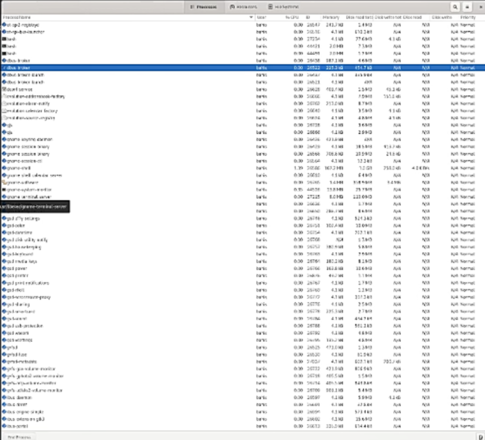{#fig-8 width=70%}

На сервере установлен просмотрщик системных журналов `lnav` с помощью пакетного менеджера `dnf` ([рис. @fig-9]).
В выводе подтверждена успешная установка пакета версии `0.11.1-1.el9` из репозитория `epel`.

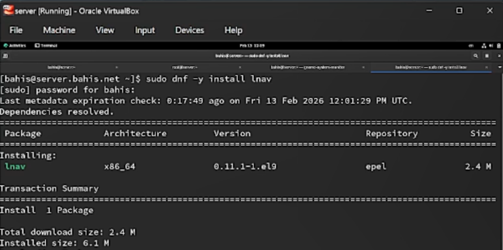{#fig-9 width=70%}

Просмотр журналов на сервере выполнен с использованием `lnav` ([рис. @fig-10]).
В интерфейсе отображаются записи как локального сервера, так и клиента, включая сообщения служб `systemd`, `rsyslog`, `cupsd` и других.

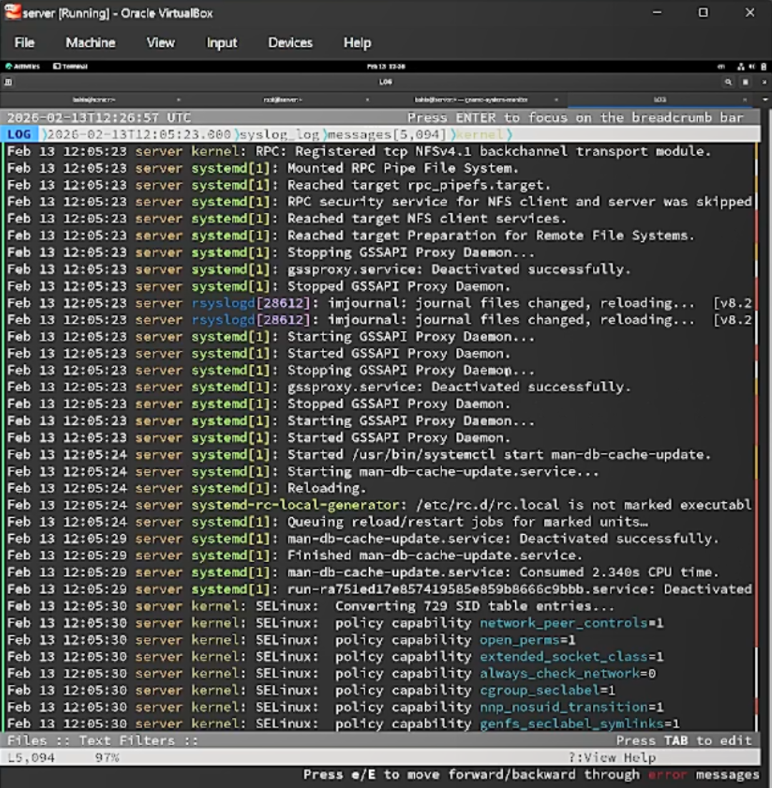{#fig-10 width=70%}


На клиенте выполнен просмотр системных журналов с помощью `lnav` ([рис. @fig-12]).
В журнале отображаются записи служб клиента (`systemd`, `rsyslog`, `packagekit`), что подтверждает корректную работу локального логирования и передачу сообщений на сервер.

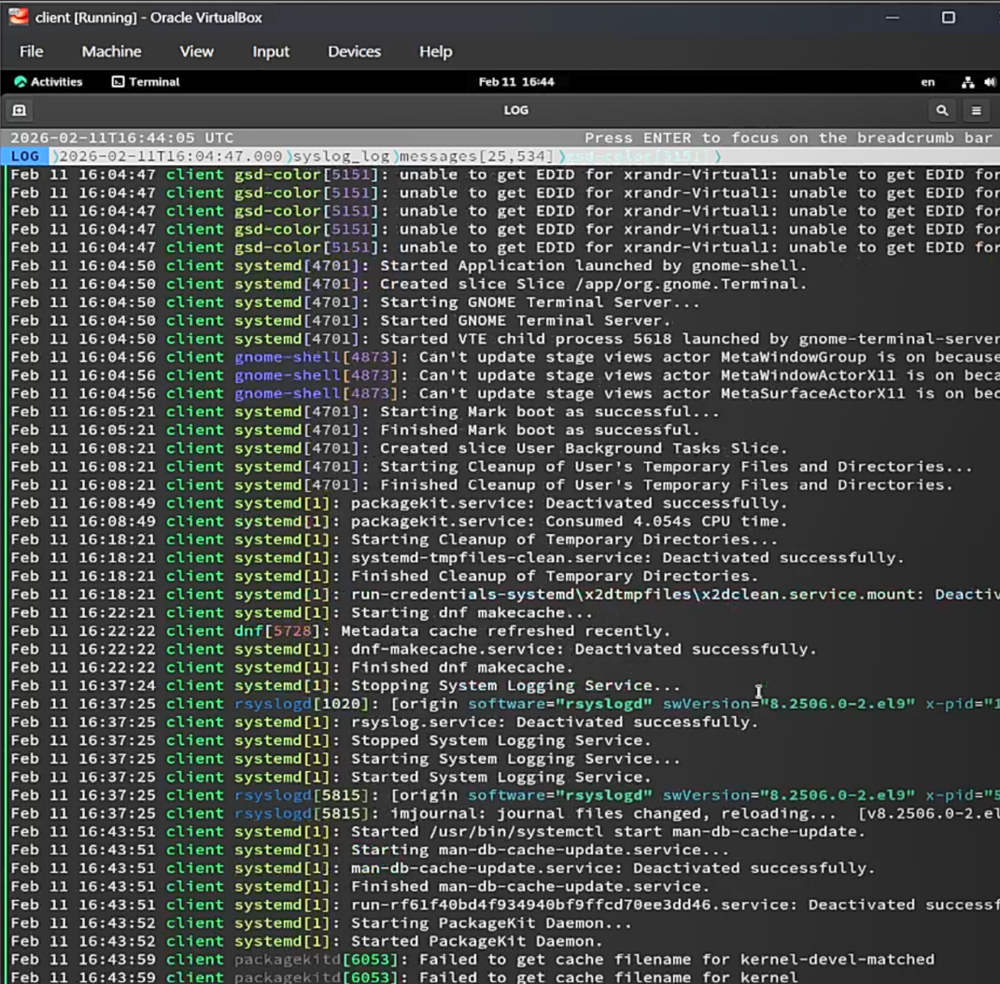{#fig-12 width=70%}

## Внесение изменений в настройки внутреннего

На виртуальной машине `server` выполнен переход в каталог `/vagrant/provision/server`, создан каталог `netlog/etc/rsyslog.d` и скопирован файл конфигурации `netlog-server.conf` для последующего автоматического развёртывания ([рис. @fig-13]).
Команды `mkdir -p` и `cp -R` обеспечивают формирование структуры каталогов и размещение конфигурационного файла в директории provisioning.

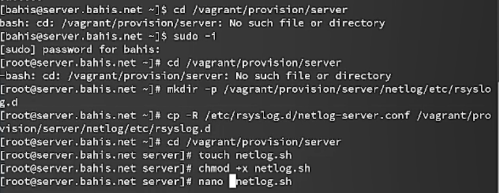{#fig-13 width=70%}

В каталоге `/vagrant/provision/server` создан исполняемый скрипт `netlog.sh`, которому назначены права выполнения, и в него добавлен сценарий автоматической настройки ([рис. @fig-14]).
Скрипт выполняет копирование конфигурационных файлов в `/etc`, восстановление контекстов SELinux (`restorecon -vR /etc`), открытие TCP-порта 514 в `firewalld` и перезапуск службы `rsyslog`, что обеспечивает автоматизацию настройки сетевого журнала.

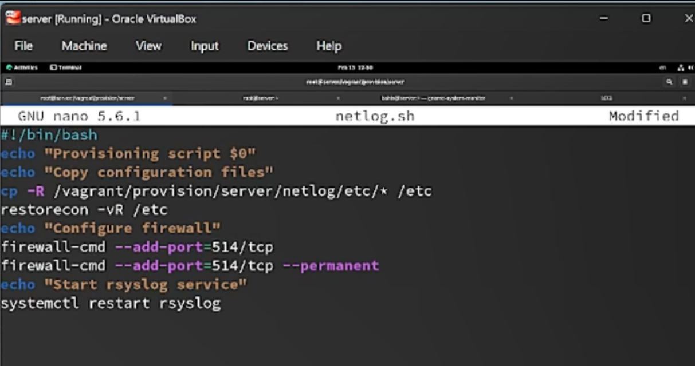{#fig-14 width=70%}

На виртуальной машине `client` выполнен переход в каталог `/vagrant/provision/client`, создан каталог `netlog/etc/rsyslog.d` и скопирован файл конфигурации `netlog-client.conf` для последующего автоматического развёртывания ([рис. @fig-15]).
Команды `mkdir -p` и `cp -R` обеспечивают формирование структуры каталогов и размещение конфигурационного файла клиента.

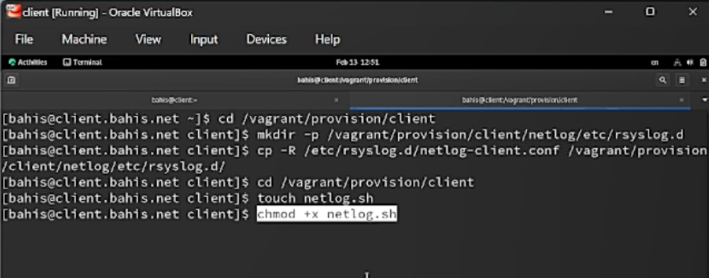{#fig-15 width=70%}

В каталоге `/vagrant/provision/client` создан исполняемый файл `netlog.sh`, которому назначены права выполнения, и в него добавлен сценарий автоматической настройки клиента ([рис. @fig-16]).
Скрипт выполняет установку пакета `lnav`, копирование конфигурационных файлов в `/etc`, восстановление контекстов SELinux и перезапуск службы `rsyslog`.

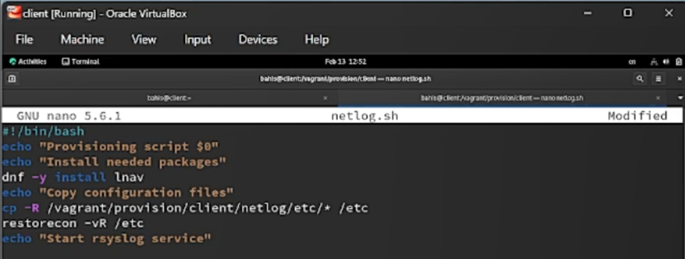{#fig-16 width=70%}

В конфигурационном файле `Vagrantfile` в разделе сервера добавлен блок автоматического выполнения скрипта `provision/server/netlog.sh` при загрузке виртуальной машины ([рис. @fig-17]).
Параметр `preserve_order: true` обеспечивает сохранение последовательности выполнения provisioning-скриптов.

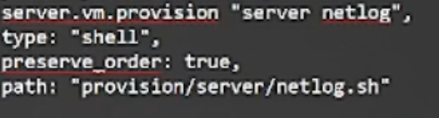{#fig-17 width=70%}

Аналогичный блок добавлен в разделе клиента для автоматического запуска скрипта `provision/client/netlog.sh` при старте виртуальной машины ([рис. @fig-18]).
Это обеспечивает применение настроек сетевого журналирования на обеих машинах при их инициализации.

{#fig-18 width=70%}


# Выводы


В ходе работы выполнена настройка централизованного сетевого журналирования на базе `rsyslog` с использованием TCP-порта 514. На сервере организован приём журналов по протоколу TCP и настроено разрешение соответствующего порта в межсетевом экране. На клиенте реализовано перенаправление всех сообщений журнала на сервер.

Корректность конфигурации подтверждена просмотром файла `/var/log/messages`, где зафиксированы записи как локального сервера, так и удалённого клиента. Использование утилиты `lnav` позволило проанализировать системные сообщения в удобном интерактивном режиме.

Дополнительно реализована автоматизация развёртывания конфигурации посредством provisioning-скриптов `netlog.sh` и интеграции их в `Vagrantfile`, что обеспечивает воспроизводимость и автоматическое применение настроек при запуске виртуальных машин.

Таким образом, создана функционирующая система централизованного сбора и анализа системных журналов.


# Ответы на контрольные вопросы

1. Какой модуль `rsyslog` вы должны использовать для приёма сообщений от
`journald`?

Для приёма сообщений от `journald` следует использовать модуль `imjournal`.

2. Как называется устаревший модуль, который можно использовать для включения приёма сообщений журнала в `rsyslog`?

`imklog`

3. Чтобы убедиться, что устаревший метод приёма сообщений из `journald` в `rsyslog` не используется, какой дополнительный параметр следует использовать?

Cледует использовать параметр `“SystemCallFilter[include:omusrmsg.conf?]”` в конфигурационном файле `rsyslog.conf`.

4. В каком конфигурационном файле содержатся настройки, которые позволяют вам настраивать работу журнала?

Настройки, позволяющие настраивать работу журнала, содержатся в конфигурационном файле `rsyslog.conf`.

5. Каким параметром управляется пересылка сообщений из journald в rsyslog?

Пересылка сообщений из `journald` в `rsyslog` управляется параметром `“ForwardToSyslog”` в файле конфигурации `journald.conf`.

6. Какой модуль rsyslog вы можете использовать для включения сообщений из файла журнала, не созданного rsyslog?

Модуль `rsyslog`, который можно использовать для включения сообщений из файла журнала, не созданного `rsyslog`, называется `imfile`.

7. Какой модуль rsyslog вам нужно использовать для пересылки сообщений в базу данных MariaDB?

Для пересылки сообщений в базу данных MariaDB следует использовать модуль `ommysql`.

8. Какие две строки вам нужно включить в rsyslog.conf, чтобы позволить текущему журнальному серверу получать сообщения через TCP?

Для позволения текущему журнальному серверу получать сообщения через TCP нужно включить две строки в `rsyslog.conf`:
```
$ModLoad imtcp 
$InputTCPServerRun 514
```

9. Как настроить локальный брандмауэр, чтобы разрешить приём сообщений журнала через порт TCP 514?

```
firewall-cmd --add-port=514/tcp
firewall-cmd --add-port=514/tcp --permanent

```