---
## Author
author:
  name: Бахи сиди али темассини
  degrees: Student (3 курс)
  orcid: ""
  email: 1032234211@pfur.ru
  affiliation:
    - name: Российский университет дружбы народов
      country: Российская Федерация
      postal-code: 117198
      city: Москва
      address: ул. Миклухо-Маклая, д. 6

## Title
title: "Отчёт по лабораторной работе №16"
subtitle: "Дисциплина: Администрирование сетевых подсистем"
license: "CC BY"
---


# Цель работы

Получить навыки работы с программным средством Fail2ban для обеспечения базовой защиты от атак типа «brute force».

# Выполнение лабораторной работы

##  Защита с помощью Fail2ban

### Установка Fail2ban

На сервере выполнена установка пакета `fail2ban` с использованием менеджера пакетов `dnf`. В процессе установки также автоматически установлены зависимости: `fail2ban-firewalld`, `fail2ban-selinux`, `fail2ban-sendmail`, `fail2ban-server`. Установка выполнена из репозитория `epel` ([рис. @fig-1]).

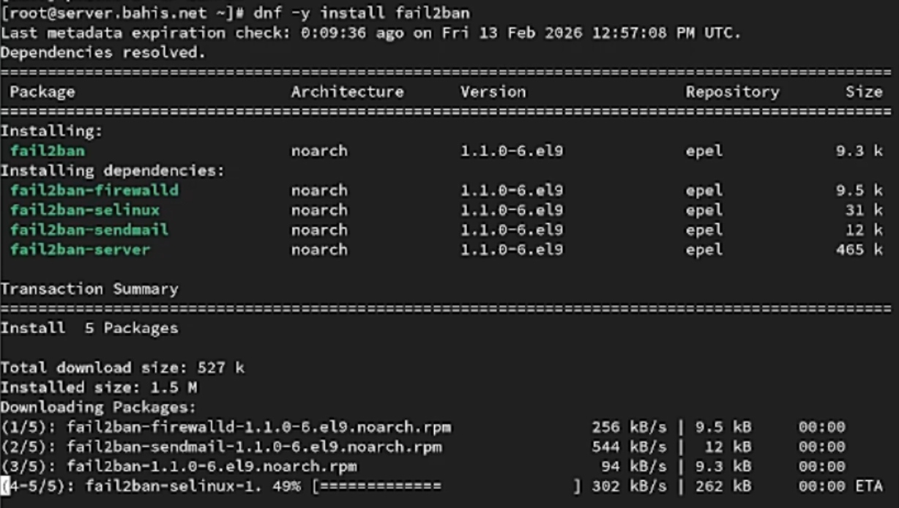{#fig-1 width=70%}


### Запуск и добавление службы в автозагрузку

После установки выполнен запуск службы `fail2ban` командой `systemctl start fail2ban`, затем служба добавлена в автозагрузку командой `systemctl enable fail2ban`. Создана символическая ссылка в каталоге `multi-user.target.wants`, что подтверждает корректную регистрацию службы в системе ([рис. @fig-2]).

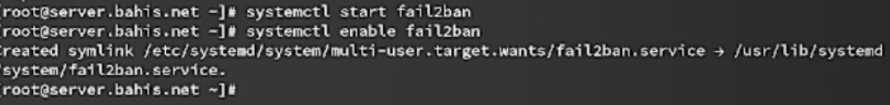{#fig-2 width=70%}


### Контроль журнала событий Fail2ban

В дополнительном терминале выполнен мониторинг журнала `/var/log/fail2ban.log` с помощью команды `tail -f`. В журнале зафиксирован запуск сервера Fail2ban версии 1.1.0, инициализация observer и создание новой базы данных `fail2ban.sqlite3` ([рис. @fig-3]).

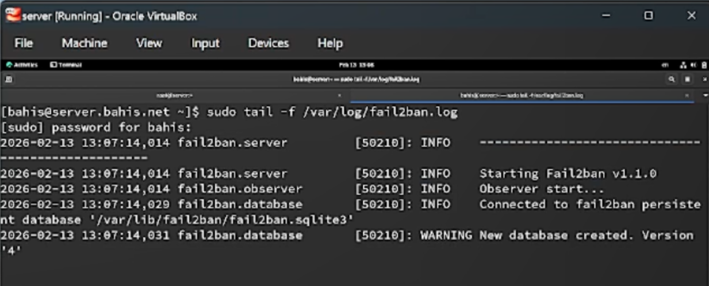{#fig-3 width=70%}


### Создание файла локальной конфигурации

Создан файл локальной конфигурации `/etc/fail2ban/jail.d/customisation.local` с использованием команды `touch`, после чего выполнено его редактирование в текстовом редакторе `nano` ([рис. @fig-5]).

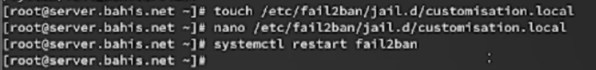{#fig-5 width=70%}


### Настройка параметров блокирования и защиты SSH

В файле `/etc/fail2ban/jail.d/customisation.local` заданы параметры:

* В секции `[DEFAULT]` установлено время блокировки `bantime = 3600` секунд (1 час).
* Включена защита SSH в секциях `[sshd]`, `[sshd-ddos]`, `[selinux-ssh]`.
* Для `sshd` указан порт `ssh,2022`.
* Для всех перечисленных служб установлен параметр `enabled = true` ([рис. @fig-4]).

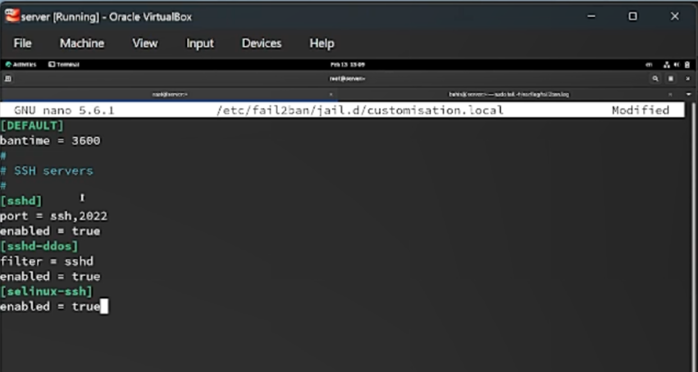{#fig-4 width=70%}


### Перезапуск службы Fail2ban

После внесения изменений выполнен перезапуск службы командой `systemctl restart fail2ban`, что обеспечивает применение новой конфигурации ([рис. @fig-5]).

{#fig-5 width=70%}

### Просмотр журнала событий Fail2ban

После перезапуска службы выполнен мониторинг журнала `/var/log/fail2ban.log`. В журнале зафиксирована инициализация backend `pyinotify`, параметры `maxLines`, `maxRetry`, `findtime`, `banTime = 3600`, а также запуск jail-модулей `sshd`, `selinux-ssh`, `sshd-ddos` ([рис. @fig-6]).

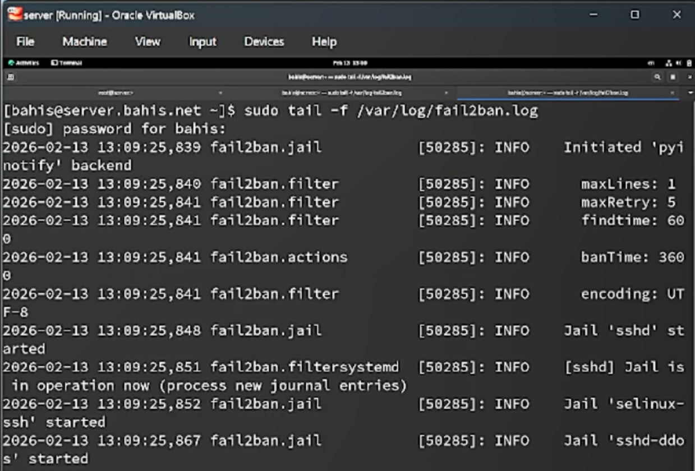{#fig-6 width=70%}


### Включение защиты HTTP

В файле `/etc/fail2ban/jail.d/customisation.local` активированы jail-модули для HTTP-сервера Apache:
`apache-auth`, `apache-badbots`, `apache-noscript`, `apache-overflows`, `apache-nohome`, `apache-botsearch`, `apache-fakegooglebot`, `apache-modsecurity`, `apache-shellshock`.
Для каждого модуля установлен параметр `enabled = true` ([рис. @fig-7]).

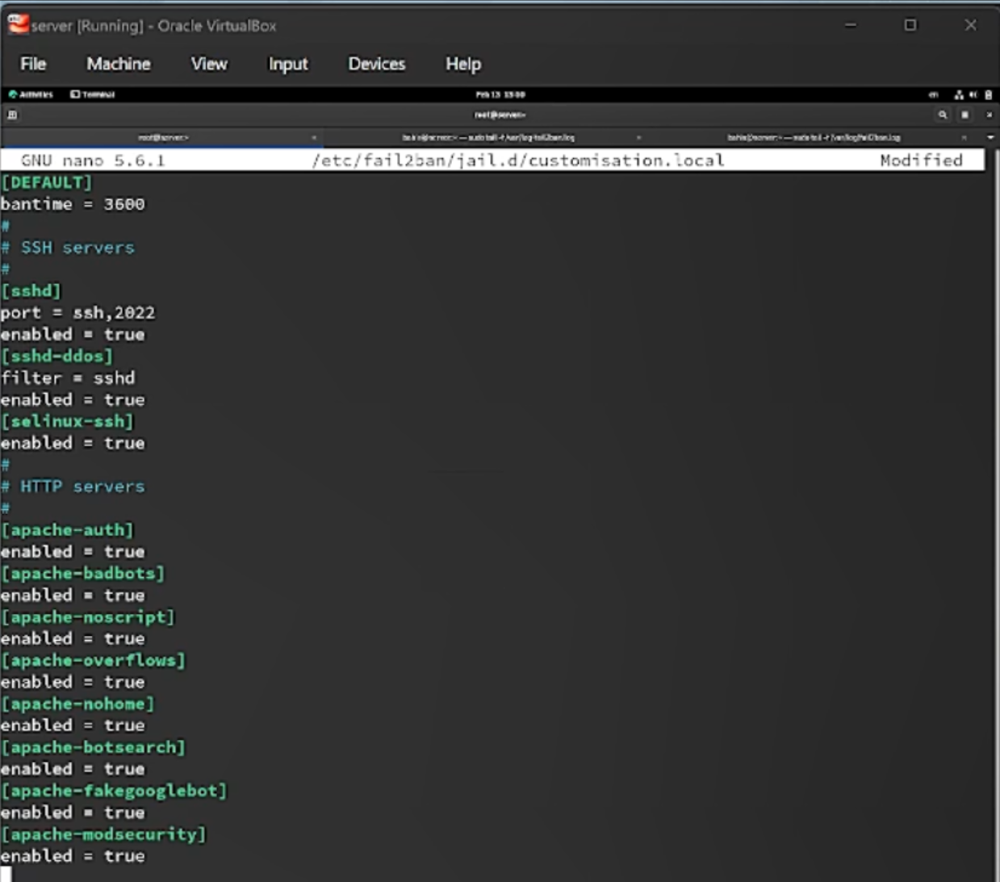{#fig-7 width=70%}


### Перезапуск Fail2ban после настройки HTTP

После внесения изменений выполнен перезапуск службы `systemctl restart fail2ban`, что обеспечило загрузку новых jail-настроек ([рис. @fig-8]).

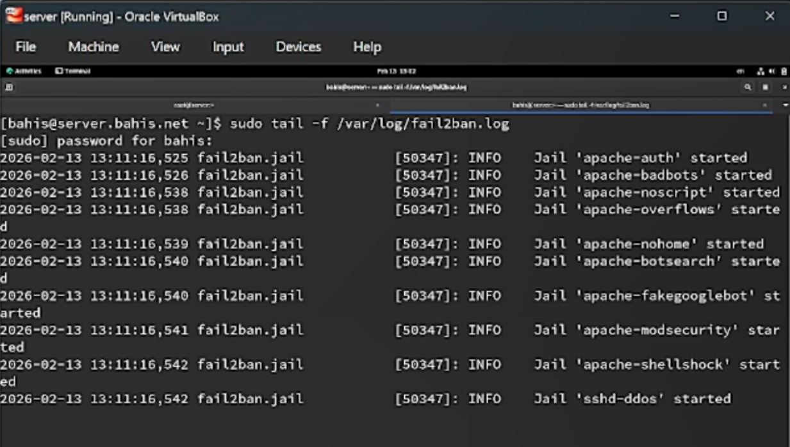{#fig-8 width=70%}


### Контроль журнала после включения HTTP-защиты

В журнале `/var/log/fail2ban.log` зафиксирован запуск jail-модулей `apache-auth`, `apache-badbots`, `apache-noscript`, `apache-overflows`, `apache-nohome`, `apache-botsearch`, `apache-fakegooglebot`, `apache-modsecurity`, `apache-shellshock`, а также повторная активация `sshd-ddos` ([рис. @fig-8]).

{#fig-8 width=70%}


### Включение защиты почтовых сервисов

В файле `/etc/fail2ban/jail.d/customisation.local` активированы jail-модули для почтовых сервисов:
`postfix`, `postfix-rbl`, `dovecot`, `postfix-sasl`.
Для каждого модуля установлен параметр `enabled = true` ([рис. @fig-9]).

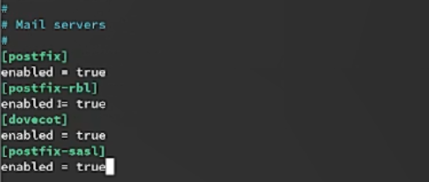{#fig-9 width=70%}


### Перезапуск Fail2ban после настройки почтовых служб

После добавления конфигурации выполнен перезапуск службы `fail2ban` для применения изменений ([рис. @fig-10]).

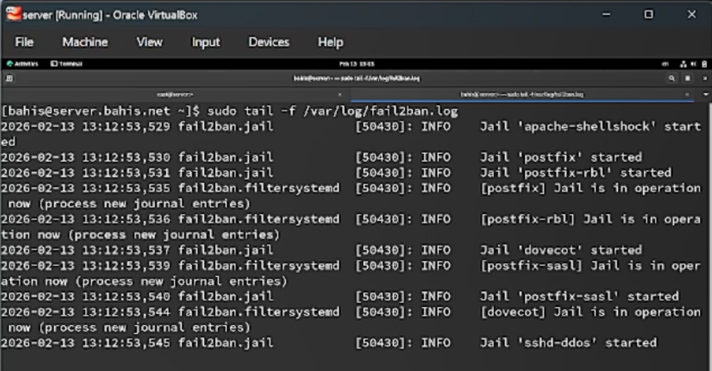{#fig-10 width=70%}


### Контроль журнала после включения почтовой защиты

В журнале событий зафиксирован запуск jail-модулей `postfix`, `postfix-rbl`, `dovecot`, `postfix-sasl`. Для каждого модуля отображается сообщение `Jail is in operation now`, что подтверждает успешную активацию защиты почтовых сервисов ([рис. @fig-10]).

{#fig-10 width=70%}


## Проверка работы Fail2ban

### Просмотр общего статуса Fail2ban

На сервере выполнена команда `fail2ban-client status`. В выводе отображено общее количество jail-модулей (16) и их список, включая `apache-*`, `dovecot`, `postfix`, `sshd`, `sshd-ddos`, `selinux-ssh` и другие. Это подтверждает активную работу всех ранее настроенных модулей ([рис. @fig-11]).

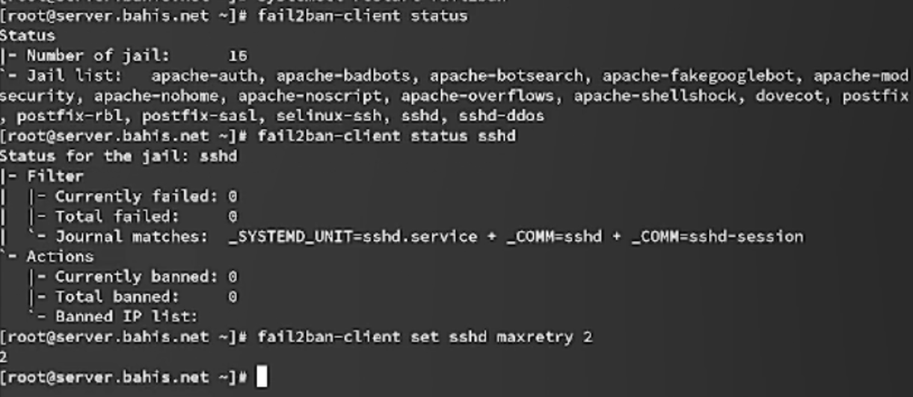{#fig-11 width=70%}


### Просмотр статуса защиты SSH

Выполнена команда `fail2ban-client status sshd`. В разделе `Filter` указаны значения `Currently failed: 0`, `Total failed: 0`. В разделе `Actions` значения `Currently banned: 0`, `Total banned: 0`, список заблокированных IP-адресов отсутствует. Это подтверждает отсутствие попыток неуспешной аутентификации на момент проверки ([рис. @fig-11]).

{#fig-11 width=70%}


### Установка максимального количества ошибок

Выполнена команда `fail2ban-client set sshd maxretry 2`, устанавливающая параметр `maxretry = 2` для jail-модуля `sshd`. После двух неудачных попыток входа IP-адрес клиента должен быть заблокирован ([рис. @fig-11]).

{#fig-11 width=70%}


### Проверка блокировки IP-адреса

На сервере повторно выполнена команда `fail2ban-client status sshd`. В разделе `Actions` указано `Currently banned: 1`, `Total banned: 1`, а в списке `Banned IP list` отображён адрес клиента `192.168.1.30`. Это подтверждает успешную блокировку IP-адреса после превышения установленного порога ошибок ([рис. @fig-13]).

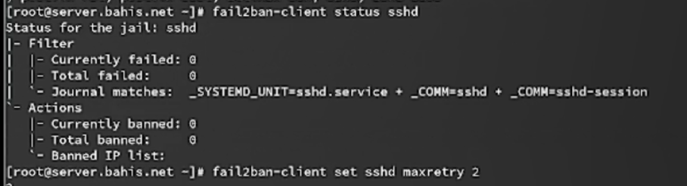{#fig-13 width=70%}


### Разблокировка IP-адреса клиента

Выполнена команда `fail2ban-client set sshd unbanip 192.168.1.30`, снимающая блокировку с IP-адреса клиента ([рис. @fig-14]).

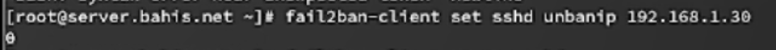{#fig-14 width=70%}


### Проверка снятия блокировки

Повторно выполнена команда `fail2ban-client status sshd`. В разделе `Actions` указано `Currently banned: 0`, список заблокированных IP-адресов пуст. Это подтверждает успешное снятие блокировки клиента ([рис. @fig-15]).

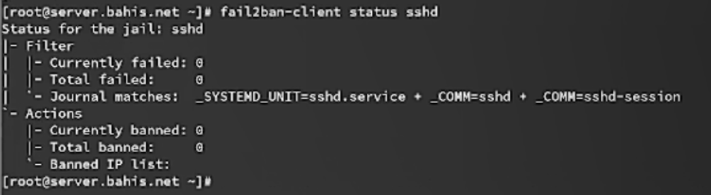{#fig-15 width=70%}

### Добавление игнорирования IP-адреса клиента

В файл `/etc/fail2ban/jail.d/customisation.local` в секции `[DEFAULT]` добавлен параметр
`ignoreip = 127.0.0.1/8 192.168.1.30`, где `192.168.1.30` — IP-адрес клиента.
Параметр `ignoreip` исключает указанный адрес из процедуры блокировки независимо от количества ошибок аутентификации ([рис. @fig-16]).

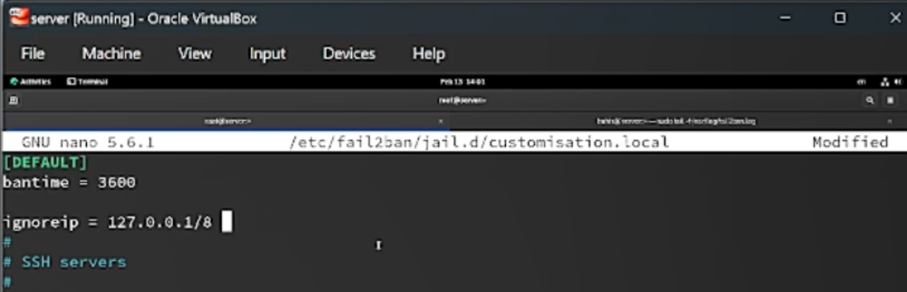{#fig-16 width=70%}


### Просмотр журнала событий

В журнале `/var/log/fail2ban.log` отображаются сообщения вида
`[sshd] Ignore 192.168.1.30 by ip` и `[selinux-ssh] Ignore 192.168.1.30 by ip`,
что подтверждает корректную обработку параметра `ignoreip` и исключение клиента из механизма блокировки ([рис. @fig-19]).

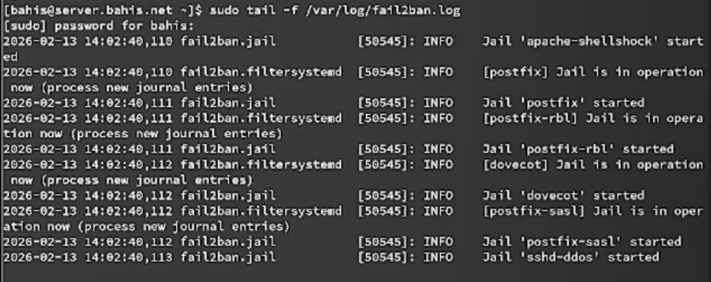{#fig-19 width=70%}


### Повторная попытка входа и проверка статуса SSH

С клиента выполнены повторные попытки входа по SSH с неправильным паролем. Несмотря на ошибки аутентификации, IP-адрес не блокируется.

При проверке статуса jail-модуля `sshd` (`fail2ban-client status sshd`) указано:
`Currently banned: 0`, `Total banned: 0`, список `Banned IP list` пуст, что подтверждает отсутствие блокировки благодаря параметру `ignoreip` ([рис. @fig-18]).

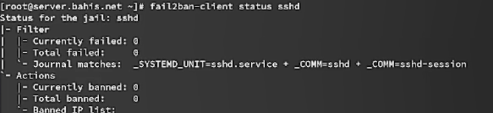{#fig-18 width=70%}

##  Внесение изменений в настройки внутреннего

### Подготовка каталога и копирование конфигурации Fail2ban

На виртуальной машине `server` выполнен переход в каталог `/vagrant/provision/server`. Создан каталог `protect/etc/fail2ban/jail.d`, после чего файл `customisation.local` скопирован из системного каталога `/etc/fail2ban/jail.d/` во внутреннюю структуру provision. Это обеспечивает перенос текущей конфигурации Fail2ban в среду автоматической настройки Vagrant ([рис. @fig-20]).

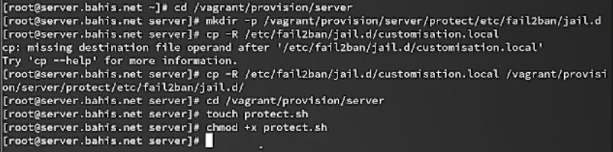{#fig-20 width=70%}


### Создание и настройка скрипта protect.sh

В каталоге `/vagrant/provision/server` создан исполняемый файл `protect.sh` и открыт для редактирования. В скрипте реализованы следующие действия:

* установка пакета `fail2ban`;
* копирование конфигурационных файлов из `/vagrant/provision/server/protect/etc/` в `/etc`;
* восстановление контекстов SELinux командой `restorecon -vR /etc`;
* включение и запуск службы `fail2ban`.

Скрипт предназначен для автоматической настройки защиты при развертывании виртуальной машины ([рис. @fig-21]).

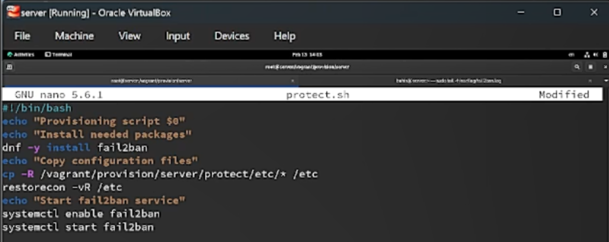{#fig-21 width=70%}


### Добавление provision-конфигурации в Vagrantfile

В файле `Vagrantfile` в разделе конфигурации виртуальной машины `server` добавлен блок:

```
server.vm.provision "server protect",
  type: "shell",
  preserve_order: true,
  path: "provision/server/protect.sh"
```

Данная конфигурация обеспечивает выполнение скрипта `protect.sh` при запуске или пересоздании виртуальной машины `server`, тем самым автоматизируя применение настроек Fail2ban ([рис. @fig-22]).

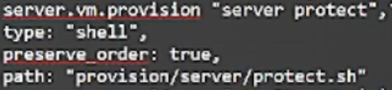{#fig-22 width=70%}

# Выводы

В ходе работы выполнена установка и базовая настройка системы предотвращения вторжений Fail2ban на сервере. Реализована защита сервисов SSH, HTTP (Apache) и почтовых служб (Postfix, Dovecot) с заданием времени блокировки и порога ошибок аутентификации.

Экспериментально подтверждена корректность механизма блокировки IP-адреса клиента при превышении значения `maxretry`, а также возможность снятия блокировки вручную. Дополнительно проверена работа параметра `ignoreip`, обеспечивающего исключение заданного адреса из процесса блокировки.

Настройки Fail2ban вынесены в систему автоматического развёртывания Vagrant посредством создания скрипта `protect.sh` и добавления соответствующего блока `provision` в `Vagrantfile`. Это обеспечивает воспроизводимость конфигурации и автоматическую активацию механизмов защиты при запуске виртуальной машины.


# Контрольные вопросы

1. Поясните принцип работы Fail2ban.

Fail2ban - это программное обеспечение, которое предотвращает атаки на сервер, анализируя лог-файлы и блокируя IP-адреса, с которых идут подозрительные или злонамеренные действия. Он работает следующим образом:

- Мониторит указанные лог-файлы на наличие заданных событий (например, неудачных попыток входа).
- Когда число попыток превышает определенный порог, Fail2ban временно блокирует IP-адрес, добавляя правила в файрвол.
- Заблокированный IP-адрес может быть разблокирован автоматически после определенного периода времени

2. Настройки какого файла более приоритетны: `jail.conf` или `jail.local`?

Настройки файла `jail.local` более приоритетны, чем настройки файла `jail.conf`.

3. Как настроить оповещение администратора при срабатывании Fail2ban?

Чтобы настроить оповещение администратора при срабатывании Fail2ban, необходимо настроить отправку уведомлений по электронной почте или другим способом. Это можно сделать, изменяя настройки в файле jail.local, добавляя адрес электронной почты администратора и настройки SMTPсервера.

4. Поясните построчно настройки по умолчанию в конфигурационном файле `/etc/fail2ban/jail.conf`, относящиеся к веб-службе.

Примеры настроек по умолчанию в конфигурационном файле `/etc/fail2ban/jail.conf`, относящиеся к веб-службе:

- `[apache]` - секция, относящаяся к веб-серверу Apache.
- `enabled = true` - включение проверки лог-файлов Apache.
- `port = http,https` - указание портов для мониторинга.
- `filter = apache-auth` - указание фильтра для обработки лог-файлов.
- `logpath = /var/log/apache*/*error.log` - путь к лог-файлам Apache.
- `maxretry = 5` - максимальное количество попыток до блокировки адреса.
- `bantime = 600` - продолжительность блокировки в секундах.

5. Поясните построчно настройки по умолчанию в конфигурационном файле `/etc/fail2ban/jail.conf`, относящиеся к почтовой службе.

Примеры настроек по умолчанию в конфигурационном файле `/etc/fail2ban/jail.conf`, относящиеся к почтовой службе:

- `[postfix]` - секция, относящаяся к почтовому серверу Postfix.
- `enabled = true` - включение проверки лог-файлов Postfix.
- `port = smtp,ssmtp` - указание портов для мониторинга.
- `filter = postfix` - указание фильтра для обработки лог-файлов.
- `logpath = /var/log/mail.log` - путь к лог-файлам Postfix.
- `maxretry = 3` - максимальное количество попыток до блокировки адреса.
- `bantime = 3600` - продолжительность блокировки в секундах

6. Какие действия может выполнять Fail2ban при обнаружении атакующего IP-адреса? Где можно посмотреть описание действий для последующего использования в настройках Fail2ban?

Fail2ban может выполнять различные действия при обнаружении атакующего IP-адреса, такие как блокировка адреса через файрвол, добавление правил в IP-таблицы, отправка уведомлений администратору и другие. Описание доступных действий можно найти в документации или руководстве Fail2ban.

7. Как получить список действующих правил Fail2ban?

Можно использовать команду: `fail2ban-client status`.

8. Как получить статистику заблокированных Fail2ban адресов?

Можно использовать команду `fail2ban-client status <jail-name>`, где `<jail-name>` - имя конкретного `jail`, например, “`ssh`” или “`apache`”.

9. Как разблокировать IP-адрес?

`fail2ban-client set sshd unbanip <ip-адрес клиента>`
